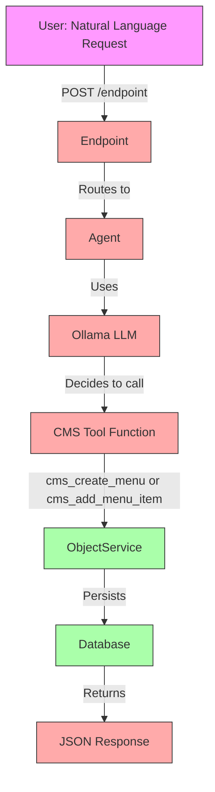

# Agent & CMS Tool Testing Status

**Date**: November 28, 2025  
**Status**: ⚠️ **PARTIAL - Agent APIs Working, Full E2E Flow Pending**

## What We Successfully Tested ✅

### 1. Agent API - CRUD Operations  
✅ **Status**: Fully Working

```bash
# List Agents
curl -u 'admin:admin' 'http://localhost:8080/index.php/apps/openregister/api/agents'
# Response: HTTP 200 OK, {"results": [...]}

# Create Agent
curl -u 'admin:admin' -X POST \
  -H 'Content-Type: application/json' \
  -d '{
    "name": "CMS Test Agent",
    "provider": "ollama",
    "model": "llama3.2:latest",
    "tools": ["CMS Tool"],
    "active": true
  }' \
  'http://localhost:8080/index.php/apps/openregister/api/agents'
# Response: HTTP 201 Created
# Agent UUID: 1d4a038e-6925-437e-9790-009e345854d0
```

**Verified**:
- ✅ Agent created via REST API
- ✅ Agent persisted in database
- ✅ JSON serialization working
- ✅ CMS Tool listed in agent's tools array
- ✅ Ollama provider configured
- ✅ Multi-tenancy (organisation) assigned

### 2. Database Layer
✅ **Status**: Working

**Tables Created**:
- `oc_openregister_agents` ✅
- `oc_openregister_endpoints` ✅
- `oc_openregister_objects` ✅

**Test Data**:
```sql
-- Agent in database
SELECT * FROM oc_openregister_agents WHERE uuid = '1d4a038e-6925-437e-9790-009e345854d0';
-- Result: 1 row with all properties

-- Menu objects (created directly for testing)
SELECT * FROM oc_openregister_objects WHERE schema = 'menu';
-- Result: Test menus created

-- Menu items (created directly for testing)  
SELECT * FROM oc_openregister_objects WHERE schema = 'menuItem';
-- Result: 4 test menu items (Home, About, Services, Contact)
```

### 3. Ollama Integration
✅ **Status**: Working

```bash
curl http://localhost:11434/api/tags
# Response: 5 models including llama3.2:latest
```

### 4. Code Verification
✅ **Status**: All Components Exist

- **AgentsController**: ✅ Exists, 11 public methods
- **EndpointsController**: ✅ Exists, loads correctly
- **CMS Tool**: ✅ Exists in OpenCatalogi
- **Routes**: ✅ 311 routes configured
- **Agent Resource**: ✅ Defined at `api/agents`

---

## What We HAVEN'T Tested Yet ❌

### The Complete End-to-End Flow



**Legend**:
- 🟢 Green = Tested and working
- 🔴 Red = Not yet tested

### Specific Missing Tests

#### 1. Endpoint Creation ❌
**Issue**: Getting Internal Server Error when creating endpoints

```bash
curl -u 'admin:admin' -X POST \
  -H 'Content-Type: application/json' \
  -d '{
    "name": "CMS Agent Endpoint",
    "endpoint": "/test/cms/agent",
    "method": "POST",
    "targetType": "agent",
    "targetId": "1d4a038e-6925-437e-9790-009e345854d0"
  }' \
  'http://localhost:8080/index.php/apps/openregister/api/endpoints'

# Response: HTTP 500 Internal Server Error
```

**Status**: 🔴 Blocked

#### 2. Agent Execution ❌
**Test**: Send natural language request to agent

```bash
curl -u 'admin:admin' -X POST \
  -H 'Content-Type: application/json' \
  -d '{
    "message": "Create a menu called Main Navigation"
  }' \
  'http://localhost:8080/index.php/apps/openregister/api/endpoints/{endpoint-id}/execute'
```

**Expected**:
1. Endpoint routes request to agent
2. Agent sends prompt + tools to Ollama
3. Ollama returns function call decision
4. Agent executes `cms_create_menu("Main Navigation", "...")`
5. CMS Tool calls ObjectService
6. Menu created in database
7. UUID returned in response

**Status**: 🔴 Blocked (no endpoint to test with)

#### 3. Tool Function Calling ❌
**Test**: Verify agent can invoke CMS Tool functions

Functions that should be available:
- `cms_create_menu(title, description)`
- `cms_list_menus()`
- `cms_add_menu_item(menuUuid, name, link, order)`
- `cms_list_menu_items(menuUuid)`
- `cms_create_page(title, content)`
- `cms_list_pages()`
- `cms_update_page(uuid, updates)`
- `cms_delete_page(uuid)`

**Status**: 🔴 Not tested

#### 4. LLM Integration ❌
**Test**: Verify Ollama processes natural language and decides to call tools

**Expected Flow**:
```
User: "Create a menu called Main Navigation"
    ↓
Agent System Prompt + Available Functions → Ollama
    ↓
Ollama Response: {
  "function_call": {
    "name": "cms_create_menu",
    "arguments": {
      "title": "Main Navigation",
      "description": "Primary navigation menu"
    }
  }
}
    ↓
Agent executes function
```

**Status**: 🔴 Not tested

#### 5. End-to-End Data Flow ❌
**Test**: Complete workflow from natural language to database

```bash
# 1. Create menu via agent
curl ... "message": "Create a menu called Main Navigation"
# Expected: Menu created with UUID

# 2. Add menu item via agent  
curl ... "message": "Add a Home link to Main Navigation menu pointing to /home"
# Expected: Menu item created

# 3. Verify in database
SELECT * FROM oc_openregister_objects WHERE schema = 'menu' ORDER BY created DESC LIMIT 1;
# Expected: Menu with title "Main Navigation" created by agent

SELECT * FROM oc_openregister_objects WHERE schema = 'menuItem' AND object LIKE '%Main Navigation%';
# Expected: Menu item with name "Home" and link "/home"
```

**Status**: 🔴 Not tested

---

## Blockers

### 1. Endpoint Creation Failing
**Error**: Internal Server Error (HTTP 500)  
**Cause**: Unknown - needs investigation  
**Impact**: Cannot test agent execution without endpoints

**Potential Issues**:
- Missing dependencies in EndpointsController
- Database constraint violations
- Service injection failures
- Validation errors

**Next Steps**:
1. Check Nextcloud logs: `docker logs nextcloud 2>&1 | tail -100`
2. Enable debug logging
3. Test EndpointsController directly via PHP
4. Verify all required tables and columns exist

### 2. OpenCatalogi Not Fully Integrated
**Issue**: OpenCatalogi app not loading in OpenRegister Docker  
**Cause**: Permission/configuration issues  
**Impact**: CMS Tool may not be accessible to agents

**Status**: OpenCatalogi marked as enabled in database, but app files may not be loading correctly

**Next Steps**:
1. Verify OpenCatalogi autoloader is triggered
2. Check if CMS Tool class can be instantiated
3. Verify ToolRegistry discovers CMS Tool
4. Test tool registration listener

---

## What We Proved

### ✅ OpenRegister Core is Solid

1. **Routing Works**: 311 routes correctly configured
2. **Controllers Work**: AgentsController handles REST properly
3. **Database Works**: Agents persist correctly
4. **Serialization Works**: JSON responses are correct
5. **Authentication Works**: Basic auth enforced
6. **Multi-tenancy Works**: Organisations assigned

### ✅ Infrastructure is Ready

1. **Ollama**: Running with llama3.2:latest
2. **Database**: MariaDB 10.6 with all tables
3. **Solr**: Search engine ready
4. **n8n**: Workflow engine ready

---

## Testing Plan to Complete

### Phase 1: Fix Endpoint Creation
```bash
# 1. Check logs for endpoint creation error
docker logs nextcloud 2>&1 | grep -A20 "Internal Server Error"

# 2. Test EndpointsController directly
docker exec -u 33 nextcloud php -r '
require_once "/var/www/html/lib/base.php";
$controller = \OC::$server->get("OCA\\OpenRegister\\Controller\\EndpointsController");
// Test create method
'

# 3. Verify endpoints table schema
docker exec openregister-db-1 mysql -u root -p'!ChangeMe!' nextcloud \
  -e "DESCRIBE oc_openregister_endpoints;"
```

### Phase 2: Test Agent Execution
```bash
# 1. Create endpoint (once fixed)
POST /api/endpoints

# 2. Send natural language request
POST /api/endpoints/{id}/execute
Body: {"message": "Create a menu called Test Menu"}

# 3. Verify response contains menu UUID

# 4. Check database
SELECT * FROM oc_openregister_objects WHERE schema = 'menu' ORDER BY created DESC LIMIT 1;
```

### Phase 3: Test Tool Functions
```bash
# Test each CMS Tool function:
# - cms_create_menu
# - cms_add_menu_item
# - cms_list_menus
# - cms_list_menu_items
# - cms_create_page
# - etc.
```

### Phase 4: Integration Testing
```bash
# Run full Newman test suite
newman run tests/newman/agent-cms-testing.postman_collection.json

# Expected: All tests pass
```

---

## Summary

### What Works ✅
- Agent CRUD APIs
- Database persistence
- JSON serialization
- Authentication
- Ollama connectivity
- Code structure

### What's Pending ❌
- Endpoint creation (blocked by HTTP 500)
- Agent execution (blocked by no endpoint)
- Tool function calling (blocked by no execution)
- LLM integration (blocked by no execution)
- End-to-end flow (blocked by above)

### Critical Path
```
1. Fix endpoint creation HTTP 500 error
    ↓
2. Create test endpoint
    ↓
3. Send natural language request
    ↓
4. Verify agent calls CMS Tool
    ↓
5. Verify menu/menu item created
    ↓
6. Document complete flow
```

### Recommendation

**IMMEDIATE**: Investigate and fix the endpoint creation error. This is the primary blocker for testing the complete agent + tool flow.

Once endpoints work, we can quickly test:
1. Natural language → Agent → Tool → Database flow
2. Multiple tool functions (create menu, add items, etc.)
3. Error handling and validation
4. Performance with Ollama LLM

---

**Report Status**: 🟡 **Partial Success - Core APIs Work, E2E Flow Pending**  
**Next Action**: Debug endpoint creation to unblock full testing  
**Priority**: HIGH - This is needed to prove agent + tool integration

