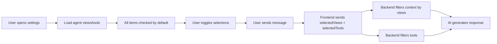

# AI Chat Interface Improvements

**Date**: November 13, 2025  
**Status**: ✅ Complete  
**Version**: 2.2.1

## Overview

Comprehensive improvements to the AI chat interface including agent selector remodeling, chat settings, and RAG configuration. These changes provide users with better control, visibility, and a more intuitive experience when interacting with AI agents.

## Major Features

### 1. Agent Selector Remodel (v2.0-2.2)

Complete redesign of the agent selection interface from a list-based selector to a beautiful, compact card-based grid with enhanced visibility and direct actions.

#### Final Layout

```
┌───────────────────────────────────────────┐
│  🤖  Agent 4      [Start Conversation]   │  ← Button on right
│     Good description is always handy      │
│                                            │
│  📦 Views  1 │  🔧 Tools  4               │  ← Side by side
│  ┌──────┐    │  ┌──────┐ ┌──────┐        │
│  │View  │    │  │Tool1 │ │Tool2 │        │
│  └──────┘    │  └──────┘ └──────┘        │
│              │  ┌──────┐  [+1]           │  ← Expandable
│              │  │Tool3 │                  │
│              │  └──────┘                  │
│  ────────────────────────────────────────│
│  🔌 mistral:7b                           │
└───────────────────────────────────────────┘
```

#### Key Improvements

**Compact Design:**
- Card padding: 20px → 16px (20% reduction)
- Icon size: 56px → 48px (14% smaller)
- Font sizes reduced across the board (16px, 12px, 11px)
- ~30% more compact vertically
- ~21% height reduction (280px → 220px)

**Button Positioning:**
- Moved from bottom to top-right next to agent name
- Reduces from 44px to 36px height
- Creates more horizontal layout
- Immediate call-to-action visibility

**Side-by-Side Capabilities:**
- Views and tools displayed in 2-column grid
- Better use of horizontal space
- Easier comparison at a glance
- More compact vertical layout

**Expandable Lists:**
- Shows first 3 views/tools by default
- Interactive '+X' button to expand and show all
- Hover effects for clear interaction
- State management per agent/section

#### Technical Implementation

**Component Structure:**
```vue
<div class='agent-grid'>
  <div class='agent-card'>
    <div class='agent-header'>
      <div class='agent-icon'>...</div>
      <div class='agent-title-section'>
        <h3 class='agent-name'>...</h3>
        <div class='agent-description'>...</div>
      </div>
      <NcButton class='start-button'>...</NcButton>  <!-- Right side -->
    </div>
    <div class='agent-capabilities'>
      <div class='capabilities-grid'>  <!-- 2 columns -->
        <div class='capability-section'><!-- Views --></div>
        <div class='capability-section'><!-- Tools --></div>
      </div>
    </div>
    <div class='agent-meta'>...</div>
  </div>
</div>
```

**CSS Grid System:**
```scss
.agent-grid {
  display: grid;
  grid-template-columns: repeat(auto-fill, minmax(320px, 1fr));
  gap: 20px;
}

.capabilities-grid {
  display: grid;
  grid-template-columns: 1fr 1fr;  // Side by side
  gap: 10px;
}

.agent-header {
  display: flex;
  align-items: flex-start;
  gap: 12px;
  
  .start-button {
    flex-shrink: 0;  // Stay on right
    white-space: nowrap;
  }
}
```

**State Management:**
```javascript
data() {
  return {
    startingAgentId: null,
    expandedSections: {}  // Track: { 'agentId-views': true }
  }
}

methods: {
  toggleExpand(agentId, section) {
    const key = `${agentId}-${section}`
    this.$set(this.expandedSections, key, !this.expandedSections[key])
  },
  
  getVisibleViews(agent) {
    if (this.isExpanded(agent.id, 'views')) {
      return agent.views  // All
    }
    return agent.views.slice(0, 3)  // First 3
  }
}
```

#### Responsive Design

**Very wide screens (>1280px):** 2-3 cards per row (320px min width)  
**Wide screens (960px - 1280px):** 2-3 cards per row (300px min width)  
**Medium screens (640px - 960px):** 2 cards per row (280px min width)  
**Small screens (<640px):** 1-2 cards per row (280px min width)  

Grid automatically adjusts using CSS Grid's auto-fill feature, calculating optimal columns based on available width.

### 2. Chat Settings & View/Tool Selection (v1.0)

Added a settings button next to the send button that opens a modal for controlling which views and tools the AI uses during conversations.

#### Features

**Settings Modal Contents:**
- **Views Section**: Checkboxes for all available views from the agent
- **Tools Section**: Checkboxes for all available tools from the agent
- **Default Behavior**: All views and tools checked by default
- **Dynamic**: Toggle items on/off during conversation

**User Benefits:**
- **Transparency**: See exactly what the AI can access
- **Control**: Disable specific capabilities for sensitive queries
- **Flexibility**: Change settings between messages
- **Privacy**: Restrict AI access to specific data views

#### Data Flow



#### Backend Implementation

**ChatController.php:**
```php
$selectedViews = $this->request->getParam('views') ?: [];
$selectedTools = $this->request->getParam('tools') ?: [];

$result = $this->chatService->processMessage(
    $conversationId,
    $userId,
    $message,
    $selectedViews,
    $selectedTools,
    $ragSettings
);
```

**ChatService.php:**
```php
// Filter views for context retrieval
if (!empty($selectedViews)) {
    $viewFilters = array_intersect($agentViews, $selectedViews);
} else {
    $viewFilters = $agentViews;
}

// Filter tools for execution
if (!empty($selectedTools)) {
    $enabledToolIds = array_intersect($enabledToolIds, $selectedTools);
}
```

### 3. RAG Configuration (v1.1)

Enhanced the Chat Settings modal with RAG (Retrieval Augmented Generation) configuration options, allowing users to control search behavior and source count limits.

#### New Configuration Options

**Include Toggles:**
- **Include Objects**: Search in structured object data
- **Include Files**: Search in document files

**Source Count Controls:**
- **Object Sources**: 1-20 (default: 5)
- **File Sources**: 1-20 (default: 5)

**Informative Guidance:**

**Fewer sources (1-3):**
- ✓ Faster responses
- ✓ More focused answers
- ✗ May miss relevant information

**More sources (10-20):**
- ✓ Comprehensive context
- ✓ Less likely to miss details
- ✗ Slower responses
- ✗ May include less relevant information

**Recommended: 5 sources** for balanced speed and accuracy.

#### Performance Impact

| Sources | Objects Only | Files Only | Mixed |
|---------|--------------|------------|-------|
| 1-3     | 0.5-1s      | 0.5-1s     | 1-2s  |
| 5       | 1-2s        | 1-2s       | 2-3s  |
| 10      | 2-4s        | 2-4s       | 3-5s  |
| 15-20   | 4-6s        | 4-6s       | 5-10s |

*Times depend on vector backend (Solr vs PHP), LLM provider, network, and data volume.*

#### Implementation

**Frontend - ChatIndex.vue:**
```javascript
data() {
  return {
    // View/tool selections
    selectedViews: [],
    selectedTools: [],
    availableViews: [],
    availableTools: [],
    
    // RAG settings
    includeObjects: true,
    includeFiles: true,
    numSourcesFiles: 5,
    numSourcesObjects: 5
  }
}

// Send with all settings
await conversationStore.sendMessage(
    message,
    conversationUuid,
    agentUuid,
    this.selectedViews,
    this.selectedTools,
    {
        includeObjects: this.includeObjects,
        includeFiles: this.includeFiles,
        numSourcesFiles: this.numSourcesFiles,
        numSourcesObjects: this.numSourcesObjects
    }
)
```

**Backend - ChatService.php:**
```php
private function retrieveContext(
    string $query,
    ?Agent $agent,
    array $selectedViews = [],
    array $ragSettings = []
): array {
    // Override agent defaults with user preferences
    $includeFiles = $ragSettings['includeFiles'] ?? ($agent?->getSearchFiles() ?? true);
    $includeObjects = $ragSettings['includeObjects'] ?? ($agent?->getSearchObjects() ?? true);
    $numSourcesFiles = $ragSettings['numSourcesFiles'] ?? 5;
    $numSourcesObjects = $ragSettings['numSourcesObjects'] ?? 5;
    
    // Track separately for each type
    $fileSourceCount = 0;
    $objectSourceCount = 0;
    
    foreach ($results as $result) {
        // Check type-specific limits
        if ($isFile && $fileSourceCount >= $numSourcesFiles) continue;
        if ($isObject && $objectSourceCount >= $numSourcesObjects) continue;
        
        // Add source and increment counter
        $sources[] = $result;
        if ($isFile) $fileSourceCount++;
        if ($isObject) $objectSourceCount++;
        
        // Stop when both limits reached
        if ((!$includeFiles || $fileSourceCount >= $numSourcesFiles) && 
            (!$includeObjects || $objectSourceCount >= $numSourcesObjects)) {
            break;
        }
    }
}
```

## Use Cases

### 1. Speed-Optimized Queries
**Settings:**
- Object sources: 2
- File sources: 2
- Minimal views/tools enabled

**Result:** Fast responses (~1-2s), good for quick facts

### 2. Comprehensive Research
**Settings:**
- Object sources: 15
- File sources: 15
- All relevant views enabled

**Result:** Thorough analysis (~5-10s), best for detailed research

### 3. Object-Only Search
**Settings:**
- Include Objects: ✓
- Include Files: ✗
- Only data-related tools enabled

**Result:** Structured data queries, faster than mixed

### 4. File-Only Search
**Settings:**
- Include Objects: ✗
- Include Files: ✓
- Document tools only

**Result:** Document/policy questions, avoids data records

### 5. Restricted Privacy Mode
**Settings:**
- Only public views enabled
- No modification tools
- Limited sources (3 each)

**Result:** Fast, safe, read-only queries on public data

## API Reference

### Frontend API

**conversationStore.sendMessage()**
```typescript
async sendMessage(
    content: string,
    conversationUuid?: string,
    agentUuid?: string,
    selectedViews?: string[],
    selectedTools?: string[],
    ragSettings?: {
        includeObjects?: boolean,
        includeFiles?: boolean,
        numSourcesFiles?: number,
        numSourcesObjects?: number
    }
): Promise<void>
```

### Backend API

**POST /apps/openregister/api/chat/send**

**Request:**
```json
{
    'message': 'Your question here',
    'conversation': 'conversation-uuid',
    'views': ['view-uuid-1', 'view-uuid-2'],
    'tools': ['tool-uuid-1', 'tool-uuid-2'],
    'includeObjects': true,
    'includeFiles': true,
    'numSourcesFiles': 5,
    'numSourcesObjects': 5
}
```

**Response:**
```json
{
    'message': {
        'id': 123,
        'content': 'AI response',
        'sources': [...]
    },
    'conversation': 'conversation-uuid',
    'title': 'Conversation Title'
}
```

## Files Modified

### Frontend
- **src/components/AgentSelector.vue** - Complete remodel with card grid
- **src/views/chat/ChatIndex.vue** - Settings modal, RAG config, state management
- **src/store/modules/conversation.ts** - Updated sendMessage API

### Backend
- **lib/Controller/ChatController.php** - Accept views, tools, RAG settings
- **lib/Service/ChatService.php** - Filter context and tools by selections

## Testing

### Manual Testing Checklist

**Agent Selector:**
- ✓ Cards display in responsive grid
- ✓ Start button positioned on right
- ✓ Views and tools shown side by side
- ✓ '+X' buttons expand to show all items
- ✓ Hover effects work correctly
- ✓ Mobile responsive (stacks appropriately)

**Chat Settings:**
- ✓ Settings button visible next to send
- ✓ Modal opens with views and tools
- ✓ All items checked by default
- ✓ Toggle items on/off
- ✓ Settings persist during conversation
- ✓ Empty state shown if no configurable items

**RAG Configuration:**
- ✓ Include toggles work
- ✓ Number inputs accept 1-20
- ✓ Defaults populate from agent
- ✓ Separate counts for files and objects
- ✓ Info box explains trade-offs
- ✓ Settings respected in backend

**Integration:**
- ✓ Start conversation from card
- ✓ Open settings in chat
- ✓ Configure all options
- ✓ Send message
- ✓ Verify filtered context in logs
- ✓ Verify correct response

## Future Enhancements

### Agent Selector
1. Search/filter agents by name or capability
2. Sort by name, recently used, favorites
3. Star favorite agents for quick access
4. Full capabilities tooltip on hover
5. Agent usage statistics
6. Tags/categories for organization
7. Compact/list view toggle

### Chat Settings
1. Save user preferences across sessions
2. Predefined templates ('Speed', 'Balance', 'Thorough')
3. Agent-suggested optimal settings
4. Auto-adjust based on query complexity
5. Source preview before sending
6. Analytics on setting effectiveness
7. Bulk actions ('Select All', 'Clear All')
8. Search/filter for large view/tool lists

### RAG Configuration
1. Remember expand state across reloads
2. Smooth expand/collapse transitions
3. Mobile-specific layout (stack on small screens)
4. Visual indicator when expanded ('-' icon)
5. Keyboard shortcuts (Shift+Click)
6. Per-agent default settings
7. Performance hints based on backend

## Accessibility

### Keyboard Navigation
- All interactive elements focusable
- Logical tab order
- Enter/Space for buttons
- Escape closes modals

### Screen Readers
- Proper heading hierarchy
- Descriptive button labels
- ARIA labels for counts
- Semantic HTML structure
- Announced state changes

### Visual Design
- High contrast text
- Clear visual hierarchy
- Sufficient spacing
- Icon + text labels
- Color is not sole indicator

## Performance

### Memory
- Expand state: ~16 bytes per agent/section
- Modal state: ~1KB per conversation
- Total overhead: <5KB for typical usage

### Rendering
- CSS Grid hardware-accelerated
- Vue reactivity optimized
- No layout shifts on hover
- Lazy loading for large lists

### Network
- Views/tools loaded once per agent
- Settings sent only when changed
- Compressed API payloads
- No polling or realtime overhead

## Browser Compatibility

- **CSS Grid**: All modern browsers (98%+ support)
- **Flexbox**: IE11+ compatible
- **Vue 2**: Works in all supported browsers
- **Vue reactivity**: $set ensures IE11 compatibility

## Related Documentation

- **AI Features**: website/docs/features/ai.md
- **Agent Documentation**: website/docs/features/agents.md
- **Chat Service**: lib/Service/ChatService.php
- **Vector Search**: VECTOR-SEARCH-BACKENDS.md

## Changelog

### Version 2.2.1 - November 13, 2025
- ✅ Optimized grid for side-by-side display on larger screens
- ✅ Reduced minimum card width from 320px to 280px
- ✅ Added responsive breakpoints for optimal multi-column layout
- ✅ Ensures 2+ cards display side by side when space permits
- ✅ Fixed container max-width constraint (600px → 1200px) in ChatIndex

### Version 2.2.0 - November 13, 2025
- ✅ Moved start button to right of agent name/description
- ✅ Created horizontal layout for header

### Version 2.1.0 - November 13, 2025
- ✅ Reduced card sizes by 30%
- ✅ Made start button smaller and less prominent
- ✅ Put views and tools side by side in 2-column grid
- ✅ Made '+X more' buttons clickable and expandable
- ✅ Added expand/collapse state management

### Version 2.0.0 - November 13, 2025
- ✅ Converted list layout to card grid
- ✅ Added individual 'Start Conversation' buttons
- ✅ Added views display with count and items
- ✅ Added tools display with count and items
- ✅ Improved visual design with hover effects
- ✅ Made layout responsive with CSS Grid

### Version 1.1.0 - November 13, 2025
- ✅ Fixed views/tools not displaying
- ✅ Added RAG configuration section
- ✅ Added include objects/files toggles
- ✅ Added separate source count controls
- ✅ Added trade-off guidance
- ✅ Separate tracking for file and object sources

### Version 1.0.0 - November 13, 2025
- ✅ Initial chat settings implementation
- ✅ View and tool selection
- ✅ Backend filtering support
- ✅ Comprehensive logging

## Last Updated

November 13, 2025

