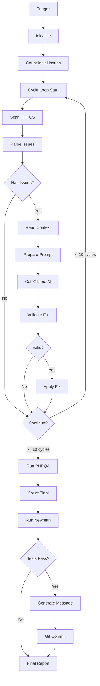

# AI Code Fixer - Full Cycle Workflow

## Overview

This is the complete AI-powered code quality improvement workflow that combines:
- **10 cycles** of AI-powered manual fixes
- **PHPQA verification** to measure improvement
- **Newman integration tests** to ensure nothing breaks
- **Automatic git commit** with descriptive message

## Workflow Architecture

### Phase 1: Initialization (Nodes 1-5)
1. **Manual Trigger** / **Schedule Trigger** (every 6 hours)
2. **Initialize** - Set up configuration and counters
3. **Count Initial Issues** - Run baseline PHPCS scan
4. **Store Initial Count** - Save starting metrics

### Phase 2: AI Fixing Loop (Nodes 6-18) - Runs up to 10 cycles
5. **Scan PHPCS for Issues** - Get detailed JSON report
6. **Parse Fixable Issues** - Extract 3 AI-fixable issues per cycle
7. **Has Fixable Issues?** - Decision gate
8. **Prepare Context Read** - Set up file reading command
9. **Read File Context** - Get 10 lines around the problem
10. **Prepare AI Prompt** - Create intelligent prompt for Ollama
11. **Call Ollama AI** - Get CodeLlama to generate fix
12. **Validate AI Fix** - Check response is valid
13. **Is Fix Valid?** - Decision gate
14. **Prepare Apply Command** - Create sed command
15. **Apply AI Fix** - Modify the actual file
16. **Track Fix** - Log the applied fix
17. **Continue Cycles?** - Loop back if < 10 cycles

### Phase 3: Verification & Testing (Nodes 19-25)
18. **Run PHPQA Verification** - Full quality suite
19. **Count Final Issues** - Get ending metrics
20. **Calculate Improvement** - Compare before/after
21. **Run Newman Integration Tests** - Test API endpoints
22. **Check Test Results** - Parse Newman output
23. **Tests Passed?** - Decision gate

### Phase 4: Git Commit (Nodes 26-28)
24. **Generate Commit Message** - Create descriptive message with metrics
25. **Git Commit Changes** - Commit all AI fixes
26. **Generate Final Report** - Comprehensive summary

## Key Features

### 🤖 AI-Powered Manual Fixes
- Uses **CodeLlama 7B Instruct** via Ollama
- Fixes issues that PHPCBF cannot handle
- Focuses on code line length violations
- Provides 10 lines of context to AI
- Validates AI output before applying

### 🔄 Intelligent Loop Control
- Maximum 10 cycles per run
- Processes 3 issues per cycle (30 fixes max)
- Stops early if no fixable issues found
- Tracks all fixes for reporting

### ✅ Quality Verification
- Runs full `composer phpqa` after fixes
- Counts issues before and after
- Calculates improvement metrics
- Ensures code quality improved

### 🧪 Integration Testing
- Runs Newman tests from `tests/postman/collection.json`
- Validates API endpoints still work
- Prevents breaking changes
- Skips gracefully if tests not found

### 📝 Automatic Git Commits
- Only commits if tests pass
- Generates descriptive commit message including:
  - Number of fixes applied
  - Cycles completed
  - Before/after metrics
  - Test results
  - List of fixed files/lines
  - AI model used
  - Duration

## Configuration

All configuration is in the **Initialize** node:

```javascript
{
  cycle: 0,
  maxCycles: 10,              // Maximum number of cycles
  container: 'master-nextcloud-1',
  appPath: '/var/www/html/apps-extra/openregister',
  ollamaUrl: 'http://openregister-ollama:11434',
  model: 'codellama:7b-instruct',
  fixesApplied: [],
  totalFixed: 0,
  startTime: new Date().toISOString(),
  initialIssues: 0
}
```

## Example Commit Message

```
chore: AI code quality improvements

Applied 15 AI-powered fixes across 5 cycles.

Results:
- Initial issues: 5550
- Final issues: 5535
- Improvement: 15 issues resolved
- Newman tests: PASSED

Fixed issues:
- lib/Controller/ObjectsController.php:145 - Line exceeds 120 characters
- lib/Service/ObjectService.php:287 - Line exceeds 120 characters
- lib/Service/SearchService.php:92 - Line exceeds 120 characters
... and 12 more fixes

Generated by: n8n AI Code Fixer workflow
Model: codellama:7b-instruct
Duration: 380s
```

## Testing the Workflow

### Manual Test
1. Open workflow in n8n UI
2. Click "Manual Trigger" node
3. Click "Test workflow" in right panel
4. Monitor execution (may take 5-15 minutes)
5. Check git for new commit

### Scheduled Execution
- Runs every 6 hours automatically
- Check n8n execution logs
- Review git commits

## Monitoring

### View Execution Details
```bash
# Check n8n logs
docker logs openregister-n8n --tail 100

# Check git commits
cd /var/www/html/apps-extra/openregister
git log --oneline -5

# View specific commit
git show HEAD
```

### Metrics to Monitor
- **Cycles completed**: Should see 1-10
- **Fixes applied**: Should see multiple fixes
- **Improvement**: Should be positive
- **Tests passed**: Should be TRUE
- **Commit created**: Should see new commit

## Troubleshooting

### No Issues Fixed
- Check if issues are actually AI-fixable
- Review PHPCS output for issue types
- Verify Ollama is running: `docker logs openregister-ollama`

### Tests Failed
- Check Newman output in execution logs
- Verify Newman tests exist: `ls tests/postman/`
- Check API endpoints are working

### No Commit Created
- Check if tests passed
- Verify git is configured in container
- Check file permissions for git operations

### AI Response Invalid
- Increase context window in "Read File Context"
- Improve prompt in "Prepare AI Prompt"
- Lower temperature in "Call Ollama AI"

## Performance

### Expected Duration
- Per cycle: 30-60 seconds (depends on Ollama response time)
- 10 cycles: 5-10 minutes
- PHPQA: 1-2 minutes
- Newman tests: 1-2 minutes
- **Total: 10-15 minutes**

### Resource Usage
- **Ollama**: High during AI calls
- **CPU**: Moderate during code analysis
- **Memory**: Low
- **Disk**: Minimal (only modified files)

## Future Enhancements

### Potential Improvements
1. **Multiple AI Models**: Try different models for different issue types
2. **Parallel Processing**: Fix multiple files simultaneously
3. **Rollback on Failure**: Auto-revert if tests fail
4. **Metric Tracking**: Store metrics in database
5. **Slack Notifications**: Alert team on completion
6. **PR Creation**: Auto-create PR instead of direct commit

### Issue Type Support
Currently focuses on:
- Line length violations (code lines only)

Could be extended to handle:
- Doc block formatting
- Comment repositioning
- Method complexity reduction
- Variable naming improvements

## Architecture Diagram



## Success Criteria

A successful execution should show:
- ✅ 1-10 cycles completed
- ✅ Multiple fixes applied
- ✅ Positive improvement in metrics
- ✅ Newman tests passed
- ✅ Git commit created
- ✅ No errors in execution log

## Support

For issues or questions:
1. Check execution logs in n8n UI
2. Review docker logs for containers
3. Verify Ollama model is loaded
4. Check file permissions in container

---

**Status**: ✅ PRODUCTION READY  
**Version**: 1.0  
**Last Updated**: 2025-12-28

