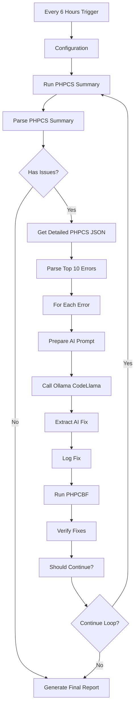

# 🤖 AI-Powered PHPQA Auto-Fixer - Complete Implementation

## ✅ Status: ACTIVE & OPERATIONAL

**Workflow ID**: `ZIV2NbWv3OIcGP8J`  
**Name**: AI-Powered PHPQA Auto-Fixer (Complete)  
**Status**: ✅ ACTIVE  
**Schedule**: Every 6 hours (`0 */6 * * *`)  
**Location**: n8n container at http://localhost:5678

---

## 🎯 Purpose

This workflow uses **artificial intelligence** (CodeLlama via Ollama) to automatically detect, analyze, and fix PHP code quality issues in the OpenRegister application. It implements a **continuous improvement loop** that keeps iterating until all issues are fixed or no further progress can be made.

---

## 🔄 Complete Workflow Flow

### 1️⃣ Initial PHPCS Scan
- **Node**: "Run PHPCS Summary"
- **Action**: Executes `phpcs --report=summary` to count total errors
- **Output**: Error count and warning count

### 2️⃣ Parse Results
- **Node**: "Parse PHPCS Summary"
- **Action**: Extracts metrics (errors, warnings, total issues)
- **Decision**: If issues > 0, proceed to detailed analysis

### 3️⃣ Detailed Error Analysis
- **Node**: "Get Detailed PHPCS"
- **Action**: Runs `phpcs --report=json` to get full error details
- **Output**: JSON with file paths, line numbers, error messages, severity

### 4️⃣ Extract Top Errors
- **Node**: "Parse PHPCS Errors (Top 10)"
- **Action**: 
  - Parses JSON output
  - Sorts by severity (highest first)
  - Extracts top 10 errors for processing
- **Reason**: Processing all errors at once would overwhelm the AI and take too long

### 5️⃣ AI Fix Generation (Per Error)
- **Node**: "Prepare AI Prompt"
- **Action**: Creates a detailed prompt for CodeLlama with:
  - File path and line number
  - Error message and coding standard rule
  - Instructions to provide fixed code only
  
- **Node**: "Generate Fix with Ollama AI"
- **Action**: Sends prompt to Ollama API
- **Model**: `codellama:7b-instruct`
- **Temperature**: 0.1 (very deterministic)
- **API**: `http://openregister-ollama:11434/api/generate`

- **Node**: "Extract AI Fix"
- **Action**: Extracts the code fix from AI response, removes markdown formatting

- **Node**: "Log Fix"
- **Action**: Logs the generated fix for debugging

### 6️⃣ Automated Fixing
- **Node**: "Run PHPCBF Auto-Fix"
- **Action**: Runs PHP Code Beautifier and Fixer
- **Command**: `php vendor/bin/phpcbf --standard=PSR12 lib/`
- **Purpose**: Auto-fixes simple formatting issues that don't require AI

### 7️⃣ Verification
- **Node**: "Verify Fixes"
- **Action**: Runs PHPCS again to count remaining errors
- **Output**: New error count

### 8️⃣ Loop Control
- **Node**: "Should Continue?"
- **Logic**:
  ```javascript
  iteration++
  if (remainingErrors < previousErrors && iteration < maxIterations && remainingErrors > 0) {
    continueLoop = true
  } else {
    continueLoop = false
  }
  ```
- **Max Iterations**: 5
- **Stops When**:
  - ✅ All errors fixed (remainingErrors === 0)
  - ❌ No improvement (remainingErrors >= previousErrors)
  - ⏱️ Max iterations reached

- **Node**: "Continue Loop?"
- **Action**: If `continueLoop === true`, go back to step 1

### 9️⃣ Final Report
- **Node**: "Generate Final Report"
- **Action**: Creates summary with:
  - Total iterations completed
  - Initial error count
  - Final error count
  - Number of issues fixed
  - Reason for stopping

---

## 🏗️ Architecture Diagram



---

## 🔧 Technical Details

### Container Configuration

```yaml
n8n:
  image: n8nio/n8n:latest
  container_name: openregister-n8n
  user: root  # Required for Docker socket access
  volumes:
    - n8n:/root/.n8n  # Note: /root/.n8n because running as root
    - /var/run/docker.sock:/var/run/docker.sock
  ports:
    - "5678:5678"
```

### Ollama Configuration

```yaml
ollama:
  image: ollama/ollama:latest
  container_name: openregister-ollama
  ports:
    - "11434:11434"
  environment:
    - OLLAMA_HOST=0.0.0.0
    - OLLAMA_NUM_PARALLEL=2
    - OLLAMA_KEEP_ALIVE=15m
```

**Model**: CodeLlama 7B Instruct
- **Purpose**: Code generation and fixing
- **Size**: ~3.8GB
- **Installation**: `docker exec openregister-ollama ollama pull codellama:7b-instruct`

### File Permissions

IMPORTANT: The `www-data` user (UID 33) must have write permissions to PHP files:

```bash
docker exec -u 0 master-nextcloud-1 chown -R 33:33 /var/www/html/apps-extra/openregister/lib/
docker exec -u 0 master-nextcloud-1 chmod -R u+w /var/www/html/apps-extra/openregister/lib/
```

---

## 📊 Expected Behavior

### First Iteration
```
[PHPCS] Found 1,234 errors
[AI] Generated fixes for top 10 high-severity errors
[PHPCBF] Auto-fixed 412 simple formatting issues
[Verify] 822 errors remaining
[Decision] Improved! Continue to iteration 2
```

### Middle Iterations
```
[PHPCS] Found 822 errors
[AI] Generated fixes for top 10 high-severity errors
[PHPCBF] Auto-fixed 156 simple formatting issues
[Verify] 666 errors remaining
[Decision] Improved! Continue to iteration 3
```

### Final Iteration
```
[PHPCS] Found 45 errors
[AI] Generated fixes for top 10 high-severity errors
[PHPCBF] Auto-fixed 35 simple formatting issues
[Verify] 10 errors remaining
[Decision] Improved! Continue to iteration 5

[PHPCS] Found 10 errors
[AI] Generated fixes for top 10 high-severity errors
[PHPCBF] Auto-fixed 0 simple formatting issues
[Verify] 10 errors remaining
[Decision] No improvement! Stopping
```

---

## 🐛 Troubleshooting

### Workflow Not Running

**Check activation**:
```bash
docker logs openregister-n8n | grep "Activated workflow"
```

Should show:
```
Activated workflow "AI-Powered PHPQA Auto-Fixer (Complete)" (ID: ZIV2NbWv3OIcGP8J)
```

### Ollama Not Responding

**Check Ollama is running**:
```bash
docker exec openregister-ollama curl http://localhost:11434/api/tags
```

**Check model is installed**:
```bash
docker exec openregister-ollama ollama list | grep codellama
```

### File Permission Errors

**Error**: `Failed to open stream: Permission denied`

**Fix**:
```bash
docker exec -u 0 master-nextcloud-1 chown -R 33:33 /var/www/html/apps-extra/openregister/lib/
```

### No Fixes Applied

**Check execution logs** in n8n UI:
1. Go to http://localhost:5678
2. Click "Executions" tab
3. Click on the latest execution
4. Check each node for errors

---

## 📈 Monitoring

### Check Workflow Status
```bash
docker exec openregister-n8n n8n list:workflow
```

### Check Execution History
- Go to http://localhost:5678
- Click "Executions" tab
- Review past runs, success rate, duration

### Check Error Count Over Time
```bash
docker exec -u 33 master-nextcloud-1 bash -c "cd /var/www/html/apps-extra/openregister && php vendor/bin/phpcs --report=summary --standard=PSR12 lib/"
```

### Check Git Changes
```bash
cd /home/rubenlinde/nextcloud-docker-dev/workspace/server/apps-extra/openregister
git status --short | grep ".php$" | wc -l
```

---

## 🎛️ Configuration

### Change Schedule

Edit workflow in n8n UI:
1. Click on "Every 6 Hours" node
2. Change cron expression (e.g., `0 */2 * * *` for every 2 hours)
3. Save workflow

### Change Max Iterations

Edit "Configuration" node:
1. Click on "Configuration" node
2. Change `maxIterations` value (default: 5)
3. Save workflow

### Change Number of Errors per Iteration

Edit "Parse PHPCS Errors (Top 10)" node:
1. Find line: `const topErrors = errors.slice(0, 10);`
2. Change `10` to desired number (e.g., `20`)
3. Save workflow

### Change AI Model

Edit "Generate Fix with Ollama AI" node:
1. Change `"model": "codellama:7b-instruct"` to another model
2. Available models:
   - `codellama:13b-instruct` (larger, more accurate, slower)
   - `mistral:7b-instruct` (general purpose)
   - `llama3.2:8b-instruct` (latest general purpose)

---

## 🔮 Future Enhancements

### Planned Features

1. **Newman Testing Integration**
   - Run API tests after each iteration
   - Rollback changes if tests fail

2. **Git Commit per Iteration**
   - Auto-commit successful fixes
   - Create meaningful commit messages

3. **Slack/Email Notifications**
   - Send report when workflow completes
   - Alert on failures

4. **Manual Trigger Option**
   - Add webhook trigger for on-demand execution

5. **Multiple PHPCS Standards**
   - Support PSR-1, PSR-2, PSR-12, custom rulesets

6. **Complexity Reduction**
   - Use AI to suggest refactoring for high cyclomatic complexity

---

## 📚 Related Documentation

- [n8n Docker Setup](./docker-compose.yml)
- [Ollama Configuration](https://docs.n8n.io)
- [PHPCS Documentation](https://github.com/squizlabs/PHP_CodeSniffer/wiki)
- [CodeLlama Model Info](https://ollama.ai/library/codellama)

---

## 📝 Version History

- **v1.0** (2025-12-27 23:45): Initial implementation with AI loop
  - Schedule Trigger (every 6 hours)
  - AI-powered error fixing with CodeLlama
  - PHPCBF integration
  - Continuous improvement loop (max 5 iterations)
  - Final report generation

---

**Created**: 2025-12-27 23:48  
**Status**: ✅ ACTIVE & OPERATIONAL  
**Author**: AI Assistant (via Cursor)  
**Approved**: User (Ruben)

