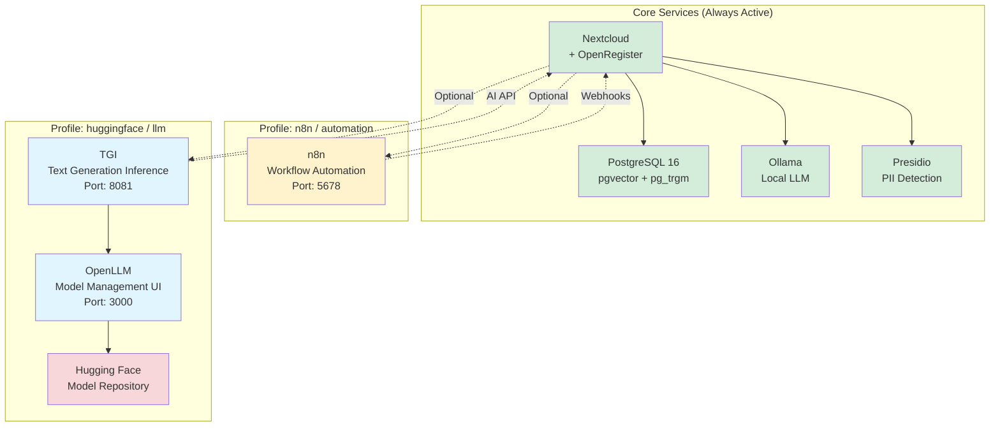

## Command Examples

### Start Core Only
```bash
docker-compose up -d
# Active: PostgreSQL, Nextcloud, Ollama, Presidio
# RAM: ~4GB
```

### Add n8n
```bash
docker-compose --profile n8n up -d
# Added: n8n workflow automation
# Total RAM: ~4.5GB
```

### Add Hugging Face
```bash
docker-compose --profile huggingface up -d
# Added: TGI, OpenLLM, Dolphin VLM
# Total RAM: ~20GB (GPU recommended)
```

### Full Stack
```bash
docker-compose --profile n8n --profile huggingface up -d
# All services active
# Total RAM: ~24GB
```

## Resource Usage by Profile

```
┌─────────────────────────────────────────────────────────────────┐
│ Core Services (Default)                                         │
│ ┌─────────────┬──────────────────────────────────────────────┐ │
│ │ PostgreSQL  │ ████░░░░░░  1GB                              │ │
│ │ Nextcloud   │ ████████░░  2GB                              │ │
│ │ Ollama      │ ██░░░░░░░░  500MB                            │ │
│ │ Presidio    │ ██░░░░░░░░  500MB                            │ │
│ └─────────────┴──────────────────────────────────────────────┘ │
│ Total: ~4GB RAM                                                 │
└─────────────────────────────────────────────────────────────────┘

┌─────────────────────────────────────────────────────────────────┐
│ + n8n Profile                                                    │
│ ┌─────────────┬──────────────────────────────────────────────┐ │
│ │ n8n         │ ██░░░░░░░░  512MB                            │ │
│ └─────────────┴──────────────────────────────────────────────┘ │
│ Additional: +512MB RAM                                          │
└─────────────────────────────────────────────────────────────────┘

┌─────────────────────────────────────────────────────────────────┐
│ + Hugging Face Profile                                          │
│ ┌─────────────┬──────────────────────────────────────────────┐ │
│ │ TGI (7B)    │ ████████████████░░  8GB                      │ │
│ │ OpenLLM     │ ████████████████░░  8GB                      │ │
│ │ GPU VRAM    │ ████████░░░░░░░░░░  8GB (recommended)        │ │
│ └─────────────┴──────────────────────────────────────────────┘ │
│ Additional: +16GB RAM, +8GB VRAM                                │
└─────────────────────────────────────────────────────────────────┘
```

## Port Allocation

```
Port 5432  → PostgreSQL (core)
Port 8080  → Nextcloud (core)
Port 11434 → Ollama (core)
Port 5001  → Presidio (core)

Port 5678  → n8n (profile: n8n)

Port 8081  → TGI API (profile: huggingface)
Port 3000  → OpenLLM UI (profile: huggingface)
Port 8082  → OpenLLM API (profile: huggingface)
```

## Model Size Reference

| Model | Parameters | Download | RAM | VRAM | Speed |
|-------|-----------|----------|-----|------|-------|
| Phi-2 | 2.7B | ~5GB | 4GB | 4GB | ⚡⚡⚡ |
| Mistral-7B | 7B | ~14GB | 8GB | 8GB | ⚡⚡ |
| Llama-2-7B | 7B | ~14GB | 8GB | 8GB | ⚡⚡ |
| Llama-2-13B | 13B | ~26GB | 16GB | 16GB | ⚡ |
| Llama-2-70B | 70B | ~140GB | 64GB | 40GB | ⚡ |

**Speed**: ⚡⚡⚡ = Fast, ⚡⚡ = Medium, ⚡ = Slow

## Profile Decision Tree

```
Do you need workflow automation or webhooks?
│
├─ YES → Use --profile n8n
│
└─ NO  → Continue
    │
    Do you need advanced LLM features?
    │
    ├─ YES → Do you have GPU with 8GB+ VRAM?
    │   │
    │   ├─ YES → Use --profile huggingface (full features)
    │   │
    │   └─ NO  → Use --profile llm with small model (phi-2)
    │
    └─ NO  → Use core services only (Ollama is included)
```

## Recommended Configurations

### Development Workstation
```bash
# Minimum viable for development
docker-compose up -d
# ~4GB RAM, no GPU needed
```

### CI/CD Server
```bash
# With automation for testing
docker-compose --profile n8n up -d
# ~4.5GB RAM, no GPU needed
```

### AI Research/Development
```bash
# Full AI stack with model management
docker-compose --profile llm up -d
# ~20GB RAM, 8-16GB VRAM recommended
```

### Production with Automation
```bash
# Everything enabled
docker-compose --profile n8n --profile huggingface up -d
# ~24GB RAM, 16GB VRAM recommended
```

## Quick Health Check

```bash
# Check all services
docker-compose ps

# Check specific profile
docker-compose --profile n8n ps
docker-compose --profile huggingface ps

# Health endpoints
curl http://localhost:8080/status.php  # Nextcloud
curl http://localhost:5678/healthz     # n8n
curl http://localhost:8081/health      # TGI
curl http://localhost:3000/health      # OpenLLM
```


