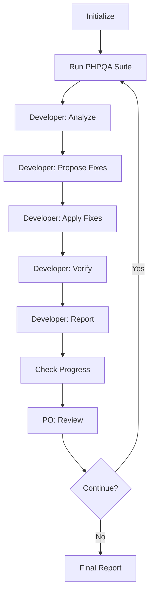

# Multi-Agent PHPQA Continuous Improvement Workflow

## Overview
This n8n workflow implements a multi-agent system for continuous code quality improvement using PHPQA tools.

## Architecture

### 🤖 Agent 1: Developer Agent
**Responsibilities:**
- Execute full PHPQA suite (PHPCS, PHPMD, Psalm, PHPMetrics)
- Analyze detected issues and categorize by severity
- Propose fixes using AI analysis (Ollama)
- Apply safe automatic fixes (PHPCBF)
- Verify improvements after each iteration
- Generate detailed status reports

**Process Flow:**
```
Run PHPQA → Analyze Issues → Propose Fixes → Apply Fixes → Verify → Report
```

### 🤖 Agent 2: Product Owner Agent
**Responsibilities:**
- Review developer agent's status reports
- Evaluate improvement metrics
- Decide whether to continue or stop
- Provide feedback for next iteration

**Decision Criteria:**
- ✅ Continue if: Issues remain AND progress being made
- ⏹️  Stop if: No issues remain OR no improvement OR max iterations

## Loop Mechanism

### Iteration Flow


### Stop Conditions
1. **Success**: All issues resolved
2. **Plateau**: No improvement for current iteration
3. **Limit**: Maximum iterations reached (10)
4. **Manual**: Requires human intervention

## Metrics Tracked

### Per Iteration
- PHPCS errors count
- PHPCS warnings count
- Total issues remaining
- Issues fixed this iteration
- Progress percentage
- Timestamp

### Overall
- Total iterations executed
- Total issues fixed
- Completion reason
- Duration
- Improvement trend

## Testing

### Manual Test
1. Navigate to http://localhost:5678/workflows
2. Open "Multi-Agent PHPQA Continuous Improvement"
3. Click Manual Trigger node
4. Click "Test workflow" button
5. Monitor execution log

### Expected Output
```
Iteration 1: 299 issues → Fixed 15 → 284 remaining
Developer Agent: CONTINUE
Product Owner: APPROVED

Iteration 2: 284 issues → Fixed 12 → 272 remaining
Developer Agent: CONTINUE
Product Owner: APPROVED

... continues until no more fixes possible ...

Final Report:
- Total iterations: 5
- Total fixed: 45 issues
- Remaining: 254 issues
- Reason: No further auto-fixes available
```

## Configuration

### Workflow Settings
- **Max Iterations**: 10
- **Container**: master-nextcloud-1
- **App Path**: /var/www/html/apps-extra/openregister
- **Schedule**: Every 6 hours (or manual trigger)

### AI Integration
- **Model**: CodeLlama 7B Instruct
- **Endpoint**: http://openregister-ollama:11434/api/generate
- **Use Cases**: Issue analysis, fix proposals

## Monitoring

### Logs
Check n8n execution logs for:
- Developer agent analysis
- Product owner decisions
- Iteration progress
- Stop conditions

### Database
Query workflow executions:
```bash
docker exec openregister-n8n sqlite3 /root/.n8n/database.sqlite \
  "SELECT * FROM execution_entity WHERE workflowId='cdg3zXOoQ8x5gFZJ' ORDER BY startedAt DESC LIMIT 10;"
```

## Troubleshooting

### Common Issues
1. **Git ownership errors**: Run `git config --global --add safe.directory` in container
2. **Permission errors**: Ensure user 33 (www-data) can write files
3. **No progress**: Check if PHPCBF can fix detected issues
4. **AI timeout**: Increase execution timeout in workflow settings

## Future Enhancements
- Add PHPMD (mess detection)
- Add Psalm (static analysis)  
- Add PHPMetrics (complexity)
- Git commit after each successful iteration
- Slack/email notifications
- Newman API tests after fixes
