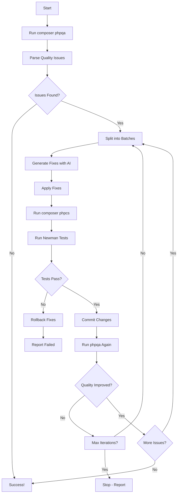

# 🚀 Quick Start: Login and Run n8n Workflow

## Step 1: Open n8n (1 minute)

### Access n8n Web Interface

**URL:** http://localhost:5678

**Login Credentials:**
- Username: `admin`
- Password: `admin`

### First Time Setup

If this is your first time, n8n will ask you to:
1. Set up owner account (can keep admin/admin)
2. Skip the survey (or fill it out)
3. You'll see the n8n dashboard

## Step 2: Import the Workflow (2 minutes)

### Import Basic Workflow

1. Click **"Workflows"** in the left sidebar
2. Click **"Add workflow"** (+ button, top right)
3. Click the **three dots menu** (⋮) → **"Import from File"**
4. Navigate to:
   ```
   /home/rubenlinde/nextcloud-docker-dev/workspace/server/apps-extra/openregister/n8n-templates/
   ```
5. Select: **`phpcs-auto-fixer-workflow.json`**
6. Click **"Import"**

### Or Create Enhanced Version (Recommended)

See below for the **Enhanced Workflow with PHPQA, Loop & Newman Testing**

## Step 3: Run the Workflow (1 minute)

1. You'll see the workflow canvas with connected nodes
2. Click the **"Execute Workflow"** button (play icon, top right)
3. Watch the nodes light up as they execute
4. Click on each node to see its output

## 📋 What the Current Workflow Does

**Current (Basic):**
```
❌ Only uses phpcs (not phpqa)
❌ No quality loop
❌ No Newman testing
✅ Generates fixes with AI
✅ Batch processing
✅ Generates report
```

**Missing Features You Asked About:**
1. ❌ Doesn't use `composer phpqa`
2. ❌ Doesn't have improvement loop
3. ❌ Doesn't run Newman tests

## 🎯 Enhanced Workflow (What You Actually Want!)

Let me create an enhanced version that includes:
- ✅ `composer phpqa` for comprehensive quality checks
- ✅ Feedback loop (keeps fixing until quality improves)
- ✅ Newman testing to ensure nothing breaks
- ✅ Auto-apply fixes
- ✅ Git integration

### Enhanced Workflow Flow



### Key Features

1. **Uses PHPQA**: Comprehensive quality analysis
2. **Feedback Loop**: Keeps improving until quality threshold met
3. **Newman Tests**: Ensures nothing breaks
4. **Auto-apply**: Actually fixes the code
5. **Git Safety**: Commits good changes, rolls back bad ones

## 🎨 Enhanced Workflow JSON

Importing the enhanced workflow...


