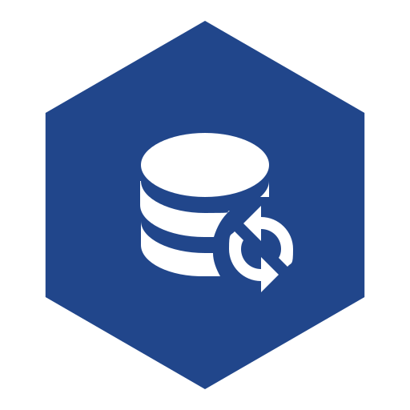
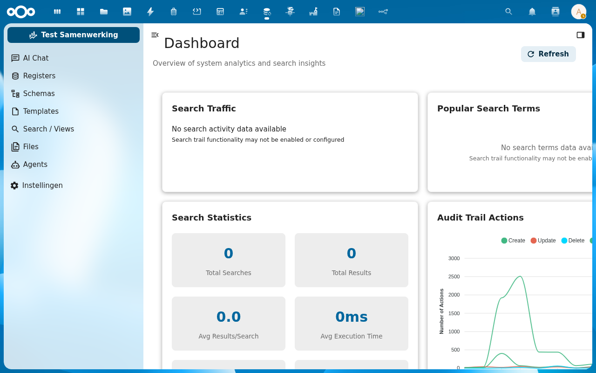
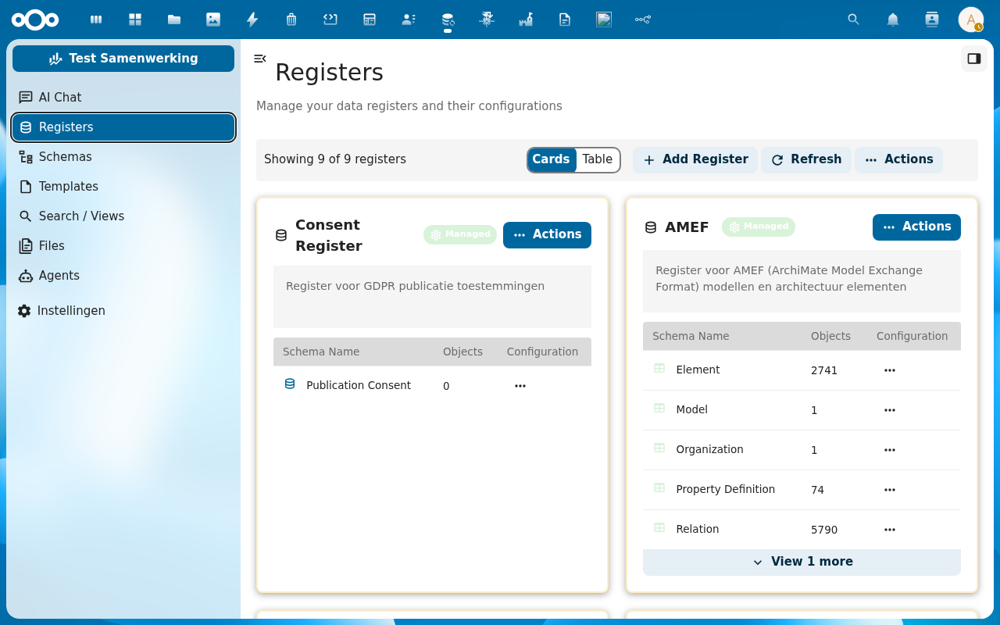
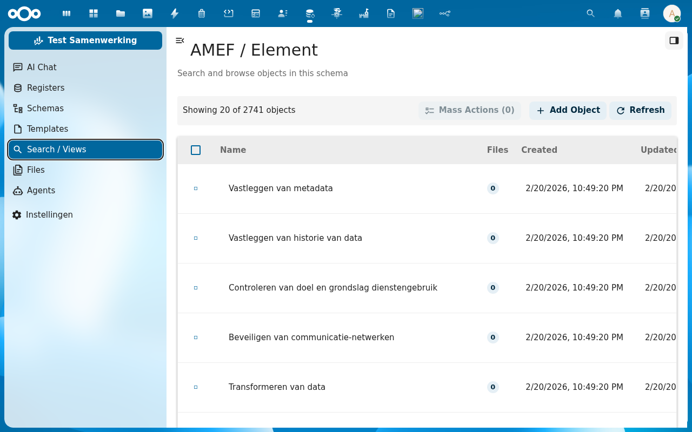
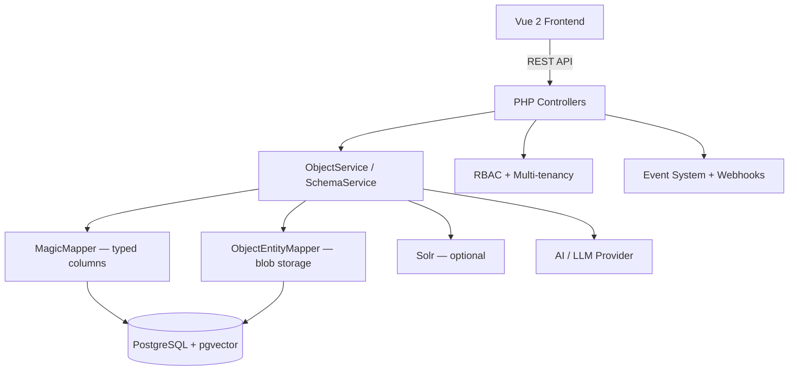

<p align="center">
  
</p>

<h1 align="center">OpenRegister</h1>

<p align="center">
  <strong>Flexible object storage for Nextcloud — schema-driven registers with REST APIs, multi-tenancy, and audit trails</strong>
</p>

<p align="center">
  <a href="https://github.com/ConductionNL/openregister/releases"></a>
  <a href="https://github.com/ConductionNL/openregister/blob/main/LICENSE"></a>
  <a href="https://github.com/ConductionNL/openregister/actions"></a>
  <a href="https://openregisters.app"></a>
</p>

---

OpenRegister provides a way to quickly build and deploy standardized data registers in Nextcloud. Define your data models with JSON Schema, store objects in high-performance registers, and expose them through REST APIs that follow NLGov API Design Rules and Common Ground principles.

It is the shared data backbone for apps like [OpenCatalogi](https://github.com/ConductionNL/opencatalogi), [Procest](https://github.com/ConductionNL/procest), [Pipelinq](https://github.com/ConductionNL/pipelinq), and [Software Catalogus](https://github.com/ConductionNL/softwarecatalog).

## Screenshots

<table>
  <tr>
    <td></td>
    <td></td>
    <td></td>
  </tr>
  <tr>
    <td align="center"><em>Dashboard</em></td>
    <td align="center"><em>Registers</em></td>
    <td align="center"><em>Objects</em></td>
  </tr>
</table>

## Features

### Core

- **Schema-driven Registers** — Define data structures with JSON Schema and organize them into registers
- **Full CRUD API** — Create, read, update, and delete objects through a standards-compliant REST API
- **Multi-tenancy** — Complete organization-based data isolation with user management
- **Role-based Access Control** — Fine-grained permissions at register, schema, and object level
- **Audit Trails** — Full history of all object changes with user attribution
- **Time Travel** — View and restore previous object states at any point in time
- **Soft Deletes** — Safely remove objects with configurable retention and recovery
- **Object Relations** — Create and manage typed connections between objects across registers
- **File Attachments** — Manage files with text extraction, OCR, and version control
- **Schema Validation** — Validate objects against JSON Schema with enhanced error messages
- **Object Locking** — Prevent concurrent modifications for data integrity
- **Bulk Operations** — Perform batch create, update, and delete operations
- **Events and Webhooks** — React to data changes with events for integrations and automation
- **Data Filtering** — Select specific properties to return for data minimization and GDPR compliance

### Search and AI

- **Full-text Search** — Search across registers with PostgreSQL pg_trgm, no external engine required
- **Automatic Faceting** — Dynamic filtering based on object properties with UUID resolution
- **Semantic Search** — AI-powered search using PostgreSQL pgvector for meaning-based discovery
- **Vector Embeddings** — Automatic vectorization of objects and files stored natively in PostgreSQL
- **File Vectorization** — Chunk and vectorize documents (PDF, DOCX, images with OCR) for semantic search
- **Content Generation** — AI-powered text generation, summarization, translation, and classification
- **LLM Providers** — Supports OpenAI, Ollama (local), Fireworks AI, and Azure OpenAI

### Integrations

- **SOLR Integration** — Optional Apache Solr for advanced search scenarios
- **Source Synchronization** — Keep registers in sync with external data sources
- **Schema Import** — Import schemas from Schema.org, OpenAPI, and GGM standards
- **CalDAV Tasks** — Attach Nextcloud tasks and comments directly to data objects
- **JSON-LD and Linked Data** — Standards-compliant output for the open data ecosystem

## Architecture



### Data Model

| Entity         | Description                                                      |
| -------------- | ---------------------------------------------------------------- |
| Register       | Collection of schemas with shared configuration and access rules |
| Schema         | JSON Schema definition that validates and types objects          |
| Object         | Data record validated against a schema, stored in a register     |
| AuditTrail     | Immutable change log entry for an object                         |
| ObjectRelation | Typed link between two objects (within or across registers)      |
| File           | Attachment with text extraction, chunking, and vector embeddings |

### Directory Structure

```
openregister/
├── appinfo/           # Nextcloud app manifest, routes, navigation
├── lib/               # PHP backend — controllers, services, mappers, events
│   ├── Controller/    # API and page controllers
│   ├── Service/       # Business logic (ObjectService, SchemaService, SearchService…)
│   ├── Db/            # Database entities and mappers (MagicMapper, ObjectEntityMapper)
│   └── Handlers/      # RBAC, faceting, search, multi-tenancy handlers
├── src/               # Vue 2 frontend — components, Pinia stores, views
│   ├── components/    # Reusable UI components
│   ├── store/         # Pinia stores per entity
│   └── views/         # Route-level views
├── img/               # App icons and screenshots
├── l10n/              # Translations (en, nl)
├── tests/             # Integration tests (Newman/Postman)
└── docusaurus/        # Documentation site (openregisters.app)
```

## Requirements

| Dependency | Version                                      |
| ---------- | -------------------------------------------- |
| Nextcloud  | 28 – 33                                      |
| PHP        | 8.1+                                         |
| PostgreSQL | 12+ (recommended, with pgvector and pg_trgm) |
| MySQL      | 8.0+ (alternative, no vector search)         |

## Installation

### From the Nextcloud App Store

1. Go to **Apps** in your Nextcloud instance
2. Search for **OpenRegister**
3. Click **Download and enable**

### From Source

```bash
cd /var/www/html/custom_apps
git clone https://github.com/ConductionNL/openregister.git
cd openregister
composer install --no-dev
npm install
npm run build
php occ app:enable openregister
```

## Development

### Start the environment

```bash
docker compose -f openregister/docker-compose.yml up -d
# Nextcloud available at http://localhost:8080 (admin/admin)
```

### Frontend development

```bash
cd openregister
npm install
npm run dev        # Watch mode
npm run build      # Production build
```

### Code quality

```bash
# PHP
composer phpcs          # Check coding standards
composer cs:fix         # Auto-fix issues
composer phpmd          # Mess detection
composer phpmetrics     # HTML metrics report

# Frontend
npm run lint            # ESLint
npm run stylelint       # CSS linting
```

## Tech Stack

| Layer    | Technology                                         |
| -------- | -------------------------------------------------- |
| Frontend | Vue 2.7, Pinia, @nextcloud/vue                     |
| Build    | Webpack 5, @nextcloud/webpack-vue-config           |
| Backend  | PHP 8.1+, Nextcloud App Framework                  |
| Database | PostgreSQL 16 with pgvector + pg_trgm              |
| Search   | Magic tables (SQL), Solr (optional)                |
| AI       | Ollama, OpenAI, Fireworks AI, Azure OpenAI         |
| UX       | @conduction/nextcloud-vue                          |
| Quality  | PHPCS, PHPMD, phpmetrics, Psalm, ESLint, Stylelint |

## Documentation

Full documentation is available at **[openregisters.app](https://openregisters.app)**

| Page                                                        | Description                                                     |
| ----------------------------------------------------------- | --------------------------------------------------------------- |
| [Installation](https://openregisters.app/docs/installation) | Complete installation and configuration guide                   |
| [Features](website/docs/Features/)                          | Feature documentation (objects, schemas, registers, search, AI) |
| [Developer Guide](website/docs/development/)                | Development setup, Docker profiles, PostgreSQL search           |
| [API Reference](website/docs/api/)                          | REST API endpoints and bulk operations                          |
| [Testing](tests/integration/README.md)                      | Integration test suite (Newman/Postman)                         |

## Standards & Compliance

- **Data standard:** JSON Schema, JSON-LD, Schema.org
- **API standard:** NLGov REST API Design Rules (Logius)
- **Dutch interoperability:** Common Ground principles, VNG standards
- **Accessibility:** WCAG AA (Dutch government requirement)
- **Authorization:** RBAC with organization-level multi-tenancy
- **Audit trail:** Full immutable change history on all objects
- **Localization:** English and Dutch

## Related Apps

- **[OpenCatalogi](https://github.com/ConductionNL/opencatalogi)** — Publication and catalog management (uses OpenRegister as data layer)
- **[Procest](https://github.com/ConductionNL/procest)** — Case and process management (uses OpenRegister as data layer)
- **[Pipelinq](https://github.com/ConductionNL/pipelinq)** — CRM with lead pipelines (uses OpenRegister as data layer)
- **[Software Catalogus](https://github.com/ConductionNL/softwarecatalog)** — GEMMA software catalog (uses OpenRegister as data layer)
- **[NL Design](https://github.com/ConductionNL/nldesign)** — Design token theming for government standards
- **[DocuDesk](https://github.com/ConductionNL/docudesk)** — Document generation

## License

EUPL-1.2 — see [LICENSE](LICENSE) for details.

## Authors

Built by [Conduction](https://conduction.nl) — open-source software for Dutch government and public sector organizations.
