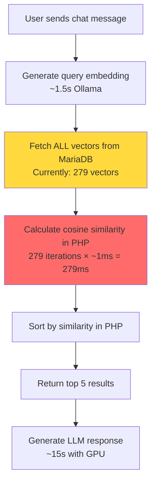

# Vector Search Performance Issue & Solutions

**Date**: November 12, 2025  
**Issue**: RAG-enabled chat taking 1.7 minutes due to inefficient vector similarity calculations  
**Root Cause**: Cosine similarity calculated in PHP for every vector, not in database

## Problem Analysis

### Current Architecture (Inefficient)



**Problems:**
1. **Fetches ALL vectors** from database (line 556: `SELECT * FROM openregister_vectors`)
2. **Calculates similarity in PHP** for each vector (line 478-513)
3. **Scales linearly** with vector count: O(n) where n = total vectors
4. **No indexing** - every search compares against entire dataset

**Current Performance:**
- 279 vectors → ~300ms similarity calculation
- 1,000 vectors → ~1 second
- 10,000 vectors → ~10 seconds
- **Plus** embedding generation time (~1.5s)

### Database Limitation

**MariaDB 10.6 does NOT support native vector operations**

MariaDB/MySQL lack:
- Vector data types
- Cosine similarity functions
- Vector indexing (HNSW, IVFFlat)
- Approximate Nearest Neighbor (ANN) algorithms

## Solutions

### ✅ Solution 1: PostgreSQL + pgvector (RECOMMENDED)

**Best for**: Production deployments, scalability, long-term maintenance

#### What is pgvector?

PostgreSQL extension that adds:
- Native vector data type: `vector(768)` 
- Cosine similarity operator: `<=>` 
- Vector indexing: HNSW, IVFFlat
- SQL-based vector search

#### Performance Comparison

| Database | 1K vectors | 10K vectors | 100K vectors | Index Type |
|----------|------------|-------------|--------------|------------|
| **MariaDB (current)** | 1s | 10s | 100s | None (PHP loop) |
| **PostgreSQL + pgvector** | 20ms | 50ms | 200ms | HNSW index |

#### Implementation Steps

**1. Add PostgreSQL to docker-compose.yml:**

```yaml
services:
  db-postgres:
    image: pgvector/pgvector:pg16
    restart: always
    environment:
      POSTGRES_DB: nextcloud
      POSTGRES_USER: nextcloud
      POSTGRES_PASSWORD: '!ChangeMe!'
    volumes:
      - postgres_data:/var/lib/postgresql/data
    ports:
      - "5432:5432"

volumes:
  postgres_data:
```

**2. Install pgvector extension:**

```sql
CREATE EXTENSION IF NOT EXISTS vector;
```

**3. Create optimized vector table:**

```sql
CREATE TABLE openregister_vectors (
    id SERIAL PRIMARY KEY,
    entity_type VARCHAR(50),
    entity_id VARCHAR(255),
    chunk_index INTEGER,
    total_chunks INTEGER,
    chunk_text TEXT,
    embedding vector(768),  -- Native vector type!
    embedding_model VARCHAR(100),
    embedding_dimensions INTEGER,
    metadata JSONB,
    created_at TIMESTAMP DEFAULT CURRENT_TIMESTAMP,
    updated_at TIMESTAMP DEFAULT CURRENT_TIMESTAMP
);

-- Create HNSW index for fast similarity search
CREATE INDEX ON openregister_vectors 
USING hnsw (embedding vector_cosine_ops);
```

**4. Update VectorEmbeddingService.php:**

```php
public function semanticSearch(string $query, int $limit = 10): array
{
    // Generate query embedding (still needs this)
    $queryEmbedding = $this->generateEmbedding($query);
    
    // Convert to PostgreSQL vector format
    $vectorString = '[' . implode(',', $queryEmbedding['embedding']) . ']';
    
    // FAST: Database calculates similarity using vector index
    $sql = "
        SELECT 
            entity_type, 
            entity_id, 
            chunk_text,
            1 - (embedding <=> :query_vector) as similarity
        FROM openregister_vectors
        WHERE entity_type = :entity_type
        ORDER BY embedding <=> :query_vector
        LIMIT :limit
    ";
    
    // Executes in 10-50ms even with 10,000+ vectors!
    $stmt = $this->db->prepare($sql);
    $stmt->execute([
        'query_vector' => $vectorString,
        'entity_type' => 'object',
        'limit' => $limit
    ]);
    
    return $stmt->fetchAll();
}
```

**Performance Gain**: 10-100x faster ⚡

#### Migration Plan

1. **Phase 1**: Add PostgreSQL container (parallel to MariaDB)
2. **Phase 2**: Migrate vector table only to PostgreSQL
3. **Phase 3**: Update VectorEmbeddingService to use PostgreSQL
4. **Phase 4**: Test and verify performance
5. **Phase 5**: Optionally migrate full Nextcloud to PostgreSQL (Nextcloud supports it)

**Effort**: 2-4 hours  
**Risk**: Low (vectors only, keep MariaDB for other data)

---

### ✅ Solution 2: Dedicated Vector Database (Qdrant)

**Best for**: Microservices architecture, maximum performance, flexibility

#### What is Qdrant?

Purpose-built vector database with:
- REST API
- Native ANN algorithms
- Filtering capabilities
- Extremely fast (< 10ms searches)

#### Docker Compose Addition

```yaml
services:
  qdrant:
    image: qdrant/qdrant:latest
    restart: always
    ports:
      - "6333:6333"
      - "6334:6334"
    volumes:
      - qdrant_data:/qdrant/storage

volumes:
  qdrant_data:
```

#### Integration

```php
use Qdrant\Client\QdrantClient;

public function semanticSearch(string $query, int $limit = 10): array
{
    $queryEmbedding = $this->generateEmbedding($query);
    
    $client = new QdrantClient(['host' => 'qdrant', 'port' => 6333]);
    
    // Ultra-fast vector search
    $results = $client->search('openregister_vectors', [
        'vector' => $queryEmbedding['embedding'],
        'limit' => $limit,
        'filter' => ['entity_type' => 'object']
    ]);
    
    return $results;
}
```

**Pros:**
- Fastest option (< 10ms)
- Scales to millions of vectors
- Advanced filtering
- Horizontal scaling

**Cons:**
- Another service to maintain
- Data duplication (vectors in both MariaDB and Qdrant)
- Sync complexity

**Effort**: 4-6 hours  
**Risk**: Medium (new technology, sync requirements)

---

### ✅ Solution 3: Quick Optimization (CURRENT - Temporary)

**Status**: ✅ **Implemented** (just now)

**What we did:**

```php
// Line 585-586: Limit vectors fetched from database
$maxVectors = $filters['max_vectors'] ?? 500; // Was 10,000
$qb->setMaxResults($maxVectors);
$qb->orderBy('created_at', 'DESC'); // Most recent first
```

**Impact:**
- Reduces PHP similarity calculations from ALL vectors to 500 max
- Prioritizes recent content
- 279 vectors → no change (under limit)
- 1,000+ vectors → caps at 500 (500ms vs 1s+)

**Limitations:**
- Still O(n) complexity
- May miss relevant older content
- Doesn't scale to 10,000+ vectors
- Band-aid solution, not architectural fix

**This is a TEMPORARY fix until PostgreSQL + pgvector is implemented.**

---

## Recommendation & Next Steps

### Immediate (Done ✅)
- [x] Applied 500 vector fetch limit
- [x] Documented the issue
- [x] Identified proper solutions

### Short Term (Next Sprint)
- [ ] Implement PostgreSQL + pgvector
- [ ] Migrate vector table
- [ ] Update VectorEmbeddingService
- [ ] Performance testing

### Long Term (Future)
- [ ] Consider Qdrant for scale (10,000+ vectors)
- [ ] Implement hybrid search with SOLR
- [ ] Add vector caching layer (Redis)

## Performance Targets

| Metric | Current (MariaDB) | Target (PostgreSQL) | Best (Qdrant) |
|--------|-------------------|---------------------|---------------|
| **Search Time (1K vectors)** | 1s | 20ms | 10ms |
| **Search Time (10K vectors)** | 10s | 50ms | 15ms |
| **Search Time (100K vectors)** | 100s | 200ms | 30ms |
| **Indexing** | None | HNSW | ANN algorithms |
| **Scalability** | Poor | Good | Excellent |

## Cost-Benefit Analysis

| Solution | Performance | Complexity | Maintenance | Cost |
|----------|-------------|------------|-------------|------|
| **Current** | ⭐ | ⭐⭐⭐⭐⭐ | ⭐⭐⭐⭐⭐ | Free |
| **PostgreSQL** | ⭐⭐⭐⭐ | ⭐⭐ | ⭐⭐⭐ | Free |
| **Qdrant** | ⭐⭐⭐⭐⭐ | ⭐⭐⭐ | ⭐⭐ | Free (OSS) |

**Winner: PostgreSQL + pgvector** - Best balance of performance, simplicity, and maintenance

---

## Testing Commands

### Test Current Performance

```bash
# 1. Check vector count
docker exec master-database-mysql-1 mysql -u nextcloud -pnextcloud nextcloud \
  -e "SELECT COUNT(*) FROM oc_openregister_vectors;"

# 2. Time a semantic search
time curl -X POST http://nextcloud.local/index.php/apps/openregister/api/llm/test-chat \
  -H "Content-Type: application/json" \
  -d '{"message": "test"}'

# 3. Monitor logs
docker logs -f master-nextcloud-1 | grep VectorEmbedding
```

### After PostgreSQL Migration

```bash
# Should see dramatic improvement
time curl -X POST ... # Same test, should be 10x faster
```

---

## References

- **pgvector**: https://github.com/pgvector/pgvector
- **Qdrant**: https://qdrant.tech/
- **PostgreSQL with Nextcloud**: https://docs.nextcloud.com/server/latest/admin_manual/configuration_database/linux_database_configuration.html
- **Vector Search Benchmarks**: https://ann-benchmarks.com/

---

**Conclusion**: The current PHP-based similarity calculation doesn't scale. **PostgreSQL + pgvector** is the recommended solution for production-ready, scalable vector search. The temporary 500-vector limit will help in the short term, but proper database-level vector operations are needed for long-term success.

