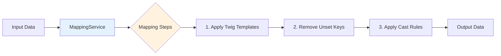

# Mappings

Mappings in OpenRegister define how to transform data between different formats. They use Twig templating for dynamic value transformations, dot notation for nested array access, and type casting for format conversion. Mappings are reusable entities that can be shared across applications via configuration JSON files.

## Overview

A Mapping entity contains four core components:

- **mapping**: Key-value pairs that define field transformations using Twig templates
- **unset**: Array of keys to remove from the output
- **cast**: Type casting rules for specific fields
- **passThrough**: Whether unmapped input fields should pass through to the output



## Mapping Entity Properties

| Property | Type | Description |
|---|---|---|
| `uuid` | string | Unique identifier (auto-generated) |
| `name` | string | Human-readable name |
| `slug` | string | URL-friendly identifier for deduplication |
| `version` | string | Semantic version (X.Y.Z), auto-incremented on update |
| `description` | string | Description of what the mapping does |
| `mapping` | JSON | The transformation rules (Twig templates) |
| `unset` | JSON | Keys to remove from output |
| `cast` | JSON | Type casting rules |
| `passThrough` | boolean | Include unmapped input fields in output |
| `configurations` | JSON | Array of configuration UUIDs this mapping belongs to |
| `organisation` | string | Organisation UUID for multi-tenancy |
| `reference` | string | External reference identifier |

## Twig Templating

Mapping values use Twig template syntax to reference input fields:

```json
{
    "mapping": {
        "fullName": "{{ firstName }} {{ lastName }}",
        "email": "{{ contact.email }}",
        "status": "active",
        "address.street": "{{ address.streetName }} {{ address.houseNumber }}"
    }
}
```

### Dot Notation

Both input access and output keys support dot notation for nested structures:

- **Input**: `{{ address.city }}` reads `$input['address']['city']`
- **Output**: `"address.street": "..."` writes to `$output['address']['street']`

### Static Values

Values without Twig brackets are treated as static:

```json
{
    "mapping": {
        "type": "person",
        "version": "1.0"
    }
}
```

## Type Casting

The `cast` array defines type conversions applied after mapping:

```json
{
    "cast": {
        "age": "integer",
        "isActive": "boolean",
        "score": "float",
        "createdAt": "date",
        "tags": "array",
        "amount": "moneyStringToInt"
    }
}
```

### Supported Cast Types

| Type | Description |
|---|---|
| `string` | Convert to string |
| `bool` / `boolean` | Convert to boolean ("true"/"1" = true) |
| `?bool` / `?boolean` | Nullable boolean (empty string = null) |
| `int` / `integer` | Convert to integer |
| `float` | Convert to float |
| `array` | Convert to array |
| `date` | Format as ISO 8601 date string |
| `json` | JSON encode the value |
| `jsonToArray` | JSON decode to array |
| `url` | URL encode |
| `urlDecode` | URL decode |
| `rawurl` | Raw URL encode |
| `rawurlDecode` | Raw URL decode |
| `html` | HTML entity encode |
| `htmlDecode` | HTML entity decode |
| `base64` | Base64 encode |
| `base64Decode` | Base64 decode |
| `utf8` | Convert to UTF-8 |
| `nullStringToNull` | Convert "null" string to actual null |
| `coordinateStringToArray` | Parse coordinate string to array |
| `keyCantBeValue` | Set to null if key equals value |
| `unsetIfValue` | Remove field if it matches a specific value |
| `setNullIfValue` | Set to null if it matches a specific value |
| `countValue` | Replace array with its count |
| `moneyStringToInt` | Convert money string (e.g., "12.50") to cents integer |
| `intToMoneyString` | Convert cents integer to money string |

## Unset

The `unset` array removes keys from the output after mapping:

```json
{
    "unset": ["internalId", "metadata.debug", "tempField"]
}
```

## Pass-Through Mode

When `passThrough` is `true`, all input fields not explicitly mapped are included in the output. When `false` (default), only explicitly mapped fields appear in the output.

## Caching

MappingService uses a two-layer caching strategy for performance:

1. **In-memory Twig template cache**: Compiled Twig templates are cached by SHA-256 hash of the template string, avoiding recompilation when the same template is used across multiple records.

2. **Distributed entity cache** (APCu/Redis): Mapping entities fetched from the database are cached for 5 minutes. Cache entries are keyed by ID, UUID, and slug. The cache is automatically invalidated on create, update, and delete operations in MappingMapper.

## Configuration Import/Export

Mappings can be included in application configuration JSON files (`{app}/lib/Settings/{app}_register.json`) under `components.mappings`:

```json
{
    "openapi": "3.0.0",
    "info": {
        "title": "My App",
        "version": "1.0.0"
    },
    "components": {
        "mappings": {
            "my-mapping-slug": {
                "name": "My Mapping",
                "slug": "my-mapping-slug",
                "version": "1.0.0",
                "description": "Transforms external data to internal format",
                "mapping": {
                    "name": "{{ externalName }}",
                    "status": "{{ externalStatus }}"
                },
                "cast": {
                    "count": "integer"
                },
                "unset": ["tempField"],
                "passThrough": false
            }
        }
    }
}
```

### Import Behaviour

When a configuration is imported (via API or repair step), the ImportHandler processes mappings as follows:

1. **Slug-based deduplication**: Builds a slug-to-ID map of all existing mappings (including those with no organisation) to detect duplicates.
2. **Version comparison**: If a mapping with the same slug exists, compares versions. Only updates if the imported version is higher (or if `force` is set).
3. **Auto-versioning**: If no version is specified, inherits the configuration version or defaults to `0.0.1`.
4. **Configuration tracking**: The mapping's `configurations` array is set to the importing configuration's UUID, and the configuration's `mappings` array tracks imported mapping IDs.

### Multi-Tenancy During Import

Mappings created during import may have `null` organisation when there is no user session (e.g., CLI repair steps, background jobs). To ensure re-imports correctly find these mappings for deduplication, the import flow uses `includeNullOrg: true` on mapper queries. This adds `OR organisation IS NULL` to the multi-tenancy filter, preventing duplicate creation on subsequent imports.

### Export

When exporting a configuration, all mappings tracked in the configuration's `mappings` array are serialized into `components.mappings`. Instance-specific fields (id, uuid, organisation, created, updated) are stripped so the export is portable across instances.

## API Endpoints

### List Mappings
```
GET /index.php/apps/openregister/api/mappings
```

### Get Mapping
```
GET /index.php/apps/openregister/api/mappings/{id}
```
Supports lookup by numeric ID, UUID, or slug.

### Create Mapping
```
POST /index.php/apps/openregister/api/mappings
Content-Type: application/json

{
    "name": "My Mapping",
    "slug": "my-mapping",
    "mapping": { ... },
    "cast": { ... },
    "unset": [ ... ]
}
```

### Update Mapping
```
PUT /index.php/apps/openregister/api/mappings/{id}
Content-Type: application/json

{
    "name": "Updated Mapping",
    "mapping": { ... }
}
```
Version auto-increments (patch) if not explicitly provided.

### Delete Mapping
```
DELETE /index.php/apps/openregister/api/mappings/{id}
```

## Example: ZGW-style Mapping

Transform an internal case object to a ZGW-compatible format:

```json
{
    "name": "case-to-zgw",
    "slug": "case-to-zgw",
    "version": "1.0.0",
    "mapping": {
        "identificatie": "{{ caseNumber }}",
        "omschrijving": "{{ title }}",
        "startdatum": "{{ createdAt }}",
        "einddatum": "{{ closedAt }}",
        "status": "{{ status }}",
        "zaaktype": "{{ caseType.url }}",
        "resultaat.omschrijving": "{{ result.description }}"
    },
    "cast": {
        "startdatum": "date",
        "einddatum": "date"
    },
    "unset": ["internalNotes", "debugInfo"],
    "passThrough": false
}
```

## Code References

- Entity: `lib/Db/Mapping.php`
- Mapper: `lib/Db/MappingMapper.php`
- Service: `lib/Service/MappingService.php`
- Config import: `lib/Service/Configuration/ImportHandler.php`
- Config export: `lib/Service/Configuration/ExportHandler.php`
- Migration: `lib/Migration/Version1Date20260308000000.php` (adds `mappings` column to configurations)
