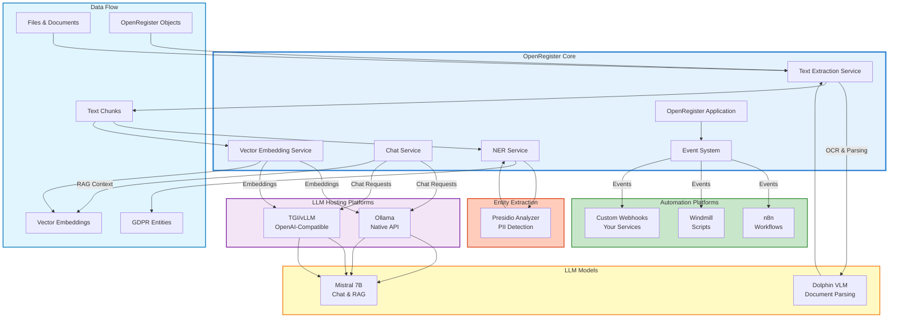
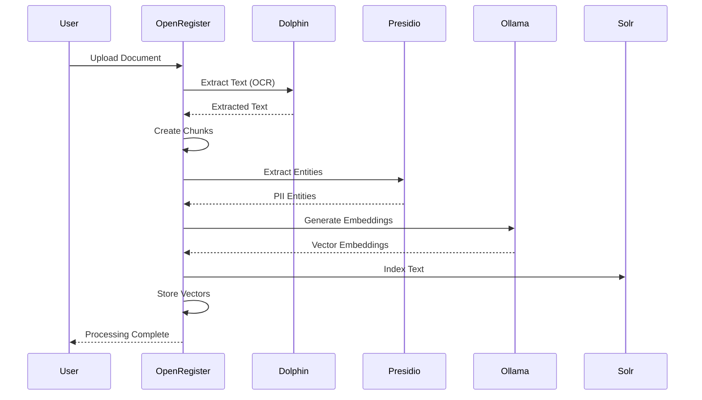
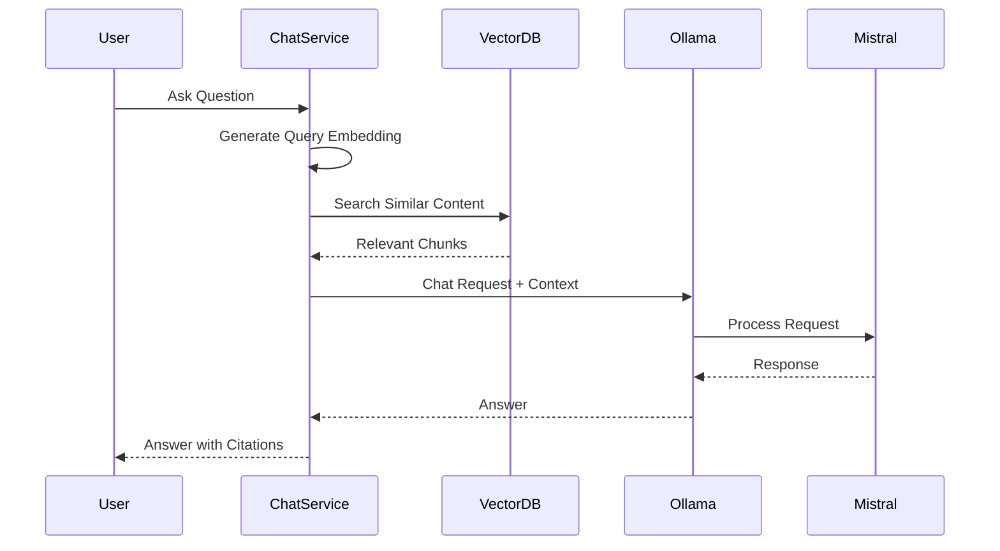
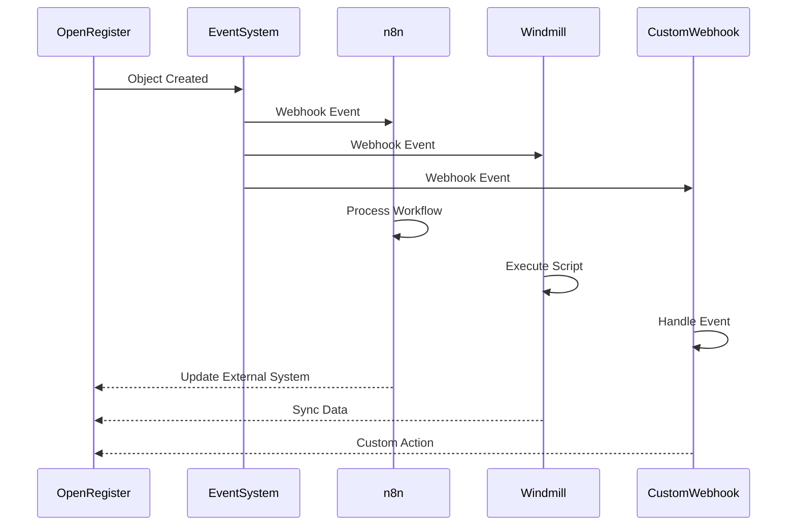

# Integrations

Every "linked thing" on an Open Register object is a **leaf**. Meetings, contacts, files, wiki pages, kanban cards, chat threads — each is a leaf with the same provider contract on the backend and the same registry surface on the frontend. Plus a separate set of integrations for LLMs and automation engines.

## Leaf integrations

Open Register ships **18 leaves** plus the 5 always-available built-ins. Every leaf surfaces as a sidebar tab on linked objects, a dashboard widget in four surfaces, and an admin row with health status. See **[Leaf integration system](./leaf-system.md)** for the architecture and **[Pluggable integration registry](./pluggable-integration-registry.md)** for the full ADR-019 contract.

### Always-available built-ins

- **[Files](../features/files)** — files attached to an object (magic-column).
- **Notes** — free-form notes (link-table). Documented under the [pluggable integration registry](./pluggable-integration-registry.md).
- **Tags** — system tags (link-table).
- **Tasks** — to-dos (link-table).
- **Audit trail** — every change on the object (query-time).

### NC-native leaves

| Group | Leaf |
|---|---|
| Core | [Shares](./shares.md) |
| Comms | [Calendar](./calendar.md) · [Contacts](./contacts.md) · [Email](./email.md) · [Talk](./talk.md) |
| Docs | [Bookmarks](./bookmarks.md) · [Collectives](./collectives.md) · [Maps](./maps.md) · [Photos](./photos.md) |
| Workflow | [Activity](./activity.md) · [Analytics](./analytics.md) · [Cospend](./cospend.md) · [Deck](./deck.md) · [Flow](./flow.md) · [Forms](./forms.md) · [Polls](./polls.md) · [Time tracker](./time-tracker.md) |

### External leaves (OpenConnector-routed)

- **[xWiki](./xwiki.md)** — link xWiki pages with breadcrumb + text preview.
- **[OpenProject](./openproject.md)** — link OpenProject work packages.

## OpenRegister's own push events

OpenRegister itself emits `notify_custom` events on every object lifecycle change so consumers can subscribe and refresh without polling.

- **[OpenRegister Push Events](./OpenRegister.md)** — `or-object-{uuid}` and `or-collection-{register}-{schema}` event reference, fan-out semantics, batch mode, subscription examples.

## LLM hosting platforms

Services that host and run large language models locally.

- **[Ollama](./ollama.md)** — simple native API for running LLMs.
- **[Hugging Face](./huggingface.md)** — TGI / vLLM with an OpenAI-compatible API.

## LLM models

Specific models you can plug in.

- **[Mistral](./mistral.md)** — high-performance 7B model.
- **[Dolphin](./dolphin.md)** — document parsing and OCR.

## Entity extraction

- **[Presidio](./presidio.md)** — Microsoft's PII detector.

## Automation platforms

- **[n8n](./n8n.md)** — workflow automation.
- **[Windmill](./windmill.md)** — developer-focused workflow engine.
- **[Custom webhooks](./custom-webhooks.md)** — build your own.

## Integration Architecture

The following diagram shows how all integrations work together in OpenRegister:



## Integration Flow

### 1. Text Extraction Pipeline



### 2. Chat & RAG Pipeline



### 3. Automation Pipeline



## Integration Comparison

### LLM Hosting Platforms

| Platform | API Type | Setup Difficulty | Performance | Best For |
|----------|----------|------------------|-------------|----------|
| **Ollama** | Native | ⭐⭐⭐⭐⭐ Easy | ⚡⚡⚡ Good | Development, simple setup |
| **TGI** | OpenAI-Compatible | ⭐⭐⭐ Medium | ⚡⚡ Fast | Production, optimized |
| **vLLM** | OpenAI-Compatible | ⭐⭐⭐ Medium | ⚡⚡⚡ Very Fast | High throughput |

### LLM Models

| Model | Size | Use Case | Hosting |
|-------|------|----------|---------|
| **Mistral 7B** | 7B | Chat, RAG, general purpose | Ollama, TGI, vLLM |
| **Dolphin** | 0.3B | Document parsing, OCR | Custom container |

### Entity Extraction

| Service | Accuracy | Languages | Best For |
|---------|----------|-----------|----------|
| **Presidio** | 90-95% | 50+ | GDPR compliance, production |
| **MITIE** | 75-85% | Limited | Fast local processing |
| **LLM-based** | 92-98% | All | Highest accuracy |

### Automation Platforms

| Platform | Language | Use Case | Best For |
|----------|----------|----------|----------|
| **n8n** | Visual/JS | Workflow automation | Non-developers |
| **Windmill** | Python/TS/Go/Bash | Script execution | Developers |
| **Custom Webhooks** | Any | Custom integrations | Full control |

## Quick Start Guide

### For AI Chat & RAG

1. **Choose LLM Hosting**: Start with [Ollama](./ollama.md) for easiest setup
2. **Pull Model**: Download [Mistral](./mistral.md) or Llama 3.2
3. **Configure**: Set up in OpenRegister Settings → LLM Configuration
4. **Enable RAG**: Vectorize your objects and files

### For Document Processing

1. **Deploy Dolphin**: Start [Dolphin](./dolphin.md) container for OCR
2. **Configure**: Set Dolphin as extraction method
3. **Process Files**: Upload documents for automatic processing

### For GDPR Compliance

1. **Start Presidio**: Presidio is included in docker-compose
2. **Configure**: Enable entity extraction in settings
3. **Monitor**: Track PII in GDPR register

### For Automation

1. **Choose Platform**: [n8n](./n8n.md) for workflows or [Windmill](./windmill.md) for scripts
2. **Set Up Webhooks**: Register webhook endpoints
3. **Create Workflows**: Build automation for your use cases

## Integration Requirements

### Minimum Requirements

- **CPU**: 4+ cores recommended
- **RAM**: 16GB minimum (32GB recommended for larger models)
- **Storage**: 50GB+ for models and data
- **GPU**: Optional but recommended (8GB+ VRAM for LLMs)

### Docker Requirements

- Docker 20.10+
- Docker Compose 2.0+
- NVIDIA Docker runtime (for GPU support)

## Configuration Overview

### LLM Configuration

```yaml
# docker-compose.yml
services:
  ollama:
    image: ollama/ollama:latest
    # ... configuration
  
  tgi-mistral:
    image: ghcr.io/huggingface/text-generation-inference:latest
    # ... configuration
```

### Entity Extraction Configuration

```yaml
services:
  presidio-analyzer:
    image: mcr.microsoft.com/presidio-analyzer:latest
    # ... configuration
```

### Document Processing Configuration

```yaml
services:
  dolphin-vlm:
    build: ./docker/dolphin
    # ... configuration
```

## Best Practices

### 1. Start Simple

Begin with Ollama for LLM hosting - it's the easiest to set up and configure.

### 2. Use GPU When Available

GPU acceleration provides 10-100x performance improvement for LLMs and document processing.

### 3. Choose Right Model Size

- **Development**: Use smaller models (3B-7B) for faster iteration
- **Production**: Use larger models (7B-13B) for better quality

### 4. Monitor Resource Usage

Keep an eye on:
- Memory usage (models can be memory-intensive)
- GPU utilization
- API response times

### 5. Implement Fallbacks

Always have fallback options:
- LLPhant for text extraction if Dolphin unavailable
- MITIE for entity extraction if Presidio unavailable
- Database search if vector search unavailable

## Troubleshooting

### Common Issues

1. **Container Communication**: Always use container names, not localhost
2. **Model Not Found**: Ensure model names include version tags
3. **Out of Memory**: Reduce model size or increase available RAM
4. **Slow Performance**: Enable GPU acceleration

### Getting Help

- Check individual integration documentation
- Review [Development Guides](../development/api-validation.md)
- Open GitHub issues for bugs
- Check Docker logs for errors

## Next Steps

- **[Ollama Integration](./ollama.md)** - Get started with local LLMs
- **[Hugging Face Integration](./huggingface.md)** - Production-ready LLM hosting
- **[Presidio Integration](./presidio.md)** - GDPR-compliant entity extraction
- **[n8n Integration](./n8n.md)** - Workflow automation
- **[Custom Webhooks](./custom-webhooks.md)** - Build your own integrations

## Related Documentation

- [Text Extraction](../features/text-extraction-sources.md)
- [RAG Implementation](../features/rag-implementation.md)
- [Entity Extraction](../features/ner-nlp-concepts.md)
- [AI Features](../Features/ai.md)


