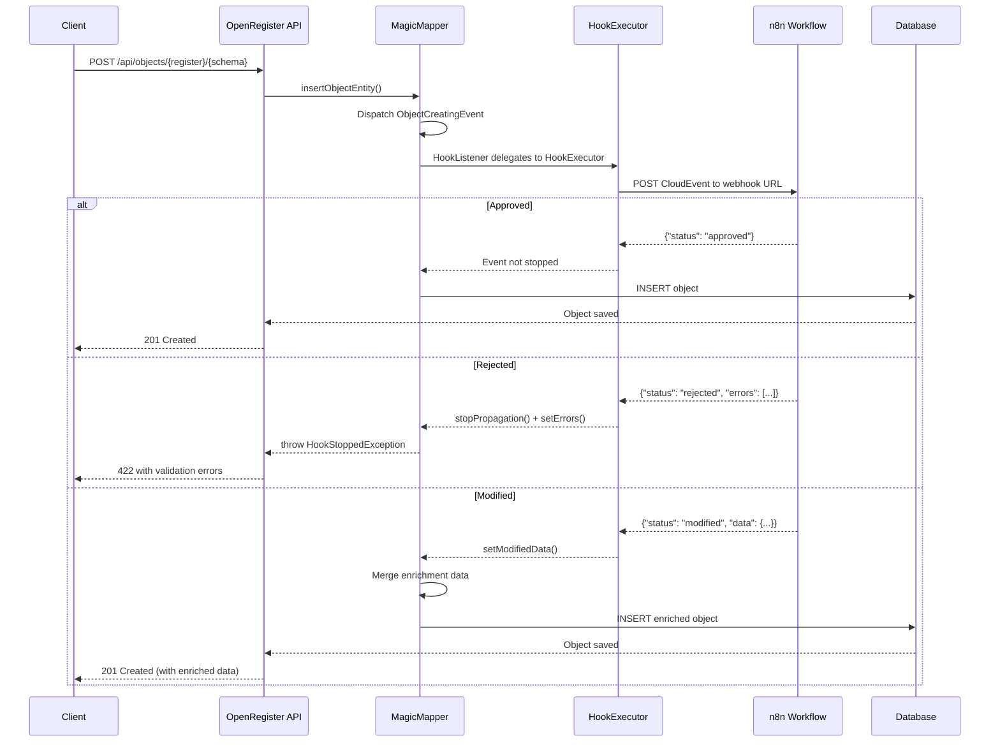

# n8n Integration

Integrate OpenRegister with n8n to create powerful automation workflows. This guide provides step-by-step instructions and ready-to-use workflow templates.

## Overview

n8n is a fair-code workflow automation platform that allows you to connect various services and automate tasks. OpenRegister provides two integration approaches:

1. **Schema Hooks (recommended)** — Configure hooks directly on schemas that call n8n workflows synchronously (blocking) or asynchronously on object lifecycle events. Supports advanced validation, data enrichment, and rejection of invalid objects before save.
2. **Webhook Listeners (legacy)** — Use Nextcloud's `webhook_listeners` app for simple event notifications to n8n.

With the n8n integration you can:

- **Block saves** with sync hooks — n8n validates objects before they are persisted
- **Enrich data** — n8n adds computed fields before save (e.g., geocoding, KvK lookup)
- **Reject invalid objects** — return HTTP 422 with validation errors from n8n
- Automatically sync objects to external systems (async)
- Deploy workflows as part of app configuration via import
- Build custom automation workflows

## Prerequisites

- Nextcloud 28+ with OpenRegister installed
- n8n instance (self-hosted, cloud, or as Nextcloud ExApp)
- A registered workflow engine in OpenRegister (see [Workflow Engine Setup](#workflow-engine-setup))
- Admin access to both Nextcloud and n8n

## Workflow Engine Setup

Before using schema hooks, register your n8n instance as a workflow engine in OpenRegister:

```bash
curl -X POST http://localhost:8080/index.php/apps/openregister/api/engines \
  -u 'admin:admin' \
  -H 'Content-Type: application/json' \
  -H 'OCS-APIREQUEST: true' \
  -d '{
    "name": "n8n Production",
    "engineType": "n8n",
    "baseUrl": "http://your-n8n-host:5678",
    "authType": "bearer",
    "authConfig": {
      "token": "your-n8n-api-key"
    },
    "enabled": true
  }'
```

Verify the connection:

```bash
curl -X POST http://localhost:8080/index.php/apps/openregister/api/engines/{id}/health \
  -u 'admin:admin' \
  -H 'OCS-APIREQUEST: true'
```

## Schema Hooks (Recommended)

Schema hooks are configured directly on a schema's `hooks` JSON property. They fire on object lifecycle events and call n8n workflows via the workflow engine adapter.

### How It Works



### Sync vs Async Events

| Event | Type | When | Can Block? |
|-------|------|------|------------|
| `creating` | Sync | Before INSERT | Yes |
| `updating` | Sync | Before UPDATE | Yes |
| `deleting` | Sync | Before DELETE | Yes |
| `created` | Async | After INSERT | No |
| `updated` | Async | After UPDATE | No |
| `deleted` | Async | After DELETE | No |

### Configuring a Schema Hook

Add a hook to a schema via the API:

```bash
# First, get the current schema
SCHEMA=$(curl -s -u admin:admin -H 'OCS-APIREQUEST: true' \
  http://localhost:8080/index.php/apps/openregister/api/schemas/{id})

# Update hooks array (add to existing hooks)
curl -X PUT http://localhost:8080/index.php/apps/openregister/api/schemas/{id} \
  -u 'admin:admin' \
  -H 'Content-Type: application/json' \
  -H 'OCS-APIREQUEST: true' \
  -d '{
    "hooks": [
      {
        "event": "creating",
        "engine": "n8n",
        "workflowId": "your-n8n-workflow-id",
        "mode": "sync",
        "order": 1,
        "timeout": 30,
        "enabled": true,
        "onFailure": "reject",
        "onTimeout": "allow",
        "onEngineDown": "allow"
      }
    ]
  }'
```

### Hook Configuration Fields

| Field | Type | Default | Description |
|-------|------|---------|-------------|
| `event` | string | required | `creating`, `updating`, `deleting`, `created`, `updated`, `deleted` |
| `engine` | string | required | Engine type: `n8n` or `windmill` |
| `workflowId` | string | required | The workflow ID in the engine (used for webhook URL) |
| `mode` | string | `sync` | `sync` (blocking, waits for response) or `async` (fire-and-forget) |
| `order` | int | `0` | Execution order when multiple hooks exist for the same event |
| `timeout` | int | `30` | Timeout in seconds for sync hooks |
| `enabled` | bool | `true` | Toggle hook on/off |
| `onFailure` | string | `reject` | `reject` (abort save), `allow` (proceed), `flag` (proceed + set metadata), `queue` (proceed + retry later) |
| `onTimeout` | string | `reject` | Same options as onFailure |
| `onEngineDown` | string | `allow` | Same options as onFailure |

### n8n Workflow Response Format

Your n8n workflow must return one of these JSON responses:

**Approve (allow save):**
```json
{"status": "approved"}
```

**Reject (block save, return HTTP 422):**
```json
{
  "status": "rejected",
  "errors": [
    {"field": "kvkNumber", "message": "Invalid KvK number", "code": "INVALID_KVK"},
    {"field": "email", "message": "Email domain not allowed", "code": "BLOCKED_DOMAIN"}
  ]
}
```

**Modify (enrich data before save):**
```json
{
  "status": "modified",
  "data": {
    "normalizedAddress": "Keizersgracht 1, 1015 AA Amsterdam",
    "geocode": {"lat": 52.3676, "lng": 4.8837},
    "validatedAt": "2026-03-08T12:00:00Z"
  }
}
```

### CloudEvents Payload

Hooks deliver a CloudEvents 1.0 payload to the n8n webhook URL:

```json
{
  "specversion": "1.0",
  "type": "nl.openregister.object.creating",
  "source": "/apps/openregister/registers/1/schemas/5",
  "id": "unique-event-uuid",
  "time": "2026-03-08T12:00:00Z",
  "datacontenttype": "application/json",
  "subject": "object:abc-123",
  "data": {
    "object": {
      "id": "abc-123",
      "name": "Acme Corp",
      "kvkNumber": "12345678"
    },
    "schema": "organisation",
    "register": "1",
    "action": "creating",
    "hookMode": "sync"
  }
}
```

## Deploying Workflows via Import

Instead of manually configuring hooks, you can include workflow definitions in your JSON import file. This enables packaging n8n workflows as part of your app configuration.

```json
{
  "info": {
    "title": "My App Config",
    "version": "1.0.0"
  },
  "components": {
    "schemas": {
      "organisation": {
        "title": "Organisation",
        "slug": "organisation",
        "properties": {
          "name": {"type": "string"},
          "kvkNumber": {"type": "string"}
        }
      }
    },
    "workflows": [
      {
        "name": "kvk-validator",
        "engine": "n8n",
        "workflow": { "...n8n workflow JSON..." },
        "attachTo": {
          "schema": "organisation",
          "event": "creating",
          "mode": "sync",
          "onFailure": "reject"
        }
      }
    ]
  }
}
```

The import pipeline:
1. Creates schemas
2. Deploys workflows to n8n via `WorkflowEngineInterface::deployWorkflow()`
3. Wires hooks to schemas using the engine-returned workflow ID
4. Creates objects (with hooks now active)

Reimports are idempotent — unchanged workflows (same SHA-256 hash) are skipped. See [Import/Export documentation](../user/import-export.md) for the full format reference.

## Webhook Listeners (Legacy Approach)

> **Note:** The webhook listeners approach requires the `webhook_listeners` Nextcloud app and uses Nextcloud's event system directly. For most use cases, [Schema Hooks](#schema-hooks-recommended) are simpler and more powerful — they support sync blocking, data enrichment, and can be deployed via import.

## Quick Start (Legacy)

### Step 1: Enable webhook_listeners in Nextcloud

```bash
docker exec -u 33 <nextcloud-container> php occ app:enable webhook_listeners
```

### Step 2: Import n8n Workflow Template

1. Download a template from `openregister/n8n-templates/` directory
2. Open n8n web interface
3. Click '+' to add a new workflow
4. Click the menu (⋮) in the top right
5. Select 'Import from File'
6. Choose the downloaded JSON template
7. Click 'Import'

### Step 3: Configure Webhook in n8n

1. Open the imported workflow
2. Click on the 'Webhook' node (usually the first node)
3. Copy the 'Webhook URL' (e.g., `https://your-n8n.com/webhook/openregister-object-sync`)
4. Save this URL for the next step

### Step 4: Register Webhook in Nextcloud

Register the webhook to trigger on OpenRegister events:

```bash
curl -X POST http://<nextcloud-host>/ocs/v2.php/apps/webhook_listeners/api/v1/webhooks \
  -H "OCS-APIRequest: true" \
  -u "admin:admin" \
  -H "Content-Type: application/json" \
  -d '{
    "httpMethod": "POST",
    "uri": "https://your-n8n.com/webhook/openregister-object-sync",
    "event": "OCA\\OpenRegister\\Event\\ObjectCreatedEvent",
    "eventFilter": []
  }'
```

### Step 5: Configure OpenRegister API Credentials

1. In n8n, find nodes that call the OpenRegister API (usually 'HTTP Request' nodes)
2. Click on 'Credentials'
3. Select 'HTTP Basic Auth' or create a new credential
4. Enter:
   - **Username**: Your Nextcloud admin username
   - **Password**: Your Nextcloud admin password
5. Save the credential

### Step 6: Activate the Workflow

1. Toggle the workflow to 'Active' in the top right
2. Save the workflow
3. Test by creating an object in OpenRegister

## Available Workflow Templates

OpenRegister provides four ready-to-use n8n workflow templates in the `n8n-templates/` directory:

### 1. Object Sync (`openregister-object-sync.json`)

**Description**: Automatically sync OpenRegister objects to an external system when they are created or updated.

**Use Cases**:
- Keep external databases synchronized
- Archive data to external storage
- Trigger processes in other systems

**Events**: `ObjectCreatedEvent`, `ObjectUpdatedEvent`

**Configuration Required**:
- OpenRegister API credentials
- External system endpoint and credentials

---

### 2. Database Sync (`openregister-to-database.json`)

**Description**: Write OpenRegister objects directly to an external MySQL/PostgreSQL database with data transformation.

**Use Cases**:
- Data warehousing
- Analytics and reporting
- External system integration

**Events**: `ObjectCreatedEvent`, `ObjectUpdatedEvent`

**Configuration Required**:
- OpenRegister API credentials
- Database credentials (MySQL/PostgreSQL)

**Database Schema Example**:

```sql
CREATE TABLE openregister_objects (
    uuid VARCHAR(36) PRIMARY KEY,
    register_name VARCHAR(255),
    schema_name VARCHAR(255),
    title VARCHAR(255),
    description TEXT,
    data_json JSON,
    organisation VARCHAR(36),
    created_at TIMESTAMP,
    updated_at TIMESTAMP,
    synced_at TIMESTAMP
);
```

---

### 3. Bidirectional Sync (`openregister-bidirectional-sync.json`)

**Description**: Two-way synchronization between OpenRegister and an external system.

**Use Cases**:
- CRM integration
- ERP system sync
- Multi-system data consistency

**Events**: `ObjectCreatedEvent`, `ObjectUpdatedEvent`, `ObjectDeletedEvent`

**Configuration Required**:
- OpenRegister API credentials
- External system API credentials
- Polling interval (default: 5 minutes)

**How It Works**:
1. **From OpenRegister**: Webhook triggers on object changes → Syncs to external system
2. **To OpenRegister**: Scheduled trigger polls external system → Updates OpenRegister

---

### 4. Schema Notifications (`openregister-schema-notifications.json`)

**Description**: Send notifications to Slack, Email, and Microsoft Teams when schemas are created, updated, or deleted.

**Use Cases**:
- Team collaboration
- Change management
- Schema documentation

**Events**: `SchemaCreatedEvent`, `SchemaUpdatedEvent`, `SchemaDeletedEvent`

**Configuration Required**:
- Slack webhook URL or OAuth credentials
- SMTP credentials for email
- Microsoft Teams webhook URL

---

## Customizing Workflows

### Modifying Event Types

To listen to different events, update the webhook registration:

```bash
# Listen to schema updates instead of object creation
curl -X POST http://<nextcloud-host>/ocs/v2.php/apps/webhook_listeners/api/v1/webhooks \
  -H "OCS-APIRequest: true" \
  -u "admin:admin" \
  -H "Content-Type: application/json" \
  -d '{
    "httpMethod": "POST",
    "uri": "https://your-n8n.com/webhook/my-workflow",
    "event": "OCA\\OpenRegister\\Event\\SchemaUpdatedEvent",
    "eventFilter": []
  }'
```

### Adding Data Transformations

Use the 'Code' node in n8n to transform data:

```javascript
// Example: Transform OpenRegister object to external format.
const object = $input.item.json;

return {
  external_id: object.uuid,
  name: object.data.title || 'Untitled',
  description: object.data.description || '',
  custom_fields: {
    register: object.register,
    schema: object.schema,
    created: object.created
  },
  metadata: object.data
};
```

### Error Handling

Add error handling to your workflows:

1. Add an 'Error Trigger' node
2. Connect it to error handling logic (e.g., send error notification)
3. Configure retry logic in HTTP Request nodes

Example Error Handler:

```javascript
// Log error and send notification.
const error = $input.item.json;

return {
  error_type: error.name,
  error_message: error.message,
  timestamp: new Date().toISOString(),
  workflow: $workflow.name
};
```

## Advanced Configuration

### Filtering Events

Filter events in Nextcloud webhook registration:

```json
{
  "httpMethod": "POST",
  "uri": "https://your-n8n.com/webhook/my-workflow",
  "event": "OCA\\OpenRegister\\Event\\ObjectCreatedEvent",
  "eventFilter": {
    "user.uid": "specific_user"
  }
}
```

### Multiple Webhooks

Register multiple webhooks for different event types:

```bash
# Webhook for object creation.
curl -X POST http://<nextcloud-host>/ocs/v2.php/apps/webhook_listeners/api/v1/webhooks \
  -H "OCS-APIRequest: true" \
  -u "admin:admin" \
  -d '{"httpMethod":"POST","uri":"https://n8n.com/webhook/object-created","event":"OCA\\OpenRegister\\Event\\ObjectCreatedEvent"}'

# Webhook for schema updates.
curl -X POST http://<nextcloud-host>/ocs/v2.php/apps/webhook_listeners/api/v1/webhooks \
  -H "OCS-APIRequest: true" \
  -u "admin:admin" \
  -d '{"httpMethod":"POST","uri":"https://n8n.com/webhook/schema-updated","event":"OCA\\OpenRegister\\Event\\SchemaUpdatedEvent"}'
```

### Using OpenRegister API in n8n

Access the full OpenRegister API from n8n workflows:

**Get Object by UUID**:
```
GET http://master-nextcloud-1/apps/openregister/api/objects/{uuid}
```

**List Objects**:
```
GET http://master-nextcloud-1/apps/openregister/api/objects?register=my-register&_limit=50
```

**Create Object**:
```
POST http://master-nextcloud-1/apps/openregister/api/objects
Body: {
  "register": "my-register",
  "schema": "my-schema",
  "data": {
    "title": "New Object",
    "description": "Created from n8n"
  }
}
```

**Update Object**:
```
PUT http://master-nextcloud-1/apps/openregister/api/objects/{uuid}
Body: {
  "data": {
    "title": "Updated Title"
  }
}
```

**Delete Object**:
```
DELETE http://master-nextcloud-1/apps/openregister/api/objects/{uuid}
```

## Troubleshooting

### Webhook Not Triggering

**Problem**: n8n workflow not receiving webhook requests.

**Solutions**:
1. Verify webhook is registered:
   ```bash
   curl -X GET http://<nextcloud-host>/ocs/v2.php/apps/webhook_listeners/api/v1/webhooks \
     -H "OCS-APIRequest: true" \
     -u "admin:admin"
   ```
2. Check n8n webhook URL is correct and accessible
3. Ensure workflow is 'Active' in n8n
4. Test webhook manually with curl:
   ```bash
   curl -X POST https://your-n8n.com/webhook/test \
     -H "Content-Type: application/json" \
     -d '{"test": "data"}'
   ```

### API Authentication Errors

**Problem**: HTTP 401 Unauthorized when calling OpenRegister API.

**Solutions**:
1. Verify credentials are correct
2. Check user has appropriate permissions
3. Use admin user for testing
4. Ensure credentials are saved in n8n

### Data Not Transforming Correctly

**Problem**: Data transformation in Code nodes not working as expected.

**Solutions**:
1. Use 'Execute workflow' in n8n to test transformations
2. Add console.log() statements (visible in execution logs)
3. Check input data structure using 'Edit Fields' node
4. Review JavaScript syntax and n8n-specific functions

### Workflow Executions Failing

**Problem**: Workflow shows errors in execution history.

**Solutions**:
1. Check execution logs in n8n
2. Verify all credentials are configured
3. Test individual nodes using 'Execute Node'
4. Add error handling nodes
5. Check external system availability

## Best Practices

1. **Use Specific Event Types**: Don't subscribe to all events; only listen to what you need
2. **Implement Error Handling**: Add Error Trigger nodes to handle failures gracefully
3. **Add Logging**: Use Code nodes to log important information
4. **Test Incrementally**: Test each node individually before activating the workflow
5. **Monitor Executions**: Regularly review workflow execution history
6. **Version Control**: Export workflows regularly as backup
7. **Document Customizations**: Add notes to nodes explaining custom logic

## Performance Considerations

- **Batch Processing**: For high-volume scenarios, batch multiple operations together
- **Async Processing**: Use n8n's queue mode for long-running operations
- **Rate Limiting**: Implement rate limiting when calling external APIs
- **Caching**: Cache frequently accessed data to reduce API calls

## Examples

### Example 1: Send Slack Notification on Object Creation

1. Import `openregister-object-sync.json` template
2. Replace 'Send to External System' node with 'Slack' node
3. Configure Slack credentials
4. Set channel and message format
5. Activate workflow

### Example 2: Create Airtable Records from OpenRegister

1. Import `openregister-object-sync.json` template
2. Replace external system node with 'Airtable' node
3. Configure Airtable credentials and base
4. Map OpenRegister fields to Airtable columns
5. Activate workflow

### Example 3: Sync to Google Sheets

1. Import `openregister-to-database.json` template
2. Replace database node with 'Google Sheets' node
3. Configure Google Sheets credentials
4. Map fields to sheet columns
5. Activate workflow

## Further Reading

- [Webhooks Feature Documentation](../Features/webhooks.md)
- [Events API Reference](../api/events-reference.md)
- [n8n Official Documentation](https://docs.n8n.io)
- [OpenRegister API Documentation](../api/objects.md)

## Support

For issues specific to:
- **n8n workflows**: n8n community forum or GitHub
- **OpenRegister integration**: OpenRegister GitHub issues
- **Nextcloud webhooks**: Nextcloud documentation

