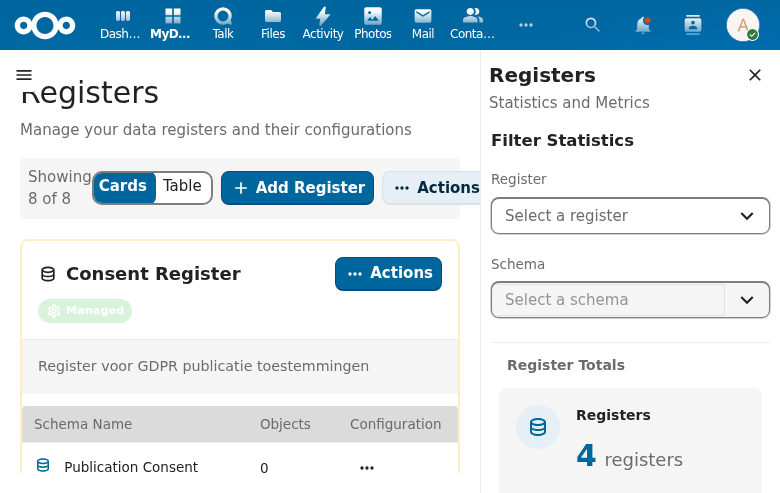
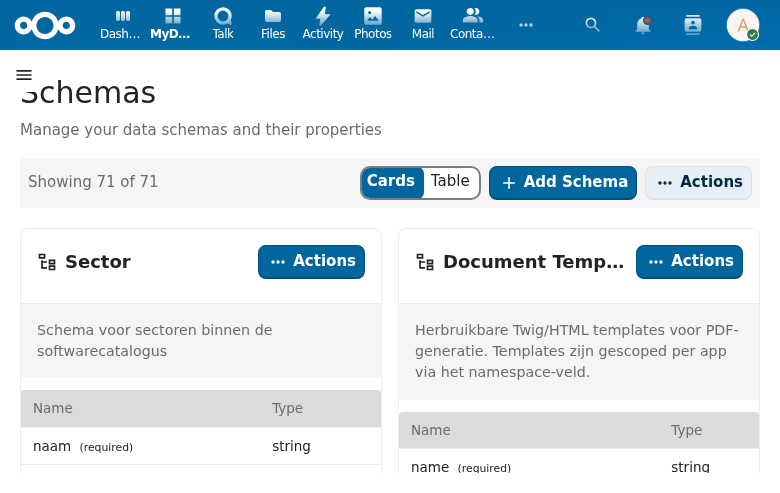
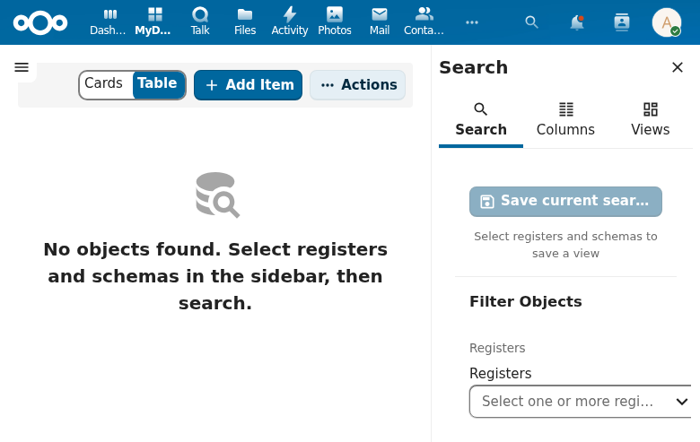
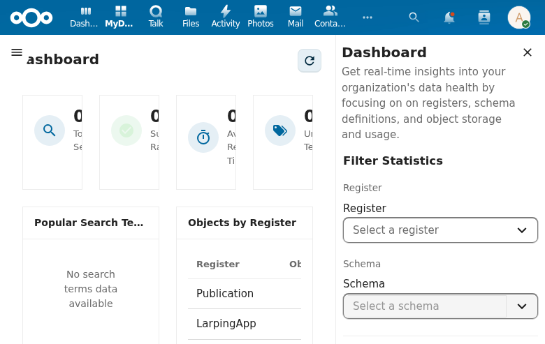

# OpenRegister Feature Overview

OpenRegister is a Nextcloud app for managing structured data registers with schemas, objects, and comprehensive search capabilities.

## Core Features

### Registers
Manage data registers and their configurations. Each register groups related schemas and objects.

### Schemas
Define data schemas with typed properties. Schemas support JSON Schema validation, translatable fields, computed fields, and authorization rules.

### Search / Views
Query objects across registers and schemas with full-text search, faceted filtering, and saved views.

### Dashboard
Real-time insights into data health with statistics on registers, schemas, objects, search activity, and storage usage.

## Implemented Specs

The following features have been fully implemented and archived:

| Feature | Status | Description |
|---------|--------|-------------|
| audit-trail-immutable | Implemented | Immutable audit trail for all data changes |
| auth-system | Implemented | Authentication and authorization system |
| computed-fields | Implemented | Dynamic computed properties on schemas |
| content-versioning | Implemented | Object version history and rollback |
| data-import-export | Implemented | CSV/JSON/Excel import and export |
| deep-link-registry | Implemented | Deep linking to registers, schemas, and objects |
| deletion-audit-trail | Implemented | Soft delete with audit trail |
| deprecate-published-metadata | Implemented | Replaced published/depublished with RBAC $now |
| event-driven-architecture | Implemented | CloudEvent-based lifecycle events |
| faceting-configuration | Implemented | Configurable faceted search |
| graphql-api | Implemented | GraphQL query and subscription API |
| mariadb-ci-matrix | Implemented | MariaDB compatibility testing in CI |
| mcp-discovery | Implemented | MCP standard protocol for AI integration |
| mock-registers | Implemented | Test registers for development |
| oas-validation | Implemented | OpenAPI specification validation |
| object-interactions | Implemented | Object locking, commenting, file attachments |
| openapi-generation | Implemented | Auto-generated OpenAPI documentation |
| production-observability | Implemented | Logging, metrics, health checks |
| rbac-scopes | Implemented | Role-based access control with scopes |
| realtime-updates | Implemented | SSE-based real-time data updates |
| reference-existence-validation | Implemented | Validate references exist before save |
| referential-integrity | Implemented | Cascading delete/update for references |
| row-field-level-security | Implemented | Per-row and per-field access control |
| schema-hooks | Implemented | Pre/post-save workflow hooks on schemas |
| unit-test-coverage | Implemented | 317+ PHPUnit test files |
| webhook-payload-mapping | Implemented | Configurable webhook payload transformation |
| workflow-engine-abstraction | Implemented | Pluggable workflow engine (n8n, etc.) |
| workflow-in-import | Implemented | Trigger workflows during data import |
| workflow-integration | Implemented | End-to-end workflow integration |
| zoeken-filteren | Implemented | Advanced search and filtering |

## Partially Implemented

| Feature | Status | Description |
|---------|--------|-------------|
| notificatie-engine | Partial | User-facing notification delivery |
| rbac-zaaktype | Partial | Per-zaaktype authorization rules |
| register-i18n | Partial | Multi-language content management |

## Roadmap (Draft)

| Feature | Status | Description |
|---------|--------|-------------|
| api-test-coverage | Draft | Newman API integration tests |
| archivering-vernietiging | Draft | MDTO-compliant archival and destruction |
| avg-verwerkingsregister | Draft | GDPR processing register |
| besluiten-management | Draft | ZGW BRC-compliant decision management |
| data-sync-harvesting | Draft | Configurable data synchronization |
| geo-metadata-kaart | Draft | Geospatial metadata and map visualization |
| rapportage-bi-export | Draft | Reporting and BI tool integration |
| urn-resource-addressing | Draft | RFC 8141 URN identifiers |
