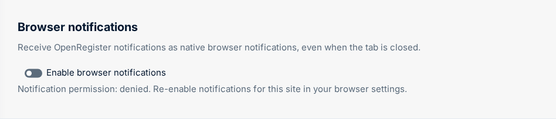

# Webhooks & Notifications

## Overview

OpenRegister delivers event notifications to external systems via a full-featured webhook infrastructure and to Nextcloud users via in-app notifications. The webhook system uses CloudEvents v1.0 as the standard payload format, supports configurable payload transformation via Twig mappings, HMAC signing for security, retry with exponential backoff, and multi-tenant isolation.

**Tender demand**: 51% of analyzed government tenders require notification capabilities.

## Webhooks

### Webhook Configuration

A webhook subscription is registered via the API and stored as a `Webhook` entity with 23 fields:

```json
{
  "url": "https://external.system.nl/api/events",
  "events": ["nl.conduction.openregister.object.created", "nl.conduction.openregister.object.updated"],
  "secret": "hmac-signing-secret",
  "method": "POST",
  "headers": { "X-Source": "openregister" },
  "timeout": 30,
  "retryPolicy": "exponential",
  "register": "meldingen-register",
  "schema": "meldingen"
}
```

Webhooks can be scoped to a specific register, schema, or object-level filter condition.

### Payload Formats

Three payload strategies are applied in priority order:

| Priority | Strategy | Description |
|----------|----------|-------------|
| 1 (highest) | Twig Mapping | Payload is transformed by a `Mapping` entity using Twig templates — arbitrary output format |
| 2 | CloudEvents v1.0 | Standard CloudEvents envelope, recommended for interoperability |
| 3 | Standard | OpenRegister native JSON format |

**Twig Mapping** enables delivering events in any format required by the subscriber — ZGW notifications, FHIR events, VNG Notificaties API format, Slack messages, etc. — without hardcoded format knowledge in OpenRegister.

### HMAC Signing

Outgoing webhook requests are signed with HMAC-SHA256 using the configured secret:

```
X-Signature: sha256=<hex_signature>
```

Subscribers can verify authenticity by computing the same signature over the raw request body.

### Retry Mechanism

Failed webhook deliveries are retried by `WebhookRetryJob` (runs every 5 minutes):

| Policy | Description |
|--------|-------------|
| `exponential` | Backoff doubles with each attempt (1m, 2m, 4m, 8m, …) |
| `linear` | Fixed interval between attempts |
| `fixed` | All retries at the same interval |

Maximum retry count and backoff ceiling are configurable per webhook.

### Delivery Logging

Every delivery attempt is logged in `WebhookLog`:

- HTTP status code and response body
- Delivery timestamp and duration
- Error message for failed deliveries
- Retry count

Statistics are available via `GET /api/webhooks/{id}/statistics`.

### Event Filtering

`WebhookEventListener` handles 36+ event types across 11 entity categories. Webhooks can filter by:

- Event type (class name)
- Register slug
- Schema slug
- Conditional property matching (object-level conditions)

### Multi-Tenancy

Webhooks are scoped to organisations via `MultiTenancyTrait` on `WebhookMapper`. Each organisation's webhooks only receive events for objects in their organisation scope.

### Management API

```
GET    /api/webhooks                         List all webhooks
POST   /api/webhooks                         Create a new webhook
GET    /api/webhooks/{id}                    Get a webhook
PUT    /api/webhooks/{id}                    Update a webhook
DELETE /api/webhooks/{id}                    Delete a webhook
POST   /api/webhooks/{id}/test               Send a test event
GET    /api/webhooks/{id}/logs               List delivery logs
GET    /api/webhooks/{id}/statistics         Delivery statistics
POST   /api/webhooks/{id}/retry/{logId}      Manually retry a failed delivery
GET    /api/webhooks/events                  List all available event types
```

## In-App Notifications

OpenRegister integrates with Nextcloud's `INotificationManager` for user-facing in-app notifications:

### Notification Channels

| Channel | Description |
|---------|-------------|
| `nc-notification` | Nextcloud notification bell (via `INotificationManager`) |
| `email` | Via `IMailer` (being replaced by n8n) |
| `activity` | Activity stream entry per recipient |
| `webhook` | Inline POST per dispatch; with `webhook.persistent: true` an auto-managed `Webhook` entity routes through the standard retry / HMAC / dead-letter pipeline |
| `talk` | Posts a chat message to the configured Spreed room (one-shot per dispatch, recipients are not @-mentioned) |

### Notification Rules

Rules live on the schema under `configuration['x-openregister-notifications']`. Each entry has `trigger`, `recipients`, `channels`, and a `subject` template (supports `{{prop}}` interpolation).

#### Triggers

| `trigger.type` | Fires when |
|----------------|-----------|
| `created` | Object created. |
| `updated` | Object updated. |
| `transition` | Object transitioned via the lifecycle state machine. Optional `trigger.action` filters to a specific action. |
| `scheduled` | Periodic. Requires `trigger.intervalSec >= 60`. The 60s `ScheduledNotificationJob` iterates the schema, optionally narrowed by `trigger.filter` (flat equality, relative-date and inequality operators — see below), and dispatches **at most once per object per dedup fingerprint** until the watched fields change (see *Scheduled trigger filters & per-object dedup* below). |
| `threshold` | Aggregation crossed a threshold. Requires `trigger.aggregation` (declared on the same schema), `trigger.op` ∈ `[gt, gte, lt, lte, eq, ne]`, and `trigger.value`. `AggregationThresholdListener` re-runs the aggregation on object-write events and dispatches once per below→above transition. |

#### Recipient kinds

| `kind` | Resolution |
|--------|------------|
| `users` | Literal list (`recipient.users: [uid, …]`). |
| `field` | Reads `recipient.field` from the object data, treats the value as a uid. |
| `groups` | Members of `recipient.groups`. |
| `relation` | Resolves a typed `x-openregister-relations` field; reads either a uid string, an array of uids, or an array of objects with `userId`. |
| `object-acl` | ACL holders of the object for the configured `recipient.permission` ∈ `[read, manage]`. |
| `expression` | Arbitrary resolver class (DI tag in `recipient.resolver`). Must implement `RecipientResolverInterface::resolve(ObjectEntity $object, array $context): string[]`. |

#### Example

```json
{
  "x-openregister-notifications": {
    "meetingReminderDaily": {
      "trigger": {"type": "scheduled", "intervalSec": 86400, "filter": {"lifecycle": "scheduled"}},
      "recipients": [{"kind": "field", "field": "chair"}],
      "channels": ["nc-notification", "email"],
      "subject": "Reminder: {{title}} starts soon"
    },
    "tooManyOverdue": {
      "trigger": {"type": "threshold", "aggregation": "totalOverdue", "op": "gt", "value": 10},
      "recipients": [{"kind": "groups", "groups": ["admin"]}],
      "channels": ["nc-notification", "talk"],
      "talk": {"token": "abc123def"},
      "subject": "Action items overdue: {{value}}"
    },
    "meetingClosed": {
      "trigger": {"type": "transition", "action": "close"},
      "recipients": [{"kind": "object-acl", "permission": "manage"}],
      "channels": ["webhook"],
      "webhook": {
        "persistent": true,
        "url": "https://example.com/hooks/closed",
        "events": ["ObjectTransitionedEvent"],
        "secret": "..."
      },
      "subject": "Meeting closed"
    }
  }
}
```

#### Scheduled trigger filters & per-object dedup

The `scheduled` trigger's `filter` is a flat `field => spec` map ANDed together. Each entry accepts either a **scalar** (strict equality, v1 behaviour) or an **operator object**:

| Operator | Value form | Meaning |
|----------|------------|---------|
| `equals` | scalar | Strict equality. Same as the scalar shorthand. |
| `notEquals` | scalar | Strict inequality. A missing/`null` field satisfies `notEquals` for any non-null value. |
| `withinNext` | ISO-8601 duration (e.g. `PT24H`, `P7D`) | Field is a date or date-time in the half-open window `(now, now + duration]`. |
| `olderThan` | ISO-8601 duration | Field is a date or date-time strictly before `now − duration`. |

Relative-date operators **fail closed**: unparsable values do not match, and the engine logs at debug only. All entries must hold for the object to match (AND semantics). The annotation validator rejects unknown operators, missing values, and malformed durations with HTTP 422.

**Per-object dedup.** A scheduled rule dispatches at most once per `(schema, rule key, object, watched-field fingerprint)`. The fingerprint is a SHA-1 over the object's current values of the rule's **watched fields**:

- By default, the watched fields are the filter fields that use a relative-date operator (`withinNext` / `olderThan`).
- Override with `trigger.dedupeFields: ["field1", "field2", …]` — a non-empty array of field names. Validated at save time on the same 422 contract as the operator grammar.
- When there are neither relative-date operators nor `dedupeFields`, the fingerprint is constant — the rule fires exactly once per object until pruned.

Dedup state lives in `oc_openregister_notification_dedupe` (durable across cache flushes and worker restarts) and is pruned automatically when:

- the object is deleted (`ObjectDeletedEvent` → `NotificationDedupePruneListener`);
- a rule key is removed/renamed in the schema annotation (`SchemaCreatedEvent`/`SchemaUpdatedEvent` → `NotificationDedupeAnnotationSyncListener`);
- a state row has not been re-evaluated for `notification_dedupe_retention_days` (default 90), reclaimed by the retention sweep that runs inside the scheduled job.

The per-rule `intervalSec` throttle is unchanged: it bounds **scan frequency**, not delivery count.

##### Worked example — `taskDueSoon`

```json
{
  "x-openregister-notifications": {
    "taskDueSoon": {
      "trigger": {
        "type": "scheduled",
        "intervalSec": 3600,
        "filter": {
          "dueDate": {"operator": "withinNext", "value": "PT24H"},
          "status":  {"operator": "notEquals",  "value": "done"}
        }
      },
      "recipients": [{"kind": "field", "field": "assignee"}],
      "channels":   ["nc-notification", "email"],
      "subject":    "Task '{{title}}' is due within 24h"
    }
  }
}
```

- The job re-evaluates every hour. Tasks whose `dueDate` is within the next 24h **and** `status` is anything other than `done` match.
- The watched-field set is `["dueDate"]` (the only relative-date field). Each matching task dispatches exactly once for a given `dueDate`. Reschedule a task → new fingerprint → exactly one new reminder. Mark it `done` → no more matches; sweep eventually reclaims the dedup row.
- To re-arm whenever the assignee changes too, add `"dedupeFields": ["dueDate", "assignee"]` to the `trigger`.

The `updated` trigger's field-change `only_if_changed` filter — documented earlier in this page — is independent of scheduled dedup; both pipelines stay decoupled.

#### Rendering

In-app subjects are rendered by `AnnotationNotifier` (`object_created` / `object_updated` / `object_transitioned`), localised nl/en, with a primary action linking to the object detail view. A schema's per-locale `subject` wins; otherwise a canonical localised string is used. `Notifier` keeps `configuration_update_available` — the two notifiers are mutually exclusive by subject. Push needs no extra code: `notify_push` auto-intercepts the same `INotificationManager::notify()` call.

### User Notification Preferences

Notification **rules** live ONLY in the schema annotation (no rule table) — the dispatcher evaluates them from the already-loaded schema at dispatch time. Per-user **preferences** are stored as **override-only** values in Nextcloud per-user app config under the `openregister` app, keyed `notification_pref/<schema>/<notification>`. An override only flips the schema-declared default (on/off, optionally narrowing channels) for one `(schema, notification)` pair; when a user has no override the schema default applies. This gives a **zero-migration** property: adding a schema — or a notification to an existing schema — works immediately with no per-user backfill.

Before delivering the in-app/push channel, the dispatcher resolves `schema-default ⊕ user-override` **per recipient** and skips recipients whose effective value is off (one user's override never affects another's delivery).

| Endpoint | Description |
|----------|-------------|
| `GET /api/notification-preferences` | Effective notifications for the current user (every notification their accessible schemas declare, merged with their overrides, each tagged `schema-default` or `user-override`). |
| `PUT /api/notification-preferences` | Record (`{schema, notification, enabled, channels?}`) or clear (`{schema, notification, reset: true}`) a single override for the current user only. |

> The earlier per-`(register, schema)` `NotificationSubscription` table + controller are **deprecated**; existing rows are migrated to user-config overrides by a one-shot repair step and the table is scheduled for removal.

### Delivery Windows (Quiet Hours) & Fixed-Time Digest Schedules

Independently of the per-`(schema, notification)` on/off override above, a user MAY configure a global **delivery window** (quiet hours) via `NotificationDeliveryWindowService` — stored the same override-only way, under a distinct per-user app-config key (`notification_delivery_window`), so a user who never configures one keeps today's immediate-delivery behaviour (zero-migration).

| Endpoint | Description |
|----------|-------------|
| `GET /api/notification-delivery-window` | The current user's stored window, or `{enabled: false}` when none is configured. |
| `PUT /api/notification-delivery-window` | Store (`{enabled: true, start: "HH:MM", end: "HH:MM", timezone?, days?: [0-6]}`) or clear (`{enabled: false}`) the window for the current user only. `timezone` is an IANA name (e.g. `Europe/Amsterdam`); when absent it defaults to the Nextcloud server timezone. `start`/`end` wrap past midnight (e.g. `18:00`-`08:00`). |

Two new dialect keys on a notification rule work with the delivery window:

| Key | Shape | Behaviour |
|-----|-------|-----------|
| `critical` | `bool`, default `false` | When `true`, the rule bypasses quiet-hours queuing and always dispatches immediately (still subject to the preference-off / rate-limit / coalesce gates). Does NOT bypass a recipient's per-`(schema, notification)` opt-out. |
| `digest` | `{schedule: "daily"\|"weekly", at: "HH:MM", timezone?, weekday?: 0-6}` | A FIXED time-of-day batching schedule, distinct from the rolling `coalesce` window. A rule may declare at most one of `coalesce` or `digest` (mutually exclusive, HTTP 422). `weekday` (0=Sunday) is required for `schedule: "weekly"`, forbidden for `"daily"`. |

**Dispatcher behaviour**: before delivering a per-recipient channel (`nc-notification`, `email`, `activity`), the dispatcher checks whether the recipient is inside their configured delivery window, or the rule's `digest` schedule has not yet reached its next fire time. When either applies and the rule is not `critical: true`, the event is **persisted as a `QueuedNotification` row — never dropped** — and notification history records `queued-quiet-hours` or `queued-digest` instead of `dispatched`. Broadcast channels (`webhook`, `talk`) are unaffected — they still fire once per dispatch.

`NotificationQueueFlushJob` (a 60s `TimedJob`) scans the queue every tick and **re-evaluates each row's condition live** against the current wall clock in the window's/schedule's declared timezone — never a precomputed instant — so DST transitions are handled correctly by PHP's tz database. Rows sharing `(schema, rule, recipient)` are grouped into one summary notification per flush. This replaces the earlier `NotificationDigest`/`BatchNotificationJob` in-memory primitives, which were never wired to the dispatcher and could not survive the process boundary between the enqueuing request and the flush tick.

### VNG Notificaties API Compliance

For Dutch government interoperability, webhook payloads can be formatted according to the VNG Notificaties API standard via a Twig mapping configuration. This enables OpenRegister to act as a notificatiecomponent in a ZGW API landscape.

## Browser Web Push (rich background notifications)

The `web-push` channel of the `x-openregister-notifications` dialect delivers a
rich OS-level notification — app icon, body, and up to two action buttons —
**even when the browser or all Nextcloud tabs are closed**. It complements the
`nc-notification` channel (which only nudges already-open tabs via `notify_push`).

A rule opts in by listing `web-push` in `channels` and may declare `actions[]` +
`originApp` (see the dialect reference in ADR-031). Example — an incoming-call
notification with an "Open client" button:

```jsonc
"incomingCall": {
  "trigger": { "type": "created", "filter": { "field": "channel", "operator": "equals", "value": "telefoon" } },
  "originApp": "pipelinq",
  "channels": ["nc-notification", "web-push"],
  "recipients": [ { "kind": "field", "field": "agent" } ],
  "subject": { "nl": "Inkomende oproep van {{client}}", "en": "Incoming call from {{client}}" },
  "actions": [
    { "label": { "nl": "Klant openen", "en": "Open client" }, "primary": true,
      "target": { "kind": "object-detail", "object": { "kind": "relation", "field": "client" } } }
  ]
}
```

### Setup (admin)

Web Push needs a one-time VAPID keypair, generated and stored in app config:

```bash
occ openregister:web-push:generate-vapid
```

The public key is exposed to browsers via `GET /apps/openregister/webpush/vapid-public-key`;
the private key never leaves the server. Status and the public key are shown in
**Admin settings → OpenRegister → Push notifications**.

**Key rotation:** re-running the command replaces the keypair. Existing browser
subscriptions are bound to the old key and stop receiving pushes after a rotation —
they self-heal when the user re-enables the toggle (which re-subscribes against the
new key); the server prunes stale subscriptions on the first `404`/`410` response
from the push service.

### Enabling browser notifications (user guide)

Browser push is **opt-in** — OpenRegister never prompts for notification
permission on page load. To turn it on:

1. Click your avatar (top-right) → **Settings**.
2. Open the **Notifications** section under *Personal*.
3. Find **Browser notifications** and switch on **"Enable browser notifications"**.
4. Your browser asks to show notifications — click **Allow**.



When it is on, the line under the toggle reads **"Notification permission:
granted"**. From then on OpenRegister sends you a native notification — with the
originating app's icon and any action buttons (for example *Open client*) —
whenever a notification rule you are a recipient of fires, **even when no
Nextcloud tab is open**.

To stop receiving them, switch the toggle **off** (this removes the browser
subscription).

> Behind the scenes the toggle requests permission, registers the Service Worker
> (`js/openregister-push-sw.js`), and subscribes
> (`pushManager.subscribe({ userVisibleOnly: true, … })`). The subscription is
> stored per user + browser in the `openregister_push_subscriptions` table
> (infrastructure state — not an OpenRegister object).

### Browser support / degradation

| Browser | Background Web Push |
|---------|---------------------|
| Chrome / Edge | Supported — delivered while the browser keeps a background process alive (see below) |
| Firefox | Supported — delivered while the browser keeps a background process alive (see below) |
| Safari (macOS/iOS) | Only when the site is an **installed PWA**; otherwise no background push — degrades to the foreground `nc-notification` popup |

### Receiving notifications when the browser is closed

Browser push is delivered over your browser's **background connection** to its
push service (Chrome → FCM, Firefox → Mozilla autopush). The notification arrives
**without any Nextcloud tab open**, but a **browser process must be running**:

| State | Result |
|-------|--------|
| A browser window is open (any site — no Nextcloud tab needed) | Arrives immediately |
| Browser running in the background (window closed, tray process alive) | Arrives immediately — *if* the browser is actually maintaining its push connection (see the reality check) |
| Browser fully closed / process asleep | The push is **queued** by the push service and delivered the moment you next open the browser — nothing is lost |

This is standard browser/OS behaviour shared by every web-push site (Slack,
Gmail, …) — it is not specific to OpenRegister. For notifications that arrive
with **no browser running at all**, use the native Nextcloud desktop or mobile
apps, which have their own push channel.

#### Keep Chrome receiving with all windows closed

For Chrome to receive a push with no window open, it has to keep a background
process running. On Windows:

1. Open Chrome **Settings → System** (or paste `chrome://settings/system` into the address bar).
2. Turn on **"Continue running background apps when Google Chrome is closed."**

Microsoft Edge has the same option at `edge://settings/system`.

> **Reality check.** This setting is *necessary but not sufficient*. Even with it
> on, whether a push is delivered while every window is closed depends on whether
> Chrome is actually keeping its background connection alive — Windows power
> management, how you closed Chrome, and Chrome's own throttling can still let the
> process sleep. When that happens the push is simply **queued and delivered the
> instant you reopen the browser** (no Nextcloud tab required, nothing lost). The
> only reliably-instant states are *a browser window open* or *the browser
> actively running in the background*. For guaranteed always-on delivery, use the
> native Nextcloud desktop/mobile apps.

### Duplicate suppression

When `web-push` is active and a Nextcloud tab is also open, the stock
notifications app would otherwise show its own plain popup for the same event.
Each notification carries a stable `tag` (`openregister-<rule>-<objectUuid>`) so
the rich Service-Worker notification and the stock popup collapse, and the
foreground client suppresses the stock popup while web-push is active. With the
browser closed there is only one source, so no suppression is needed.

## Standards

| Standard | Role |
|----------|------|
| CloudEvents v1.0 | Default webhook payload envelope |
| HMAC-SHA256 | Webhook request signing |
| VNG Notificaties API | Dutch government notification format (via Mapping) |
| Nextcloud INotificationManager | In-app notification delivery |
| Web Push Protocol (RFC 8030) + VAPID (RFC 8292) | Background browser notifications |
| aes128gcm (RFC 8291) | Web Push payload encryption (via `minishlink/web-push`) |

## Related Features

- [Event-Driven Architecture](event-driven-architecture.md) — all mutations dispatch events consumed by `WebhookEventListener`
- [Workflow Automation](workflow-automation.md) — schema hooks also trigger on object events
- [Real-Time Updates](realtime-updates.md) — SSE provides in-browser realtime (no polling)
- [Access Control (RBAC)](access-control.md) — webhooks are organisation-scoped
