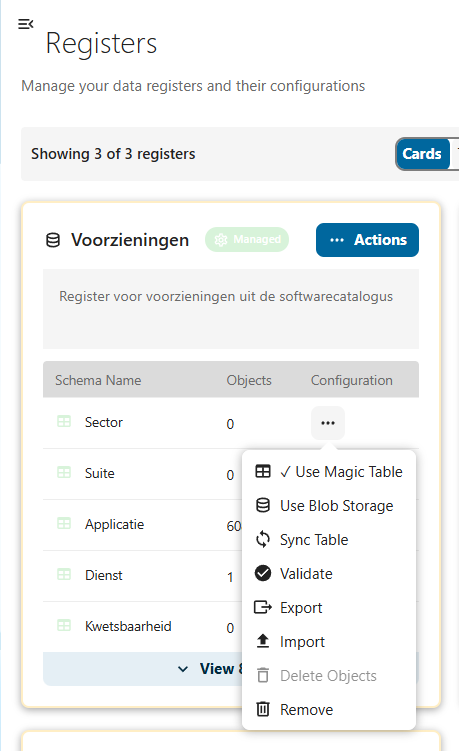
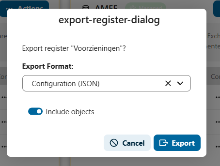

# Exporting to Excel and CSV

Open Register allows you to export your data in multiple formats. This guide covers exporting objects to **Excel** (.xlsx) and **CSV** files, both at the register level and at the schema level.

## Export Formats

| Format | Extension | Best For |
|--------|-----------|----------|
| **Configuration (JSON)** | .json | Backing up register structure and configuration |
| **Excel** | .xlsx | Bulk data export across multiple schemas |
| **CSV** | .csv | Simple data export for a single schema |

## Exporting from a Register

### Step 1: Open the Register Actions Menu

1. Navigate to **Registers** in the left sidebar
2. Find the register you want to export
3. Click **Actions** (the three-dot menu) on the register card



### Step 2: Select Export

Click **Export** from the dropdown menu. The export dialog opens.

### Step 3: Choose Format and Options



In the export dialog:

1. **Export Format**: Select your preferred format from the dropdown:
   - **Configuration (JSON)**: Exports the register structure, schemas, and optionally all objects as JSON
   - **Excel**: Exports all objects across all schemas as an Excel workbook (one sheet per schema)
   - **CSV**: Exports objects from a single schema as a CSV file (you will be asked to select which schema)

2. **Include objects**: Toggle this on to include the actual object data in the export. When off, only the register and schema configuration is exported (JSON format only).

3. Click **Export** to download the file.

### What Gets Exported

#### Excel Export

The Excel file contains:
- **One sheet per schema** in the register
- **Column A**: `id` (the object UUID)
- **Columns B onwards**: Schema properties (e.g., `naam`, `website`, `type`)
- **Last columns**: Metadata fields prefixed with `_` (e.g., `_created`, `_updated`, `_owner`, `_organisation`)

Example column order:

```
id | naam | website | type | _created | _updated | _owner | _organisation
```

#### CSV Export

The CSV file contains:
- **One file** for the selected schema
- Same column structure as Excel (id, properties, metadata)
- Comma-delimited values with proper quoting

## Exporting from a Schema

You can also export objects directly from a schema's action menu within a register:

1. Navigate to **Registers** in the left sidebar
2. Expand a register card to see its schemas
3. Click the **three-dot menu** next to the schema name
4. Select **Export**

This exports only the objects belonging to that specific schema.

## File Naming

Exported files are automatically named with the register or schema slug and a timestamp:

```
voorzieningen_2026-02-20.xlsx
organisatie_2026-02-20.csv
```

## Metadata Columns

Exported files include metadata columns for reference. These columns are prefixed with `_` and contain system-managed information:

| Column | Description |
|--------|-------------|
| `_created` | Object creation timestamp |
| `_updated` | Last update timestamp |
| `_published` | Publication timestamp |
| `_owner` | Object owner |
| `_organisation` | Associated organisation |
| `_register` | Associated register |
| `_schema` | Associated schema |
| `_name` | Object display name |
| `_version` | Object version |

:::info
Metadata columns are included for reference and audit purposes. When re-importing an exported file, metadata columns (those starting with `_`) are automatically ignored.
:::

## Best Practices

1. **Use Excel for multi-schema exports**: When you need data from all schemas in a register, Excel creates a separate sheet for each schema automatically
2. **Use CSV for single-schema work**: CSV is simpler and works well with external tools like spreadsheet editors or data processing scripts
3. **Regular backups**: Export your data regularly as backups, especially before making bulk changes
4. **Keep metadata columns**: When editing exported files for re-import, do not rename or remove the `id` column — it is needed to match existing records
5. **Format choice**: Use JSON for configuration backup and migration between environments; use Excel/CSV for working with the actual data

## Troubleshooting

### Export Button Not Visible

- Ensure you have the necessary permissions to access the register
- Check that you are viewing the register from the **Registers** page (not from Search / Views)

### Empty Export File

- Verify that the register contains objects
- If using CSV, make sure you selected a schema that has objects
- Check that the "Include objects" toggle is enabled

### Large Exports Timing Out

- For very large datasets (tens of thousands of objects), the export may take some time
- The browser will automatically download the file when it is ready
- If the export fails, try exporting individual schemas instead of the entire register
