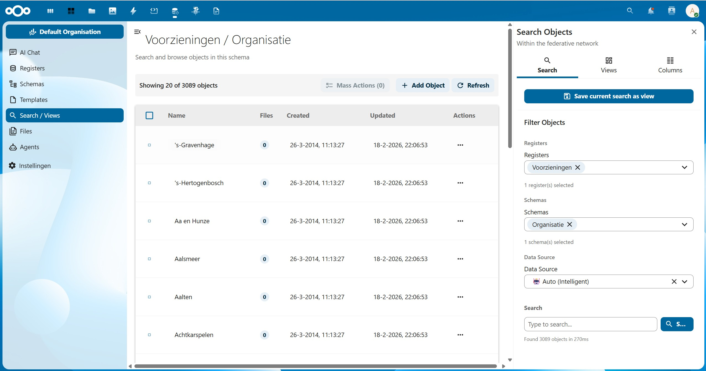
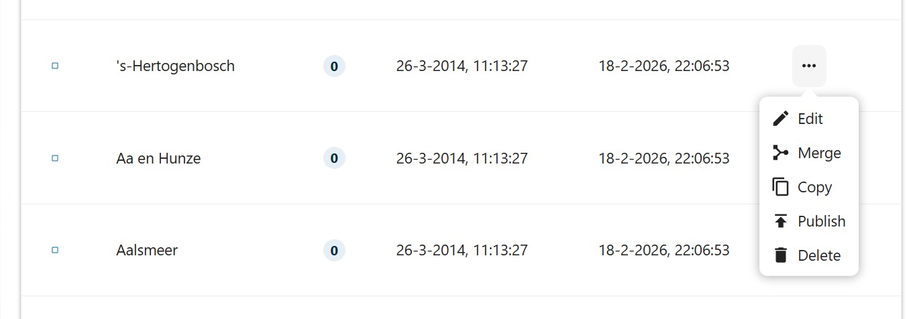
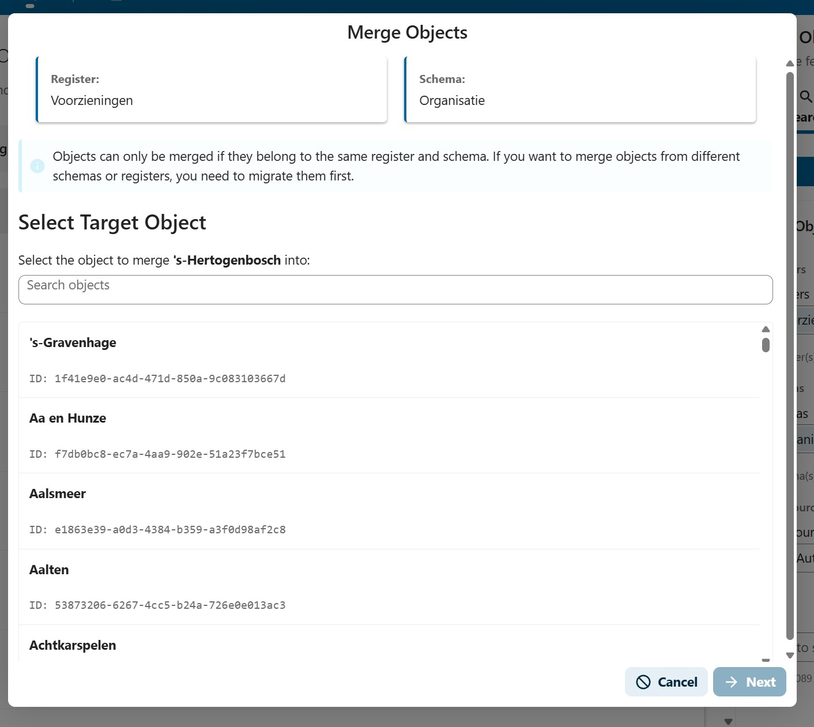
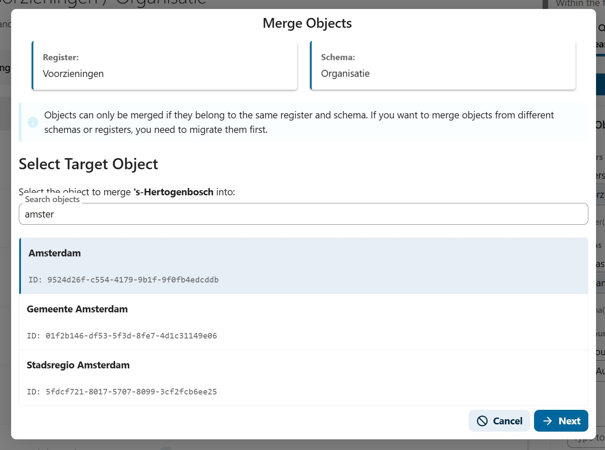
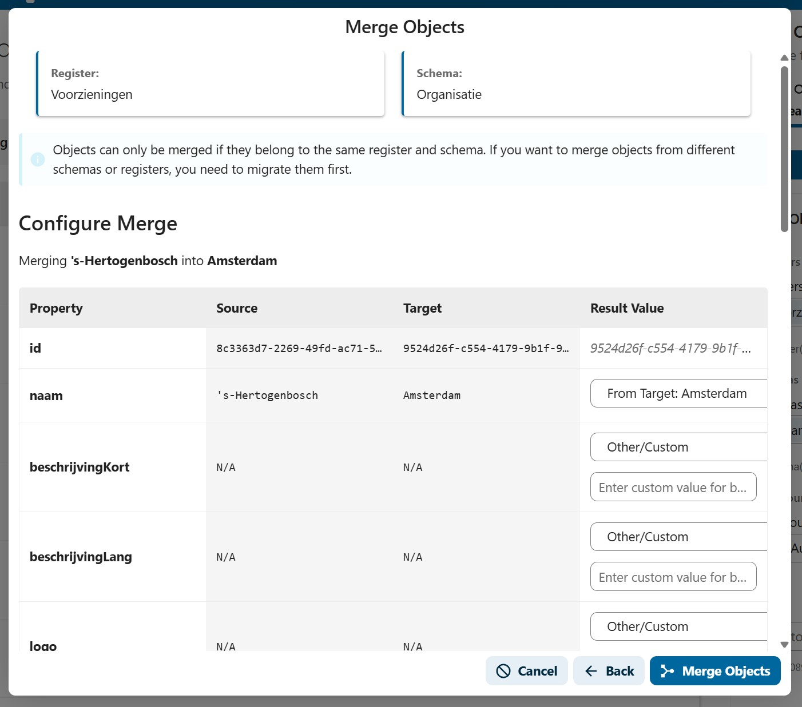
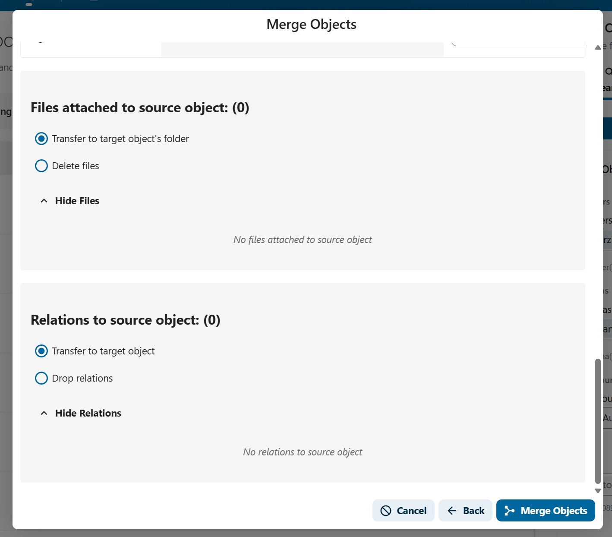
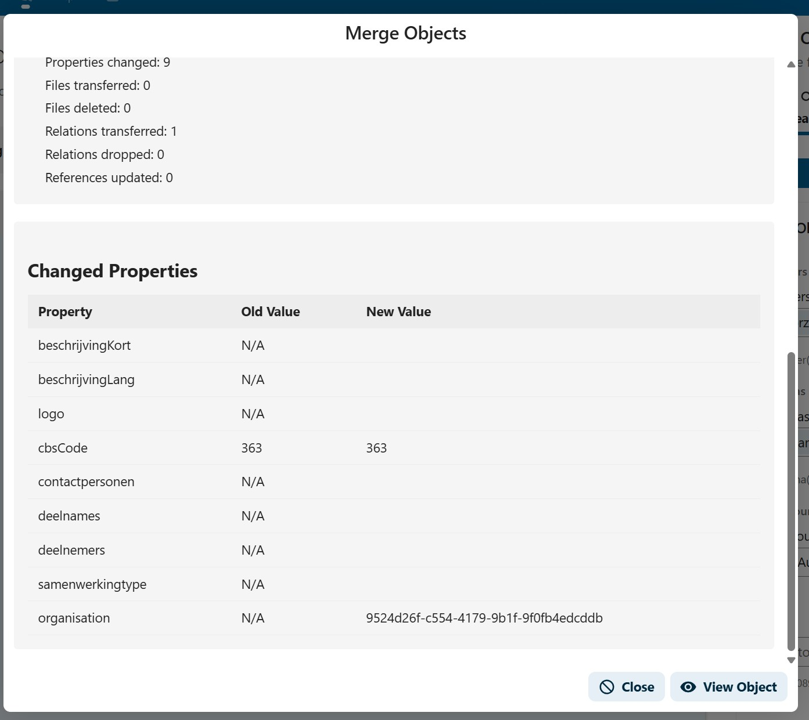

# Finding and Merging Objects

When working with large datasets, you may end up with duplicate or overlapping objects. Open Register provides a powerful search interface to find objects and a merge wizard to combine duplicates into a single authoritative record.

## Finding Objects

### Using the Search / Views Page

The **Search / Views** page is your main tool for finding objects across registers and schemas.

1. Navigate to **Search / Views** in the left sidebar
2. Use the **Filter Objects** panel on the right to narrow your search:
   - **Registers**: Select one or more registers to search within
   - **Schemas**: Select one or more schemas to filter by type
   - **Data Source**: Choose between Auto (Intelligent), Database, or SOLR
   - **Search**: Type a search query to find objects by name or content

The object list shows:
- **Name**: The display name of the object
- **Files**: Number of files attached to the object
- **Created**: When the object was first created
- **Updated**: When the object was last modified
- **Actions**: The three-dot menu for object actions

### Saving a Search as a View

If you frequently search for the same combination of filters, you can save your current search as a view by clicking **Save current search as view** at the top of the filter panel. Views are accessible from the **Views** tab.

## Merging Objects

Merging allows you to combine two duplicate objects into one. The source object is merged into a target object, and the source is deleted afterward. All files, relations, and references from other objects can be transferred to the target.

:::info
Objects can only be merged if they belong to the **same register and schema**. If you want to merge objects from different schemas or registers, you need to migrate them first.
:::

### Step 1: Open the Merge Dialog

1. Find the object you want to merge (the **source** object) in the object list
2. Click the **three-dot menu** (Actions) on the right side of the object row
3. Select **Merge** from the dropdown menu

### Step 2: Select the Target Object

The Merge Objects dialog opens. At the top, you can see which **Register** and **Schema** the merge operates on.

1. Browse the list of available objects, or use the **Search objects** field to find the target object
2. Click on the target object to select it (it will be highlighted)
3. Click **Next** to proceed

You can search for the target object by typing part of its name. The list filters in real time:

### Step 3: Configure the Merge

The configuration screen shows a side-by-side comparison of all properties from both objects. For each property, you can choose what the merged result should contain.

The table has four columns:

| Column | Description |
|--------|-------------|
| **Property** | The name of the field |
| **Source** | The value from the source object (the one being merged away) |
| **Target** | The value from the target object (the one that will remain) |
| **Result Value** | A dropdown where you choose which value to keep |

For each property, the **Result Value** dropdown offers:

- **From Source**: Keep the source object's value
- **From Target**: Keep the target object's value (default)
- **Other/Custom**: Enter a completely new value

:::note
The **id** field is always locked to the target object's ID and cannot be changed.
:::

#### File and Relation Handling

Below the property table, you will see two additional sections for handling files and relations.

**Files attached to source object:**
- **Transfer to target object's folder**: Move all files from the source to the target object (default)
- **Delete files**: Remove the files when the source object is deleted
- You can expand the file list to review which files will be affected

**Relations to source object:**
- **Transfer to target object**: Move the outgoing relations to the target object (default)
- **Drop relations**: Remove the relations when the source is deleted
- You can expand the relation list to review which relations will be affected

#### Reference Handling

Other objects may reference the source object. You can choose to:
- **Transfer**: Update all references in other objects to point to the target instead
- **Keep**: Leave references unchanged (they will point to a deleted object)

### Step 4: Execute the Merge

After configuring all properties and options:

1. Review your choices in the configuration table
2. Click **Merge Objects** to execute the merge
3. A merge report appears showing a summary and a detailed change log

The merge report shows:
- **Properties changed**: How many properties were updated on the target
- **Files transferred / deleted**: What happened to the source object's files
- **Relations transferred / dropped**: What happened to outgoing relations
- **References updated**: How many other objects had their references updated

Below the summary, a **Changed Properties** table lists each property with its old and new value, so you can verify exactly what changed.

Click **View Object** to navigate to the merged result, or **Close** to return to the object list.

## Best Practices

1. **Search before creating**: Use the search panel to check if an object already exists before creating a new one
2. **Review carefully**: Always review the property comparison table before executing a merge — this action cannot be undone
3. **Choose the right target**: Pick the most complete or authoritative record as the target, since its ID will be preserved
4. **Transfer references**: In most cases, select "Transfer" for references so that other objects continue to link to a valid record
5. **Check files**: If both objects have files, review what will be transferred to avoid duplicates
