# Docker Development Setup

OpenRegister includes a complete Docker Compose setup for developers and partners. This guide will help you quickly get started with a fully-configured development environment including Nextcloud, MariaDB, Solr, and Ollama.

## 🚀 Two Setup Modes

OpenRegister provides **two docker-compose configurations** to suit different needs:

### 📦 **Production/Testing Mode** (`docker-compose.yml`)

Perfect for partners, testers, and quick evaluation.

- ✅ Downloads OpenRegister from Nextcloud App Store
- ✅ Automatically installs and enables the app
- ✅ Production-ready configuration
- ✅ No local code required

**Usage:**
```bash
docker-compose up -d
```

### 👨‍💻 **Developer Mode** (`docker-compose.dev.yml`)

Perfect for developers working on OpenRegister code.

- ✅ Mounts local code into the container
- ✅ Automatically builds dependencies
- ✅ Live code changes (use `npm run watch`)
- ✅ Full development environment

**Usage:**
```bash
docker-compose -f docker-compose.dev.yml up -d
```

## Overview

The docker-compose setup provides:

- **Nextcloud**: Latest version with OpenRegister pre-mounted
- **MariaDB**: Database backend for Nextcloud
- **Solr**: Full-text search engine in standalone mode
- **Ollama**: Local LLM inference for AI features (privacy-focused, no external API needed)
- **Persistent Volumes**: Data preservation across container restarts

```mermaid
graph TB
    A[Nextcloud Container] --> B[MariaDB]
    A --> C[Solr]
    A --> D[Ollama]
    
    F[Host Port 8080] --> A
    G[Host Port 8983] --> C
    H[Host Port 11434] --> D
    
    style A fill:#0082c9
    style C fill:#d9411e
    style D fill:#000000,color:#ffffff
    style B fill:#003545
```



## Quick Start

### Prerequisites

- Docker and Docker Compose installed
- WSL2 (for Windows users)
- At least 8GB RAM available
- 20GB free disk space

### Production/Testing Mode (App Store)

**Use this if:** You want to test OpenRegister without modifying code.

1. **Navigate to the openregister directory:**

```bash
cd /path/to/apps-extra/openregister
```

2. **Start all services:**

```bash
docker-compose up -d
```

3. **Wait for services to initialize** (first start takes 2-3 minutes):

```bash
# Watch the logs (including OpenRegister auto-setup)
docker-compose logs -f nextcloud

# Check service health
docker-compose ps
```

**What's happening during startup:**
- Nextcloud initializes the database
- OpenRegister is downloaded from App Store
- The app is automatically enabled
- Ready to use!

4. **Access Nextcloud:**

- URL: http://localhost:8080
- Username: 'admin'
- Password: 'admin'
- **OpenRegister is already enabled and ready!**

### Developer Mode (Local Code)

**Use this if:** You want to develop and make changes to OpenRegister code.

1. **Navigate to the openregister directory:**

```bash
cd /path/to/apps-extra/openregister
```

2. **Start all services:**

```bash
docker-compose -f docker-compose.dev.yml up -d
```

3. **Wait for services to initialize** (first start takes 3-5 minutes):

```bash
# Watch the logs (including dependency installation and build)
docker-compose -f docker-compose.dev.yml logs -f nextcloud

# Check service health
docker-compose -f docker-compose.dev.yml ps
```

**What's happening during startup:**
- Nextcloud initializes the database
- Composer dependencies are installed
- NPM dependencies are installed
- Frontend assets are built
- The app is enabled and ready

4. **Access Nextcloud:**

- URL: http://localhost:8080
- Username: 'admin'
- Password: 'admin'
- Container name: `nextcloud-dev`

5. **Enable live development:**

```bash
# On your host machine, run:
npm run watch
```

Now any changes to Vue/JS files will automatically rebuild!

## Service Configuration

### Nextcloud

**Container Name:** 'nextcloud'  
**Port:** 8080 → 80  
**Volumes:**
- 'nextcloud:/var/www/html' - Nextcloud core files
- './custom_apps:/var/www/html/custom_apps' - Custom apps folder
- '.:/var/www/html/custom_apps/openregister' - OpenRegister app (mounted for development)
- './docker/entrypoint-openregister.sh' - Auto-setup script

**Environment:**
- PHP Memory Limit: 4G
- Upload Limit: 2G
- Post Max Size: 2G
- Timezone: Europe/Amsterdam

**Database Connection:**
- Host: 'db'
- Database: 'nextcloud'
- User: 'nextcloud'
- Password: '!ChangeMe!'

**Auto-Setup:**
- On startup, automatically installs dependencies and enables OpenRegister
- Script location: 'docker/entrypoint-openregister.sh'
- Runs in background while Nextcloud starts

### MariaDB

**Container Name:** 'db'  
**Port:** Not exposed (internal only)  
**Version:** MariaDB 10.6

**Database Credentials:**
- Root Password: '!ChangeMe!'
- Database: 'nextcloud'
- User: 'nextcloud'
- Password: '!ChangeMe!'

**Features:**
- Transaction isolation: READ-COMMITTED
- Binary logging enabled
- Persistent volume for data

### Solr (Search Engine)

**Container Name:** 'openregister-solr'  
**Port:** 8983 → 8983  
**Version:** Solr 9 (slim)

**Configuration:**
- Mode: Standalone (simpler for development)
- Heap Size: 512MB
- No external dependencies

**Access:**
- Admin UI: http://localhost:8983/solr
- API: http://localhost:8983/solr/admin/info/system

**Internal URL for Nextcloud:**
Use 'http://solr:8983' in OpenRegister Solr configuration.

### Ollama (Local LLM)

**Container Name:** 'openregister-ollama'  
**Port:** 11434 → 11434  
**Image:** ollama/ollama:latest

**Configuration:**
- Host: '0.0.0.0' (accessible from other containers)
- Volume: 'ollama:/root/.ollama' (persistent model storage)

**Internal URL for Nextcloud:**
Use 'http://ollama:11434' in OpenRegister LLM configuration.

**Models Location:**
Models are stored in the persistent volume and survive container restarts.

## Initial Configuration

### 1. Verify OpenRegister is Enabled

The app is automatically enabled during container startup. You can verify with:

```bash
# Check app status
docker exec -u 33 nextcloud php /var/www/html/occ app:list | grep openregister

# View auto-setup logs
docker logs nextcloud | grep "OpenRegister"
```

### 2. Setup Solr

Initialize Solr infrastructure:

```bash
# Setup Solr collections and schema
docker exec -u 33 nextcloud php /var/www/html/occ openregister:solr:manage setup

# Verify Solr health
docker exec -u 33 nextcloud php /var/www/html/occ openregister:solr:manage health
```

### 3. Configure Ollama

#### Download Models

Before using Ollama, you need to download the AI models:

```bash
# Download embedding model (required for search)
docker exec openregister-ollama ollama pull nomic-embed-text

# Download chat model (choose one based on your needs)

# Recommended: Meta Llama 3.1 (best balance, function calling support)
docker exec openregister-ollama ollama pull llama3.1

# Alternative: Mistral (European AI, ethical focus)
docker exec openregister-ollama ollama pull mistral

# Alternative: Phi-3 (smaller, efficient)
docker exec openregister-ollama ollama pull phi3

# High Quality (requires powerful hardware)
docker exec openregister-ollama ollama pull llama3.1:70b
```

#### Configure in OpenRegister

1. Log in to Nextcloud (http://localhost:8080)
2. Go to **Settings → Administration → OpenRegister**
3. Navigate to **LLM Configuration**
4. Set up Ollama:
   - **Embedding Provider:** Ollama
   - **Ollama URL:** 'http://ollama:11434'
   - **Embedding Model:** 'nomic-embed-text'
   - **Chat Provider:** Ollama
   - **Chat Model:** 'llama3.1' (or your chosen model)

## Development Workflow

### Production/Testing Mode

For testing and evaluation (no code changes):

```bash
# View logs
docker-compose logs -f nextcloud

# Restart services
docker-compose restart nextcloud

# Stop services
docker-compose down

# Start services
docker-compose up -d
```

### Developer Mode

For active development with code changes:

#### Making Code Changes

The OpenRegister directory is mounted directly into the container, so changes are immediately available:

```bash
# Install dependencies (run on host)
npm install
composer install

# Watch for frontend changes (automatic rebuild)
npm run watch

# Lint code
npm run lint
```

#### Viewing Logs

```bash
# All services
docker-compose -f docker-compose.dev.yml logs -f

# Specific service
docker-compose -f docker-compose.dev.yml logs -f nextcloud
docker-compose -f docker-compose.dev.yml logs -f solr
docker-compose -f docker-compose.dev.yml logs -f ollama

# Filter logs
docker logs nextcloud-dev | grep 'OpenRegister'
```

#### Restarting Services

```bash
# Restart all services
docker-compose -f docker-compose.dev.yml restart

# Restart specific service
docker-compose -f docker-compose.dev.yml restart nextcloud
docker-compose -f docker-compose.dev.yml restart ollama
```

### Database Access

Connect to the database from your host machine:

**Using Docker:**
```bash
docker exec -it db mysql -u nextcloud -p'!ChangeMe!' nextcloud
```

**Using DBeaver or other DB tools:**
- Host: 'localhost'
- Port: 3306 (if exposed in your docker-compose)
- Database: 'nextcloud'
- Username: 'nextcloud'
- Password: '!ChangeMe!'

### Accessing Containers

```bash
# Access Nextcloud container
docker exec -it nextcloud bash

# Access as www-data user (for occ commands)
docker exec -it -u 33 nextcloud bash

# Access Ollama container
docker exec -it openregister-ollama bash
```

## AI Features Testing

### Test Ollama Connection

```bash
# Check if Ollama is running
docker exec openregister-ollama curl -s http://localhost:11434/api/tags

# List downloaded models
docker exec openregister-ollama ollama list

# Test model inference
docker exec openregister-ollama ollama run llama3.1 "Hello, how are you?"
```

### Test Vectorization

1. Create a test object in OpenRegister
2. Check if it was vectorized:

```bash
docker exec -u 33 nextcloud php /var/www/html/occ openregister:solr:debug query "your search term"
```

### Monitor Model Performance

```bash
# Watch Ollama logs
docker logs -f openregister-ollama

# Check resource usage
docker stats openregister-ollama
```

## Troubleshooting

### Auto-Setup Issues

If OpenRegister isn't automatically enabled:

```bash
# Check auto-setup logs
docker logs nextcloud | grep "OpenRegister"

# Manually trigger setup
docker exec -u 33 nextcloud bash /entrypoint-openregister.sh

# Or manually enable
docker exec -u 33 nextcloud php /var/www/html/occ app:enable openregister
```

### Container Won't Start

```bash
# Check container status
docker-compose ps

# View error logs
docker-compose logs [service-name]

# Restart specific service
docker-compose restart [service-name]
```

### Nextcloud Installation Issues

```bash
# Reset Nextcloud (WARNING: destroys data)
docker-compose down -v
docker-compose up -d
```

### Solr Connection Issues

```bash
# Check if Solr is accessible from Nextcloud
docker exec nextcloud curl -s http://solr:8983/solr/admin/info/system

# Check Solr health
docker exec openregister-solr curl -s http://localhost:8983/solr/admin/info/system

# View Solr logs
docker logs openregister-solr
```

### Ollama Issues

```bash
# Check if Ollama is accessible
docker exec nextcloud curl -s http://ollama:11434/api/tags

# Check Ollama logs
docker logs openregister-ollama

# Restart Ollama
docker-compose restart ollama

# Check disk space for models
docker exec openregister-ollama df -h
```

### Out of Memory

If services crash due to memory:

1. **Increase Docker memory limit:**
   - Docker Desktop: Settings → Resources → Memory
   - Recommended: At least 8GB

2. **Reduce Solr heap:**
   - Edit 'docker-compose.yml'
   - Change 'SOLR_HEAP=512m' to '256m'

3. **Use smaller Ollama models:**
   - Use 'phi3' instead of 'llama3.1:70b'

### Performance Issues

```bash
# Check resource usage
docker stats

# Optimize Solr index
docker exec -u 33 nextcloud php /var/www/html/occ openregister:solr:manage optimize

# Clear caches
docker exec -u 33 nextcloud php /var/www/html/occ maintenance:mode --on
docker exec -u 33 nextcloud php /var/www/html/occ files:cleanup
docker exec -u 33 nextcloud php /var/www/html/occ maintenance:mode --off
```

## Stopping the Environment

### Temporary Stop (preserves data)

```bash
docker-compose stop
```

### Full Shutdown (preserves data)

```bash
docker-compose down
```

### Complete Reset (DESTROYS ALL DATA)

```bash
# WARNING: This deletes all data including databases, uploaded files, and downloaded models
docker-compose down -v
```

## Advanced Configuration

### Custom Port Mapping

Edit 'docker-compose.yml' to change ports:

```yaml
ports:
  - "8081:80"  # Change Nextcloud port to 8081
```

### Resource Limits

Add resource limits to services:

```yaml
services:
  ollama:
    deploy:
      resources:
        limits:
          memory: 8G
          cpus: '4'
```

### Using GPU for Ollama

For NVIDIA GPUs:

```yaml
services:
  ollama:
    deploy:
      resources:
        reservations:
          devices:
            - driver: nvidia
              count: 1
              capabilities: [gpu]
```

## Production Considerations

This docker-compose setup is designed for **development and testing only**. For production:

1. **Change all default passwords**
2. **Use proper SSL/TLS certificates**
3. **Set up proper backup procedures**
4. **Configure firewall rules**
5. **Use external database with proper credentials**
6. **Configure Solr authentication**
7. **Set up monitoring and logging**
8. **Review and harden security settings**
9. **Use production-grade hardware/infrastructure**
10. **Consider using managed services for AI (OpenAI) instead of local Ollama**

## Additional Resources

- [Solr Setup Guide](../technical/solr-setup-configuration.md)
- [AI Features Documentation](../features/ai.md)
- [CLI Commands Reference](../developers/commands.md)
- [Official Nextcloud Development Guide](https://docs.nextcloud.com/server/latest/developer_manual/)
- [Ollama Documentation](https://ollama.com)
- [Apache Solr Documentation](https://solr.apache.org)

## Support

For issues or questions:

1. Check the [troubleshooting section](#troubleshooting)
2. Review the logs: 'docker-compose logs -f'
3. Contact: info@conduction.nl
4. GitHub Issues: [OpenRegister Issues](https://github.com/ConductionNL/OpenRegister)

