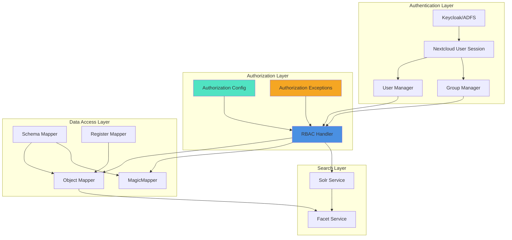
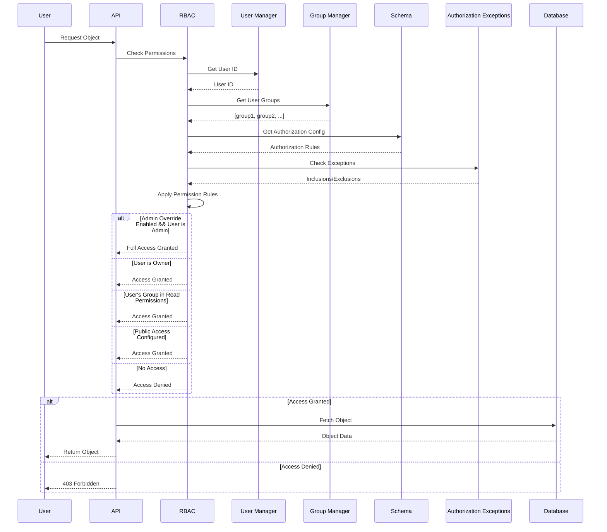
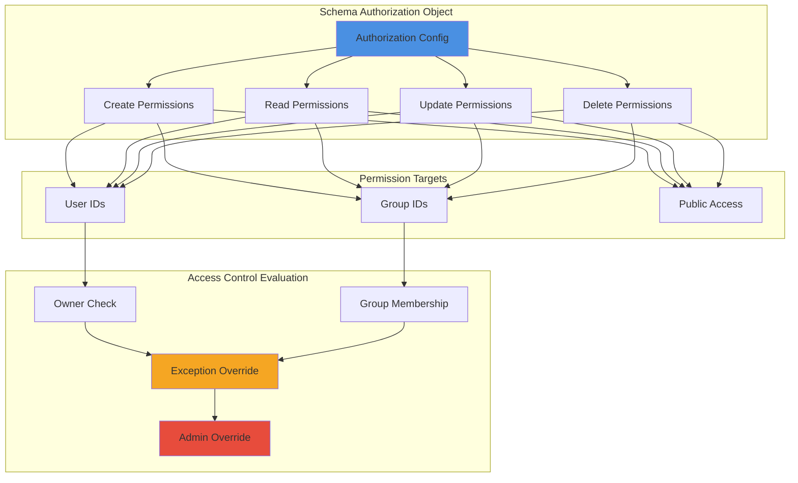
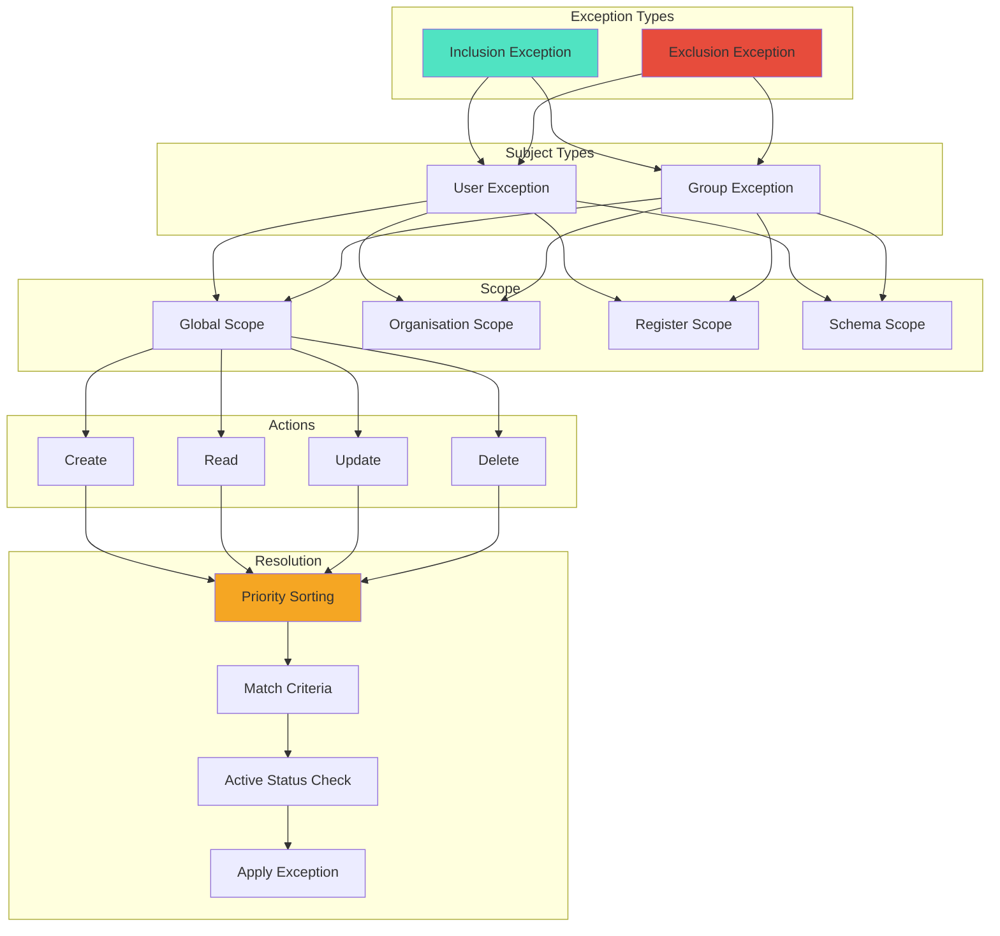
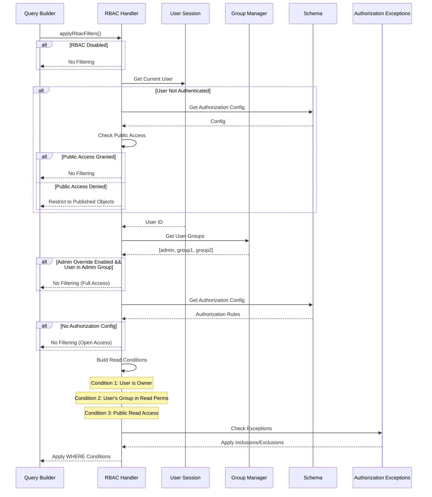
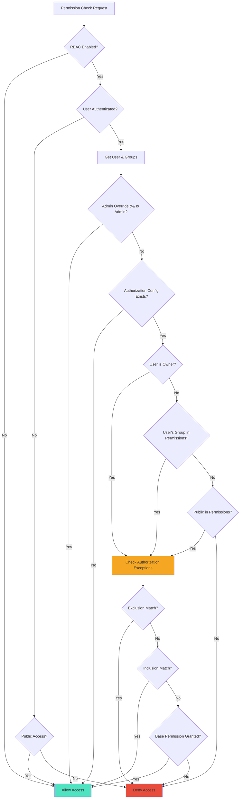

# Access Control

Access Control provides enterprise-grade permissions management through integration with Nextcloud RBAC (Role-Based Access Control) and Keycloak.

## Overview

The access control system integrates with:
- ADFS (Active Directory Federation Services) for user and group management via Keycloak
- Nextcloud RBAC for role-based permissions
- FCS (Federal Cloud Services) compliance requirements
- Verwerkingen registers for process tracking

## Permission Levels

Access can be controlled at multiple levels:
- Register level - Control access to entire registers
- Schema level - Manage permissions for specific register/schema combinations  
- Object level - Set permissions on individual objects
- Property level - Fine-grained control over specific object properties

## Permission Types

Permissions are granted through:
1. **User Rights**
   - CRUD (Create, Read, Update, Delete) operations
   - Inherited from ADFS groups via Keycloak
   - Role-based access control through Nextcloud

2. **Contract Rights** 
   - Application-level permissions
   - Process-specific authorizations
   - Compliance with FCS requirements
   - Integration with verwerkingen registers

## Implementation

Access control is implemented through:

1. **User Authentication**
   - Direct integration with Keycloak for identity management
   - ADFS synchronization for user and group information
   - Single Sign-On (SSO) capabilities

2. **Permission Management**
   - CRUD-level permissions for all system entities
   - Hierarchical permission inheritance
   - Fine-grained access control at multiple levels

3. **Process Integration**
   - Compliance with FCS guidelines
   - Integration with verwerkingen registers for process tracking
   - Application-specific permission contracts

## Technical Implementation

### Architecture Overview



### Authorization Flow



### Schema Authorization Configuration



### Authorization Exception System



### RBAC Query Filtering Process



### Database Schema

**Authorization Exception Table: `oc_openregister_authorization_exceptions`**

| Column | Type | Description |
|--------|------|-------------|
| `id` | INTEGER | Primary key |
| `uuid` | VARCHAR(36) | Unique identifier |
| `type` | VARCHAR(20) | Exception type: `inclusion` or `exclusion` |
| `subject_type` | VARCHAR(20) | Subject type: `user` or `group` |
| `subject_id` | VARCHAR(255) | User ID or Group ID |
| `schema_uuid` | VARCHAR(36) | Schema UUID (nullable for global) |
| `register_uuid` | VARCHAR(36) | Register UUID (nullable) |
| `organization_uuid` | VARCHAR(36) | Organisation UUID (nullable) |
| `action` | VARCHAR(20) | CRUD action: `create`, `read`, `update`, `delete` |
| `priority` | INTEGER | Priority for resolution (higher = more important) |
| `active` | BOOLEAN | Whether exception is active |
| `description` | TEXT | Human-readable description |
| `created_by` | VARCHAR(255) | User who created the exception |
| `created_at` | DATETIME | Creation timestamp |
| `updated_at` | DATETIME | Last update timestamp |

**Schema Authorization Field:**
- Stored in `oc_openregister_schemas.authorization` (JSON)
- Format:
```json
{
  "create": ["admin", "editors"],
  "read": ["admin", "editors", "viewers", "public"],
  "update": ["admin", "editors"],
  "delete": ["admin"]
}
```

**Object Authorization Field:**
- Stored in `oc_openregister_objects.authorization` (JSON)
- Inherits from schema but can be overridden per-object
- Same format as schema authorization

### Permission Resolution Algorithm



### Code Examples

#### Schema Authorization Configuration

```php
// Setting authorization on a schema
$schema->setAuthorization([
    'create' => ['admin', 'editors'],
    'read' => ['admin', 'editors', 'viewers', 'public'],
    'update' => ['admin', 'editors'],
    'delete' => ['admin']
]);

// Checking if a user has permission
$hasPermission = $schema->hasPermission('read', $userGroups);
```

#### Creating Authorization Exceptions

```php
use OCA\OpenRegister\Db\AuthorizationException;

// Create an inclusion exception (grant extra permission)
$inclusion = new AuthorizationException();
$inclusion->setType(AuthorizationException::TYPE_INCLUSION);
$inclusion->setSubjectType(AuthorizationException::SUBJECT_TYPE_USER);
$inclusion->setSubjectId('user123');
$inclusion->setSchemaUuid($schemaUuid);
$inclusion->setAction(AuthorizationException::ACTION_UPDATE);
$inclusion->setPriority(10);
$inclusion->setActive(true);
$inclusion->setDescription('Allow user123 to update objects in this schema');

// Create an exclusion exception (deny permission)
$exclusion = new AuthorizationException();
$exclusion->setType(AuthorizationException::TYPE_EXCLUSION);
$exclusion->setSubjectType(AuthorizationException::SUBJECT_TYPE_GROUP);
$exclusion->setSubjectId('restricted_group');
$exclusion->setRegisterUuid($registerUuid);
$exclusion->setAction(AuthorizationException::ACTION_DELETE);
$exclusion->setPriority(20);
$exclusion->setActive(true);
$exclusion->setDescription('Prevent restricted_group from deleting objects in this register');

// Check if an exception matches criteria
$matches = $exception->matches(
    subjectType: 'user',
    subjectId: 'user123',
    action: 'update',
    schemaUuid: $schemaUuid
);
```

#### RBAC Query Filtering (MagicMapper)

```php
use OCA\OpenRegister\Service\MagicMapperHandlers\MagicRbacHandler;

// Apply RBAC filters to a dynamic table query
$rbacHandler->applyRbacFilters(
    qb: $queryBuilder,
    register: $register,
    schema: $schema,
    tableAlias: 't',
    userId: $currentUserId,
    rbac: true
);

// Check if current user is admin
$isAdmin = $rbacHandler->isCurrentUserAdmin();

// Get current user's groups
$userGroups = $rbacHandler->getCurrentUserGroups();
```

#### Object-Level Authorization

```php
// Get object authorization (inherits from schema if not set)
$objectAuth = $object->getAuthorization();

// Override schema authorization for specific object
$object->setAuthorization([
    'read' => ['admin', 'special_viewers'],
    'update' => ['admin']
]);
```

### RBAC Configuration

RBAC can be configured in Nextcloud app settings:

```json
{
  "enabled": true,
  "adminOverride": true
}
```

- **`enabled`**: Master switch for RBAC system
- **`adminOverride`**: Allow users in 'admin' group to bypass all RBAC checks

### Performance Optimizations

1. **Lazy Group Loading**
   - User groups are only fetched when RBAC is enabled
   - Results are cached within the request lifecycle

2. **Admin Fast Path**
   - Admin users bypass permission checks entirely when override is enabled
   - Reduces database queries for administrative operations

3. **Query-Level Filtering**
   - RBAC filters are applied at the database query level
   - Prevents loading unauthorized objects into memory

4. **Authorization Config Caching**
   - Schema authorization configs are cached with schema entities
   - Reduces redundant JSON parsing

5. **Exception Priority Indexing**
   - Database index on `priority` field for fast exception sorting
   - Composite index on `(subject_type, subject_id, action, active)` for fast matching

### Integration Points

#### 1. ObjectEntityMapper
- Applies RBAC filters to all object queries via `findAll()`, `find()`, `count()`
- Respects `rbac` parameter (default: true)

#### 2. MagicMapper (Dynamic Tables)
- Uses `MagicRbacHandler` for schema-specific table filtering
- Consistent security across schema-generated tables

#### 3. Solr Search
- RBAC filtering applied via `applyAdditionalFilters()` in `GuzzleSolrService`
- Currently logs RBAC application but full implementation pending

#### 4. API Controllers
- RBAC checks in `ObjectsController`, `RegistersController`, `SchemasController`
- Validates permissions before CRUD operations

### Best Practices

1. **Use Schema-Level Authorization**
   - Define authorization at the schema level for consistency
   - Only override at object level when necessary

2. **Leverage Group-Based Permissions**
   - Use Nextcloud groups for role management
   - Avoid user-specific permissions unless absolutely required

3. **Authorization Exceptions as Last Resort**
   - Use exceptions sparingly for edge cases
   - Document the reason for each exception
   - Set appropriate priorities to avoid conflicts

4. **Test Permission Scenarios**
   - Test unauthenticated access
   - Test group membership changes
   - Test admin override behavior
   - Test exception priority resolution

5. **Monitor Authorization Exceptions**
   - Regularly audit active exceptions
   - Deactivate or delete obsolete exceptions
   - Review exception conflicts (overlapping priorities)

### Debugging & Monitoring

#### Enable Debug Logging

```php
// In GuzzleSolrService
$this->logger->debug('[SOLR] RBAC filtering applied');

// In MagicRbacHandler
$this->logger->debug('Applying RBAC filters', [
    'user_id' => $userId,
    'user_groups' => $userGroups,
    'schema_uuid' => $schema->getUuid()
]);
```

#### Check Authorization Config

```bash
# Query schema authorization
docker exec -u 33 master-nextcloud-1 php -r "
\$schema = \OC::$server->get(\OCA\OpenRegister\Db\SchemaMapper::class)->find(1);
var_dump(\$schema->getAuthorization());
"
```

#### Query Authorization Exceptions

```bash
# List active exceptions
docker exec -it master-database-mysql-1 mysql -u nextcloud -pnextcloud nextcloud -e "
SELECT type, subject_type, subject_id, action, priority, description 
FROM oc_openregister_authorization_exceptions 
WHERE active = 1 
ORDER BY priority DESC;
"
```

### Security Considerations

1. **Default Deny**
   - When authorization is configured, default behavior is to deny access
   - Explicitly configure 'public' in read permissions for public access

2. **Admin Override**
   - Admin override can be disabled for high-security environments
   - When disabled, even admins must have explicit permissions

3. **Authorization Inheritance**
   - Objects inherit authorization from schemas
   - Object-level overrides take precedence

4. **Exception Priority**
   - Exclusions should have higher priority than inclusions to ensure security
   - Use priority > 50 for security-critical exclusions

5. **Unauthenticated Access**
   - Unauthenticated users only see objects with 'public' in read permissions
   - Fallback to published object filtering can be enabled (currently disabled)

### Future Enhancements

1. **Field-Level Authorization**
   - Control access to specific object properties
   - Redact sensitive fields based on user permissions

2. **Time-Based Permissions**
   - Temporary permission grants with expiration
   - Scheduled permission changes

3. **Audit Logging**
   - Log all authorization decisions
   - Track permission changes over time

4. **Permission Testing Tool**
   - UI for testing user permissions
   - Visualize effective permissions for users/groups

5. **RBAC Analytics**
   - Permission usage statistics
   - Identify over-privileged users
   - Suggest permission optimizations

