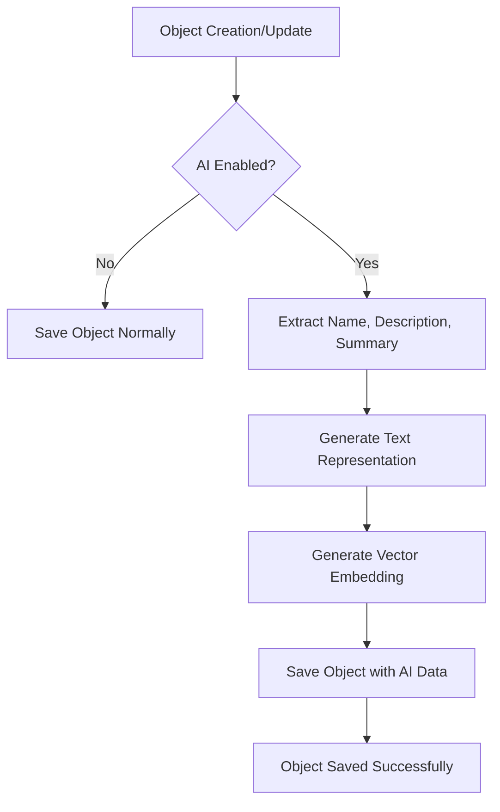

# AI Functionality

OpenRegister integrates with the [LLPhant framework](https://github.com/LLPhant/LLPhant) to provide advanced AI capabilities including automatic text generation, vector embeddings, chat interactions, and intelligent content enrichment for semantic search and analysis.

## Overview

The AI functionality enables:

- **Automatic Text Generation**: Generate searchable text representations of objects
- **Vector Embeddings**: Create semantic embeddings for similarity search and recommendations
- **AI Chat Interface**: Interactive chat functionality with context-aware responses
- **Object Enrichment**: Automatic AI-powered content enhancement during object creation/updates
- **Content Analysis**: AI-powered analysis of object content
- **Semantic Search**: Enhanced search capabilities using vector similarity
- **Multi-Provider Support**: Support for OpenAI, Ollama, Azure, and Anthropic

## Supported AI Providers

OpenRegister supports multiple AI providers through the LLPhant framework:

### OpenAI
- **Models**: GPT-3.5 Turbo, GPT-4, GPT-4 Turbo, GPT-4o
- **Embeddings**: Ada v2, Embedding v3 Small/Large
- **Configuration**: Requires OpenAI API key

### Ollama (Local AI)
- **Models**: Llama 2, Mistral, Code Llama
- **Embeddings**: Nomic Embed Text, MxBai Embed Large, All MiniLM
- **Configuration**: Requires local Ollama installation

### Azure OpenAI
- **Models**: GPT-3.5 Turbo, GPT-4, GPT-4 32K
- **Embeddings**: Ada v2, Embedding v3 Small/Large
- **Configuration**: Requires Azure OpenAI service and endpoint

### Anthropic
- **Models**: Claude 3 Haiku, Sonnet, Opus
- **Embeddings**: Uses OpenAI embeddings (recommended)
- **Configuration**: Requires Anthropic API key

## Configuration

### Basic Setup

1. **Install Dependencies**: LLPhant is automatically included via Composer
2. **Enable AI**: Toggle AI functionality in Settings → AI Configuration
3. **Choose Provider**: Select your preferred AI provider
4. **Configure API**: Enter API keys and connection details
5. **Select Models**: Choose language and embedding models

### Provider-Specific Configuration

#### OpenAI Configuration
```json
{
    'provider': 'openai',
    'apiKey': 'sk-...',
    'model': 'gpt-3.5-turbo',
    'embeddingModel': 'text-embedding-ada-002',
    'maxTokens': 4000,
    'temperature': 0.7
}
```

#### Ollama Configuration
```json
{
    'provider': 'ollama',
    'baseUrl': 'http://localhost:11434',
    'model': 'llama2',
    'embeddingModel': 'nomic-embed-text',
    'maxTokens': 4000,
    'temperature': 0.7
}
```

#### Azure Configuration
```json
{
    'provider': 'azure',
    'apiKey': 'your-azure-key',
    'baseUrl': 'https://your-resource.openai.azure.com',
    'model': 'gpt-35-turbo',
    'embeddingModel': 'text-embedding-ada-002'
}
```

#### Anthropic Configuration
```json
{
    'provider': 'anthropic',
    'apiKey': 'sk-ant-...',
    'model': 'claude-3-sonnet',
    'embeddingModel': 'text-embedding-ada-002'
}
```

## Database Schema

AI functionality adds two new fields to the `openregister_objects` table:

### Text Field
- **Type**: TEXT (65KB capacity)
- **Purpose**: Stores AI-generated searchable text representation
- **Usage**: Full-text search, content analysis

### Embedding Field
- **Type**: JSON
- **Purpose**: Stores vector embeddings as JSON arrays
- **Format**: `[0.1234, -0.5678, 0.9012, ...]`
- **Usage**: Semantic similarity search, recommendations

## Processing Options

### Automatic Processing
- **Auto Text Generation**: Automatically generate text for new/updated objects
- **Auto Embedding**: Automatically create embeddings for semantic search
- **Batch Processing**: Process multiple objects efficiently

### Manual Processing
- **Batch Size**: Configure number of objects per batch (1-1000)
- **Retry Logic**: Automatic retry for failed requests (0-10 attempts)
- **Timeout**: Request timeout configuration (5-300 seconds)

## Embedding Models and Dimensions

Different embedding models produce vectors with different dimensions:

### OpenAI Models
- **text-embedding-ada-002**: 1536 dimensions
- **text-embedding-3-small**: 1536 dimensions  
- **text-embedding-3-large**: 3072 dimensions

### Ollama Models
- **nomic-embed-text**: 768 dimensions
- **mxbai-embed-large**: 1024 dimensions
- **all-minilm**: 384 dimensions

### Choosing Embedding Models
- **Higher dimensions**: More detailed representations, better accuracy
- **Lower dimensions**: Faster processing, less storage
- **Compatibility**: Ensure consistent dimensions for similarity comparisons

## API Integration

### Text Generation
Objects automatically generate text representations during save operations:

```php
$object = new ObjectEntity();
$object->setObject(['name' => 'Example', 'description' => 'Test object']);

// AI service generates text representation
$aiService->generateText($object);

// Text is stored in the 'text' field
echo $object->getText(); // 'Example: Test object with detailed description...'
```

### Embedding Generation
Vector embeddings are created from text representations:

```php
// Generate embedding from text
$embedding = $aiService->generateEmbedding($object->getText());

// Store embedding in object
$object->setEmbedding($embedding);

// Embedding is now available for similarity search
$similarObjects = $searchService->findSimilar($object->getEmbedding());
```

## Search Integration

### Semantic Search
Use embeddings for semantic similarity searches:

```php
// Find objects similar to a query
$queryEmbedding = $aiService->generateEmbedding('search query');
$results = $objectService->findBySimilarity($queryEmbedding, $threshold = 0.8);
```

### Enhanced Text Search
AI-generated text improves full-text search capabilities:

```php
// Search in AI-generated text representations
$results = $objectService->searchText('complex query terms');
```

## Performance Considerations

### Batch Processing
- Process objects in configurable batches
- Avoid API rate limits with proper batching
- Monitor processing progress and errors

### Caching
- Cache embeddings to avoid regeneration
- Use appropriate cache invalidation strategies
- Consider storage requirements for embeddings

### Cost Management
- Monitor API usage and costs
- Use appropriate models for your use case
- Consider local models (Ollama) for cost efficiency

## Error Handling

### Connection Testing
Test AI provider connections before processing:

```php
$testResult = $aiService->testConnection();
if (!$testResult->success) {
    throw new Exception('AI service unavailable: ' . $testResult->message);
}
```

### Retry Logic
Automatic retry for failed requests:
- Configurable retry attempts (0-10)
- Exponential backoff for rate limiting
- Detailed error logging for troubleshooting

### Fallback Strategies
- Continue operation if AI services are unavailable
- Queue objects for later AI processing
- Maintain search functionality without embeddings

## Security Considerations

### API Key Management
- Store API keys securely in environment variables
- Use separate keys for development/production
- Rotate keys regularly

### Data Privacy
- AI providers may process your data
- Review provider privacy policies
- Consider local models for sensitive data

### Access Control
- Restrict AI configuration to administrators
- Audit AI processing activities
- Monitor usage and costs

## Monitoring and Logging

### Processing Logs
- Detailed logs for AI operations
- Error tracking and alerting
- Performance metrics collection

### Usage Analytics
- Track AI service usage
- Monitor costs and quotas
- Analyze processing performance

## Troubleshooting

### Common Issues

#### Connection Failures
- Verify API keys and endpoints
- Check network connectivity
- Review firewall settings

#### Model Availability
- Ensure selected models are available
- Check provider service status
- Verify model permissions

#### Performance Issues
- Adjust batch sizes
- Optimize timeout settings
- Monitor API rate limits

### Debug Mode
Enable detailed logging for troubleshooting:

```json
{
    'enableLogging': true,
    'logLevel': 'debug'
}
```

## Migration

When enabling AI functionality on existing installations:

1. **Run Migration**: Database schema updates automatically
2. **Configure Provider**: Set up AI provider and models
3. **Bulk Processing**: Process existing objects for embeddings
4. **Verify Results**: Test search and AI functionality

## API Endpoints

### Settings Endpoints

- `GET /api/settings/ai` - Retrieve current AI configuration
- `PUT /api/settings/ai` - Update AI configuration  
- `POST /api/settings/ai/test` - Test AI connection and functionality

### Chat Endpoints

- `POST /api/chat` - Send a chat message and receive AI response
- `GET /api/chat/capabilities` - Get AI chat capabilities and status
- `POST /api/chat/test` - Test AI chat connection
- `GET /api/chat/context` - Get context information for AI chat
- `POST /api/chat/generate-text` - Generate text representation for an object
- `POST /api/chat/generate-embedding` - Generate vector embedding for text

## Advanced Usage

### AI Chat Interface

Use the chat API to interact with AI:

```javascript
// Send a chat message with context
const response = await fetch('/api/chat', {
    method: 'POST',
    headers: { 'Content-Type': 'application/json' },
    body: JSON.stringify({
        message: 'How do I create a new register?',
        context: {
            register: 'current-register',
            schema: 'current-schema'
        },
        history: [
            { role: 'user', content: 'Previous question...' },
            { role: 'assistant', content: 'Previous response...' }
        ]
    })
});

const chatResponse = await response.json();
console.log(chatResponse.response); // AI-generated response
```

### Manual Text Generation

Generate text representations manually:

```javascript
// Generate text for an object
const textResponse = await fetch('/api/chat/generate-text', {
    method: 'POST',
    headers: { 'Content-Type': 'application/json' },
    body: JSON.stringify({
        object: {
            name: 'Product Name',
            description: 'Product description...',
            summary: 'Brief summary...'
        }
    })
});

const { text } = await textResponse.json();
```

### Manual Embedding Generation

Generate vector embeddings for custom text:

```javascript
// Generate embedding for text
const embeddingResponse = await fetch('/api/chat/generate-embedding', {
    method: 'POST',
    headers: { 'Content-Type': 'application/json' },
    body: JSON.stringify({
        text: 'Text to embed...',
        provider: 'openai' // optional
    })
});

const { embedding, dimensions } = await embeddingResponse.json();
```

### Object Enrichment Process

The AI enrichment process automatically occurs during object creation and updates:



## Integration with Business Logic

### Object Metadata Hydration

AI enrichment is integrated into the object metadata hydration process in `SaveObject.php`:

1. **Metadata Extraction**: Name, description, and summary are extracted from object data
2. **Text Generation**: AI generates a searchable text representation
3. **Embedding Creation**: Vector embedding is created from the text
4. **Database Storage**: Both text and embedding are stored with the object

### Performance Considerations

- **Asynchronous Processing**: AI operations are designed to be non-blocking
- **Error Handling**: Failed AI operations don't prevent object creation
- **Caching**: Consider implementing caching for frequently used embeddings
- **Rate Limiting**: Be aware of API rate limits for external providers

## Troubleshooting

### Common Issues

1. **AI Not Working**: Check if AI is enabled in settings and API keys are valid
2. **Connection Errors**: Test connection using the test endpoints
3. **Missing Embeddings**: Verify embedding model is supported by provider
4. **Performance Issues**: Consider using local Ollama for better performance

### Debugging

Enable debug logging to see AI operations:

```php
$this->logger->debug('AI enrichment completed', [
    'object_id' => $entity->getUuid(),
    'text_length' => strlen($textRepresentation),
    'has_embedding' => !empty($entity->getEmbedding())
]);
```

## Future Enhancements

Planned AI features include:
- Content classification and tagging
- Automated metadata extraction
- Multi-language support
- Custom model fine-tuning
- Advanced analytics and insights
- Batch Processing: Bulk AI enrichment for existing objects
- Custom Models: Support for fine-tuned models
- Semantic Search: Enhanced search using vector embeddings

## Support

For AI functionality support:
- Check LLPhant documentation: https://github.com/LLPhant/LLPhant
- Review provider-specific documentation
- Contact support for configuration assistance
- Test AI functionality using the provided endpoints
