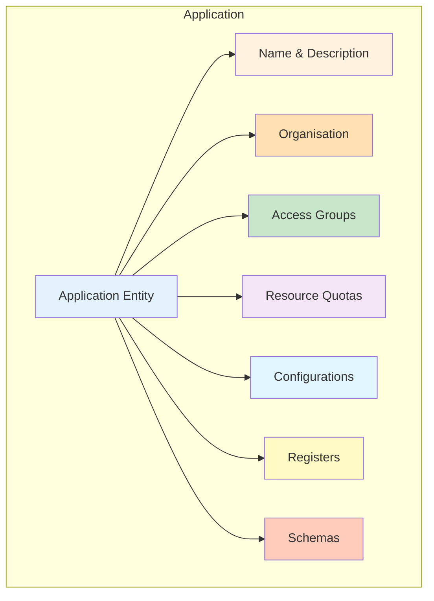
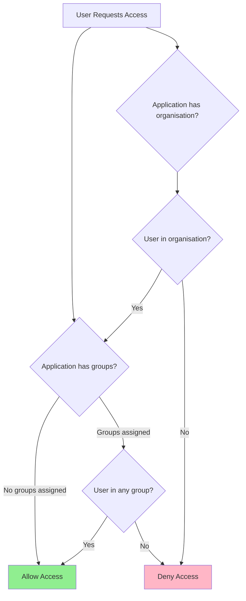
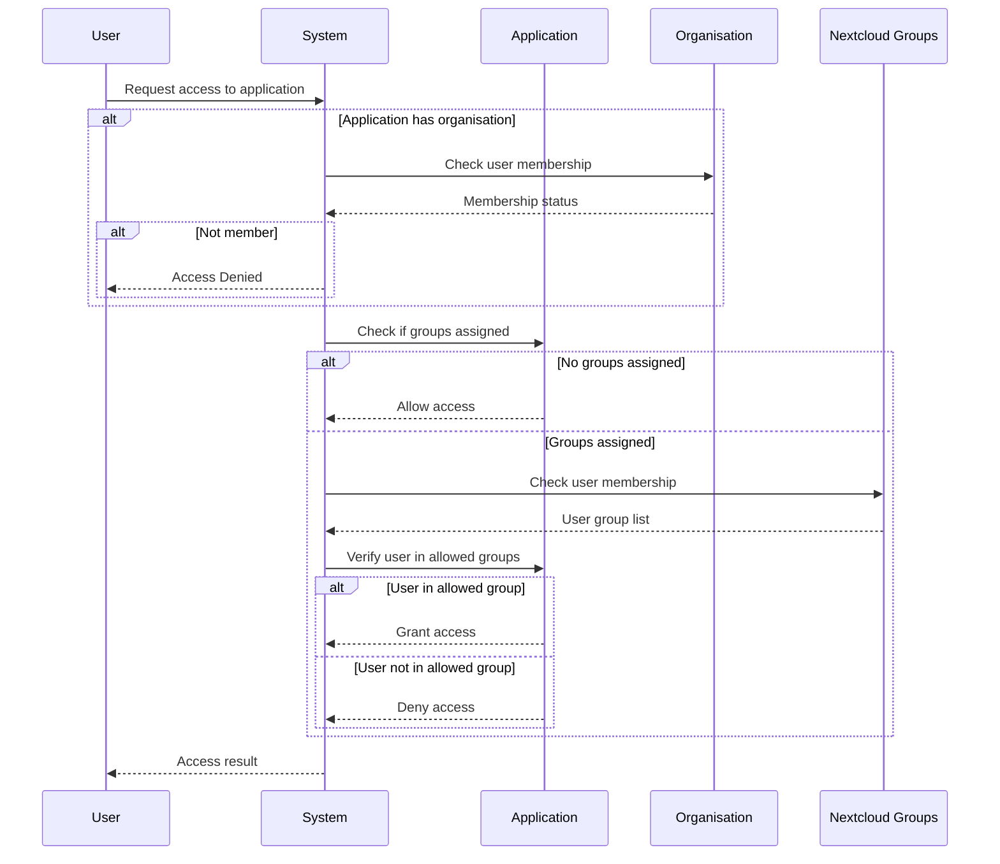

# Applications

Applications in OpenRegister represent software modules, systems, or logical groupings of functionality. They can be assigned to organisations and configured with group-based access control to manage who can use them.

## Overview

Applications provide a way to:
- **Package Functionality**: Group related configurations, registers, and schemas
- **Control Access**: Use Nextcloud groups to restrict who can access the application
- **Manage Resources**: Set storage, bandwidth, and API request quotas
- **Organise Structure**: Associate applications with organisations for better multi-tenancy



## Key Features

### Organisation Integration
- Applications can be assigned to organisations
- Inherit organisation-level access controls
- Support multi-tenant deployments

### Group-Based Access Control
- Restrict access using Nextcloud groups
- Multiple groups can be assigned
- Leave empty for open access to all users
- Integrates with Nextcloud's native group system

### Resource Management
- **Storage Quota**: Limit total storage per application (0 = unlimited)
- **Bandwidth Quota**: Monthly bandwidth limits (0 = unlimited)
- **API Request Quota**: Daily API request limits (0 = unlimited)

### Configuration Management
- Associate configurations with applications
- Link registers and schemas
- Package complete application functionality

## Creating an Application

### Via UI

1. Navigate to **Applications** in the OpenRegister app
2. Click **Create Application**
3. Fill in the application details in the modal:

#### Basic Information Tab
- **Name** (required): The application name
- **Description** (optional): Detailed description of what the application does
- **Organisation** (optional): Select which organisation owns this application
- **Nextcloud Groups**: Select which groups have access to this application

#### Resource Allocation Tab
- **Storage Quota (MB)**: Set storage limit (0 = unlimited)
- **Bandwidth Quota (MB/month)**: Set monthly bandwidth limit (0 = unlimited)
- **API Request Quota (requests/day)**: Set daily API request limit (0 = unlimited)

#### Security Tab
View and manage the list of Nextcloud groups that have access to this application

4. Click **Create** to save the application

### Via API

```bash
POST /index.php/apps/openregister/api/applications
Content-Type: application/json

{
  'name': 'Research Portal',
  'description': 'Application for research data management',
  'organisation': 1,
  'groups': [
    'researchers',
    'lab-managers'
  ],
  'storageQuota': 10737418240,  // 10GB in bytes
  'bandwidthQuota': 53687091200, // 50GB in bytes
  'requestQuota': 5000
}
```

## Managing Application Groups

### Group Assignment

Applications use Nextcloud groups to control access. Only users who belong to at least one of the assigned groups can access the application.

#### Adding Groups

1. Navigate to **Applications**
2. Click **Edit** on an application
3. **Basic Information Tab**: 
   - Use the 'Nextcloud Groups' multi-select dropdown
   - Select one or more groups
   - Groups are saved when you click Save
4. **Security Tab**: 
   - View the complete list of assigned groups
   - Remove individual groups with the X button

#### Group Access Logic



### How Application Access Works

1. **Organisation Check** (if application belongs to organisation):
   - User must be a member of the application's organisation
   - If not a member → access denied

2. **Group Check**:
   - If no groups assigned → all authorised users have access
   - If groups assigned → user must belong to at least one group
   - System administrators bypass group checks

3. **Resource Quotas**:
   - Check if application is within quota limits
   - Deny operations that would exceed quotas



## Editing an Application

1. Navigate to **Applications**
2. Find the application to edit
3. Click **Actions** → **Edit**
4. Modify any of the tabs:
   - Basic Information (name, description, organisation, groups)
   - Resource Allocation (quotas)
   - Security (view/remove groups)
5. Click **Save** to apply changes

## Deleting an Application

1. Navigate to **Applications**
2. Click **Actions** → **Delete**
3. Confirm the deletion
4. The application is permanently removed

**Note**: Deleting an application does not delete associated configurations, registers, schemas, or objects.

## Application Properties

### Database Schema

The Application entity includes these fields:

| Field | Type | Description |
|-------|------|-------------|
| 'uuid' | VARCHAR(255) | Unique identifier |
| 'name' | VARCHAR(255) | Application name (required) |
| 'description' | TEXT | Detailed description |
| 'version' | VARCHAR(50) | Application version |
| 'organisation' | INTEGER | Organisation ID (nullable) |
| 'groups' | JSON | Array of Nextcloud group definitions |
| 'configurations' | JSON | Array of configuration IDs |
| 'registers' | JSON | Array of register IDs |
| 'schemas' | JSON | Array of schema IDs |
| 'owner' | VARCHAR(255) | User who created the application |
| 'active' | BOOLEAN | Whether the application is active |
| 'storage_quota' | BIGINT | Storage limit in bytes (NULL = unlimited) |
| 'bandwidth_quota' | BIGINT | Monthly bandwidth in bytes (NULL = unlimited) |
| 'request_quota' | INTEGER | Daily API requests (NULL = unlimited) |
| 'created' | DATETIME | Creation timestamp |
| 'updated' | DATETIME | Last update timestamp |

### Groups JSON Structure

Groups are stored as a simple array of group ID strings:

```json
{
  'groups': [
    'group-id-1',
    'group-id-2',
    'group-id-3'
  ]
}
```

Example:

```json
{
  'groups': [
    'engineers',
    'managers',
    'developers'
  ]
}
```

## Use Cases

### Department Application

```
Application: 'Engineering Tools'
Organisation: Engineering Department
Groups:
  - 'engineers' (50 users) - Full access to engineering tools
  - 'engineering-managers' (5 users) - Administrative access
  - 'interns' (10 users) - Read-only access
Resource Quotas:
  - Storage: 50 GB
  - Bandwidth: 200 GB/month
  - API Requests: 25,000/day
```

### Project-Based Application

```
Application: 'Website Redesign Project'
Organisation: Marketing Department
Groups:
  - 'designers' (8 users) - Design tool access
  - 'developers' (12 users) - Development tool access
  - 'project-managers' (2 users) - Full project oversight
Resource Quotas:
  - Storage: 30 GB
  - Bandwidth: 100 GB/month
  - API Requests: 10,000/day
```

### Client Application

```
Application: 'Client Portal: Acme Corp'
Organisation: Acme Corp
Groups:
  - 'acme-admins' (3 users) - Client administrators
  - 'acme-users' (100 users) - Regular client users
  - 'support-staff' (10 users) - Internal support team
Resource Quotas:
  - Storage: 200 GB
  - Bandwidth: 500 GB/month
  - API Requests: 50,000/day
```

### Open Application

```
Application: 'Company Directory'
Organisation: (none)
Groups: (empty)
Access: All authenticated users can access
Resource Quotas:
  - Storage: Unlimited
  - Bandwidth: Unlimited
  - API Requests: Unlimited
```

## Access Control Combinations

Applications support various access control patterns:

| Organisation | Groups | Result |
|--------------|--------|--------|
| None | None | All authenticated users |
| None | Assigned | Users in any assigned group |
| Assigned | None | All organisation members |
| Assigned | Assigned | Organisation members in assigned groups |

## Best Practices

### Naming and Organisation
- Use descriptive application names
- Group related functionality in a single application
- Assign applications to organisations for better structure
- Document the application's purpose in the description

### Group Management
- ✅ Use descriptive Nextcloud group names ('marketing-editors' not 'group1')
- ✅ Start with specific groups assigned, not open to all
- ✅ Combine with organisation assignment for layered access control
- ✅ Regularly audit group membership
- ❌ Don't mix unrelated permissions in a single group
- ❌ Don't leave sensitive applications open to all users

### Resource Quotas
- Set realistic quotas based on expected usage
- Monitor quota usage regularly
- Use 0 for unlimited where appropriate
- Consider application complexity when setting quotas

### Security
- Only assign necessary groups to each application
- Regularly review and update group assignments
- Use the Security tab to audit current access
- Combine organisation and group restrictions for sensitive applications
- Remove inactive users from groups promptly

## API Reference

### List Applications

```bash
GET /index.php/apps/openregister/api/applications
```

### Get Application

```bash
GET /index.php/apps/openregister/api/applications/{uuid}
```

### Create Application

```bash
POST /index.php/apps/openregister/api/applications
Content-Type: application/json

{
  'name': 'My Application',
  'description': 'Application description',
  'organisation': 1,
  'groups': [
    'group-1',
    'group-2'
  ]
}
```

### Update Application

```bash
PUT /index.php/apps/openregister/api/applications/{uuid}
Content-Type: application/json

{
  'name': 'Updated Name',
  'groups': [
    'group-1',
    'group-2',
    'group-3'
  ]
}
```

### Delete Application

```bash
DELETE /index.php/apps/openregister/api/applications/{uuid}
```

## Troubleshooting

### Cannot Create Application

**Problem**: Create button is disabled

**Solution**: Ensure the name field is filled in - it's required.

### Groups Not Appearing

**Problem**: Group dropdown is empty

**Solutions**:
1. Verify Nextcloud groups exist: Settings → Users → Groups
2. Check OCS API access: 'curl -u admin:password http://nextcloud/ocs/v1.php/cloud/groups?format=json'
3. Review browser console for errors

### Groups Not Saving

**Problem**: Selected groups are not persisted

**Solutions**:
1. Verify you clicked Save (not just closed the modal)
2. Check browser console for API errors
3. Ensure you have write permissions for applications
4. Check database column exists: 'SHOW COLUMNS FROM oc_openregister_applications LIKE (groups)'
5. Run migrations: 'php occ migrations:migrate openregister'

### Access Denied Despite Group Membership

**Problem**: User is in the assigned group but cannot access

**Solutions**:
1. Verify user is in the group: Settings → Users → search user
2. Check if application belongs to an organisation and user is a member
3. Check if application is active
4. Clear user session and login again
5. Review server logs for detailed errors

### Resource Quota Exceeded

**Problem**: Cannot perform operations due to quota limits

**Solutions**:
1. Check current usage in application details
2. Request quota increase from administrator
3. Clean up unused objects and files
4. Archive old data

## PHP API Examples

### Create Application with Groups

```php
use OCA\OpenRegister\Service\ApplicationService;

$application = $applicationService->createApplication(
    'Research Portal',
    'Application for research data management'
);

// Assign groups (just the IDs)
$application->setGroups([
    'researchers',
    'lab-managers'
]);

// Assign to organisation
$application->setOrganisation(1);

// Set quotas
$application->setStorageQuota(10737418240);  // 10GB
$application->setBandwidthQuota(53687091200); // 50GB
$application->setRequestQuota(5000);          // 5k requests/day

$applicationMapper->update($application);
```

### Check User Access

```php
// Check if user can access application
$hasAccess = $applicationService->userHasAccess($application, $userId);

if ($hasAccess) {
    // Allow access to application
} else {
    // Deny access
}
```

### Get User's Accessible Applications

```php
// Get all applications the user can access
$applications = $applicationService->getUserApplications($userId);
```

## Integration with Other Features

### With Organisations
- Applications can belong to organisations
- Organisation membership is checked first
- Groups provide additional layer of access control within organisation

### With Configurations
- Applications can have multiple configurations
- Configurations package registers and schemas for the application
- Export/import applications with their configurations

### With RBAC
- Application access control works alongside schema-level RBAC
- Users must pass both application and schema access checks
- Provides granular control at multiple levels

## Related Documentation

- [Organisations](organisations.md) - Organisation management
- [Configurations](configurations.md) - Configuration management
- [Access Control](access-control.md) - RBAC and security
- [Multi-Tenancy](multi-tenancy.md) - Multi-tenancy system
- [Organisation Roles](../features/organisation-roles.md) - Detailed RBAC documentation
- [Nextcloud Groups](https://docs.nextcloud.com/server/latest/admin_manual/configuration_user/user_configuration.html)

