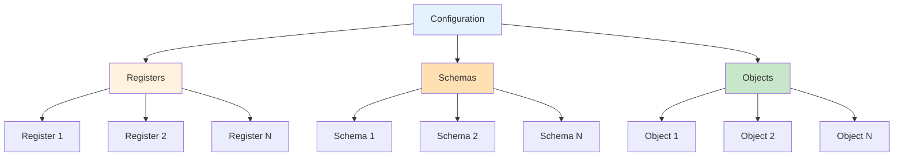
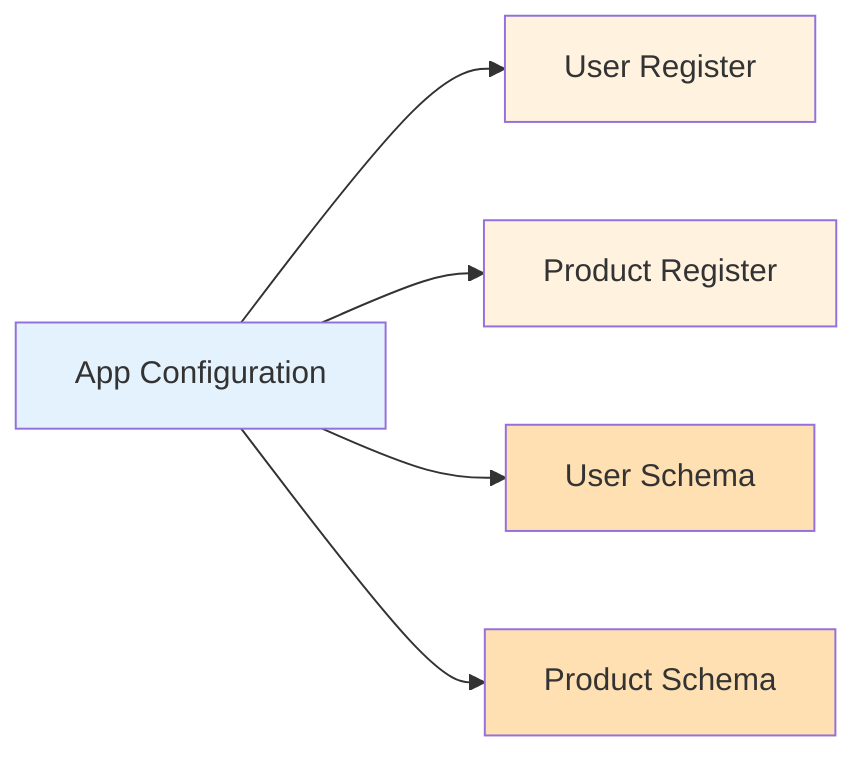
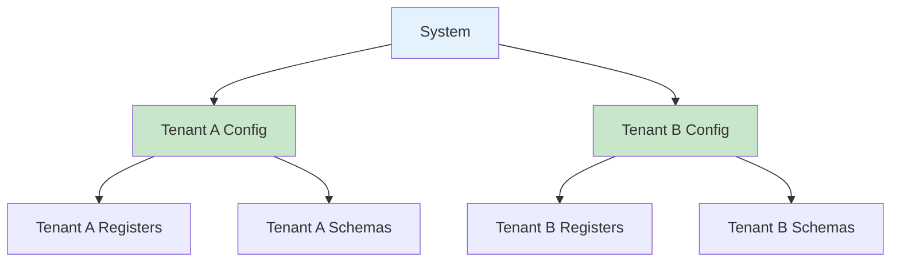
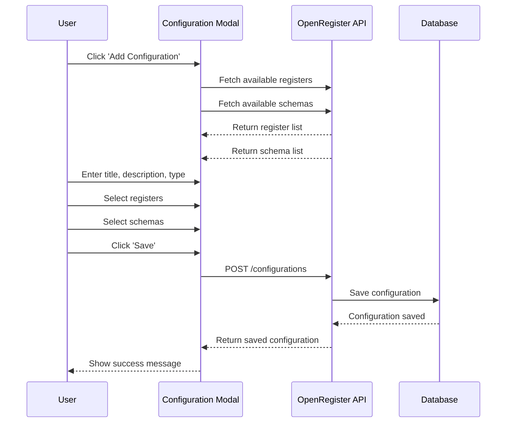
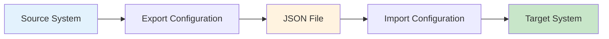
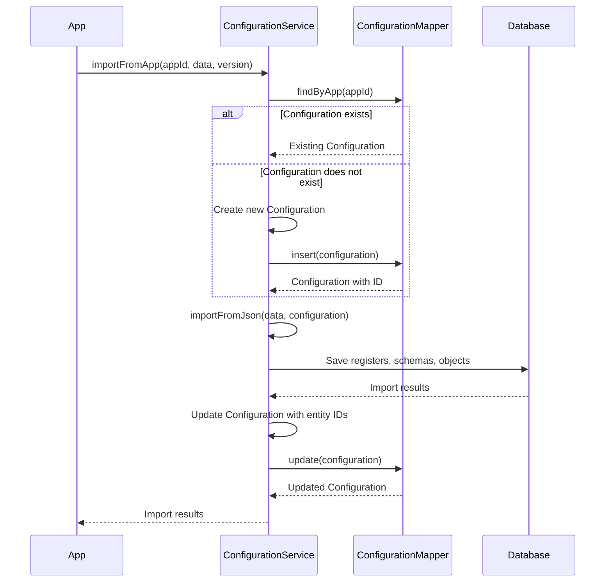
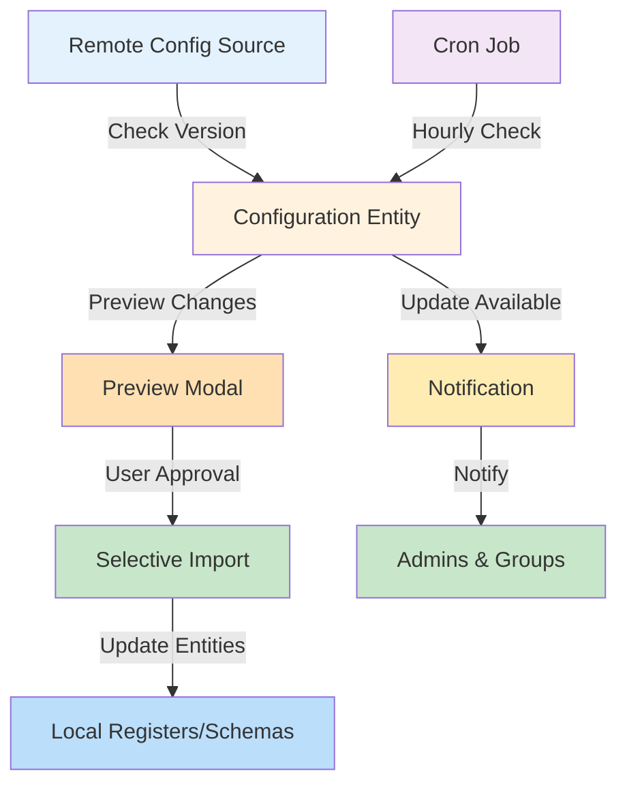
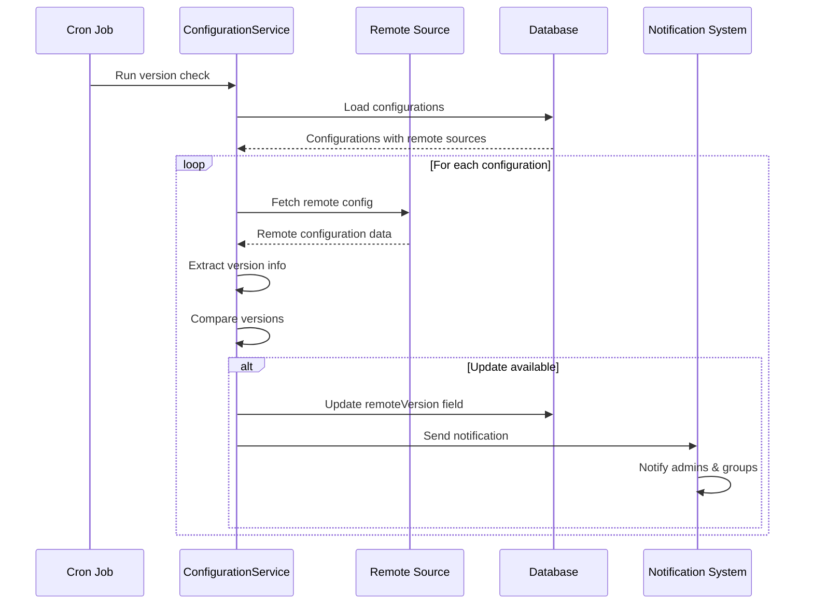
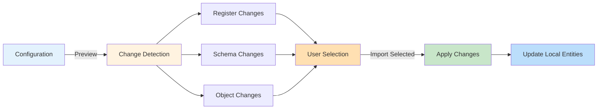
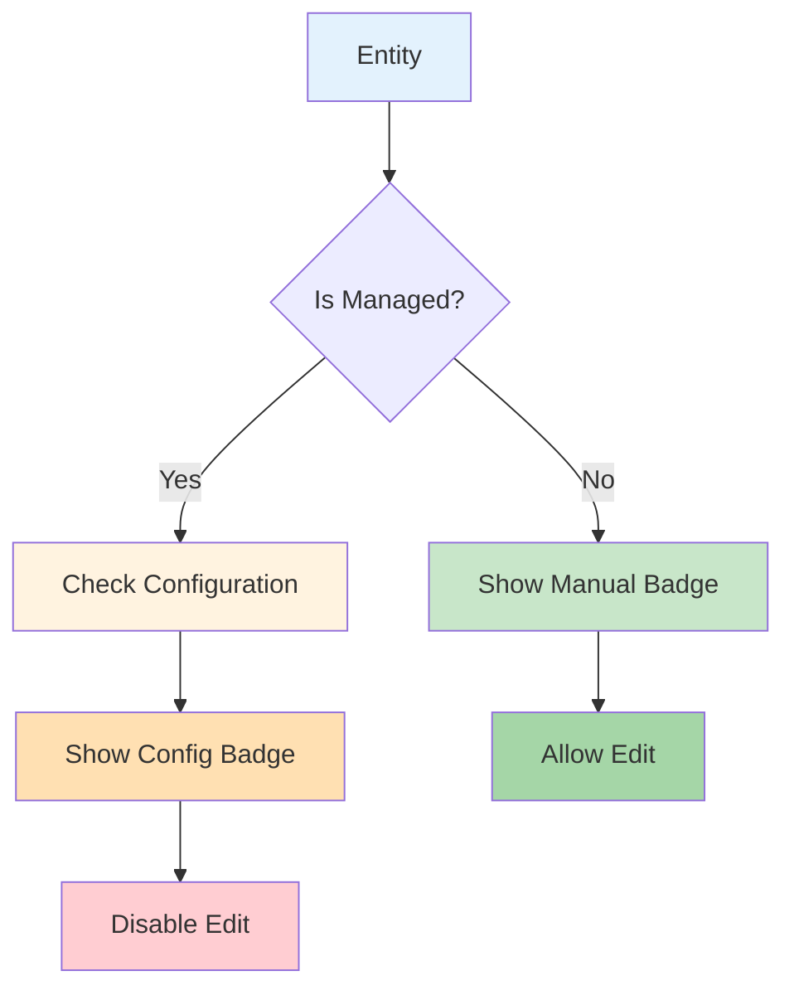

# Configurations

Configurations in OpenRegister allow you to package and manage related registers, schemas, and objects together as a coherent unit. This feature is particularly useful for multi-tenancy, application packaging, and organizing complex data structures.

## Overview

A Configuration is a container that groups together:
- **Registers**: Collections of objects that share similar characteristics
- **Schemas**: Data structure definitions that define object properties
- **Objects**: Individual data items (optional)



## Key Concepts

### Configuration Properties

Each configuration has the following properties:

- **Title**: A human-readable name for the configuration
- **Description**: Detailed description of what the configuration contains
- **Type**: The type or category of the configuration (e.g., 'application', 'tenant', 'module')
- **Owner/App**: The application or owner identifier
- **Registers**: Array of register IDs that are part of this configuration
- **Schemas**: Array of schema IDs that are part of this configuration
- **Objects**: Array of object IDs that are part of this configuration (optional)
- **Version**: Configuration version for tracking changes
- **Created/Updated**: Timestamps for auditing

## Use Cases

### Application Packaging

Package all registers and schemas for a specific application:



### Multi-Tenancy

Create separate configurations for different tenants:



### Module Organization

Group related functionality into logical modules:

- **Core Module**: Base registers and schemas
- **Customer Module**: Customer-related data structures
- **Product Module**: Product catalog structures
- **Order Module**: Order processing structures

## Creating a Configuration

### Step 1: Navigate to Configurations

1. Log in to your Nextcloud instance
2. Navigate to the OpenRegister app
3. Click on **Configurations** in the left sidebar

### Step 2: Add New Configuration

1. Click the **Add Configuration** button
2. Fill in the configuration details:
   - **Title**: Give your configuration a meaningful name
   - **Description**: Describe what this configuration contains
   - **Type**: Specify the configuration type (e.g., 'application', 'tenant')

### Step 3: Select Registers and Schemas

1. **Select Registers**: 
   - Click on the Registers dropdown
   - Select multiple registers that should be part of this configuration
   - The count of selected registers is displayed below the selector

2. **Select Schemas**:
   - Click on the Schemas dropdown
   - Select multiple schemas that should be part of this configuration
   - The count of selected schemas is displayed below the selector



### Step 4: Save the Configuration

1. Review your selections
2. Click the **Save** button
3. The configuration is created and added to the list

## Editing a Configuration

### Modifying Configuration Details

1. Navigate to the Configurations page
2. Find the configuration you want to edit
3. Click the **Actions** menu (three dots)
4. Select **Edit**
5. Modify the fields as needed:
   - Update title, description, or type
   - Add or remove registers
   - Add or remove schemas
6. Click **Save** to apply changes

### Managing Associations

You can dynamically manage which registers and schemas are associated with a configuration:

- **Add new associations**: Select additional items from the dropdowns
- **Remove associations**: Deselect items from the dropdowns
- **View current associations**: The modal shows all currently selected items

## Viewing Configurations

### Card View

The card view displays configurations as cards showing:
- Configuration title
- Description
- Type
- Owner/App
- Count of associated items (registers, schemas, objects)

### Table View

The table view shows configurations in a tabular format with columns:
- Title
- Type
- Owner
- Config Keys count
- Created date
- Updated date
- Actions

Switch between views using the **Cards** / **Table** toggle buttons.

## Exporting and Importing Configurations

### Exporting

1. Select a configuration
2. Click **Actions** → **Export**
3. The configuration (including its registers, schemas, and optionally objects) is exported as JSON
4. Use this for:
   - Backup and restore
   - Moving configurations between environments
   - Sharing configurations with other installations

### Importing

1. Click **Import Configuration**
2. Select a configuration JSON file
3. Choose whether to include objects
4. The configuration and its associated items are imported



## Programmatic Configuration Import for Apps

Apps can programmatically import their configurations using the ConfigurationService without needing to manually create Configuration entities. This is useful for:

- App initialization and setup
- Automatic configuration deployment
- Version-based configuration updates
- Bundling configurations with app releases

### Using importFromApp

The `importFromApp` method provides a simplified way for apps to import their configuration data:

```php
// Get the configuration service
$configurationService = $this->container->get('OCA\OpenRegister\Service\ConfigurationService');

// Load your configuration data (from JSON file, array, etc.)
$configData = json_decode(file_get_contents('path/to/config.json'), true);

// Import the configuration
$result = $configurationService->importFromApp(
    appId: 'myapp',           // Your app ID
    data: $configData,        // Configuration data array
    version: '1.0.0',         // Version string
    force: false              // Force import even if version is not newer
);

// Result contains imported entities
// $result['registers'] - Array of imported Register entities
// $result['schemas'] - Array of imported Schema entities  
// $result['objects'] - Array of imported Object entities
```

### How It Works

The `importFromApp` method automatically:

1. **Finds or Creates Configuration Entity**: Checks if a Configuration entity exists for your app ID. If not, creates one.
2. **Handles Version Checking**: Compares versions and skips import if the same or older version is already installed (unless force=true).
3. **Tracks Imported Entities**: Associates all imported registers, schemas, and objects with the Configuration entity.
4. **Updates Configuration**: Merges new entity IDs with existing ones on subsequent imports.



### Example: App Installation Hook

Use this in your app's installation or upgrade hooks:

```php
namespace OCA\MyApp\Migration;

use OCP\Migration\IOutput;
use OCP\Migration\IRepairStep;
use Psr\Container\ContainerInterface;

class InstallConfiguration implements IRepairStep {
    
    private ContainerInterface $container;
    
    public function __construct(ContainerInterface $container) {
        $this->container = $container;
    }
    
    public function getName(): string {
        return 'Install MyApp configuration';
    }
    
    public function run(IOutput $output): void {
        try {
            // Get configuration service
            $configService = $this->container->get(
                'OCA\OpenRegister\Service\ConfigurationService'
            );
            
            // Load configuration from bundled JSON file
            $configPath = __DIR__ . '/../Settings/configuration.json';
            $configData = json_decode(file_get_contents($configPath), true);
            
            // Import configuration
            $result = $configService->importFromApp(
                appId: 'myapp',
                data: $configData,
                version: '1.0.0',
                force: false
            );
            
            $output->info(sprintf(
                'Configuration imported: %d registers, %d schemas, %d objects',
                count($result['registers']),
                count($result['schemas']),
                count($result['objects'])
            ));
            
        } catch (\Exception $e) {
            $output->warning('Failed to import configuration: ' . $e->getMessage());
        }
    }
}
```

### Example: Version-Based Updates

Update configurations only when app version increases:

```php
// In your app's upgrade logic
$appManager = \OC::$server->getAppManager();
$currentVersion = $appManager->getAppVersion('myapp');

$configService = $this->container->get('OCA\OpenRegister\Service\ConfigurationService');

// Check if update is needed
$storedVersion = $configService->getConfiguredAppVersion('myapp');

if ($storedVersion === null || version_compare($currentVersion, $storedVersion, '>')) {
    // Load updated configuration
    $configData = $this->loadConfiguration();
    
    // Import with app version
    $result = $configService->importFromApp(
        appId: 'myapp',
        data: $configData,
        version: $currentVersion,
        force: false
    );
    
    // Configuration is now at the current app version
}
```

### Configuration Data Format

Your configuration data should follow the OpenAPI 3.0 specification with OpenRegister-specific metadata stored in the `x-openregister` extension field following the [OpenAPI Extensions specification](https://swagger.io/docs/specification/v3_0/openapi-extensions/).

```json
{
  "openapi": "3.0.0",
  "info": {
    "title": "MyApp Configuration",
    "description": "Default configuration for MyApp",
    "version": "1.0.0"
  },
  "x-openregister": {
    "title": "MyApp Configuration",
    "description": "Default configuration for MyApp",
    "type": "app",
    "app": "myapp",
    "version": "1.0.0",
    "sourceType": "local",
    "sourceUrl": null,
    "githubRepo": null,
    "githubBranch": null,
    "githubPath": null
  },
  "components": {
    "registers": {
      "myregister": {
        "title": "My Register",
        "slug": "myregister",
        "description": "Application data register",
        "version": "1.0.0",
        "schemas": ["myschema"]
      }
    },
    "schemas": {
      "myschema": {
        "title": "My Schema",
        "slug": "myschema",
        "version": "1.0.0",
        "type": "object",
        "properties": {
          "name": {
            "type": "string",
            "title": "Name"
          },
          "description": {
            "type": "string",
            "title": "Description"
          }
        },
        "required": ["name"]
      }
    }
  }
}
```

#### x-openregister Extension

The `x-openregister` extension contains OpenRegister-specific metadata following the OpenAPI Extensions specification. This extension is used to store configuration properties that are not part of the standard OpenAPI specification.

**Properties in x-openregister:**

- `title`: Configuration title
- `description`: Configuration description
- `type`: Type of configuration (e.g., 'app', 'imported', 'manual')
- `app`: Application identifier
- `version`: Configuration version
- `sourceType`: Source type ('local', 'github', 'gitlab', 'url', 'manual')
- `sourceUrl`: URL to remote configuration source (if applicable)
- `githubRepo`: GitHub repository (format: 'owner/repo')
- `githubBranch`: GitHub branch name
- `githubPath`: Path within GitHub repository

**Properties excluded from export/import:**

The following internal properties are managed automatically by the system and are NOT included in configuration exports or processed during imports:

**System-managed metadata:**
- `id`: Internal database ID
- `uuid`: Internal UUID
- `created`: Creation timestamp
- `updated`: Last update timestamp
- `lastChecked`: Last version check timestamp
- `remoteVersion`: Remote version (auto-detected)
- `localVersion`: Local version (auto-updated)

**Instance-specific settings:**
- `autoUpdate`: Whether to automatically update (instance-specific preference)
- `notificationGroups`: Groups to notify on updates (instance-specific)
- `owner`: Owner user ID (instance-specific)
- `organisation`: Organisation UUID (instance-specific, may not exist in target instance)

**Entity references (tracked automatically during import):**
- `registers`: Array of register IDs (built from components.registers)
- `schemas`: Array of schema IDs (built from components.schemas)
- `objects`: Array of object IDs (built from components.objects)
- `views`: Array of view IDs (tracked automatically)
- `agents`: Array of agent IDs (tracked automatically)
- `sources`: Array of source IDs (tracked automatically)
- `applications`: Array of application IDs (tracked automatically)

**Minimal Configuration Example:**

For simple use cases, you only need to include the essential fields:

```json
{
  "openapi": "3.0.0",
  "info": {
    "title": "MyApp Configuration",
    "version": "1.0.0"
  },
  "x-openregister": {
    "type": "app",
    "app": "myapp",
    "version": "1.0.0"
  },
  "components": {
    "registers": {},
    "schemas": {}
  }
}
```

### Best Practices

#### Configuration Files

- Store configuration in `Settings/` or `Config/` directory within your app
- Use semantic versioning for your configuration
- Include metadata (appId, version, title, description) in the JSON

#### Version Management

- Set version to match your app version
- Increment configuration version with app updates
- Use `force: false` to respect version checks
- Only use `force: true` during development or explicit reinstalls

#### Error Handling

- Wrap imports in try-catch blocks
- Log errors appropriately
- Provide meaningful error messages to admins
- Consider fallback behavior if import fails

#### Testing

- Test configuration imports in development environment first
- Verify all registers, schemas, and objects are created correctly
- Test upgrade scenarios (version updates)
- Test fresh install scenarios

## Configuration API

### List Configurations

```http
GET /index.php/apps/openregister/api/configurations
```

### Get Single Configuration

```http
GET /index.php/apps/openregister/api/configurations/{id}
```

### Create Configuration

```http
POST /index.php/apps/openregister/api/configurations
Content-Type: application/json

{
  "title": "My Application",
  "description": "Core application configuration",
  "type": "application",
  "registers": [1, 2, 3],
  "schemas": [4, 5, 6]
}
```

### Update Configuration

```http
PUT /index.php/apps/openregister/api/configurations/{id}
Content-Type: application/json

{
  "title": "Updated Application",
  "description": "Updated description",
  "registers": [1, 2, 3, 7],
  "schemas": [4, 5, 6, 8]
}
```

### Delete Configuration

```http
DELETE /index.php/apps/openregister/api/configurations/{id}
```

## Data Structure

### Configuration Entity

```typescript
{
  id: string
  title: string
  description: string | null
  type: string
  owner: string
  registers: number[]  // Array of register IDs
  schemas: number[]    // Array of schema IDs
  objects: number[]    // Array of object IDs (optional)
  created: string      // ISO 8601 timestamp
  updated: string      // ISO 8601 timestamp
}
```

### Database Schema

The configuration is stored in the 'oc_openregister_configurations' table with the following fields:

- 'id': Primary key (integer)
- 'title': Configuration name (string)
- 'description': Detailed description (text, nullable)
- 'type': Configuration type (string)
- 'app': Owner/app identifier (string)
- 'version': Configuration version (string)
- 'registers': JSON array of register IDs
- 'schemas': JSON array of schema IDs
- 'objects': JSON array of object IDs
- 'created': Creation timestamp (datetime)
- 'updated': Last update timestamp (datetime)

## Best Practices

### Naming Conventions

- Use descriptive titles that clearly indicate the configuration's purpose
- Include the application or tenant name in the title when applicable
- Use consistent type values across your system (e.g., always use 'application', not 'app' or 'Application')

### Organization

- Create configurations for logical groupings of functionality
- Keep configurations focused - don't mix unrelated registers and schemas
- Use configurations to enforce multi-tenancy boundaries
- Document the purpose of each configuration in the description field

### Version Management

- The system automatically increments the patch version on each update
- Major and minor version changes should be managed manually when needed
- Export configurations before making major structural changes

### Multi-Tenancy

- Create separate configurations for each tenant
- Never share registers or schemas between tenant configurations
- Use the owner/app field to identify the tenant
- Export/import configurations to provision new tenants

## Troubleshooting

### Cannot Save Configuration

**Problem**: Save button is disabled

**Solution**: Ensure both title and type fields are filled in. These are required fields.

### Registers/Schemas Not Showing in Dropdown

**Problem**: No items appear in the register or schema selector

**Solution**: 
- Ensure you have created registers and schemas in the system
- Refresh the page to reload the data
- Check that you have the necessary permissions to view registers and schemas

### Changes Not Persisting

**Problem**: Selected registers or schemas are not saved

**Solution**:
- Verify that you clicked the Save button (not just closed the modal)
- Check browser console for any API errors
- Ensure you have write permissions for configurations
- Try refreshing the page and editing again

### Import Fails

**Problem**: Configuration import returns an error

**Solution**:
- Verify the JSON file format is correct
- Ensure referenced registers and schemas exist or will be created
- Check for ID conflicts if importing into a system with existing data
- Review server logs for detailed error messages

## Related Features

- [Registers](registers.md) - Learn about register management
- [Schemas](schemas.md) - Learn about schema definitions
- [Objects](objects.md) - Learn about object management
- [Import/Export](../technical/import-export.md) - Detailed import/export documentation
- [Multi-Tenancy](multi-tenancy.md) - Multi-tenancy implementation details

## Configuration Management System

The Configuration Management System provides advanced features for managing configurations from remote sources, tracking versions, and keeping configurations synchronized.

### Overview

The configuration management system allows you to:

- Link configurations to remote sources (GitHub, GitLab, URL)
- Track local and remote versions automatically
- Preview changes before importing
- Selectively import only the changes you want
- Set up automatic updates when new versions are detected
- Receive Nextcloud notifications when updates are available
- Push local configurations to GitHub repositories



### Source Types

Configurations can be managed from different source types:

#### Local Source

A locally managed configuration that is not synchronized with any remote source. This is the default type and is suitable for:

- Custom configurations specific to your installation
- Configurations used for exporting to other systems
- Development and testing purposes

#### GitHub Source

Configuration synchronized with a GitHub repository. Requires:

- A GitHub Personal Access Token (configured in user settings)
- Repository name in format 'owner/repo'
- Branch name (e.g., 'main', 'develop')
- File path within the repository

#### GitLab Source

Configuration synchronized with a GitLab repository. Works similarly to GitHub with GitLab-specific authentication.

#### URL Source

Configuration fetched from any publicly accessible URL. The URL should point to a raw JSON or YAML configuration file.

### Version Tracking

The system tracks two version numbers for each configuration:

#### Local Version

The version currently installed in your system. This is updated automatically when you:

- Import a configuration
- Make manual changes to managed entities
- Apply updates from a remote source

#### Remote Version

The latest version available from the remote source. The system:

- Checks this automatically via the cron job
- Compares it with the local version using semantic versioning
- Shows an update notification if a newer version is available



### Previewing Configuration Changes

Before importing or updating a configuration, you can preview all changes that will be applied:

#### Preview Modal Features

The preview modal shows:

1. **Summary Information**
   - Configuration title and description
   - Local and remote version numbers
   - Total number of changes

2. **Change Details by Entity Type**
   - Registers: What will be created or updated
   - Schemas: What will be created or updated
   - Objects: What will be created or updated

3. **Action Indicators**
   - **Create**: New entity will be created
   - **Update**: Existing entity will be modified
   - **Skip**: No changes detected

4. **Version Comparison**
   - Current version of each entity
   - Proposed version from remote configuration

5. **Field-Level Differences**
   - Shows exactly which fields will change
   - Displays old and new values
   - Highlights additions and deletions

#### Selective Import

You can choose which changes to apply:

- **Select All** button: Selects all proposed changes
- **Deselect All** button: Clears all selections
- **Individual Selection**: Check/uncheck specific entities
- **Import Selected** button: Applies only the selected changes



### Auto-Update Functionality

Configurations can be set to automatically update when new versions are detected:

#### Enabling Auto-Update

1. Edit the configuration
2. Navigate to the **Management** tab
3. Check **Enable Auto-Update**
4. Save the configuration

When auto-update is enabled:

- The cron job checks for updates hourly
- If a newer version is found, it is automatically imported
- All changes are applied without requiring user approval
- No preview or selection is performed
- Admins are notified after the update completes

**Important**: Use auto-update only for trusted sources where you want all changes applied automatically.

### Notification System

The system can notify users when configuration updates are available:

#### Notification Groups

Configure which groups receive notifications:

1. **Admin Group** (always included): System administrators
2. **Custom Groups**: Add any Nextcloud groups

#### Notification Behavior

- Notifications are sent when a newer remote version is detected
- Auto-update configurations bypass the notification (update happens automatically)
- Clicking a notification takes you to the configuration preview
- Notifications are dismissed once the update is applied

### Managed Entities

Entities (Registers, Schemas, Objects) that are created from a configuration are marked as **managed**:

#### Restrictions on Managed Entities

- Cannot be edited directly through their detail pages
- Edit buttons are disabled in the UI
- API attempts to modify them return an error
- Only the configuration that manages them can update them

#### Identifying Managed Entities

Managed entities display a pill badge showing:

- **Configuration Name**: Which configuration manages the entity
- **Version**: The current version from that configuration

Entities without a configuration show a **Manual** badge, indicating they can be edited freely.



### GitHub Integration

The system provides deep integration with GitHub for configuration management:

#### Push to GitHub

Export your configuration directly to a GitHub repository:

1. Navigate to the configuration detail page
2. Click **Actions** → **Push to GitHub**
3. The configuration is committed to the configured repository

Requirements:

- GitHub Personal Access Token set in user settings
- Repository, branch, and path configured in the configuration
- Write access to the target repository

#### Create Pull Request

Create a pull request for your configuration changes:

1. Make changes to a configuration
2. Click **Actions** → **Create Pull Request**
3. A new PR is created in the configured repository

This allows for review workflows before changes are merged.

### Configuration Management Tab

The configuration edit modal includes a **Management** tab with these fields:

#### Source Settings

- **Source Type**: Choose from Local, GitHub, GitLab, or URL
- **Source URL**: The URL to the remote configuration file (for remote types)

#### Version Settings

- **Local Version**: The currently installed version (editable)
- **Remote Version**: Latest version from remote source (read-only, auto-detected)

#### Update Settings

- **Enable Auto-Update**: Checkbox to enable automatic updates
- **Notification Groups**: Select which groups receive update notifications

#### GitHub Settings (when Source Type is GitHub)

- **GitHub Repository**: Format 'owner/repo'
- **GitHub Branch**: The branch to use (default: 'main')
- **GitHub Path**: Path to the configuration file within the repository

### API Endpoints

#### Check Remote Version

```http
GET /index.php/apps/openregister/api/configurations/{id}/check-version
```

Checks the remote source for a newer version and updates the 'remoteVersion' field.

Response:

```json
{
  'localVersion': '1.0.0',
  'remoteVersion': '1.1.0',
  'hasUpdate': true,
  'lastChecked': '2025-01-15T10:30:00Z'
}
```

#### Preview Configuration Changes

```http
GET /index.php/apps/openregister/api/configurations/{id}/preview
```

Generates a preview of changes that would be applied if the remote configuration were imported.

Response:

```json
{
  'metadata': {
    'localVersion': '1.0.0',
    'remoteVersion': '1.1.0',
    'totalChanges': 5
  },
  'registers': [
    {
      'slug': 'myregister',
      'title': 'My Register',
      'action': 'update',
      'current': { 'version': '1.0.0' },
      'proposed': { 'version': '1.1.0' },
      'changes': [
        {
          'field': 'description',
          'current': 'Old description',
          'proposed': 'New description'
        }
      ]
    }
  ],
  'schemas': [...],
  'objects': [...]
}
```

#### Import with Selection

```http
POST /index.php/apps/openregister/api/configurations/{id}/import
Content-Type: application/json

{
  'selection': {
    'registers': ['register1', 'register2'],
    'schemas': ['schema1'],
    'objects': ['register1:schema1:object1']
  }
}
```

Imports only the selected entities from the remote configuration.

Response:

```json
{
  'registersCount': 2,
  'schemasCount': 1,
  'objectsCount': 1,
  'localVersion': '1.1.0'
}
```

#### Export Configuration

```http
GET /index.php/apps/openregister/api/configurations/{id}/export?format=json
```

Exports the configuration with all managed entities following the OpenAPI 3.0 specification with OpenRegister metadata in the `x-openregister` extension.

Query Parameters:

- 'format': 'json' or 'yaml'
- 'includeObjects': 'true' or 'false' (default: false)

Response Structure:

```json
{
  "openapi": "3.0.0",
  "info": {
    "title": "Configuration Title",
    "description": "Configuration Description",
    "version": "1.0.0"
  },
  "x-openregister": {
    "title": "Configuration Title",
    "description": "Configuration Description",
    "type": "app",
    "app": "myapp",
    "version": "1.0.0",
    "sourceType": "local",
    "sourceUrl": null,
    "githubRepo": null,
    "githubBranch": null,
    "githubPath": null
  },
  "components": {
    "registers": {},
    "schemas": {},
    "objects": []
  }
}
```

**Note**: The exported configuration follows the [OpenAPI Extensions specification](https://swagger.io/docs/specification/v3_0/openapi-extensions/) by storing OpenRegister-specific metadata in the `x-openregister` extension field. 

**Excluded properties**: 
- **From Configuration**: System-managed metadata (id, uuid, created, updated, lastChecked, remoteVersion, localVersion), instance-specific settings (autoUpdate, notificationGroups, owner, organisation), and entity reference arrays (registers, schemas, objects, views, agents, sources, applications)
- **From Registers/Schemas/Objects**: id, uuid, organisation (all instance-specific)
- Entity references are tracked automatically during import from the `components` section

### Background Jobs

The system includes a cron job that runs hourly (configurable):

#### Configuration Check Job

Purpose: Check all remote configurations for updates

Behavior:

1. Loads all configurations with remote sources
2. For each configuration, fetches the remote file
3. Compares remote version with local version
4. If auto-update is enabled: Automatically imports the new version
5. If auto-update is disabled: Sends notification to configured groups
6. Updates the 'lastChecked' timestamp

Configuration:

Set the check interval in Nextcloud admin settings (in seconds, 0 to disable):

```php
'openregister.configuration.check_interval' => 3600  // 1 hour
```

### Best Practices

#### Version Management

- Use semantic versioning (MAJOR.MINOR.PATCH)
- Increment PATCH for bug fixes and minor changes
- Increment MINOR for new features (backward compatible)
- Increment MAJOR for breaking changes
- Always update the version in your remote configuration when making changes

#### Source Selection

- Use **Local** for configurations you manage entirely within Nextcloud
- Use **GitHub** when collaborating with others or tracking changes in version control
- Use **URL** for read-only configurations from external sources
- Use **GitLab** if your organization uses GitLab

#### Auto-Update Usage

- Enable for trusted, stable configuration sources
- Disable for production systems where you want to review changes first
- Test configurations in a staging environment before enabling auto-update in production
- Always keep backups before enabling auto-update

#### Notification Strategy

- Add your DevOps team to notification groups for all configurations
- Create specific groups for different configuration types
- Review and apply updates promptly to stay current with remote sources

### Troubleshooting

#### Remote Version Not Updating

**Problem**: The remote version field shows '-' or an old version

**Solution**:

- Click **Actions** → **Check Version** to manually trigger a check
- Verify the source URL is correct and accessible
- Check that the remote file has a 'version' or 'info.version' field
- Review server logs for connection errors

#### Preview Shows No Changes

**Problem**: Preview modal shows no changes even though you expect updates

**Solution**:

- Verify the remote version is actually newer than the local version
- Check that entity slugs match between local and remote configurations
- Ensure the remote configuration uses the same structure

#### Import Fails with Selection

**Problem**: Importing selected entities returns an error

**Solution**:

- Check that all referenced schemas and registers exist
- Verify you have write permissions for the configuration
- Review the preview for any validation errors
- Check server logs for detailed error messages

#### Managed Entity Cannot Be Edited

**Problem**: Edit button is disabled on a schema or register

**Solution**:

- This is expected behavior for managed entities
- To edit, modify the source configuration and re-import
- Alternatively, remove the entity from the configuration to make it editable
- For local configurations, edit through the configuration itself

## Changelog

### Version 0.2.9 (2025-01-16)

- **OpenAPI Extensions Support**: Configuration export/import now follows [OpenAPI Extensions specification](https://swagger.io/docs/specification/v3_0/openapi-extensions/)
- Added `x-openregister` extension field for OpenRegister-specific metadata
- **Excluded from export/import**:
  - **Configuration**: System-managed metadata (id, uuid, created, updated, lastChecked, remoteVersion, localVersion), instance-specific settings (autoUpdate, notificationGroups, owner, organisation), entity reference arrays (registers, schemas, objects, views, agents, sources, applications)
  - **Registers/Schemas/Objects**: id, uuid, organisation (all instance-specific)
- **Critical Fix**: Removed organisation field from all exported entities (Configuration, Registers, Schemas, Objects) to prevent cross-instance UUID conflicts
- **Import Resilience**: Import now gracefully handles organisation filtering - when registers/schemas aren't found due to organisation context, they're created as new entities
- Each imported configuration automatically gets the current instance's organisation context
- Cross-instance imports work seamlessly without organisation UUID conflicts
- Backward compatibility maintained: import still supports legacy format without `x-openregister`
- Added `importFromApp()` convenience method for programmatic configuration imports
- Enhanced documentation with OpenAPI extension examples and clear property exclusion list

### Version 0.2.8 (2025-01-15)

- Added Configuration Management System
- Source type support (Local, GitHub, GitLab, URL)
- Version tracking (local and remote versions)
- Configuration preview with change detection
- Selective import functionality
- Auto-update feature with configurable behavior
- Notification system for update alerts
- GitHub integration (push, create PR)
- Managed entity enforcement
- Cron job for automated version checking
- Enhanced configuration modal with Management tab
- API endpoints for version checking, preview, and import
- Full integration tests and unit tests

### Version 0.2.7 (2025-01-01)

- Added register selection in configuration modal
- Added schema selection in configuration modal
- Multi-select dropdowns for easy association management
- Display count of selected items
- Enhanced configuration entity to support arrays of IDs
- Improved configuration editing workflow

