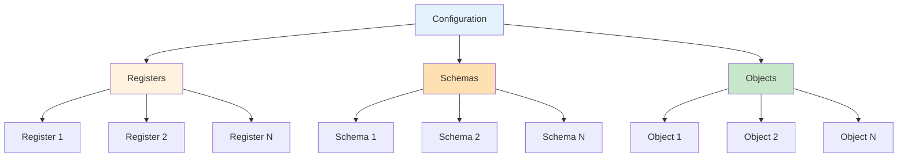
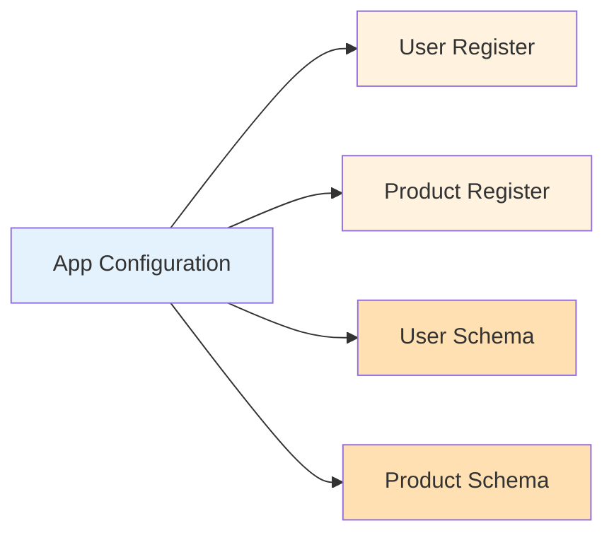
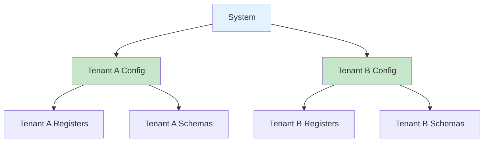
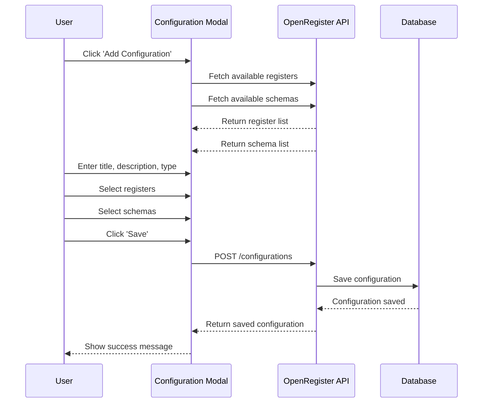
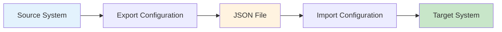

# Configurations

Configurations in OpenRegister allow you to package and manage related registers, schemas, and objects together as a coherent unit. This feature is particularly useful for multi-tenancy, application packaging, and organizing complex data structures.

## Overview

A Configuration is a container that groups together:
- **Registers**: Collections of objects that share similar characteristics
- **Schemas**: Data structure definitions that define object properties
- **Objects**: Individual data items (optional)



## Key Concepts

### Configuration Properties

Each configuration has the following properties:

- **Title**: A human-readable name for the configuration
- **Description**: Detailed description of what the configuration contains
- **Type**: The type or category of the configuration (e.g., 'application', 'tenant', 'module')
- **Owner/App**: The application or owner identifier
- **Registers**: Array of register IDs that are part of this configuration
- **Schemas**: Array of schema IDs that are part of this configuration
- **Objects**: Array of object IDs that are part of this configuration (optional)
- **Version**: Configuration version for tracking changes
- **Created/Updated**: Timestamps for auditing

## Use Cases

### Application Packaging

Package all registers and schemas for a specific application:



### Multi-Tenancy

Create separate configurations for different tenants:



### Module Organization

Group related functionality into logical modules:

- **Core Module**: Base registers and schemas
- **Customer Module**: Customer-related data structures
- **Product Module**: Product catalog structures
- **Order Module**: Order processing structures

## Creating a Configuration

### Step 1: Navigate to Configurations

1. Log in to your Nextcloud instance
2. Navigate to the OpenRegister app
3. Click on **Configurations** in the left sidebar

### Step 2: Add New Configuration

1. Click the **Add Configuration** button
2. Fill in the configuration details:
   - **Title**: Give your configuration a meaningful name
   - **Description**: Describe what this configuration contains
   - **Type**: Specify the configuration type (e.g., 'application', 'tenant')

### Step 3: Select Registers and Schemas

1. **Select Registers**: 
   - Click on the Registers dropdown
   - Select multiple registers that should be part of this configuration
   - The count of selected registers is displayed below the selector

2. **Select Schemas**:
   - Click on the Schemas dropdown
   - Select multiple schemas that should be part of this configuration
   - The count of selected schemas is displayed below the selector



### Step 4: Save the Configuration

1. Review your selections
2. Click the **Save** button
3. The configuration is created and added to the list

## Editing a Configuration

### Modifying Configuration Details

1. Navigate to the Configurations page
2. Find the configuration you want to edit
3. Click the **Actions** menu (three dots)
4. Select **Edit**
5. Modify the fields as needed:
   - Update title, description, or type
   - Add or remove registers
   - Add or remove schemas
6. Click **Save** to apply changes

### Managing Associations

You can dynamically manage which registers and schemas are associated with a configuration:

- **Add new associations**: Select additional items from the dropdowns
- **Remove associations**: Deselect items from the dropdowns
- **View current associations**: The modal shows all currently selected items

## Viewing Configurations

### Card View

The card view displays configurations as cards showing:
- Configuration title
- Description
- Type
- Owner/App
- Count of associated items (registers, schemas, objects)

### Table View

The table view shows configurations in a tabular format with columns:
- Title
- Type
- Owner
- Config Keys count
- Created date
- Updated date
- Actions

Switch between views using the **Cards** / **Table** toggle buttons.

## Exporting and Importing Configurations

### Exporting

1. Select a configuration
2. Click **Actions** → **Export**
3. The configuration (including its registers, schemas, and optionally objects) is exported as JSON
4. Use this for:
   - Backup and restore
   - Moving configurations between environments
   - Sharing configurations with other installations

### Importing

1. Click **Import Configuration**
2. Select a configuration JSON file
3. Choose whether to include objects
4. The configuration and its associated items are imported



## Configuration API

### List Configurations

```http
GET /index.php/apps/openregister/api/configurations
```

### Get Single Configuration

```http
GET /index.php/apps/openregister/api/configurations/{id}
```

### Create Configuration

```http
POST /index.php/apps/openregister/api/configurations
Content-Type: application/json

{
  "title": "My Application",
  "description": "Core application configuration",
  "type": "application",
  "registers": [1, 2, 3],
  "schemas": [4, 5, 6]
}
```

### Update Configuration

```http
PUT /index.php/apps/openregister/api/configurations/{id}
Content-Type: application/json

{
  "title": "Updated Application",
  "description": "Updated description",
  "registers": [1, 2, 3, 7],
  "schemas": [4, 5, 6, 8]
}
```

### Delete Configuration

```http
DELETE /index.php/apps/openregister/api/configurations/{id}
```

## Data Structure

### Configuration Entity

```typescript
{
  id: string
  title: string
  description: string | null
  type: string
  owner: string
  registers: number[]  // Array of register IDs
  schemas: number[]    // Array of schema IDs
  objects: number[]    // Array of object IDs (optional)
  created: string      // ISO 8601 timestamp
  updated: string      // ISO 8601 timestamp
}
```

### Database Schema

The configuration is stored in the 'oc_openregister_configurations' table with the following fields:

- 'id': Primary key (integer)
- 'title': Configuration name (string)
- 'description': Detailed description (text, nullable)
- 'type': Configuration type (string)
- 'app': Owner/app identifier (string)
- 'version': Configuration version (string)
- 'registers': JSON array of register IDs
- 'schemas': JSON array of schema IDs
- 'objects': JSON array of object IDs
- 'created': Creation timestamp (datetime)
- 'updated': Last update timestamp (datetime)

## Best Practices

### Naming Conventions

- Use descriptive titles that clearly indicate the configuration's purpose
- Include the application or tenant name in the title when applicable
- Use consistent type values across your system (e.g., always use 'application', not 'app' or 'Application')

### Organization

- Create configurations for logical groupings of functionality
- Keep configurations focused - don't mix unrelated registers and schemas
- Use configurations to enforce multi-tenancy boundaries
- Document the purpose of each configuration in the description field

### Version Management

- The system automatically increments the patch version on each update
- Major and minor version changes should be managed manually when needed
- Export configurations before making major structural changes

### Multi-Tenancy

- Create separate configurations for each tenant
- Never share registers or schemas between tenant configurations
- Use the owner/app field to identify the tenant
- Export/import configurations to provision new tenants

## Troubleshooting

### Cannot Save Configuration

**Problem**: Save button is disabled

**Solution**: Ensure both title and type fields are filled in. These are required fields.

### Registers/Schemas Not Showing in Dropdown

**Problem**: No items appear in the register or schema selector

**Solution**: 
- Ensure you have created registers and schemas in the system
- Refresh the page to reload the data
- Check that you have the necessary permissions to view registers and schemas

### Changes Not Persisting

**Problem**: Selected registers or schemas are not saved

**Solution**:
- Verify that you clicked the Save button (not just closed the modal)
- Check browser console for any API errors
- Ensure you have write permissions for configurations
- Try refreshing the page and editing again

### Import Fails

**Problem**: Configuration import returns an error

**Solution**:
- Verify the JSON file format is correct
- Ensure referenced registers and schemas exist or will be created
- Check for ID conflicts if importing into a system with existing data
- Review server logs for detailed error messages

## Related Features

- [Registers](registers.md) - Learn about register management
- [Schemas](schemas.md) - Learn about schema definitions
- [Objects](objects.md) - Learn about object management
- [Import/Export](../technical/import-export.md) - Detailed import/export documentation
- [Multi-Tenancy](multi-tenancy.md) - Multi-tenancy implementation details

## Changelog

### Version 0.2.7 (2025-01-01)

- Added register selection in configuration modal
- Added schema selection in configuration modal
- Multi-select dropdowns for easy association management
- Display count of selected items
- Enhanced configuration entity to support arrays of IDs
- Improved configuration editing workflow

