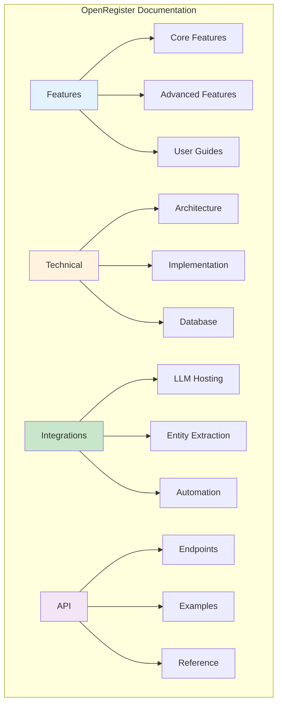

# Documentation System

OpenRegister provides comprehensive documentation covering all features, technical implementation details, and integration guides. This document provides an overview of the documentation structure and how to navigate it.

## Overview

The OpenRegister documentation is organized into several categories to serve different audiences:

- **Features**: User-facing feature documentation
- **Technical**: Developer and implementation documentation
- **Integrations**: Third-party service integration guides
- **API**: API reference documentation
- **User Guides**: Step-by-step user guides

## Documentation Structure

## Feature Documentation

### Core Features

**Essential features every user should understand:**

- **[Objects](../Features/objects.md)** - Core data entities
- **[Registers](../Features/registers.md)** - Data containers
- **[Schemas](../Features/schemas.md)** - Data structure definitions
- **[Search](../Features/search.md)** - Search and filtering capabilities
- **[Faceting](../Features/faceting.md)** - Dynamic filtering system
- **[Applications](../Features/applications.md)** - Application management and access control

### Advanced Features

**Powerful features for advanced use cases:**

- **[Text Extraction](../features/text-extraction-enhanced.md)** - File and object text extraction
- **[Text Extraction Sources](../features/text-extraction-sources.md)** - Files vs Objects processing
- **[RAG Implementation](../features/rag-implementation.md)** - Retrieval Augmented Generation
- **[Entity Extraction](../features/ner-nlp-concepts.md)** - GDPR entity tracking
- **[Multi-Tenancy](../Features/multi-tenancy.md)** - Multi-tenant support
- **[Access Control](../Features/access-control.md)** - Role-based access control
- **[Views](../features/views.md)** - Saved search views
- **[Files](../Features/files.md)** - File management and processing

### User Experience Features

**Features that improve user experience:**

- **[Enhanced Validation Errors](../Features/enhanced-validation-errors.md)** - Clear validation messages

## Technical Documentation

### Architecture

- **[Text Extraction Entities](../technical/text-extraction-entities.md)** - Database schema
- **[Unified Faceting System](../technical/unified-faceting-system.md)** - Faceting architecture
- **[Vectorization Architecture](../Technical/vectorization-architecture.md)** - Vector embeddings

### Implementation

- **[Enhanced Text Extraction Plan](../technical/enhanced-text-extraction-implementation-plan.md)** - Implementation roadmap
- **[Text Extraction Implementation](../technical/text-extraction-implementation.md)** - Technical details

### Setup & Configuration

- **[Solr Setup](../technical/solr-setup-configuration.md)** - Solr configuration
- **[Text Extraction README](../technical/text-extraction-readme.md)** - Quick start guide

## Integration Documentation

### LLM Hosting

- **[Ollama](../Integrations/ollama.md)** - Local LLM hosting
- **[Hugging Face](../Integrations/huggingface.md)** - TGI/vLLM hosting
- **[Mistral](../Integrations/mistral.md)** - Mistral model integration

### Document Processing

- **[Dolphin](../Integrations/dolphin.md)** - Document parsing and OCR

### Entity Extraction

- **[Presidio](../Integrations/presidio.md)** - PII detection service

### Automation

- **[n8n](../Integrations/n8n.md)** - Workflow automation
- **[Windmill](../Integrations/windmill.md)** - Script-based automation
- **[Custom Webhooks](../Integrations/custom-webhooks.md)** - Custom integrations

See the **[Integrations Overview](../Integrations/index.md)** for a complete overview of all integrations.

## Documentation by Audience

### For End Users

**Start Here:**
1. [Objects](../Features/objects.md) - Understanding core concepts
2. [Search](../Features/search.md) - Finding content
3. [Applications](../Features/applications.md) - Using applications

**Key Topics:**
- Creating and managing objects
- Searching and filtering
- Using saved views
- File uploads and processing

### For Administrators

**Start Here:**
1. [Registers](../Features/registers.md) - Setting up data containers
2. [Schemas](../Features/schemas.md) - Defining data structures
3. [Multi-Tenancy](../Features/multi-tenancy.md) - Multi-tenant configuration
4. [Access Control](../Features/access-control.md) - Security and permissions

**Key Topics:**
- Register and schema management
- User and organization management
- Access control configuration
- Application setup

### For Developers

**Start Here:**
1. [Text Extraction README](../technical/text-extraction-readme.md) - Quick start
2. [Database Entities](../technical/text-extraction-entities.md) - Schema reference
3. [API Documentation](../api/) - API endpoints

**Key Topics:**
- Database schema
- Service architecture
- API integration
- Extension development

### For DevOps

**Start Here:**
1. [Solr Setup](../technical/solr-setup-configuration.md) - Search engine configuration
2. [Integrations Overview](../Integrations/index.md) - Service integration
3. [Docker Services](../development/docker-services.md) - Container setup

**Key Topics:**
- Infrastructure setup
- Service integration
- Performance optimization
- Monitoring and maintenance

## Documentation Standards

All OpenRegister documentation follows consistent standards:

### Formatting

- **Single Quotes**: Use single quotes (') instead of backticks (`) for inline code
- **Mermaid Diagrams**: All flows, processes, and architectures visualized
- **Clear Language**: Concise, user-friendly explanations
- **Code Examples**: Practical examples included throughout

### Structure

- **Overview Section**: High-level feature description
- **Key Features**: Bullet points of main capabilities
- **Use Cases**: Real-world scenarios
- **API Reference**: Endpoint documentation
- **Troubleshooting**: Common issues and solutions

### Diagrams

All documentation includes Mermaid diagrams for:
- Processing flows
- Architecture overviews
- Sequence diagrams
- Entity relationships
- User workflows

## Finding Documentation

### By Feature

Use the sidebar navigation to browse features by category:
- Core Features
- Advanced Features
- Integrations
- Technical Documentation

### By Use Case

**GDPR Compliance:**
- [Entity Extraction](../features/ner-nlp-concepts.md)
- [Presidio Integration](../Integrations/presidio.md)
- [Text Extraction](../features/text-extraction-enhanced.md)

**AI & Search:**
- [RAG Implementation](../features/rag-implementation.md)
- [Search](../Features/search.md)
- [Faceting](../Features/faceting.md)
- [Ollama Integration](../Integrations/ollama.md)

**Automation:**
- [n8n Integration](../Integrations/n8n.md)
- [Windmill Integration](../Integrations/windmill.md)
- [Custom Webhooks](../Integrations/custom-webhooks.md)

**Multi-Tenancy:**
- [Multi-Tenancy](../Features/multi-tenancy.md)
- [Applications](../Features/applications.md)
- [Access Control](../Features/access-control.md)

## Documentation Statistics

### Content Coverage

- **50+ Feature Documents**: Complete feature coverage
- **20+ Technical Documents**: Architecture and implementation
- **10+ Integration Guides**: Third-party service integration
- **30+ API Endpoints**: Complete API reference
- **100+ Mermaid Diagrams**: Visual documentation

### Documentation Quality

- ✅ Consistent formatting and structure
- ✅ Comprehensive code examples
- ✅ Visual diagrams for all major concepts
- ✅ Troubleshooting sections
- ✅ API reference included
- ✅ Use cases and best practices

## Contributing to Documentation

### Documentation Updates

When adding new features:
1. Create feature documentation in `website/docs/Features/`
2. Add technical details in `website/docs/technical/`
3. Include Mermaid diagrams for flows
4. Add API endpoint documentation
5. Include troubleshooting section

### Documentation Standards

Follow these guidelines:
- Use single quotes for inline code
- Include Mermaid diagrams for complex flows
- Provide code examples
- Document API endpoints
- Add troubleshooting tips
- Link to related documentation

## Related Documentation

- [Features Index](../Features/index.md) - Browse all features
- [Technical Documentation](../technical/schemas.md) - Implementation details
- [Integrations](../Integrations/index.md) - Integration guides
- [API Reference](../api/objects.md) - API documentation

