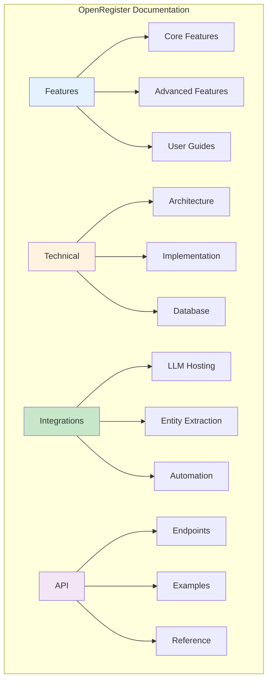
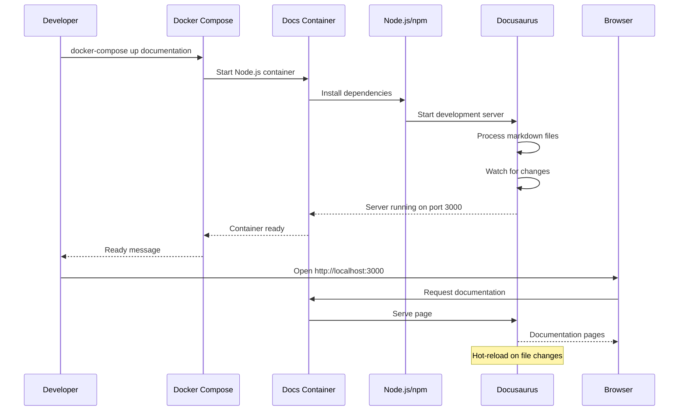
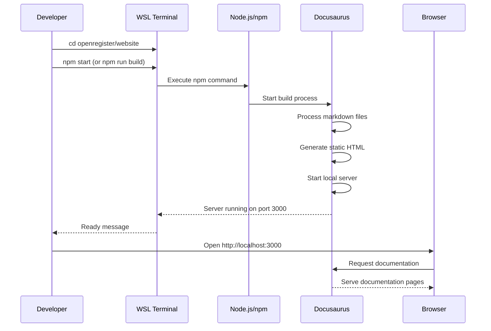

# Documentation System

OpenRegister provides comprehensive documentation covering all features, technical implementation details, and integration guides. This document provides an overview of the documentation structure and how to navigate it.

## Overview

The OpenRegister documentation is organized into several categories to serve different audiences:

- **Features**: User-facing feature documentation
- **Technical**: Developer and implementation documentation
- **Integrations**: Third-party service integration guides
- **API**: API reference documentation
- **User Guides**: Step-by-step user guides

## Documentation Structure



## Feature Documentation

### Core Features

**Essential features every user should understand:**

- **[Objects](../features/objects.md)** - Core data entities
- **[Registers](../features/registers.md)** - Data containers
- **[Schemas](../features/schemas.md)** - Data structure definitions
- **[Search](../features/search.md)** - Search and filtering capabilities
- **[Faceting](../features/faceting.md)** - Dynamic filtering system
- **[Applications](../features/applications.md)** - Application management and access control

### Advanced Features

**Powerful features for advanced use cases:**

- **[Text Extraction](../features/text-extraction-enhanced.md)** - File and object text extraction
- **[Text Extraction Sources](../features/text-extraction-sources.md)** - Files vs Objects processing
- **[RAG Implementation](../features/rag-implementation.md)** - Retrieval Augmented Generation
- **[Entity Extraction](../features/ner-nlp-concepts.md)** - GDPR entity tracking
- **[Multi-Tenancy](../features/multi-tenancy.md)** - Multi-tenant support
- **[Access Control](../features/access-control.md)** - Role-based access control
- **[Views](../features/views.md)** - Saved search views
- **[Files](../features/files.md)** - File management and processing

### User Experience Features

**Features that improve user experience:**

- **[Enhanced Validation Errors](../features/enhanced-validation-errors.md)** - Clear validation messages

## Technical Documentation

### Architecture

- **[Text Extraction Entities](../technical/text-extraction.md#database-schema)** - Database schema
- **[Unified Faceting System](../technical/unified-faceting-system.md)** - Faceting architecture
- **[Vectorization Architecture](../technical/vectorization-architecture.md)** - Vector embeddings

### Implementation

- **[Enhanced Text Extraction Plan](../technical/enhanced-text-extraction-implementation-plan.md)** - Implementation roadmap
- **[Text Extraction Implementation](../technical/text-extraction.md)** - Technical details

### Setup & Configuration

- **[Solr Setup](../technical/solr-setup-configuration.md)** - Solr configuration
- **[Text Extraction README](../technical/text-extraction.md)** - Quick start guide

## Integration Documentation

### LLM Hosting

- **[Ollama](../Integrations/ollama.md)** - Local LLM hosting
- **[Hugging Face](../Integrations/huggingface.md)** - TGI/vLLM hosting
- **[Mistral](../Integrations/mistral.md)** - Mistral model integration

### Document Processing

- **[Dolphin](../Integrations/dolphin.md)** - Document parsing and OCR

### Entity Extraction

- **[Presidio](../Integrations/presidio.md)** - PII detection service

### Automation

- **[n8n](../Integrations/n8n.md)** - Workflow automation
- **[Windmill](../Integrations/windmill.md)** - Script-based automation
- **[Custom Webhooks](../Integrations/custom-webhooks.md)** - Custom integrations

See the **[Integrations Overview](../Integrations/index.md)** for a complete overview of all integrations.

## Documentation by Audience

### For End Users

**Start Here:**
1. [Objects](../features/objects.md) - Understanding core concepts
2. [Search](../features/search.md) - Finding content
3. [Applications](../features/applications.md) - Using applications

**Key Topics:**
- Creating and managing objects
- Searching and filtering
- Using saved views
- File uploads and processing

### For Administrators

**Start Here:**
1. [Registers](../features/registers.md) - Setting up data containers
2. [Schemas](../features/schemas.md) - Defining data structures
3. [Multi-Tenancy](../features/multi-tenancy.md) - Multi-tenant configuration
4. [Access Control](../features/access-control.md) - Security and permissions

**Key Topics:**
- Register and schema management
- User and organization management
- Access control configuration
- Application setup

### For Developers

**Start Here:**
1. [Text Extraction README](../technical/text-extraction.md) - Quick start
2. [Database Entities](../technical/text-extraction.md#database-schema) - Schema reference
3. [API Documentation](../api/objects.md) - API endpoints

**Key Topics:**
- Database schema
- Service architecture
- API integration
- Extension development

### For DevOps

**Start Here:**
1. [Solr Setup](../technical/solr-setup-configuration.md) - Search engine configuration
2. [Integrations Overview](../Integrations/index.md) - Service integration
3. [Docker Setup](../development/docker-setup.md) - Container setup

**Key Topics:**
- Infrastructure setup
- Service integration
- Performance optimization
- Monitoring and maintenance

## Documentation Standards

All OpenRegister documentation follows consistent standards:

### Formatting

- **Single Quotes**: Use single quotes (') instead of backticks (`) for inline code
- **Mermaid Diagrams**: All flows, processes, and architectures visualized
- **Clear Language**: Concise, user-friendly explanations
- **Code Examples**: Practical examples included throughout

### Structure

- **Overview Section**: High-level feature description
- **Key Features**: Bullet points of main capabilities
- **Use Cases**: Real-world scenarios
- **API Reference**: Endpoint documentation
- **Troubleshooting**: Common issues and solutions

### Diagrams

All documentation includes Mermaid diagrams for:
- Processing flows
- Architecture overviews
- Sequence diagrams
- Entity relationships
- User workflows

## Finding Documentation

### By Feature

Use the sidebar navigation to browse features by category:
- Core Features
- Advanced Features
- Integrations
- Technical Documentation

### By Use Case

**GDPR Compliance:**
- [Entity Extraction](../features/ner-nlp-concepts.md)
- [Presidio Integration](../Integrations/presidio.md)
- [Text Extraction](../features/text-extraction-enhanced.md)

**AI & Search:**
- [RAG Implementation](../features/rag-implementation.md)
- [Search](../features/search.md)
- [Faceting](../features/faceting.md)
- [Ollama Integration](../Integrations/ollama.md)

**Automation:**
- [n8n Integration](../Integrations/n8n.md)
- [Windmill Integration](../Integrations/windmill.md)
- [Custom Webhooks](../Integrations/custom-webhooks.md)

**Multi-Tenancy:**
- [Multi-Tenancy](../features/multi-tenancy.md)
- [Applications](../features/applications.md)
- [Access Control](../features/access-control.md)

## Documentation Statistics

### Content Coverage

- **50+ Feature Documents**: Complete feature coverage
- **20+ Technical Documents**: Architecture and implementation
- **10+ Integration Guides**: Third-party service integration
- **30+ API Endpoints**: Complete API reference
- **100+ Mermaid Diagrams**: Visual documentation

### Documentation Quality

- ✅ Consistent formatting and structure
- ✅ Comprehensive code examples
- ✅ Visual diagrams for all major concepts
- ✅ Troubleshooting sections
- ✅ API reference included
- ✅ Use cases and best practices

## Contributing to Documentation

### Documentation Updates

When adding new features:
1. Create feature documentation in `website/docs/features/`
2. Add technical details in `website/docs/technical/`
3. Include Mermaid diagrams for flows
4. Add API endpoint documentation
5. Include troubleshooting section

### Documentation Standards

Follow these guidelines:
- Use single quotes for inline code
- Include Mermaid diagrams for complex flows
- Provide code examples
- Document API endpoints
- Add troubleshooting tips
- Link to related documentation

## Building and Viewing Documentation Locally

The OpenRegister documentation is built using Docusaurus and can be viewed locally during development. This is especially useful when making changes to documentation and wanting to preview them before committing.

### Docker Compose (Recommended)

The easiest way to run the documentation locally is using Docker Compose, which provides a consistent environment with hot-reload support.

**Start the documentation server:**

```bash
# From the openregister root directory
docker-compose -f docker-compose.dev.yml up documentation
```

Or start all services including documentation:

```bash
docker-compose -f docker-compose.dev.yml up -d
```

**Access the documentation:**
- URL: `http://localhost:3000`
- Hot-reload: Automatically reloads when you edit markdown files
- Container: `openregister-docs-dev`

**View logs:**
```bash
docker-compose -f docker-compose.dev.yml logs -f documentation
```

**Stop the documentation server:**
```bash
docker-compose -f docker-compose.dev.yml stop documentation
```

The Docker container will:
- Automatically install dependencies on first start
- Start Docusaurus development server with hot-reload
- Mount the website directory for live editing
- Accessible from Windows via `http://localhost:3000`

### Manual Setup (Alternative)

If you prefer to run documentation locally without Docker:

**Prerequisites:**
- Node.js 18 or higher installed in WSL
- npm package manager

**Development Server:**

```bash
# Navigate to the website directory
cd openregister/website

# Install dependencies (first time only)
npm install --legacy-peer-deps

# Start the development server
npm start
```

The development server will:
- Start on `http://localhost:3000`
- Automatically reload when you make changes to documentation files
- Show build errors and warnings in the terminal

**Access from Windows:** Since WSL automatically forwards localhost, you can open `http://localhost:3000` in Cursor's browser or any Windows browser to view the documentation.

**Production Build:**

To build and serve a production version of the documentation:

```bash
# Navigate to the website directory
cd openregister/website

# Build the documentation
npm run build

# Serve the built documentation
npm run serve
```

The production server will:
- Start on `http://localhost:3000`
- Serve optimized, production-ready documentation
- Not include hot-reload (restart server after changes)

### Build Process Flow

**Docker Compose Flow:**



**Manual Setup Flow:**



### Troubleshooting

**Docker-Specific Issues:**

**Container won't start:**
```bash
# Check container logs
docker-compose -f docker-compose.dev.yml logs documentation

# Restart the container
docker-compose -f docker-compose.dev.yml restart documentation

# Rebuild if dependencies changed
docker-compose -f docker-compose.dev.yml up --build documentation
```

**Port Already in Use:**
If port 3000 is already in use:
- Docker: Change the port mapping in `docker-compose.dev.yml` (e.g., `"3001:3000"`)
- Manual: Docusaurus will automatically try the next available port (3001, 3002, etc.). Check the terminal output for the actual port number.

**Dependencies Issues:**
- Docker: The container automatically installs dependencies. If issues persist, rebuild the container.
- Manual: Use the `--legacy-peer-deps` flag:
```bash
npm install --legacy-peer-deps
```

**Hot-reload not working:**
- Docker: Ensure the website directory is properly mounted as a volume
- Manual: Check that the file watcher has permissions to monitor file changes

**Build Errors:**
- Check for broken links: Docusaurus will throw errors for broken internal links
- Verify Mermaid diagram syntax: Invalid diagrams will cause build failures
- Check markdown formatting: Ensure proper frontmatter and structure

**WSL Localhost Access:**
- WSL2 automatically forwards localhost from Linux to Windows
- Docker containers are accessible via `http://localhost:3000` from Windows
- If localhost doesn't work, check Docker port mapping and firewall settings

### Available Scripts

- `npm start` - Start development server with hot-reload
- `npm run build` - Build production version
- `npm run serve` - Serve production build locally
- `npm run clear` - Clear Docusaurus cache
- `npm run write-heading-ids` - Add heading IDs to markdown files

## Related Documentation

- [Features Index](../features/index.md) - Browse all features
- [Technical Documentation](../technical/schemas.md) - Implementation details
- [Integrations](../Integrations/index.md) - Integration guides
- [API Reference](../api/objects.md) - API documentation


