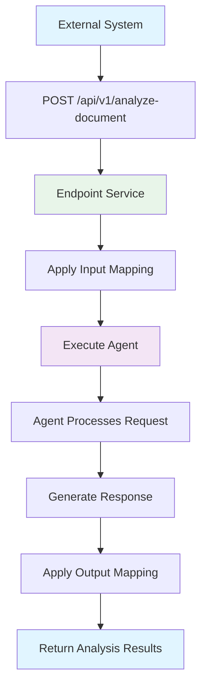
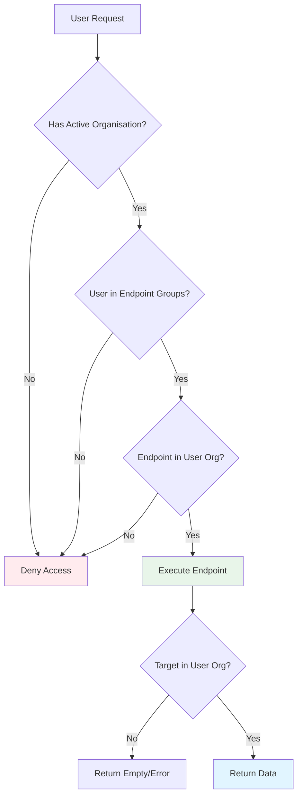

# Endpoints

OpenRegister includes a powerful endpoint management system that allows you to expose internal resources (views, agents, webhooks, registers, and schemas) as API endpoints. This enables you to create custom APIs that can be consumed by external applications or integrated into your business workflows.

## Overview

Endpoints serve several key purposes in OpenRegister:

1. **Resource Exposure**: Make internal resources available via custom API paths
2. **Access Control**: Control who can access endpoints using group-based permissions
3. **Multi-Tenancy**: Respect organisation boundaries and isolation
4. **Data Transformation**: Apply input and output mappings to transform data
5. **Logging & Monitoring**: Track all endpoint calls for auditing and debugging

The endpoint system provides a flexible, production-ready solution with comprehensive logging, access control, and transformation capabilities.

## Core Concepts

### Target Types

Endpoints can expose different types of resources:

- **view**: Expose a saved search/view as an API endpoint
- **agent**: Execute an AI agent via API call
- **webhook**: Trigger webhook functionality
- **register**: Expose register-level operations
- **schema**: Expose schema-specific CRUD operations

### Endpoint Paths

Endpoint paths support parameterization using double curly braces:

```
/api/buildings/{{id}}
/api/users/{{userId}}/orders/{{orderId}}
/api/search/{{category}}
```

Parameters are automatically extracted and made available to the target resource.

### HTTP Methods

Endpoints support all standard HTTP methods:

- `GET` - Retrieve data
- `POST` - Create new data
- `PUT` - Update existing data (full replacement)
- `PATCH` - Update existing data (partial update)
- `DELETE` - Remove data
- `OPTIONS` - Get available methods
- `HEAD` - Get headers only

### Group-Based Access Control

Endpoints can be configured with group-based access control. If no groups are specified, the endpoint is accessible to all authenticated users. When groups are specified, only users in those groups can access the endpoint.

```json
{
  "groups": ["admin", "editors"]
}
```

This allows you to create:
- **Public endpoints** (no groups, all authenticated users)
- **Restricted endpoints** (specific groups only)
- **Admin-only endpoints** (admin group only)

## Use Cases

### Use Case 1: Exposing a View as an API

You have created a complex search view in OpenRegister that filters and sorts objects in a specific way. Instead of having external applications recreate this search logic, you can expose the view as an API endpoint.

```mermaid
flowchart LR
    A[External App] --> B[GET /api/v1/active-products]
    B --> C[Endpoint Service]
    C --> D[Execute View]
    D --> E[Apply Filters & Sort]
    E --> F[Return Results]
    F --> G[Apply Output Mapping]
    G --> H[Return JSON Response]
    
    style A fill:#e1f5ff
    style C fill:#e8f5e9
    style D fill:#fff4e1
    style H fill:#e1f5ff
```



**Configuration**:
```json
{
  "name": "Active Products API",
  "endpoint": "/api/v1/active-products",
  "method": "GET",
  "targetType": "view",
  "targetId": "view-uuid-here",
  "outputMapping": "product-output-mapper",
  "groups": [],
  "version": "1.0.0"
}
```

### Use Case 2: Agent Execution API

You have an AI agent configured to analyze documents or answer questions. You want to expose this agent as an API so external applications can leverage its capabilities.



**Configuration**:
```json
{
  "name": "Document Analysis API",
  "endpoint": "/api/v1/analyze-document",
  "method": "POST",
  "targetType": "agent",
  "targetId": "document-analyzer-agent-id",
  "inputMapping": "document-input-mapper",
  "outputMapping": "analysis-output-mapper",
  "groups": ["analysts", "admin"],
  "version": "1.0.0"
}
```

### Use Case 3: Schema CRUD Operations

You want to provide a simplified API for creating and managing objects of a specific schema without exposing the full OpenRegister API complexity.


**Configuration**:
```json
{
  "name": "Customer Management API",
  "endpoint": "/api/v1/customers",
  "method": "POST",
  "targetType": "schema",
  "targetId": "customer-schema-id",
  "inputMapping": "customer-create-mapper",
  "outputMapping": "customer-response-mapper",
  "groups": ["sales", "admin"],
  "version": "1.0.0"
}
```

## Multi-Tenancy Support

Endpoints fully respect OpenRegister's multi-tenancy model:

1. **Organisation Filtering**: Endpoints created in one organisation are only visible to users in that organisation
2. **Access Control**: Group-based permissions are evaluated within the context of the active organisation
3. **Data Isolation**: Target resources (views, agents, schemas) are filtered by organisation



### Admin Override

Administrators with the 'admin override' setting enabled can access endpoints across all organisations. This is useful for:
- Cross-organisation reporting
- System-wide monitoring
- Administrative tasks

## Data Transformation

### Input Mapping

Input mappings transform incoming request data before it reaches the target resource. This is useful for:
- **Renaming fields**: Convert API field names to internal schema fields
- **Data validation**: Apply additional validation rules
- **Data enrichment**: Add computed fields or lookup data
- **Format conversion**: Convert between different data formats

Example: Transform external API format to internal schema format

```json
{
  "inputMapping": "customer-api-to-schema-mapper"
}
```

The mapper would convert:
```json
{
  "first_name": "John",
  "last_name": "Doe",
  "email": "john@example.com"
}
```

To:
```json
{
  "naam": {
    "voornaam": "John",
    "achternaam": "Doe"
  },
  "contactgegevens": {
    "email": "john@example.com"
  }
}
```

### Output Mapping

Output mappings transform data before sending responses. This allows you to:
- **Hide internal fields**: Remove sensitive or internal-only data
- **Rename fields**: Convert internal names to API-friendly names
- **Format data**: Transform dates, numbers, or other formats
- **Aggregate data**: Combine multiple fields into summary fields

Example: Transform internal object to API response

```json
{
  "outputMapping": "customer-schema-to-api-mapper"
}
```

The mapper would convert internal object to clean API response.

## Endpoint Logging

All endpoint calls are automatically logged with comprehensive information:

### Log Contents

Each log entry contains:
- **Request Data**: Method, path, headers, body, query parameters
- **Response Data**: Status code, headers, response body
- **Timing**: Timestamp of the call
- **User Info**: User ID and session ID
- **Status**: Success/failure indication
- **Size**: Calculated size of the log entry

### Log Retention

Logs are automatically expired based on the configured retention period (default: 7 days). This prevents log table growth while maintaining recent audit history.

### Statistics

The endpoint system provides statistics for:
- **Total calls**: Number of times endpoint was called
- **Success rate**: Percentage of successful calls
- **Failure rate**: Percentage of failed calls
- **Response times**: Average and peak response times (future enhancement)

## API Reference

### Create Endpoint

```http
POST /api/endpoints
Content-Type: application/json

{
  "name": "My API Endpoint",
  "description": "Description of what this endpoint does",
  "endpoint": "/api/v1/my-resource",
  "method": "GET",
  "targetType": "view",
  "targetId": "target-resource-id",
  "inputMapping": "optional-input-mapper-id",
  "outputMapping": "optional-output-mapper-id",
  "groups": ["group1", "group2"],
  "version": "1.0.0"
}
```

**Response**: `201 Created`
```json
{
  "id": 1,
  "uuid": "123e4567-e89b-12d3-a456-426614174000",
  "name": "My API Endpoint",
  "endpoint": "/api/v1/my-resource",
  "method": "GET",
  "targetType": "view",
  "targetId": "target-resource-id",
  "slug": "my-api-endpoint",
  "organisation": "org-uuid",
  "created": "2024-01-15T10:30:00+00:00",
  "updated": "2024-01-15T10:30:00+00:00"
}
```

### List Endpoints

```http
GET /api/endpoints
```

**Response**: `200 OK`
```json
{
  "results": [
    {
      "id": 1,
      "uuid": "123e4567-e89b-12d3-a456-426614174000",
      "name": "My API Endpoint",
      "endpoint": "/api/v1/my-resource",
      "method": "GET",
      "targetType": "view",
      "created": "2024-01-15T10:30:00+00:00"
    }
  ],
  "total": 1
}
```

### Get Endpoint

```http
GET /api/endpoints/{id}
```

**Response**: `200 OK`
```json
{
  "id": 1,
  "uuid": "123e4567-e89b-12d3-a456-426614174000",
  "name": "My API Endpoint",
  "description": "Description of what this endpoint does",
  "endpoint": "/api/v1/my-resource",
  "method": "GET",
  "targetType": "view",
  "targetId": "target-resource-id",
  "groups": ["group1", "group2"],
  "created": "2024-01-15T10:30:00+00:00",
  "updated": "2024-01-15T10:30:00+00:00"
}
```

### Update Endpoint

```http
PUT /api/endpoints/{id}
Content-Type: application/json

{
  "name": "Updated Name",
  "description": "Updated description",
  "groups": ["admin"]
}
```

**Response**: `200 OK` - Returns updated endpoint object

### Delete Endpoint

```http
DELETE /api/endpoints/{id}
```

**Response**: `204 No Content`

### Test Endpoint

```http
POST /api/endpoints/{id}/test
Content-Type: application/json

{
  "data": {
    "test": "data"
  }
}
```

**Response**: `200 OK`
```json
{
  "success": true,
  "message": "Test endpoint executed successfully",
  "statusCode": 200,
  "response": {
    "result": "data"
  }
}
```

### Get Endpoint Logs

```http
GET /api/endpoints/{id}/logs?limit=50&offset=0
```

**Response**: `200 OK`
```json
{
  "results": [
    {
      "id": 1,
      "uuid": "log-uuid",
      "endpointId": 1,
      "statusCode": 200,
      "statusMessage": "Success",
      "request": {
        "method": "GET",
        "path": "/api/v1/my-resource"
      },
      "response": {
        "statusCode": 200,
        "body": {}
      },
      "userId": "user123",
      "created": "2024-01-15T10:30:00+00:00",
      "size": 4096
    }
  ],
  "total": 1
}
```

### Get Endpoint Log Statistics

```http
GET /api/endpoints/{id}/logs/stats
```

**Response**: `200 OK`
```json
{
  "total": 100,
  "success": 95,
  "failed": 5
}
```

### Get All Endpoint Logs

```http
GET /api/endpoints/logs?endpoint_id=1&limit=50&offset=0
```

**Response**: `200 OK` - Returns paginated logs, optionally filtered by endpoint_id

## Frontend Usage

### Accessing Endpoints UI

Navigate to the Endpoints section in OpenRegister:

1. Click 'Endpoints' in the navigation menu
2. View list of existing endpoints
3. Click on an endpoint to see details
4. Use the actions menu to edit, test, or delete

### Creating an Endpoint

1. Click 'Add endpoint' button
2. Fill in the form:
   - **Name**: Descriptive name for the endpoint
   - **Description**: What the endpoint does
   - **Endpoint Path**: The URL path (e.g., `/api/v1/resource`)
   - **Method**: HTTP method (GET, POST, etc.)
   - **Target Type**: What resource to expose
   - **Target ID**: ID of the target resource
   - **Input Mapping**: Optional input transformer
   - **Output Mapping**: Optional output transformer
   - **Version**: API version (e.g., '1.0.0')
3. Click 'Save'

### Testing an Endpoint

1. Select an endpoint from the list
2. Click the 'Test' action in the details view
3. Optionally provide test data
4. View the test results including:
   - Success/failure status
   - Response code
   - Response data
   - Error messages (if any)

### Viewing Logs

1. Select an endpoint from the list
2. Navigate to the endpoint details
3. View recent log entries showing:
   - Timestamp
   - Status code
   - Request/response data
   - User information

## Security Considerations

### Authentication

All endpoints require authentication by default. The endpoint system uses Nextcloud's authentication mechanisms to verify user identity.

### Authorization

Two levels of authorization:

1. **Organisation-level**: Users can only access endpoints in their active organisation
2. **Group-level**: Endpoints can restrict access to specific groups

### Data Privacy

- Request and response data are logged - be cautious with sensitive information
- Use output mappings to filter sensitive fields from responses
- Configure log retention to automatically expire old logs
- Consider implementing additional encryption for sensitive endpoints

### Rate Limiting

Future enhancement: Implement rate limiting per endpoint to prevent abuse.

## Best Practices

### Naming Conventions

- Use descriptive names: 'Customer Management API' not 'API 1'
- Follow semantic versioning: '1.0.0', '1.1.0', '2.0.0'
- Use consistent path conventions: '/api/v1/resource'

### Path Design

- Use nouns, not verbs: '/api/customers' not '/api/getCustomers'
- Use plural for collections: '/api/customers' not '/api/customer'
- Use path parameters for IDs: '/api/customers/{{id}}'
- Version your APIs: '/api/v1/...' , '/api/v2/...'

### Access Control

- Start restrictive: Use groups to limit access initially
- Document required groups in the endpoint description
- Regularly audit group memberships
- Use meaningful group names: 'sales-team' not 'group1'

### Monitoring

- Regularly review endpoint logs for errors
- Monitor statistics to identify problematic endpoints
- Set up alerts for high failure rates
- Test endpoints after configuration changes

### Performance

- Use output mappings to reduce response size
- Consider caching for frequently accessed endpoints
- Monitor response times via logs
- Optimize target resources (views, agents) for performance

## Troubleshooting

### Endpoint Returns 403 Forbidden

**Cause**: User doesn't have required group membership or not in correct organisation

**Solution**:
1. Check user's group memberships
2. Verify user is in the correct organisation
3. Check endpoint's group configuration
4. Verify organisation is active

### Endpoint Returns 404 Not Found

**Cause**: Target resource doesn't exist or user doesn't have access

**Solution**:
1. Verify target ID is correct
2. Check that target resource exists
3. Ensure target resource is in same organisation
4. Check target resource hasn't been deleted

### Endpoint Test Fails

**Cause**: Various - check error message

**Solution**:
1. Review test error message
2. Check endpoint logs for details
3. Verify target resource is accessible
4. Test target resource directly
5. Check input/output mappings if configured

### Logs Not Appearing

**Cause**: Logging service failure or logs expired

**Solution**:
1. Check that endpoint was actually called
2. Verify log retention settings
3. Check database for log entries
4. Review application logs for errors

## Limitations & Future Enhancements

### Current Limitations

1. **No Rate Limiting**: Endpoints do not currently enforce rate limits
2. **Placeholder Execution**: Target type execution logic needs full implementation
3. **No Response Caching**: Responses are not cached
4. **Limited Metrics**: Only basic statistics (count, success/failure)

### Planned Enhancements

1. **Rate Limiting**: Per-endpoint and per-user rate limits
2. **Response Caching**: Configurable response caching for GET endpoints
3. **Advanced Metrics**: Response times, throughput, percentiles
4. **API Keys**: Alternative authentication mechanism for external systems
5. **Webhook Triggers**: Allow endpoints to trigger webhooks
6. **Conditions & Rules**: Apply conditions and rules to endpoint execution
7. **Request Validation**: JSON schema validation for request bodies
8. **Response Templates**: Template-based response formatting

## Related Features

- **[Webhooks](webhooks.md)**: Use webhooks to respond to events
- **[Access Control](access-control.md)**: Learn about group-based permissions
- **[Multi-Tenancy](multi-tenancy.md)**: Understand organisation isolation
- **[Views](search.md)**: Create views to expose as endpoints
- **[Agents](ai.md)**: Configure AI agents for endpoint exposure

## Examples

### Example 1: Public Search API

Create a public search endpoint that anyone (authenticated) can use:

```json
{
  "name": "Public Product Search",
  "endpoint": "/api/v1/search/products",
  "method": "GET",
  "targetType": "view",
  "targetId": "product-search-view-id",
  "groups": [],
  "version": "1.0.0"
}
```

### Example 2: Admin-Only Data Export

Create an endpoint that only administrators can access:

```json
{
  "name": "Export All Data",
  "endpoint": "/api/v1/admin/export",
  "method": "GET",
  "targetType": "register",
  "targetId": "main-register-id",
  "groups": ["admin"],
  "version": "1.0.0"
}
```

### Example 3: Department-Specific Agent

Create an endpoint for a specific department:

```json
{
  "name": "Sales Lead Analyzer",
  "endpoint": "/api/v1/sales/analyze-lead",
  "method": "POST",
  "targetType": "agent",
  "targetId": "lead-analyzer-agent-id",
  "groups": ["sales", "sales-managers"],
  "version": "1.0.0"
}
```

## Conclusion

The Endpoints feature provides a powerful way to expose OpenRegister's internal resources as APIs. With support for multi-tenancy, access control, data transformation, and comprehensive logging, it enables you to build custom APIs that integrate seamlessly with external systems while maintaining security and auditability.

For questions or support, consult the OpenRegister documentation or contact your system administrator.

