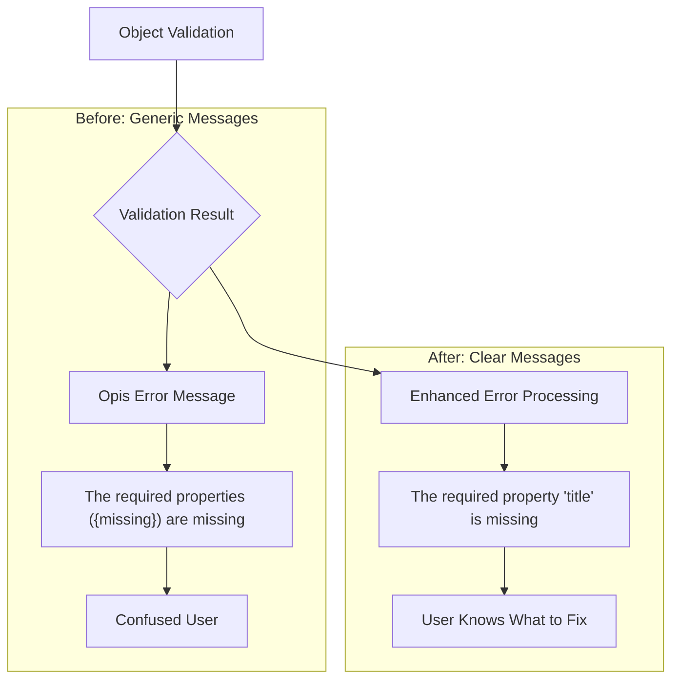
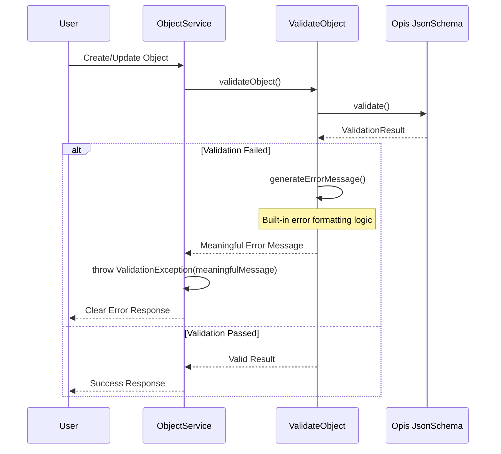

# Enhanced Validation Errors

OpenRegister provides clear, actionable validation error messages that help users quickly identify and fix issues when creating or updating objects.

## Overview

When objects fail validation against their schema, OpenRegister returns detailed error messages that specify exactly what needs to be fixed, rather than generic error codes or unclear messages.

## Key Benefits

- **Clear Messages**: Users know exactly which properties have issues
- **Actionable Feedback**: Error messages explain what needs to be fixed
- **Faster Development**: Developers can quickly identify validation problems
- **Better API Integration**: Clear error responses help with API integration
- **Reduced Support**: Fewer questions about unclear error messages

## Problem

Previously, when validation failed, users would receive generic error messages like:
- `The required properties ({missing}) are missing`
- 'Invalid object'
- Generic type mismatch errors

These messages didn't tell users exactly which properties were missing or what the specific validation issues were.

### Error Flow Comparison



## Solution

A streamlined approach that enhances validation error messages directly within the existing `ValidateObject` service, requiring no additional dependencies or complex configuration.

## Implementation

### Simplified Validation Flow

The enhanced validation system works through a streamlined approach without additional dependencies:



### Built-in Error Formatting

The `ValidateObject` class now includes built-in error formatting methods that provide detailed error messages for various validation scenarios:

- **Required Properties**: 'The required property email is missing'
- **Type Mismatches**: 'Property age should be of type integer but is string'
- **Format Validation**: 'Property email should match the format email but the value invalid-email does not'
- **Length Constraints**: 'Property name should have at least 3 characters, but has 1'
- **Value Ranges**: 'Property age should be at least 18, but is 16'
- **Enum Values**: 'Property status should be one of: active, inactive, pending, but is deleted'

### Integration

The enhanced error formatting is automatically used throughout the validation system through a simple, streamlined approach:

1. **ValidateObject Handler**: Contains built-in error formatting logic in the `generateErrorMessage()` method
2. **ObjectService**: Updated to use meaningful error messages instead of generic Opis messages  
3. **Error Response**: Provides both summary and detailed error information
4. **No Additional Dependencies**: No need for separate classes or dependency injection

### Key Improvement: Built-in generateErrorMessage()

The solution was simplified by implementing the error formatting logic directly in the `ValidateObject` class. This method:

1. **Intercepts Generic Messages**: Catches the generic Opis error messages before they reach the user
2. **Built-in Formatting**: Processes validation errors through built-in formatting logic
3. **Returns Clear Messages**: Provides specific, actionable error messages  
4. **Maintains Context**: Preserves all technical details for debugging while presenting user-friendly messages
5. **Zero Dependencies**: No additional classes or configuration needed

**Before (in ObjectService.php):**
```php
if ($result->isValid() === false) {
    throw new ValidationException($result->error()->message(), errors: $result->error());
    // Generic message: 'The required properties ({missing}) are missing'
}
```

**After (in ObjectService.php):**
```php
if ($result->isValid() === false) {
    $meaningfulMessage = $this->validateHandler->generateErrorMessage($result);
    throw new ValidationException($meaningfulMessage, errors: $result->error());
    // Clear message: 'The required property title is missing'
}
```

### Error Response Structure

```json
{
  'status': 'error',
  'message': 'Validation failed',
  'errors': [
    {
      'property': 'email',
      'keyword': 'required',
      'message': 'The required property 'email' is missing',
      'value': null,
      'path': ['email'],
      'schemaPath': ['required']
    }
  ]
}
```

### Real-World API Response Examples

**Missing Required Properties:**
```json
{
  'status': 'error',
  'message': 'Validation failed',
  'errors': [
    {
      'property': null,
      'message': 'The required property 'title' is missing'
    }
  ]
}
```

**Type Mismatch:**
```json
{
  'status': 'error', 
  'message': 'Validation failed',
  'errors': [
    {
      'property': 'age',
      'message': 'Property 'age' should be of type 'integer' but is 'string''
    }
  ]
}
```

**Multiple Validation Errors:**
```json
{
  'status': 'error',
  'message': 'Validation failed', 
  'errors': [
    {
      'property': null,
      'message': 'The required properties (name, email, address) are missing'
    }
  ]
}
```

## Benefits

1. **Improved User Experience**: Users get clear, actionable error messages
2. **Faster Development**: Developers can quickly identify validation issues
3. **Better API Documentation**: Clear error responses help with API integration
4. **Reduced Support**: Fewer questions about unclear error messages
5. **Simple Implementation**: No additional dependencies or complex setup
6. **Maintainable**: All logic contained within existing service structure

## Technical Implementation

### Compatibility with Opis JsonSchema 2.3.0

The enhanced error formatter was specifically updated to work with Opis JsonSchema version 2.3.0, which has different method signatures compared to newer versions:

**Key API Changes Handled:**
- **Data Path Access**: Uses `$error->data()->fullPath()` instead of `$error->dataPointer()`
- **Value Access**: Uses `$error->data()->value()` instead of direct `$error->data()`
- **Error Arguments**: Properly accesses validation parameters through `$error->args()`
- **Schema Information**: Simplified schema path generation to work with available API methods

**Method Mappings:**
```php
// Old (incompatible) approach:
$dataPointer = $error->dataPointer();    // Method doesn't exist in 2.3.0
$schemaPointer = $error->schemaPointer(); // Method doesn't exist in 2.3.0

// New (compatible) approach:
$dataPath = $error->data()->fullPath();   // Works with 2.3.0
$value = $error->data()->value();         // Works with 2.3.0
$args = $error->args();                   // Works with 2.3.0
```

## Files Changed

### Modified Files  
- `lib/Service/ObjectHandlers/ValidateObject.php` - Added built-in enhanced error formatting methods
- `lib/Service/ObjectService.php` - Updated to use meaningful error messages

### Approach Benefits
- **Simple**: No new classes or dependencies required
- **Maintainable**: All error formatting logic in one place
- **Efficient**: Direct implementation without additional overhead
- **Reliable**: Uses existing infrastructure without new injection points

This streamlined approach provides all the benefits of enhanced validation error messages while maintaining simplicity and avoiding additional complexity in the codebase. 