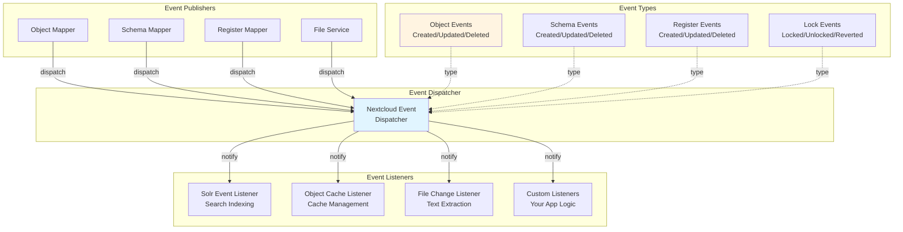
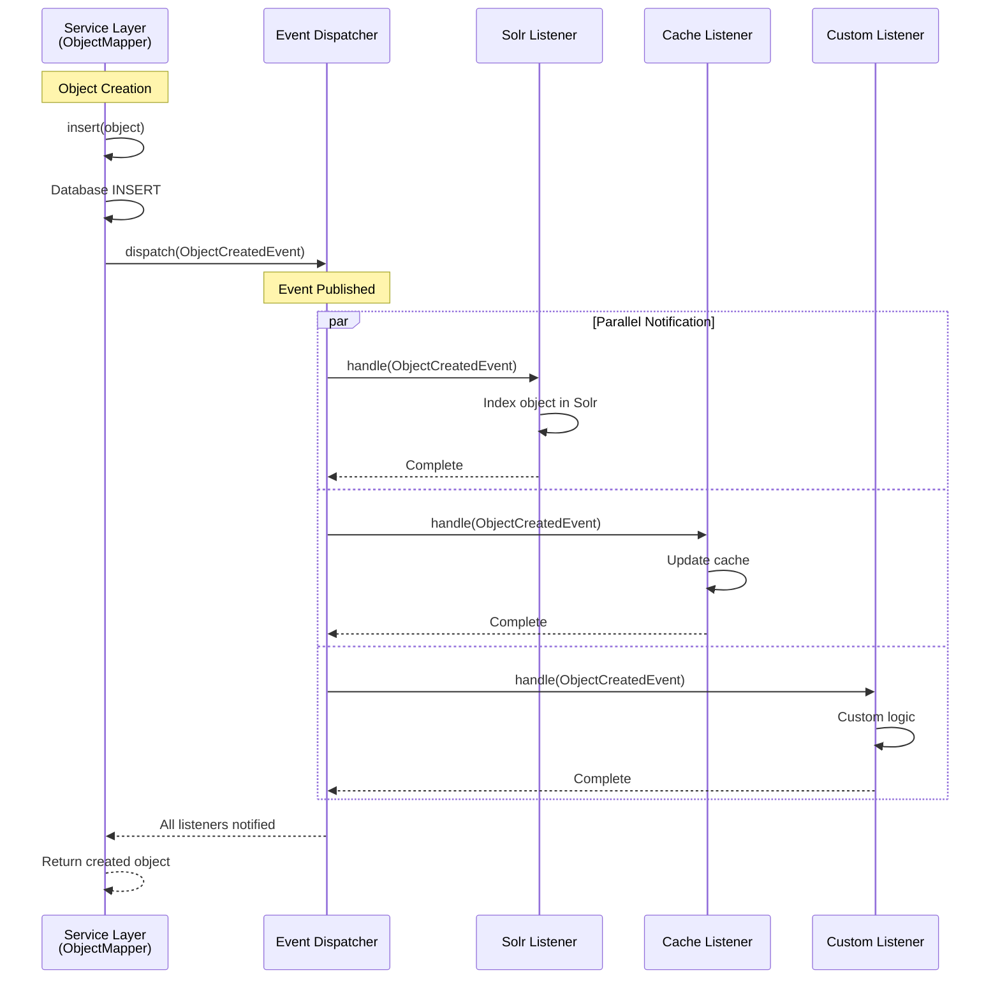
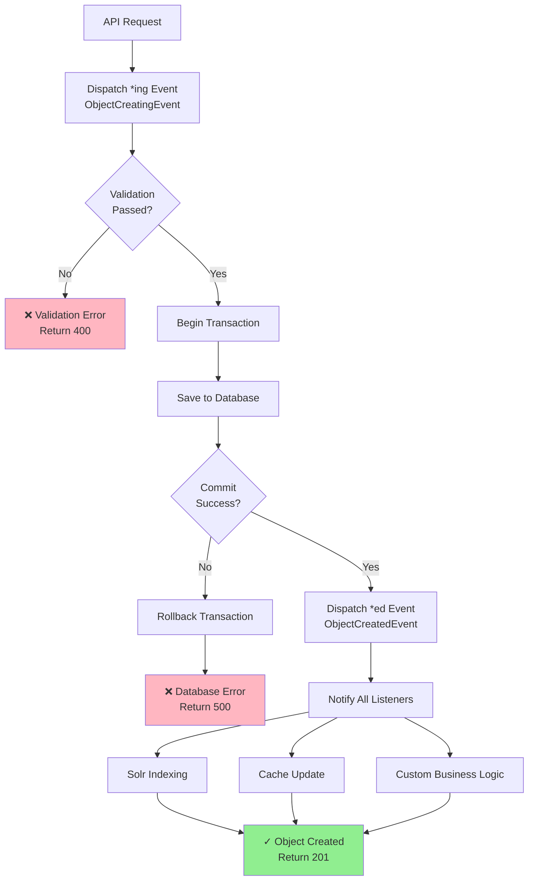

import ApiSchema from '@theme/ApiSchema';
import Tabs from '@theme/Tabs';
import TabItem from '@theme/TabItem';

# Events

## What are Events in Open Register?

In Open Register, **Events** are notifications that are triggered when significant actions occur within the system. They form the foundation of Open Register's event-driven architecture, enabling loose coupling between components while facilitating rich integration possibilities.

Events in Open Register are:
- Triggered automatically at key points in the application lifecycle
- Standardized messages containing relevant data about what occurred
- Available for other components to listen and respond to
- Essential for building extensible, integrated systems
- Compatible with Nextcloud's event dispatcher system

## Event Structure

An event in Open Register consists of the following key components:

| Component | Description |
|-----------|-------------|
| Event Class | The PHP class that defines the event type |
| Event Data | The data payload carried by the event |
| Timestamp | When the event occurred |
| Source | The component that triggered the event |
| Context | Additional contextual information |

## Event Categories

Open Register provides several categories of events:

### 1. Schema Events

Events related to schema lifecycle:
- **SchemaCreatedEvent**: Triggered when a new schema is created
- **SchemaUpdatedEvent**: Triggered when a schema is updated
- **SchemaDeletedEvent**: Triggered when a schema is deleted

### 2. Register Events

Events related to register lifecycle:
- **RegisterCreatedEvent**: Triggered when a new register is created
- **RegisterUpdatedEvent**: Triggered when a register is updated
- **RegisterDeletedEvent**: Triggered when a register is deleted

### 3. Object Events

Events related to object lifecycle:
- **ObjectCreatedEvent**: Triggered when a new object is created
- **ObjectUpdatedEvent**: Triggered when an object is updated
- **ObjectDeletedEvent**: Triggered when an object is deleted
- **ObjectCreatingEvent**: Triggered just before an object is created
- **ObjectUpdatingEvent**: Triggered just before an object is updated
- **ObjectDeletingEvent**: Triggered just before an object is deleted

### 4. File Events

Events related to file operations:
- **FileUploadedEvent**: Triggered when a file is uploaded
- **FileUpdatedEvent**: Triggered when a file is updated
- **FileDeletedEvent**: Triggered when a file is deleted

### 5. Validation Events

Events related to validation:
- **ValidationSucceededEvent**: Triggered when validation succeeds
- **ValidationFailedEvent**: Triggered when validation fails

### Schema Events

#### SchemaCreatedEvent
- **Class**: `OCA\OpenRegister\Event\SchemaCreatedEvent`
- **Triggered**: When a new schema is created in the system
- **Data Provided**:
  - `getSchema()`: Returns the Schema object that was created
- **Usage**: Can be used to perform additional setup or trigger notifications when new schemas are created

#### SchemaUpdatedEvent
- **Class**: `OCA\OpenRegister\Event\SchemaUpdatedEvent`
- **Triggered**: When a schema is updated
- **Data Provided**:
  - `getSchema()`: Returns the updated Schema object
  - `getOldSchema()`: Returns the Schema object before updates
- **Usage**: Useful for tracking changes to schemas and triggering related actions

#### SchemaDeletedEvent
- **Class**: `OCA\OpenRegister\Event\SchemaDeletedEvent`
- **Triggered**: When a schema is deleted from the system
- **Data Provided**: 
  - `getSchema()`: Returns the Schema object that was deleted
- **Usage**: Can be used to perform cleanup or trigger additional actions when schemas are removed

### Register Events

#### RegisterCreatedEvent
- **Class**: `OCA\OpenRegister\Event\RegisterCreatedEvent`
- **Triggered**: When a new register is created
- **Data Provided**:
  - `getRegister()`: Returns the Register object that was created
- **Usage**: Can be used to perform additional setup or trigger notifications when new registers are created

#### RegisterUpdatedEvent
- **Class**: `OCA\OpenRegister\Event\RegisterUpdatedEvent`
- **Triggered**: When a register is updated
- **Data Provided**:
  - `getRegister()`: Returns the updated Register object
  - `getOldRegister()`: Returns the Register object before updates
- **Usage**: Useful for tracking changes to registers and triggering related actions

#### RegisterDeletedEvent
- **Class**: `OCA\OpenRegister\Event\RegisterDeletedEvent`
- **Triggered**: When a register is deleted
- **Data Provided**:
  - `getRegister()`: Returns the Register object that was deleted
- **Usage**: Can be used for cleanup operations or notifications when registers are removed

### Object Events

#### ObjectCreatedEvent
- **Class**: `OCA\OpenRegister\Event\ObjectCreatedEvent` 
- **Triggered**: When a new object is created in a register
- **Data Provided**:
  - `getObject()`: Returns the ObjectEntity that was created
- **Usage**: Useful for tracking new entries, triggering notifications, or performing additional processing on new objects

#### ObjectUpdatedEvent
- **Class**: `OCA\OpenRegister\Event\ObjectUpdatedEvent`
- **Triggered**: When an existing object is updated in a register
- **Data Provided**:
  - `getObject()`: Returns the updated ObjectEntity
  - `getOldObject()`: Returns the ObjectEntity before updates
- **Usage**: Useful for tracking changes to objects, auditing modifications, or triggering follow-up actions

#### ObjectDeletedEvent
- **Class**: `OCA\OpenRegister\Event\ObjectDeletedEvent`
- **Triggered**: When an object is deleted from a register
- **Data Provided**:
  - `getObject()`: Returns the ObjectEntity that was deleted
- **Usage**: Can be used for cleanup operations, maintaining related data integrity, or sending notifications about deletions

## Example Event

Here's an example of an `ObjectCreatedEvent`:

```php
namespace OCA\OpenRegister\Event;

use OCA\OpenRegister\Entity\ObjectEntity;
use OCP\EventDispatcher\Event;

class ObjectCreatedEvent extends Event {
    private ObjectEntity $object;

    public function __construct(ObjectEntity $object) {
        parent::__construct();
        $this->object = $object;
    }

    public function getObject(): ObjectEntity {
        return $this->object;
    }
}
```

## Event-Driven Architecture

Open Register uses an event-driven architecture to provide several benefits:

### 1. Loose Coupling

Components can interact without direct dependencies:
- The event publisher doesn't need to know who is listening
- Listeners can be added or removed without changing the publisher
- Different parts of the system can evolve independently

### 2. Extensibility

The event system makes Open Register highly extensible:
- New functionality can be added by listening to existing events
- Third-party applications can integrate without modifying core code
- Custom business logic can be implemented through event listeners

### 3. Scalability

Event-driven architectures support better scalability:
- Processing can be distributed across different components
- Asynchronous handling allows for better resource management
- Event queues can buffer processing during peak loads

### 4. Observability

Events provide better system observability:
- System activities can be monitored through events
- Audit trails can be built by capturing events
- Debugging is easier with a clear event timeline

## Working with Events

### Listening to Events

To listen to events in Open Register, you need to:

1. Create an event listener class
2. Register it with Nextcloud's event dispatcher

Here's an example of a listener for `ObjectCreatedEvent`:

```php
namespace OCA\MyApp\Listener;

use OCA\OpenRegister\Event\ObjectCreatedEvent;
use OCP\EventDispatcher\Event;
use OCP\EventDispatcher\IEventListener;

class ObjectCreatedListener implements IEventListener {
    public function handle(Event $event): void {
        if (!($event instanceof ObjectCreatedEvent)) {
            return;
        }
        
        $object = $event->getObject();
        // Perform actions with the new object
    }
}
```

### Registering Event Listeners

Register your listener in your app's `Application.php` file:

```php
use OCA\OpenRegister\Event\ObjectCreatedEvent;
use OCA\MyApp\Listener\ObjectCreatedListener;
use OCP\EventDispatcher\IEventDispatcher;

// In the register() method:
$dispatcher = $this->getContainer()->get(IEventDispatcher::class);
$dispatcher->addServiceListener(ObjectCreatedEvent::class, ObjectCreatedListener::class);
```

If you're extending Open Register, you might need to dispatch your own events. You can read more about event handling in the [Nextcloud documentation](https://docs.nextcloud.com/server/latest/developer_manual/basics/events.html).

## Event Relationships

Events have important relationships with other core concepts:

### Events and Objects

- Events are triggered by changes to objects
- Events carry object data
- Events enable tracking object lifecycle

### Events and Schemas

- Schema changes trigger events
- Events can be used to validate schema compatibility
- Events enable schema evolution tracking

### Events and Registers

- Register operations trigger events
- Events can be used to monitor register usage
- Events enable register lifecycle management

### Events and Files

- File operations trigger events
- Events carry file metadata
- Events enable file processing workflows

## Use Cases

### 1. Integration

Use events to integrate with other systems:
- Sync data with external systems
- Trigger notifications in messaging platforms
- Update search indexes

### 2. Workflow Automation

Build automated workflows:
- Generate documents when objects are created
- Send approval requests when objects are updated
- Archive data when objects are deleted

### 3. Audit and Compliance

Implement audit and compliance features:
- Log all changes to sensitive data
- Track who did what and when
- Generate compliance reports

### 4. Custom Business Logic

Implement custom business logic:
- Validate complex business rules
- Enforce data quality standards
- Implement approval workflows

## Best Practices

1. **Keep Listeners Focused**: Each listener should have a single responsibility
2. **Handle Errors Gracefully**: Listeners should not break the system if they fail
3. **Consider Performance**: Heavy processing should be done asynchronously
4. **Document Events**: Clearly document what events are available and when they're triggered
5. **Version Events**: Consider versioning events to handle changes over time
6. **Test Event Handling**: Write tests for event listeners
7. **Monitor Event Flow**: Implement monitoring for event processing

## Conclusion

Events in Open Register provide a powerful mechanism for extending functionality, integrating with other systems, and building loosely coupled architectures. By leveraging the event-driven approach, you can create flexible, scalable applications that can evolve over time while maintaining a clean separation of concerns.

## Technical Implementation

### Architecture Overview

OpenRegister's event system is built on Nextcloud's event dispatcher, providing a pub-sub architecture:



### Event Flow

Complete lifecycle of an event from dispatch to handling:



### Event Lifecycle

Before and after events for transaction-safe operations:



### Event Class Structure

All events follow a consistent structure:

```php
namespace OCA\OpenRegister\Event;

use OCA\OpenRegister\Db\ObjectEntity;
use OCP\EventDispatcher\Event;

class ObjectCreatedEvent extends Event
{
    private ObjectEntity $object;
    
    public function __construct(ObjectEntity $object)
    {
        parent::__construct();
        $this->object = $object;
    }
    
    public function getObject(): ObjectEntity
    {
        return $this->object;
    }
}
```

### Event Catalog

Complete list of events by category:

| Category | Event Class | Triggered When | Data Provided |
|----------|-------------|----------------|---------------|
| **Object** | `ObjectCreatingEvent` | Before object creation | `getObject()` (draft) |
| | `ObjectCreatedEvent` | After object created | `getObject()` |
| | `ObjectUpdatingEvent` | Before object update | `getObject()`, `getOldObject()` |
| | `ObjectUpdatedEvent` | After object updated | `getObject()`, `getOldObject()` |
| | `ObjectDeletingEvent` | Before object deletion | `getObject()` |
| | `ObjectDeletedEvent` | After object deleted | `getObject()` |
| | `ObjectLockedEvent` | Object locked | `getObject()` |
| | `ObjectUnlockedEvent` | Object unlocked | `getObject()` |
| | `ObjectRevertedEvent` | Object reverted to version | `getObject()`, `getVersion()` |
| **Schema** | `SchemaCreatedEvent` | After schema created | `getSchema()` |
| | `SchemaUpdatedEvent` | After schema updated | `getSchema()`, `getOldSchema()` |
| | `SchemaDeletedEvent` | After schema deleted | `getSchema()` |
| **Register** | `RegisterCreatedEvent` | After register created | `getRegister()` |
| | `RegisterUpdatedEvent` | After register updated | `getRegister()`, `getOldRegister()` |
| | `RegisterDeletedEvent` | After register deleted | `getRegister()` |
| **Organisation** | `OrganisationCreatedEvent` | After organisation created | `getOrganisation()` |

### Built-in Event Listeners

OpenRegister includes several built-in listeners:

**1. Solr Event Listener** (`SolrEventListener.php`)
- Listens to: `ObjectCreatedEvent`, `ObjectUpdatedEvent`, `ObjectDeletedEvent`
- Purpose: Automatically indexes/updates/removes objects in Solr
- Priority: High (ensures search index stays synchronized)

**2. Object Cache Listener** (`ObjectCacheListener.php`)
- Listens to: `ObjectCreatedEvent`, `ObjectUpdatedEvent`, `ObjectDeletedEvent`
- Purpose: Manages object cache for UUID resolution
- Priority: High (maintains cache consistency)

**3. File Change Listener** (`FileChangeListener.php`)
- Listens to: File system events
- Purpose: Queues text extraction jobs for uploaded files
- Priority: Normal (background processing)

### Event Registration

Events are registered in `Application.php`:

```php
use OCP\EventDispatcher\IEventDispatcher;
use OCA\OpenRegister\Event\ObjectCreatedEvent;
use OCA\OpenRegister\EventListener\SolrEventListener;

public function register(IRegistrationContext $context): void
{
    // Register event listeners
    $context->registerEventListener(
        ObjectCreatedEvent::class,
        SolrEventListener::class
    );
    
    $context->registerEventListener(
        ObjectUpdatedEvent::class,
        SolrEventListener::class
    );
    
    $context->registerEventListener(
        ObjectDeletedEvent::class,
        SolrEventListener::class
    );
}
```

### Creating Custom Event Listeners

**Step 1: Create Listener Class**

```php
namespace OCA\MyApp\Listener;

use OCA\OpenRegister\Event\ObjectCreatedEvent;
use OCP\EventDispatcher\Event;
use OCP\EventDispatcher\IEventListener;
use Psr\Log\LoggerInterface;

class MyObjectListener implements IEventListener
{
    private LoggerInterface $logger;
    
    public function __construct(LoggerInterface $logger)
    {
        $this->logger = $logger;
    }
    
    public function handle(Event $event): void
    {
        if (!($event instanceof ObjectCreatedEvent)) {
            return;
        }
        
        $object = $event->getObject();
        
        // Your custom logic here
        $this->logger->info('New object created', [
            'uuid' => $object->getUuid(),
            'schema' => $object->getSchema(),
            'register' => $object->getRegister()
        ]);
        
        // Example: Send notification
        $this->sendNotification($object);
        
        // Example: Update external system
        $this->syncToExternalSystem($object);
    }
    
    private function sendNotification(ObjectEntity $object): void
    {
        // Implementation
    }
    
    private function syncToExternalSystem(ObjectEntity $object): void
    {
        // Implementation
    }
}
```

**Step 2: Register in Application.php**

```php
public function register(IRegistrationContext $context): void
{
    $context->registerEventListener(
        ObjectCreatedEvent::class,
        MyObjectListener::class
    );
}
```

### Event Priority and Ordering

Listeners execute in registration order. For custom ordering:

```php
// High priority listener (executes first)
$context->registerEventListener(
    ObjectCreatedEvent::class,
    CriticalListener::class,
    -100  // Negative priority = earlier execution
);

// Normal priority
$context->registerEventListener(
    ObjectCreatedEvent::class,
    StandardListener::class,
    0  // Default priority
);

// Low priority listener (executes last)
$context->registerEventListener(
    ObjectCreatedEvent::class,
    CleanupListener::class,
    100  // Positive priority = later execution
);
```

### Error Handling in Listeners

Best practices for handling errors:

```php
public function handle(Event $event): void
{
    if (!($event instanceof ObjectCreatedEvent)) {
        return;
    }
    
    try {
        $object = $event->getObject();
        $this->processObject($object);
        
    } catch (\Exception $e) {
        // Log error but don't break event chain
        $this->logger->error('Failed to process object event', [
            'error' => $e->getMessage(),
            'trace' => $e->getTraceAsString()
        ]);
        
        // Optionally: Queue for retry
        $this->queueForRetry($object);
        
        // Don't throw - let other listeners execute
    }
}
```

### Asynchronous Event Processing

For heavy operations, use background jobs:

```php
use OCP\BackgroundJob\IJobList;

public function handle(Event $event): void
{
    if (!($event instanceof ObjectCreatedEvent)) {
        return;
    }
    
    $object = $event->getObject();
    
    // Queue background job instead of processing immediately
    $this->jobList->add(ProcessObjectJob::class, [
        'objectId' => $object->getId(),
        'objectUuid' => $object->getUuid()
    ]);
    
    $this->logger->debug('Queued object processing job');
}
```

### Performance Considerations

**1. Lightweight Listeners**
- Keep listener logic minimal
- Delegate heavy work to background jobs
- Avoid blocking operations

**2. Conditional Processing**
- Check event type early
- Return quickly if not relevant
- Use property checks before full processing

**3. Error Isolation**
- Catch all exceptions
- Log errors comprehensively
- Don't break the event chain

**4. Monitoring**
- Log listener execution time
- Track processing failures
- Monitor queue depths

### Testing Event Listeners

**Unit Test Example:**

```php
use PHPUnit\Framework\TestCase;

class MyObjectListenerTest extends TestCase
{
    public function testHandlesObjectCreatedEvent()
    {
        $object = $this->createMock(ObjectEntity::class);
        $object->method('getUuid')->willReturn('test-uuid');
        
        $event = new ObjectCreatedEvent($object);
        
        $listener = new MyObjectListener($this->logger);
        $listener->handle($event);
        
        // Assert expected behavior
        $this->assertTrue(true); // Add real assertions
    }
    
    public function testIgnoresOtherEvents()
    {
        $event = new SchemaCreatedEvent($this->createMock(Schema::class));
        
        $listener = new MyObjectListener($this->logger);
        $listener->handle($event);
        
        // Should return early without processing
        $this->assertTrue(true);
    }
}
```

### Monitoring and Debugging

**Event Flow Debugging:**

```bash
# Enable debug logging
docker exec nextcloud-container occ config:app:set openregister log_level --value=debug

# Watch event dispatching
docker logs -f nextcloud-container | grep "Event.*dispatched"

# Check listener execution
docker logs -f nextcloud-container | grep "Listener.*handle"
```

**Event Statistics:**

```bash
# Count events by type (from logs)
docker logs nextcloud-container | grep "Event dispatched" | awk '{print $NF}' | sort | uniq -c

# Find failed event handlers
docker logs nextcloud-container | grep "Failed to.*event" | wc -l
```

### Best Practices Summary

**✓ DO:**
- Keep listeners focused on single responsibility
- Handle errors gracefully without breaking event chain
- Use background jobs for heavy processing
- Log listener activity for debugging
- Test listeners thoroughly
- Document what your listeners do

**✗ DON'T:**
- Don't perform blocking operations in listeners
- Don't throw exceptions unless critical
- Don't modify event data (events should be immutable)
- Don't create circular event dependencies
- Don't bypass the event system for convenience

### Code Examples

**Complete Custom Listener:**

```php
namespace OCA\MyApp\Listener;

use OCA\OpenRegister\Event\ObjectCreatedEvent;
use OCA\OpenRegister\Event\ObjectUpdatedEvent;
use OCP\EventDispatcher\Event;
use OCP\EventDispatcher\IEventListener;
use Psr\Log\LoggerInterface;

class AuditLogListener implements IEventListener
{
    private LoggerInterface $logger;
    private AuditService $auditService;
    
    public function __construct(
        LoggerInterface $logger,
        AuditService $auditService
    ) {
        $this->logger = $logger;
        $this->auditService = $auditService;
    }
    
    public function handle(Event $event): void
    {
        try {
            if ($event instanceof ObjectCreatedEvent) {
                $this->handleCreated($event);
            } elseif ($event instanceof ObjectUpdatedEvent) {
                $this->handleUpdated($event);
            }
        } catch (\Exception $e) {
            $this->logger->error('Audit logging failed', [
                'error' => $e->getMessage(),
                'event' => get_class($event)
            ]);
        }
    }
    
    private function handleCreated(ObjectCreatedEvent $event): void
    {
        $object = $event->getObject();
        
        $this->auditService->log([
            'action' => 'object_created',
            'object_uuid' => $object->getUuid(),
            'schema' => $object->getSchema(),
            'register' => $object->getRegister(),
            'timestamp' => time(),
            'user' => \OC::$server->getUserSession()->getUser()->getUID()
        ]);
    }
    
    private function handleUpdated(ObjectUpdatedEvent $event): void
    {
        $object = $event->getObject();
        $oldObject = $event->getOldObject();
        
        $changes = $this->detectChanges($oldObject, $object);
        
        $this->auditService->log([
            'action' => 'object_updated',
            'object_uuid' => $object->getUuid(),
            'changes' => $changes,
            'timestamp' => time(),
            'user' => \OC::$server->getUserSession()->getUser()->getUID()
        ]);
    }
    
    private function detectChanges($old, $new): array
    {
        // Implementation to detect what changed
        return [];
    }
}
``` 
