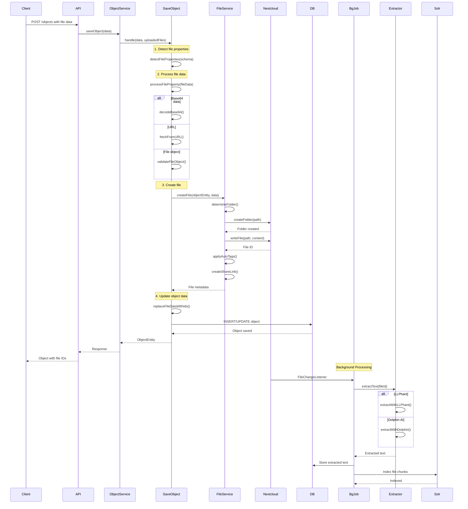
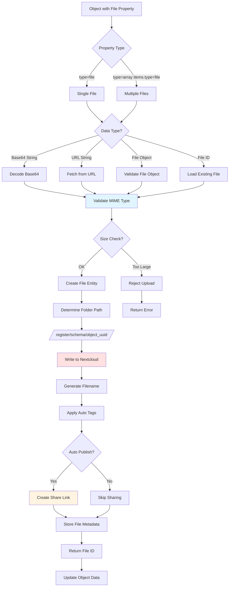
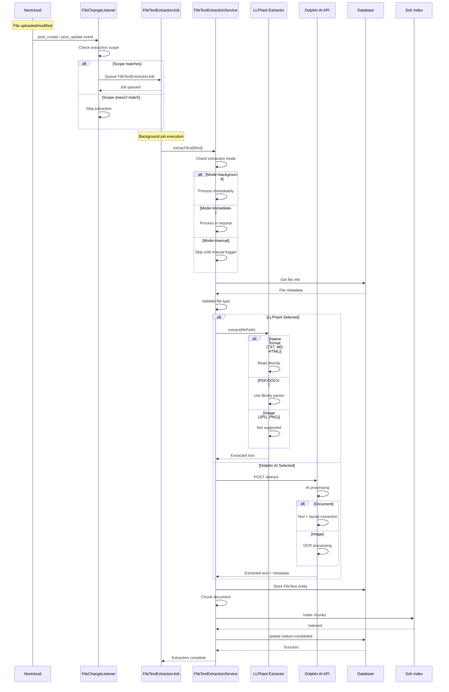
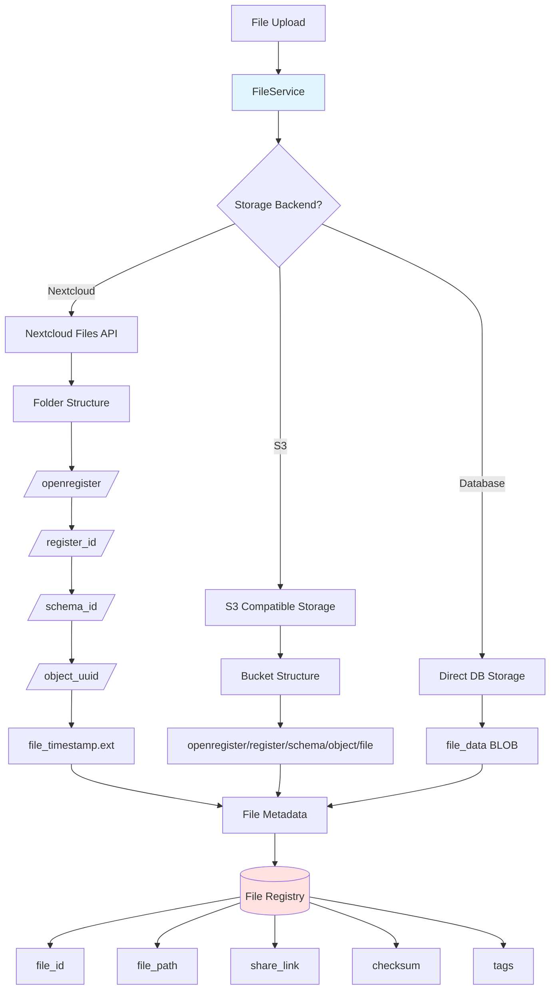
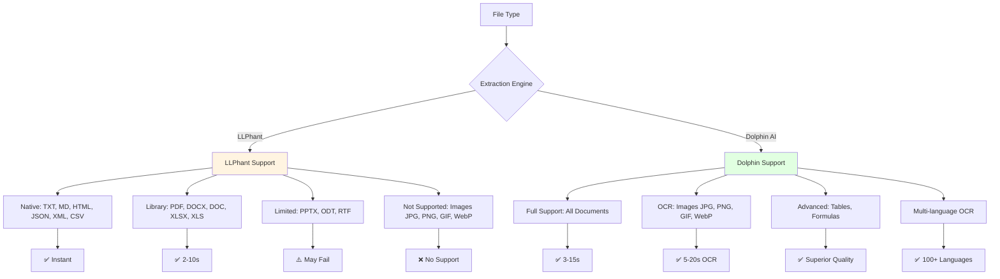
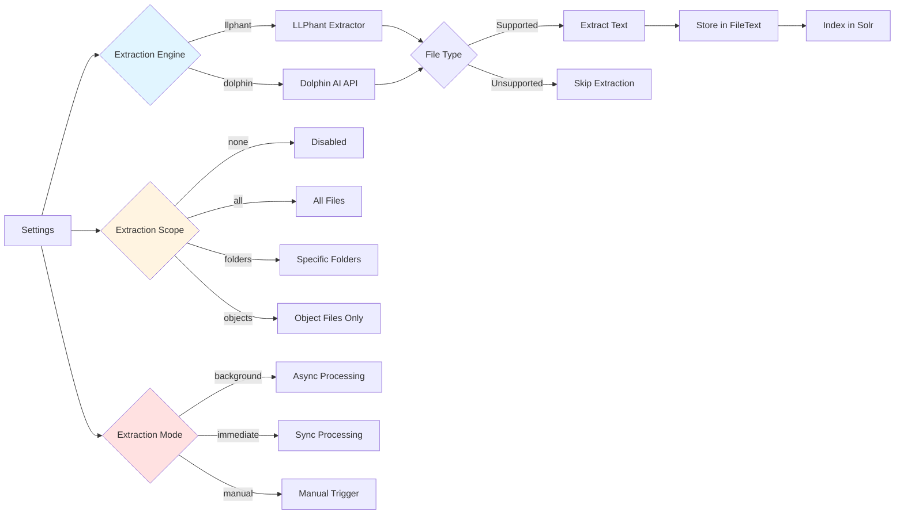
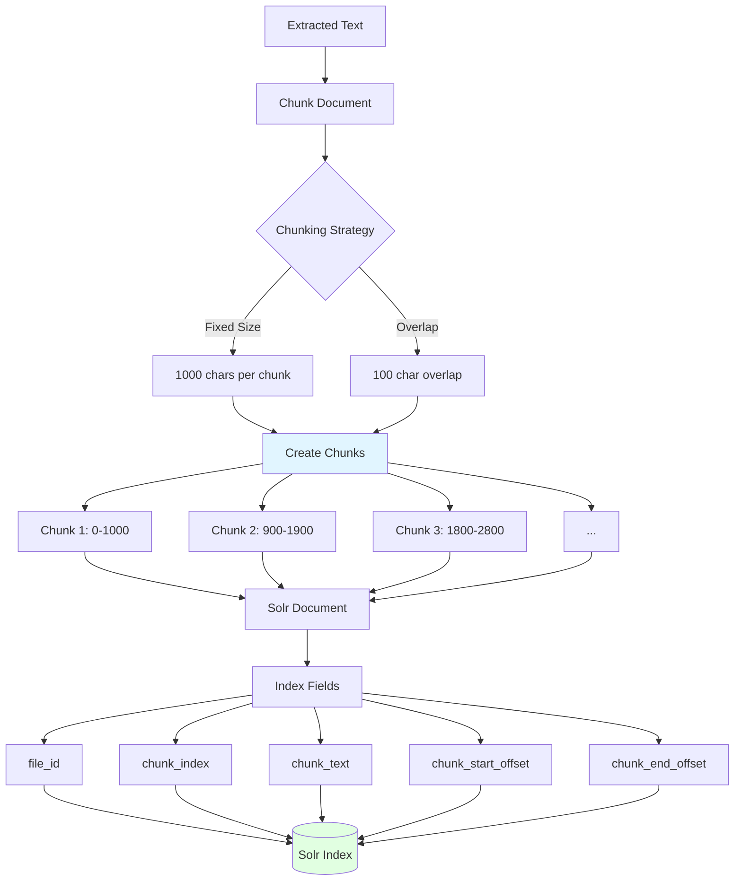

import ApiSchema from '@theme/ApiSchema';
import Tabs from '@theme/Tabs';
import TabItem from '@theme/TabItem';

# Files

## What are Files in Open Register?

In Open Register, **Files** are binary data attachments that can be associated with objects. They extend the system beyond structured data to include documents, images, videos, and other file types that are essential for many applications.

Files in Open Register are:
- Securely stored and managed
- Associated with specific objects
- Versioned alongside their parent objects
- Accessible through a consistent API
- Integrated with Nextcloud's file management capabilities

## Attaching Files to Objects

Files can be attached to objects in several ways:

1. Schema-defined file properties: When a schema includes properties of type 'file', these are automatically handled during object creation or updates
2. Direct API attachment: Files can be added to an object after creation using the file attachment API endpoints
3. Base64 encoded content: Files can be included in object data as base64-encoded strings
4. URL references: External files can be referenced by URL and will be downloaded and stored locally

## File Metadata and Tagging

Each file attachment includes rich metadata:

- Basic properties (name, size, type, extension)
- Creation and modification timestamps
- Access and download URLs
- Checksum for integrity verification
- Custom tags for categorization

### Tagging System

Files can be tagged with both simple labels and key-value pairs:
- Tags with a colon (':') are treated as key-value pairs and can be used for advanced filtering and organization

## Version Control

The system maintains file versions by:

- Tracking file modifications with timestamps
- Preserving checksums to detect changes
- Integrating with the object audit trail system
- Supporting file restoration from previous versions

## Security and Access Control

File attachments inherit the security model of their parent objects:

- Files are stored in NextCloud with appropriate permissions
- Share links can be generated for controlled external access
- Access is managed through the OpenRegister user and group system
- Files are associated with the OpenRegister application user for consistent permissions

## File Operations

The system supports the following operations on file attachments:

- Retrieving Files
- Updating Files
- Deleting Files

## File Preview and Rendering

The system leverages NextCloud's preview capabilities for supported file types:

- Images are displayed as thumbnails
- PDFs can be previewed in-browser
- Office documents can be viewed with compatible apps
- Preview URLs are generated for easy embedding

## Integration with Object Lifecycle

File attachments are fully integrated with the object lifecycle:

- When objects are created, their file folders are automatically provisioned
- When objects are updated, file references are maintained
- When objects are deleted, associated files can be optionally preserved or removed
- File operations are recorded in the object's audit trail

## Technical Implementation

The file attachment system is implemented through two main service classes:

- FileService: Handles low-level file operations, folder management, and NextCloud integration
- ObjectService: Provides high-level methods for attaching, retrieving, and managing files in the context of objects

These services work together to provide a seamless file management experience within the OpenRegister application.

## File Structure

<ApiSchema id="open-register" example   pointer="#/components/schemas/File" />

## How Files are Stored

Open Register provides flexible storage options for files:

### 1. Nextcloud Storage

By default, files are stored in Nextcloud's file system, leveraging its robust file management capabilities, including:
- Access control
- Versioning
- Encryption
- Collaborative editing

### 2. External Storage

For larger deployments or specialized needs, files can be stored in:
- Object storage systems (S3, MinIO)
- Content delivery networks
- Specialized document management systems

### 3. Database Storage

Small files can be stored directly in the database for simplicity and performance.

## File Features

### 1. Versioning

Files maintain version history, allowing you to:
- Track changes over time
- Revert to previous versions
- Compare different versions

### 2. Access Control

Files inherit access control from their parent objects, ensuring consistent security:
- Users who can access an object can access its files
- Additional file-specific permissions can be applied
- Permissions can be audited

### 3. Metadata

Files support rich metadata to provide context and improve searchability:
- Standard metadata (creation date, size, type)
- Custom metadata specific to your application
- Extracted metadata (e.g., EXIF data from images)

### 4. Preview Generation

Open Register can generate previews for common file types:
- Thumbnails for images
- PDF previews
- Document previews

### 5. Content Extraction

For supported file types, content can be extracted for indexing and search:
- Text extraction from documents
- OCR for scanned documents and images
- Metadata extraction

**Asynchronous Processing**: Text extraction happens in the background after file upload, ensuring:
- **Fast uploads**: Your file uploads complete instantly without waiting
- **Non-blocking**: Users don't experience delays during file operations
- **Reliable**: Background jobs automatically handle retries for failed extractions
- **Resource-efficient**: Processing happens when resources are available

**Text Extraction Options**:

OpenRegister supports two text extraction engines:

1. **LLPhant (Default)** - PHP-based extraction:
   - ✓ Native support: TXT, MD, HTML, JSON, XML, CSV
   - ○ Library support: PDF, DOCX, DOC, XLSX, XLS (requires PhpOffice, PdfParser)
   - ⚠️ Limited: PPTX, ODT, RTF
   - ✗ No support: Image files (JPG, PNG, GIF, WebP)
   - Best for: Privacy-conscious environments, regular documents
   - Cost: Free (included)

2. **Dolphin AI** - Advanced AI-powered extraction:
   - ✓ All document formats with superior quality
   - ✓ OCR for scanned documents and images (JPG, PNG, GIF, WebP)
   - ✓ Advanced table extraction
   - ✓ Formula recognition
   - ✓ Multi-language OCR
   - Best for: Complex documents, scanned materials, images with text
   - Cost: API subscription required

**Extraction Scope Options**:
- **None**: Text extraction disabled
- **All files**: Extract from all uploaded files
- **Files in folders**: Extract only from files in specific folders
- **Files attached to objects**: Extract only from files linked to objects (recommended)

**Typical Processing Times**:
- Text files: < 1 second
- PDFs (LLPhant): 2-10 seconds
- PDFs (Dolphin): 3-15 seconds
- Large documents or OCR: 10-60 seconds
- Images with OCR (Dolphin): 5-20 seconds

You can configure text extraction in Settings → File Configuration. Check extraction status in the file's metadata after upload.

### Technical Implementation

**Background Job Processing**:

Text extraction uses Nextcloud's background job system for reliable, async processing:

1. **File Upload** - User uploads a file
2. **Job Queuing** - 'FileChangeListener' automatically queues 'FileTextExtractionJob'
3. **Job Execution** - Background job system processes the file when resources are available
4. **Text Extraction** - Selected extractor (LLPhant or Dolphin) processes the file
5. **Storage** - Extracted text stored in 'FileText' entity for searching
6. **Completion** - Status updated to 'completed' or 'failed'

**File Type Compatibility Matrix**:

**LLPhant Support:**
- ✓ **Native** (TXT, MD, HTML, JSON, XML, CSV) - Perfect quality, very fast
- ○ **Library** (PDF, DOCX, DOC, XLSX, XLS) - Good quality, medium speed
- ⚠️ **Limited** (PPTX, ODT, RTF) - Basic text only, use Dolphin for better results
- ✗ **No Support** (JPG, PNG, GIF, WebP) - Requires Dolphin with OCR

**Dolphin AI Support:**
- ✓ All formats with superior quality
- ✓ OCR for scanned documents and images
- ✓ Table extraction with structure preserved
- ✓ Formula recognition (LaTeX format)
- ✓ Multi-language support
- ✓ Layout understanding (multi-column, etc.)

**OCR-Specific Use Cases (Dolphin only)**:
1. **Document Digitization** - Scanning paper archives into searchable text
2. **Receipt Processing** - Photo receipts from mobile devices
3. **Screenshot Analysis** - Extract text from application screenshots
4. **Infographic Text** - Extract text from images with embedded text
5. **Historical Documents** - Digitize old scanned materials

**Quality Requirements for OCR**:
- Minimum: 150 DPI resolution
- Recommended: 300+ DPI
- Clear, high-contrast images
- Minimal blur or distortion
- Properly oriented (not rotated)

**Extraction Configuration Options**:

Configure in Settings → File Configuration:

1. **Text Extractor Selection**:
   - LLPhant (default) - Local, free, privacy-friendly
   - Dolphin - Advanced AI, requires API key

2. **Extraction Scope**:
   - None - Disabled
   - All files - Every uploaded file
   - Files in folders - Specific folders only
   - Files attached to objects - Only object attachments (recommended)

3. **Extraction Mode**:
   - Background (default) - Async via background jobs
   - Immediate - Synchronous during upload (slower)
   - Manual - Triggered by admin action only

4. **Enabled File Types**:
   - Select which file extensions to process
   - Different for LLPhant vs Dolphin
   - Enable OCR formats (images) only if using Dolphin

**Integration Tests**:

The file text extraction system includes comprehensive integration tests:

```bash
# Run file extraction tests
vendor/bin/phpunit tests/Integration/FileTextExtractionIntegrationTest.php

# Test cases covered:
# - File upload queues background job
# - Background job execution completes
# - Text extraction end-to-end with content verification
# - Multiple file format support (TXT, MD, JSON)
# - Extraction metadata recording (status, method, timestamps)
```

**Monitoring Extraction**:

Check extraction status via logs:

```bash
# Watch extraction progress
docker logs -f nextcloud-container | grep FileTextExtractionJob

# Check for errors
docker logs nextcloud-container | grep "extraction failed"

# View extraction statistics
# Settings → File Configuration → Statistics section
```

## Working with Files

### Uploading Files

Files can be uploaded and attached to objects:

```
POST /api/objects/{id}/files
Content-Type: multipart/form-data

file: [binary data]
metadata: {"author": "Legal Department", "securityLevel": "confidential"}
```

### Retrieving Files

You can download a file:

```
GET /api/files/{id}
```

Or get file metadata:

```
GET /api/files/{id}/metadata
```

### Listing Files for an Object

You can retrieve all files associated with an object:

```
GET /api/objects/files/{objectId}
```

### Updating Files

Files can be updated in two ways:

#### 1. Update File Content

Upload a new version of the file:

```
PUT /api/objects/{register}/{schema}/{objectId}/files/{fileId}
Content-Type: application/json

{
  'content': '[base64 encoded content or raw content]',
  'tags': ['tag1', 'tag2']
}
```

#### 2. Update Metadata Only

Update only the file metadata (tags) without changing content:

```
PUT /api/objects/{register}/{schema}/{objectId}/files/{fileId}
Content-Type: application/json

{
  'tags': ['updated-tag1', 'updated-tag2']
}
```

Note: The 'content' parameter is optional. If omitted, only the metadata will be updated without modifying the file content itself.

### Deleting Files

Files can be deleted when no longer needed:

```
DELETE /api/files/{id}
```

## File Relationships

Files have important relationships with other core concepts:

### Files and Objects

- Files are attached to objects
- An object can have multiple files
- Files inherit permissions from their parent object
- Files are versioned alongside their parent object

### Files and Schemas

- Schemas can define expectations for file attachments
- File validation can be specified in schemas (allowed types, max size)
- Schemas can define required file attachments

### Files and Registers

- Registers can be configured with different file storage options
- File storage policies can be defined at the register level
- Registers can have quotas for file storage

## Use Cases

### 1. Document Management

Attach important documents to business objects:
- Contracts to customer records
- Invoices to order records
- Specifications to product records

### 2. Media Management

Store and manage media assets:
- Product images
- Marketing materials
- Training videos

### 3. Evidence Collection

Maintain evidence for regulatory or legal purposes:
- Compliance documentation
- Audit evidence
- Legal case files

### 4. Technical Documentation

Manage technical documents:
- User manuals
- Technical specifications
- Installation guides

## Advanced File Features

### 1. Auto-Share Configuration

File properties can be configured to automatically share uploaded files publicly. This is useful for assets that need to be accessible without authentication, such as product images or public documents.

#### Configuration via UI

When editing a schema in the OpenRegister UI:
1. Select a property with type 'file' or 'array' with items type 'file'
2. In the property actions menu, expand the 'File Configuration' section
3. Check the 'Auto-Share Files' checkbox
4. Save the schema

Files uploaded to this property will now be automatically publicly shared.

#### Configuration via API

In your schema definition, add the 'autoPublish' option to file properties:

```json
{
  'properties': {
    'productImage': {
      'type': 'file',
      'autoPublish': true,
      'allowedTypes': ['image/jpeg', 'image/png'],
      'maxSize': 5242880
    }
  }
}
```

When 'autoPublish' is set to 'true', files uploaded to this property will automatically:
- Create a public share link
- Set the 'published' timestamp
- Generate a public 'accessUrl' and 'downloadUrl'

#### Important: Property-Level vs Schema-Level autoPublish

⚠️ **Don't confuse these two different 'autoPublish' settings:**

**1. Property-Level autoPublish** (this section):
```json
{
  'properties': {
    'productImage': {
      'type': 'file',
      'autoPublish': true  // ← Controls if FILES are published
    }
  }
}
```
Controls whether files uploaded to this specific property are automatically shared publicly.

**2. Schema-Level autoPublish** (different setting):
```json
{
  'configuration': {
    'autoPublish': true  // ← Controls if OBJECTS are published
  }
}
```
Controls whether the object entity itself is published (has nothing to do with file sharing).

**These are completely separate settings** with different purposes. Setting one does NOT affect the other.

#### Example Response

```json
{
  'id': '12345',
  'title': 'Product A',
  'productImage': {
    'id': 789,
    'title': 'product-a.jpg',
    'accessUrl': 'https://your-domain.com/index.php/s/AbCdEfG123',
    'downloadUrl': 'https://your-domain.com/index.php/s/AbCdEfG123/download',
    'published': '2024-01-15T10:30:00+00:00',
    'size': 245678,
    'type': 'image/jpeg'
  }
}
```

### 2. Authenticated File Access

Files that are not publicly shared still have 'accessUrl' and 'downloadUrl' properties, but these URLs require authentication. This allows frontend applications to:
- Display file previews for logged-in users
- Provide download links that work within authenticated sessions
- Maintain security while offering convenient access

#### Authenticated URLs

Non-shared files return URLs with the following format:
- **Access URL**: '/index.php/core/preview?fileId={fileId}&x=1920&y=1080&a=1'
- **Download URL**: '/index.php/apps/openregister/api/files/{fileId}/download'

These URLs require the user to be authenticated to Nextcloud.

#### Example Response (Non-Shared File)

```json
{
  'attachment': {
    'id': 456,
    'title': 'confidential-report.pdf',
    'accessUrl': 'https://your-domain.com/index.php/core/preview?fileId=456&x=1920&y=1080&a=1',
    'downloadUrl': 'https://your-domain.com/index.php/apps/openregister/api/files/456/download',
    'published': null,
    'size': 1234567,
    'type': 'application/pdf'
  }
}
```

### 3. Logo/Image Metadata from File Properties

When a schema is configured to extract metadata fields like 'image' or 'logo' from file properties, the system automatically extracts the public share URL (or authenticated URL if not shared) and stores it in the object metadata.

#### Configuration

```json
{
  'properties': {
    'logo': {
      'type': 'file',
      'allowedTypes': ['image/png', 'image/jpeg'],
      'autoPublish': true
    }
  },
  'configuration': {
    'objectImageField': 'logo'
  }
}
```

#### Result

The object's '@self.image' field will contain the share URL:

```json
{
  'id': '12345',
  'title': 'Company A',
  'logo': {
    'id': 789,
    'accessUrl': 'https://your-domain.com/index.php/s/XyZ789',
    'type': 'image/png'
  },
  '@self': {
    'name': 'Company A',
    'image': 'https://your-domain.com/index.php/s/XyZ789'
  }
}
```

This makes it easy to display company logos, product images, or other visual metadata in listings and search results.

### 4. File Deletion via API

Files can be deleted by setting the file property to 'null' (for single file properties) or an empty array (for array file properties).

#### Single File Deletion

```http
PUT /api/objects/{register}/{schema}/{id}
Content-Type: application/json

{
  'title': 'Updated Title',
  'attachment': null
}
```

This will:
- Delete the file from Nextcloud storage
- Remove the file record from the database
- Set the 'attachment' property to 'null' in the object data

#### File Array Deletion

```http
PUT /api/objects/{register}/{schema}/{id}
Content-Type: application/json

{
  'title': 'Updated Gallery',
  'images': []
}
```

This will:
- Delete all files in the array from Nextcloud storage
- Remove all file records from the database
- Set the 'images' property to an empty array in the object data

#### Use Cases

- **Privacy Compliance**: Remove sensitive files upon user request
- **Storage Management**: Clean up unused files
- **Data Lifecycle**: Remove temporary or expired files
- **Error Correction**: Remove incorrectly uploaded files

## Best Practices

1. **Define File Types**: Establish clear guidelines for what file types are allowed
2. **Set Size Limits**: Define appropriate size limits for different file types
3. **Use Metadata**: Add relevant metadata to improve searchability and context
4. **Consider Storage**: Choose appropriate storage backends based on file types and access patterns
5. **Implement Retention Policies**: Define how long files should be kept
6. **Plan for Backup**: Ensure files are included in backup strategies
7. **Consider Performance**: Optimize file storage for your access patterns
8. **Use Auto-Publish Wisely**: Only enable property-level 'autoPublish' for files that should be publicly accessible. Remember: property 'autoPublish' (file sharing) is different from schema 'autoPublish' (object publishing)
9. **Document File Deletion**: Maintain audit trails when files are deleted for compliance
10. **Handle Authentication**: Use authenticated URLs for sensitive files

## Conclusion

Files in Open Register bridge the gap between structured data and unstructured content, providing a comprehensive solution for managing all types of information in your application. With advanced features like auto-sharing, authenticated access, metadata extraction, and flexible deletion options, Open Register creates a unified system where all your data—structured and unstructured—works together seamlessly.

---

## Technical Architecture

This section provides detailed visualization of the file handling system's architecture and data flow.

### File Upload and Processing Flow



### File Property Processing Pipeline



### Text Extraction Process



### File Storage Architecture



### File Type Compatibility Matrix



### File Text Extraction Settings



### File Chunking for Solr



### Performance Characteristics

**File Upload Performance:**
```
Small files (<1MB):      ~100-200ms
Medium files (1-10MB):   ~500ms-2s
Large files (>10MB):     ~2-10s
Very large (>100MB):     ~10-60s
```

**Text Extraction Performance:**
```
LLPhant:
- TXT/MD/HTML:    <1s    (instant)
- PDF (10 pages): 2-5s   (library parsing)
- DOCX:           3-8s   (library parsing)
- Images:         N/A    (not supported)

Dolphin AI:
- TXT/MD/HTML:    1-2s   (API latency)
- PDF (10 pages): 5-10s  (AI processing)
- DOCX:           4-8s   (AI processing)
- Images (OCR):   5-15s  (OCR + AI)
```

**Chunking and Indexing:**
```
Text chunking:     <100ms  for 100KB text
Solr indexing:     ~50-200ms per document (10 chunks)
Batch indexing:    ~500ms for 100 chunks
```

### Code Examples

#### Processing File Upload

```php
use OCA\OpenRegister\Service\FileService;

// Create file from base64
$fileMetadata = $fileService->createFile(
    objectEntity: $object,
    fileData: [
        'content' => 'data:image/jpeg;base64,/9j/4AAQ...',
        'tags' => ['profile', 'avatar']
    ]
);

// Create file from URL
$fileMetadata = $fileService->createFile(
    objectEntity: $object,
    fileData: [
        'url' => 'https://example.com/document.pdf',
        'tags' => ['imported', 'external']
    ]
);

// Access file metadata
$fileId = $fileMetadata['id'];
$shareLinkUrl = $fileMetadata['accessUrl'];
$downloadUrl = $fileMetadata['downloadUrl'];
```

#### Text Extraction

```php
use OCA\OpenRegister\Service\FileTextExtractionService;

// Extract text from file
$extractionService->extractText($fileId);

// Get extraction status
$fileText = $fileTextMapper->findByFileId($fileId);
$status = $fileText->getExtractionStatus(); // 'pending', 'processing', 'completed', 'failed'
$text = $fileText->getTextContent();

// Manually trigger extraction
$extractionService->queueExtraction($fileId);
```

#### Searching File Content

```php
// Search across file content in Solr
$results = $solrService->searchFiles([
    '_search' => 'contract terms',
    'mime_type' => 'application/pdf',
    '_limit' => 20
]);

// Access chunk results
foreach ($results['hits'] as $hit) {
    $fileId = $hit['file_id'];
    $chunkIndex = $hit['chunk_index'];
    $text = $hit['chunk_text'];
    $highlighted = $hit['highlighted_text'];
}
```

### Testing

```bash
# Run file handling tests
vendor/bin/phpunit tests/Service/FileServiceTest.php

# Test text extraction
vendor/bin/phpunit tests/Service/FileTextExtractionServiceTest.php

# Test specific scenarios
vendor/bin/phpunit --filter testBase64FileUpload
vendor/bin/phpunit --filter testTextExtraction
vendor/bin/phpunit --filter testFileChunking

# Integration tests
vendor/bin/phpunit tests/Integration/FileIntegrationTest.php
```

**Test Coverage:**
- File upload (base64, URL, file object)
- File property processing
- Text extraction (LLPhant, Dolphin)
- Chunking and Solr indexing
- File deletion
- Share link generation
- Auto-tagging 