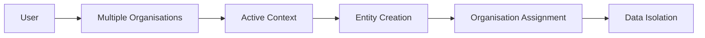
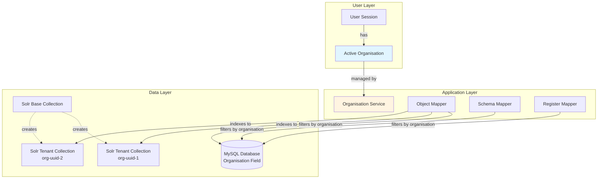
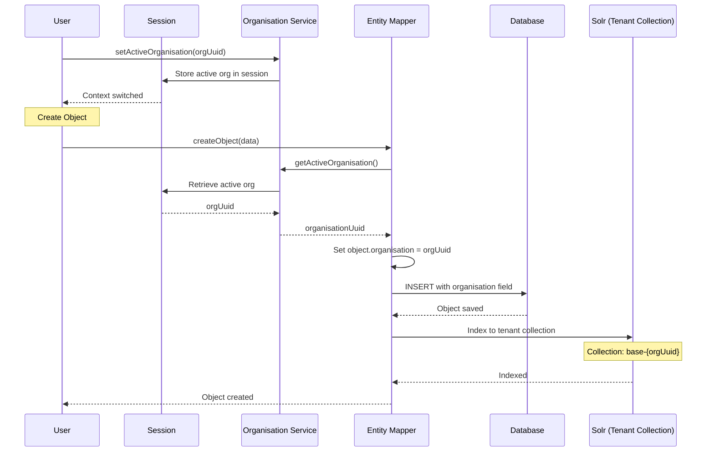

# Multi-Tenancy

OpenRegister's multi-tenancy system provides complete organisation-based data isolation, enabling multiple organizations to securely share the same application instance while maintaining strict data segregation.

## Overview

Multi-tenancy enables organizations to:

- **Maintain Complete Data Isolation**: Each organisation's data remains completely separate
- **Manage User Memberships**: Users can belong to multiple organisations with flexible switching
- **Automatic Entity Assignment**: All registers, schemas, and objects automatically assigned to active organisation
- **Session-Based Context**: Active organisation context maintained throughout user sessions
- **Enterprise-Grade Security**: Prevents cross-organisation data access and maintains audit trails

## Core Components

### Organisation Management
- **Organisation Creation**: Create and manage organisations with names, descriptions, and settings
- **User Membership**: Manage which users belong to which organisations
- **User Selection for Joining**: Optionally specify which user to add when joining an organisation (defaults to current user)
- **Default Organisation**: Automatic fallback organisation for users without specific memberships
- **Organisation Statistics**: Track usage, user counts, and system metrics

### Session Management
- **Active Organisation**: Users have one active organisation per session
- **Context Switching**: Seamless switching between organisations the user belongs to
- **Session Persistence**: Active organisation maintained across requests and sessions
- **Cache Management**: Performance-optimized with intelligent caching and cache clearing

### Automatic Entity Assignment
- **Registers**: Automatically assigned to user's active organisation when created
- **Schemas**: Inherit organisation context from active organisation
- **Objects**: Scoped to organisation context with automatic assignment
- **Cross-Organisation Prevention**: Prevents users from creating entities in organisations they don't belong to

## Key Features

### Enterprise Scalability


### Security Model
- **Access Control Integration**: Works seamlessly with existing RBAC system
- **Cross-Organisation Prevention**: Users cannot access data from other organisations
- **Audit Trails**: All actions include organisation context for compliance
- **Session Isolation**: User sessions isolated by organisation context

### Performance Optimizations
- **Database Query Filtering**: Efficient filtering at database level using joins
- **Session-Based Caching**: Active organisation cached in user sessions
- **Lazy Loading**: Organisation data loaded only when needed
- **Query Optimization**: Optimized queries prevent unnecessary cross-organisation data retrieval

## API Endpoints

### Organisation Management
- `GET /api/organisations` - List user's organisations with active organisation
- `POST /api/organisations` - Create new organisation
- `GET /api/organisations/{uuid}` - Get organisation details
- `PUT /api/organisations/{uuid}` - Update organisation
- `GET /api/organisations/search` - Search organisations

### Active Organisation
- `GET /api/organisations/active` - Get current active organisation
- `POST /api/organisations/{uuid}/set-active` - Set active organisation

### User-Organisation Relationships
- `POST /api/organisations/{uuid}/join` - Join organisation (with optional user selection)
- `POST /api/organisations/{uuid}/leave` - Leave organisation

### System Management
- `GET /api/organisations/stats` - System-wide statistics
- `POST /api/organisations/clear-cache` - Clear organisation cache

## Implementation Benefits

### For Organizations
- **Complete Data Isolation**: Guarantee that organizational data remains separate and secure
- **Flexible User Management**: Users can belong to multiple organisations as needed
- **Seamless Experience**: Transparent organisation switching without losing context
- **Enterprise Ready**: Built for enterprise-scale deployments with multiple tenant organizations

### For Administrators
- **Centralized Management**: Single application instance serving multiple organizations
- **Resource Efficiency**: Shared infrastructure with isolated data
- **Monitoring & Analytics**: Organization-scoped metrics and usage statistics
- **Maintenance Simplicity**: Single codebase serving all organizations

### For Developers
- **Automatic Implementation**: Entity assignment handled automatically
- **Session Integration**: Organisation context available throughout the application
- **Performance Optimized**: Efficient queries with proper database indexing
- **Testing Framework**: Comprehensive 113 test cases ensuring reliability

## Migration Support

The multi-tenancy system includes comprehensive migration support:

- **Default Organisation Creation**: Automatically creates default organisation if none exists
- **Legacy Data Assignment**: Assigns existing registers, schemas, and objects to default organisation
- **User Auto-Assignment**: Users without organisations automatically assigned to default
- **Backwards Compatibility**: Existing functionality continues working seamlessly

## Testing & Quality Assurance

### Comprehensive Test Suite
- **113 Test Scenarios**: Complete coverage of all multi-tenancy functionality
- **10 Specialized Test Files**: Organized by functional area for maintainability  
- **Unit Testing**: PHPUnit-based testing with mock dependencies
- **Integration Testing**: Full API testing with real database operations
- **Performance Testing**: Load testing for scalability verification
- **Security Testing**: Cross-organisation access prevention validation

### Quality Metrics
- **100% Feature Coverage**: All multi-tenancy features tested
- **Edge Case Handling**: Comprehensive error scenarios and boundary conditions
- **Security Validation**: Complete access control and data isolation verification
- **Performance Benchmarks**: Response time and scalability metrics

## Usage Examples

### Creating Organization-Scoped Entities

```php
// Register automatically assigned to active organisation
$register = $registerService->createFromArray([
    'title' => 'Customer Database',
    'description' => 'Customer records for ACME Corp'
]);
// organisation: 'uuid-of-active-org' (automatically set)

// Schema inherits organisation context  
$schema = $schemaService->createFromArray([
    'title' => 'Customer Schema',
    'version' => '1.0.0'
]);
// organisation: 'uuid-of-active-org' (automatically set)
```

### Organisation Management

```php
// Get user's organisations with active context
$organisations = $organisationService->getUserOrganisations();

// Switch active organisation
$organisationService->setActiveOrganisation('uuid-of-new-org');

// Create new organisation
$newOrg = $organisationService->createOrganisation(
    'New Department', 
    'Department for special projects'
);
```

## Best Practices

### For Implementation
1. **Always use Organisation Service**: Use the OrganisationService for all organisation operations
2. **Check Active Context**: Verify active organisation before entity creation
3. **Handle Membership**: Ensure users belong to organisations before setting as active
4. **Cache Appropriately**: Use session caching for performance, clear when necessary
5. **Test Cross-Organisation**: Always test cross-organisation access prevention

### For Security
1. **Validate Organisation Access**: Always check user belongs to organisation before operations
2. **Use Database Filtering**: Filter queries by organisation at database level
3. **Audit Organisation Context**: Include organisation in all audit logs
4. **Session Management**: Properly manage organisation context in sessions
5. **Regular Testing**: Run comprehensive security tests regularly

## Integration with Other Features

### RBAC Integration
Multi-tenancy works seamlessly with the existing Role-Based Access Control system:
- **Organisation-Scoped Permissions**: RBAC permissions apply within organisation context
- **Cross-Organisation Prevention**: RBAC prevents access to other organisations' data
- **Admin Override**: Admin users can access all organisations within their scope

### Search and Faceting
- **Organisation Filtering**: Search results automatically filtered by active organisation
- **Facet Scoping**: Facets calculated only for organisation's data
- **Performance Optimization**: Efficient organisation-aware search queries

### Audit Trails
- **Organisation Context**: All audit entries include organisation information
- **Compliance Support**: Organisation-scoped audit trails for regulatory compliance
- **Cross-Reference Prevention**: Cannot view audit trails from other organisations

## Future Enhancements

Planned enhancements for the multi-tenancy system include:

- **Organisation Hierarchies**: Parent-child organisation relationships
- **Role-Based Organisation Access**: Organisation-specific role assignments
- **Organisation Templates**: Predefined organisation setups for quick deployment
- **Cross-Organisation Sharing**: Controlled data sharing between organisations
- **Organisation Branding**: Custom branding and themes per organisation
- **Usage Analytics**: Detailed organisation usage metrics and reporting

---

## Technical Implementation

### Architecture Overview

Multi-tenancy in OpenRegister uses a combination of organisation-based filtering and Solr tenant collections:



### Tenant Isolation Strategy

OpenRegister implements multi-tenancy at two levels:

**1. Database-Level Filtering**
- All entities have `organisation` field
- Queries automatically filtered by active organisation
- Prevents cross-organisation data access

**2. Solr Collection Isolation**
- Each tenant gets separate Solr collection
- Collection naming: `{base-collection}-{org-uuid}`
- Complete search index isolation

### Organisation Context Flow



### Tenant Collection Management

```mermaid
graph TD
    Start[User Request] --> CheckCollection{Tenant collection<br/>exists?}
    
    CheckCollection -->|Yes| UseCollection[Use Tenant Collection<br/>{base}-{org-uuid}]
    CheckCollection -->|No| CreateCollection[Create Tenant Collection]
    
    CreateCollection --> ConfigSet[Apply ConfigSet<br/>openregister]
    ConfigSet --> SetupShards[Configure Shards<br/>& Replicas]
    SetupShards --> CollectionReady[Collection Ready]
    CollectionReady --> UseCollection
    
    UseCollection --> IndexData[Index/Search Data]
    IndexData --> Success[✓ Operation Complete]
    
    style Success fill:#90EE90
```

### Database Schema

Organisation field added to all tenant-aware tables:

```sql
-- Objects table
ALTER TABLE oc_openregister_objects 
ADD COLUMN organisation VARCHAR(255),
ADD INDEX idx_organisation (organisation);

-- Schemas table
ALTER TABLE oc_openregister_schemas
ADD COLUMN organisation VARCHAR(255),
ADD INDEX idx_organisation (organisation);

-- Registers table
ALTER TABLE oc_openregister_registers
ADD COLUMN organisation VARCHAR(255),
ADD INDEX idx_organisation (organisation);

-- Organisations table
CREATE TABLE oc_openregister_organisations (
    id INTEGER PRIMARY KEY AUTO_INCREMENT,
    uuid VARCHAR(255) UNIQUE NOT NULL,
    name VARCHAR(255) NOT NULL,
    description TEXT,
    settings JSON,
    created DATETIME,
    updated DATETIME,
    INDEX idx_uuid (uuid),
    INDEX idx_name (name)
);

-- User-Organisation mapping
CREATE TABLE oc_openregister_user_organisations (
    id INTEGER PRIMARY KEY AUTO_INCREMENT,
    user_id VARCHAR(255) NOT NULL,
    organisation_uuid VARCHAR(255) NOT NULL,
    role VARCHAR(50) DEFAULT 'member',
    created DATETIME,
    UNIQUE KEY unique_user_org (user_id, organisation_uuid),
    INDEX idx_user (user_id),
    INDEX idx_org (organisation_uuid)
);
```

### Performance Optimizations

**1. Session Caching**
- Active organisation cached in user session
- Reduces database queries

**2. Database Indexes**
- Indexed `organisation` field on all tables
- Fast filtering queries

**3. Lazy Collection Creation**
- Tenant collections created on-demand
- Reduces initial overhead

**4. Query Optimization**
- Automatic `WHERE organisation = ?` in all queries
- Prevents full table scans

### Code Examples

**Setting Active Organisation:**

```php
use OCA\OpenRegister\Service\OrganisationService;

$organisationService->setActiveOrganisation($organisationUuid);

// All subsequent operations use this organisation context
$object = $objectService->create($data);
// object.organisation automatically set to $organisationUuid
```

**Querying with Organisation Filter:**

```php
// Automatic organisation filtering
$objects = $objectMapper->findAll();
// SELECT * FROM objects WHERE organisation = '{active-org-uuid}'

// Explicit organisation override (admin only)
$objects = $objectMapper->findByOrganisation($specificOrgUuid);
```

**Tenant Collection Operations:**

```php
use OCA\OpenRegister\Service\GuzzleSolrService;

// Ensure tenant collection exists
$solrService->ensureTenantCollection();

// Get active collection name
$collectionName = $solrService->getActiveCollectionName();
// Returns: "openregister-{org-uuid}"

// Index to tenant collection
$solrService->indexObject($object);
// Automatically uses tenant collection
```

### Best Practices

**✓ DO:**
- Always check active organisation before operations
- Use session-based context switching
- Validate user membership before switching
- Monitor tenant collection sizes
- Implement organisation-scoped audit logs

**✗ DON'T:**
- Don't bypass organisation filtering
- Don't share collections between tenants
- Don't hard-code organisation UUIDs
- Don't skip permission checks
- Don't forget to clear caches on context switch

### Monitoring

```bash
# Check organisation isolation
SELECT organisation, COUNT(*) as count
FROM oc_openregister_objects
GROUP BY organisation;

# List tenant collections
curl "http://solr:8983/solr/admin/collections?action=LIST"

# Monitor collection sizes
curl "http://solr:8983/solr/admin/collections?action=CLUSTERSTATUS"
```

*For detailed implementation information, see [Multi-Tenancy Technical Documentation](../multi-tenancy.md)*
*For testing information, see [Multi-Tenancy Testing Framework](../multi-tenancy-testing.md)* 