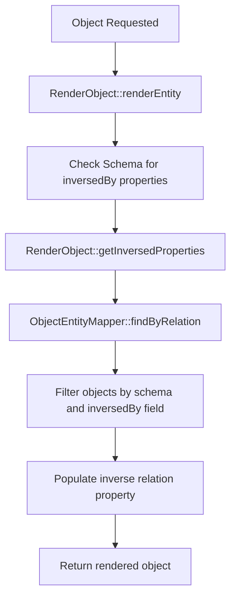
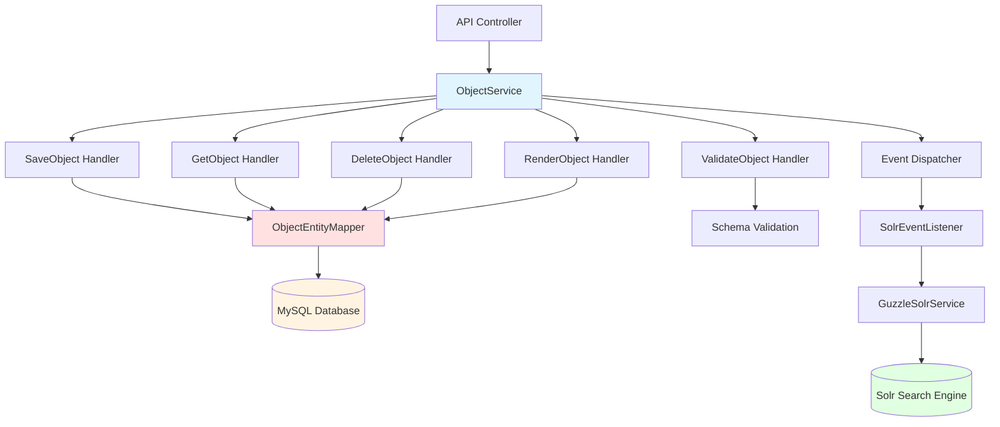
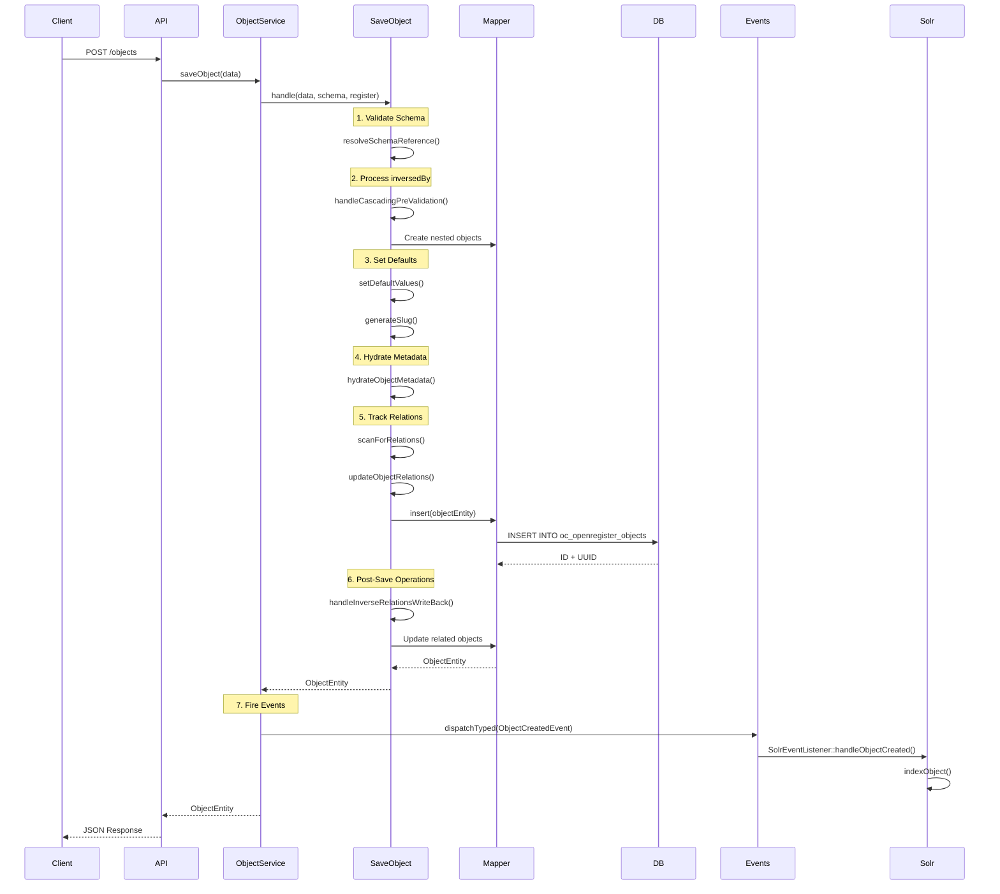
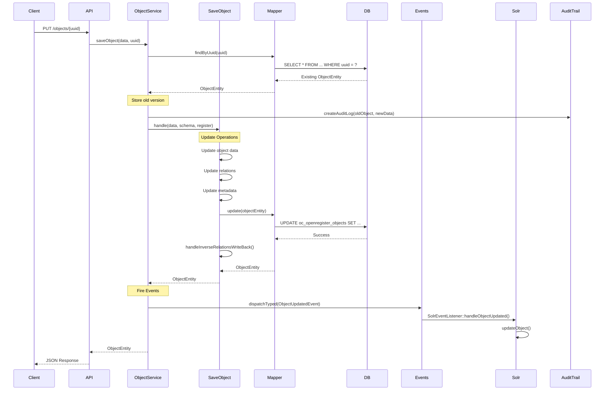
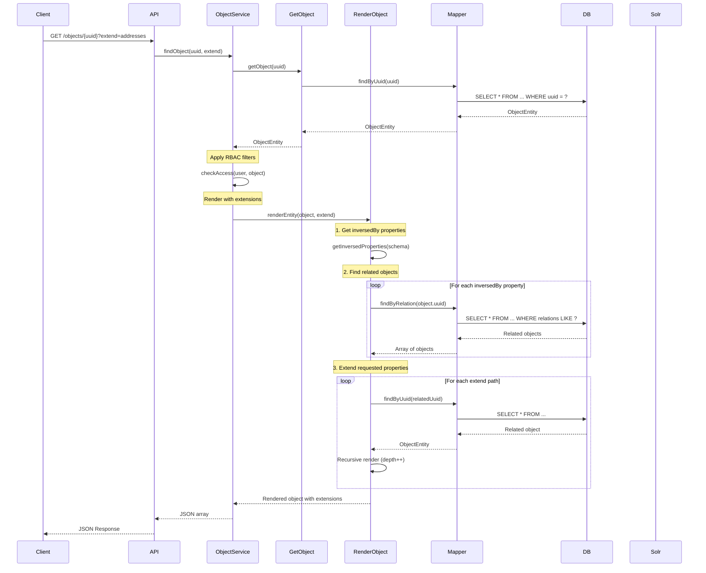
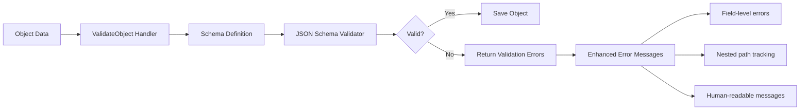
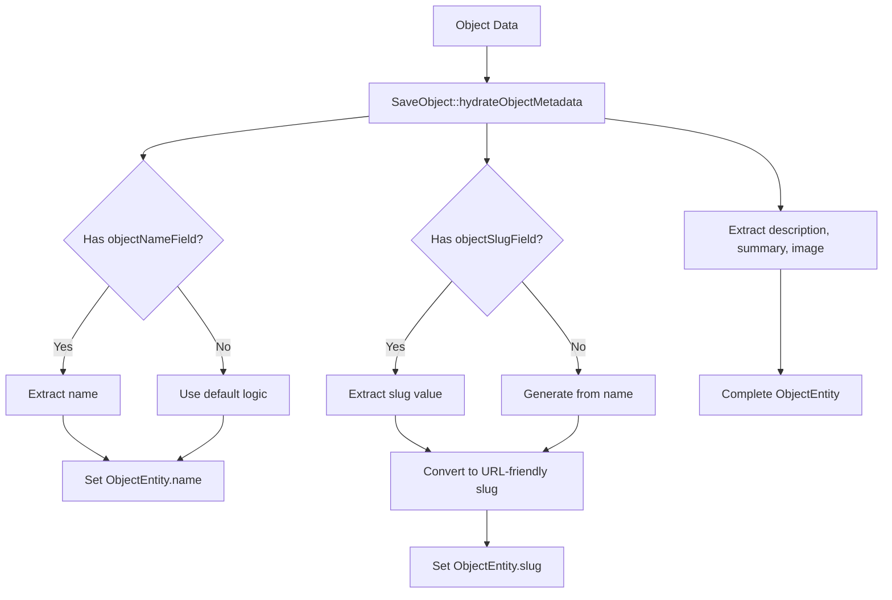

import ApiSchema from '@theme/ApiSchema';
import Tabs from '@theme/Tabs';
import TabItem from '@theme/TabItem';

# Objects

Objects are the core data entities in OpenRegister that store and manage structured information. This document explains everything you need to know about working with objects.

## Overview

An object in OpenRegister represents a single record of data that:
- Conforms to a defined schema
- Belongs to a specific register
- Has a unique UUID identifier
- Can contain nested objects and file attachments
- Maintains version history through audit logs
- Can be linked to other objects via relations

## Object Structure

Each object contains:

- `id`: Unique UUID identifier
- `uri`: Absolute URL to access the object
- `version`: Semantic version number (e.g. 1.0.0)
- `register`: The register this object belongs to
- `schema`: The schema this object must conform to
- `object`: The actual data payload as JSON
- `files`: Array of related file IDs
- `relations`: Array of related object IDs
- `textRepresentation`: Text representation of the object
- `locked`: Lock status and details
- `owner`: Nextcloud user that owns the object
- `authorization`: JSON object describing access permissions
- `updated`: Last modification timestamp
- `created`: Creation timestamp

## Key Features

### Schema Validation
- Objects are validated against their schema definition
- Supports both soft and hard validation modes
- Ensures data integrity and consistency

### Relations & Nesting
- Objects can reference other objects via UUIDs or URLs
- Supports nested object structures up to configured depth
- Maintains bidirectional relationship tracking

### Version Control
- Automatic version incrementing
- Full audit trail of changes
- Historical version access
- Ability to revert to any previous version
- Detailed change tracking between versions

### Access Control
- Object-level ownership
- Granular authorization rules
- Lock mechanism for concurrent access control

### File Attachments
- Support for file attachments
- Secure file storage integration
- File metadata tracking

## API Operations

Objects support standard CRUD operations:
- Create new objects
- Read existing objects
- Update object data
- Delete objects
- Search and filter objects
- Export object data
- Revert to previous versions

## Object Locking and Versioning

### Version Control and Revert Functionality

OpenRegister provides comprehensive version control capabilities:

- Every change creates a new version with full audit trail
- Changes are tracked at the field level
- Previous versions can be viewed and compared
- Objects can be reverted to any historical version
- Revert operation creates new version rather than overwriting
- Audit logs maintain full history of all changes including reverts
- Revert includes all object properties including relations and files
- Batch revert operations supported for related objects

### Locking Objects

Objects can be locked to prevent concurrent modifications. This is useful when:
- Long-running processes need exclusive access
- Multiple users/systems are working on the same object
- Ensuring data consistency during complex updates

## Object Relations

Objects in OpenRegister support sophisticated relationships through schema definitions. The way objects relate to each other depends on how you configure properties in your schema.

### Schema Property Configuration Options

When defining a property in a schema that references other objects, you have several configuration options:

#### For Single Objects (type: 'object')
```json
{
  "type": "object",
  "objectConfiguration": {
    "handling": "nested-object" // or "nested-schema", "related-schema", "uri"
  },
  "$ref": "schema-id-or-slug",
  "inversedBy": "property-name",
  "register": "register-id-or-slug",
  "cascadeDelete": true
}
```

#### For Arrays of Objects (type: 'array')
```json
{
  "type": "array",
  "items": {
    "type": "object",
    "$ref": "schema-id-or-slug",
    "inversedBy": "property-name",
    "register": "register-id-or-slug",
    "cascadeDelete": true
  },
  "objectConfiguration": {
    "handling": "nested-object" // or "nested-schema", "related-schema", "uri"
  }
}
```

## Schema Reference Configuration (`$ref` and `register`)

When defining object relationships in your schema properties, OpenRegister uses two key configuration options to determine where and how to store or reference related objects:

### `$ref` Property

The `$ref` property specifies which schema the related object should conform to. The backend supports two formats:

1. **Simple schema reference**: Just the schema ID or name
   ```json
   "$ref": "organisation-schema"
   ```

2. **Path-based reference**: A path where the schema name is extracted from the last segment
   ```json
   "$ref": "path/to/organisation-schema"
   ```

**Backend Resolution Logic:**
- If `$ref` contains a `/`, the backend extracts everything after the last slash
- Otherwise, it uses the value directly as the schema identifier
- This value is passed as the `schema` parameter when creating or updating related objects

### `register` Property

The `register` property specifies which register the related object belongs to:

```json
"register": "my-register-id"
```

**Backend Behavior:**
- If `register` is specified, related objects are created/updated in that register
- If `register` is omitted, the current object's register is used as the default
- This ensures related objects can be stored in different registers if needed

### Complete Configuration Example

Here's how these properties work together in a schema configuration:

```json
{
  "properties": {
    "deelnemers": {
      "type": "array",
      "items": {
        "$ref": "organisation-schema",
        "register": "organisations-register",
        "inversedBy": "deelnames",
        "writeBack": true,
        "removeAfterWriteBack": true
      }
    }
  }
}
```

**What happens when saving:**
1. Backend identifies that `deelnemers` contains organization objects
2. Uses `organisation-schema` to validate and structure the objects
3. Stores/updates objects in the `organisations-register`
4. Sets up inverse relations via the `deelnames` property
5. Handles write-back operations as configured

### Use Cases

**Same Register Relations:**
```json
{
  "community": {
    "type": "object",
    "$ref": "community-schema"
    // register omitted - uses current object's register
  }
}
```

**Cross-Register Relations:**
```json
{
  "members": {
    "type": "array",
    "items": {
      "$ref": "person-schema",
      "register": "people-register",
      "inversedBy": "communities"
    }
  }
}
```

This configuration system allows for flexible object relationships while maintaining proper data organization across different registers and schemas.

## Object Handling Types

When defining object relationships in your schema properties, you can specify how related objects should be handled using the `handling` configuration option within `objectConfiguration`. OpenRegister supports four different handling types, each with specific behaviors for storage and retrieval:

### 1. Nested Object (`nested-object`)

**Description**: Stores object data directly within the parent object as embedded JSON data.

**Behavior**:
- Object data is stored inline within the parent object's JSON structure
- No separate database entity is created for the nested object
- Changes to the nested object are saved as part of the parent object
- Best for simple, tightly coupled data that doesn't need independent lifecycle management

**Example Schema Configuration**:
```json
{
  "address": {
    "type": "object",
    "objectConfiguration": {
      "handling": "nested-object"
    },
    "properties": {
      "street": {"type": "string"},
      "city": {"type": "string"},
      "zipCode": {"type": "string"}
    }
  }
}
```

**Resulting Data Structure**:
```json
{
  "id": "123e4567-e89b-12d3-a456-426614174000",
  "name": "John Doe",
  "address": {
    "street": "Main Street 1",
    "city": "Amsterdam", 
    "zipCode": "1000 AA"
  }
}
```

### 2. Nested Schema (`nested-schema`)

**Description**: Stores object as a separate entity in the database but embeds the full object data in API responses.

**Behavior**:
- Creates a separate `ObjectEntity` in the database with its own UUID
- Object follows the schema specified in `$ref`
- During rendering, the full nested object data is included in the response
- Allows independent lifecycle management while providing convenient access to nested data
- Supports cascade operations when configured with `inversedBy`

**Example Schema Configuration**:
```json
{
  "profile": {
    "type": "object",
    "$ref": "profile-schema",
    "objectConfiguration": {
      "handling": "nested-schema"
    },
    "inversedBy": "owner",
    "register": "users"
  }
}
```

**Resulting Data Structure**:
```json
{
  "id": "123e4567-e89b-12d3-a456-426614174000", 
  "name": "John Doe",
  "profile": {
    "id": "987fcdeb-51a2-43d7-8f9e-123456789abc",
    "bio": "Software developer",
    "skills": ["PHP", "JavaScript", "Vue.js"],
    "owner": "123e4567-e89b-12d3-a456-426614174000"
  }
}
```

### 3. Related Schema (`related-schema`) 

**Description**: Stores object as a separate entity and references it by UUID/ID only.

**Behavior**:
- Creates a separate `ObjectEntity` in the database with its own UUID
- Only the UUID reference is stored in the parent object
- Client must make additional API calls to retrieve the full nested object data
- Provides the most separation and independence between objects
- Optimal for loosely coupled relationships and large datasets
- Supports cascade operations when configured with `inversedBy`

**Example Schema Configuration**:
```json
{
  "department": {
    "type": "object", 
    "$ref": "department-schema",
    "objectConfiguration": {
      "handling": "related-schema"
    },
    "inversedBy": "employees",
    "register": "organization"
  }
}
```

**Resulting Data Structure**:
```json
{
  "id": "123e4567-e89b-12d3-a456-426614174000",
  "name": "John Doe", 
  "department": "456e7890-e12b-34c5-d678-901234567890"
}
```

### 4. URI Reference (`uri`)

**Description**: References external objects by URI/URL without local storage.

**Behavior**:
- No local `ObjectEntity` is created
- Stores only the URI reference as a string
- External object is not managed by OpenRegister
- Useful for referencing objects in external systems or APIs
- No cascade operations or local validation
- Client is responsible for resolving the URI to retrieve object data

**Example Schema Configuration**:
```json
{
  "externalService": {
    "type": "object",
    "objectConfiguration": {
      "handling": "uri"
    },
    "format": "uri"
  }
}
```

**Resulting Data Structure**:
```json
{
  "id": "123e4567-e89b-12d3-a456-426614174000",
  "name": "John Doe",
  "externalService": "https://api.external.com/services/auth-service-v2"
}
```

## Handling Type Comparison

| Feature | Nested Object | Nested Schema | Related Schema | URI Reference |
|---------|---------------|---------------|----------------|---------------|
| **Separate Entity** | ❌ | ✅ | ✅ | ❌ |
| **Independent Lifecycle** | ❌ | ✅ | ✅ | ✅ |
| **Embedded in Response** | ✅ | ✅ | ❌ | ❌ |
| **Cascade Operations** | ❌ | ✅ | ✅ | ❌ |
| **Schema Validation** | ✅ | ✅ | ✅ | ❌ |
| **Performance (Read)** | ⭐⭐⭐ | ⭐⭐ | ⭐ | ⭐ |
| **Performance (Write)** | ⭐⭐⭐ | ⭐⭐ | ⭐⭐ | ⭐⭐⭐ |
| **Storage Efficiency** | ⭐⭐⭐ | ⭐⭐ | ⭐⭐⭐ | ⭐⭐⭐ |
| **Relationship Complexity** | ⭐ | ⭐⭐ | ⭐⭐⭐ | ⭐ |

## When to Use Each Type

### Use **Nested Object** when:
- Data is simple and tightly coupled to the parent
- You don't need independent lifecycle management
- The nested data is relatively small and stable
- Performance is critical and you want to minimize database queries

### Use **Nested Schema** when:
- You need schema validation for nested objects
- You want independent lifecycle management but convenient access
- The nested object might be referenced by multiple parents
- You need cascade operations but want embedded responses

### Use **Related Schema** when:
- Objects have independent lifecycles and complex relationships
- You're working with large datasets where embedding would be inefficient
- You need maximum flexibility in how relationships are managed
- Performance optimization through selective loading is important

### Use **URI Reference** when:
- Referencing objects in external systems
- You don't want to store or manage the referenced object locally
- Integration with third-party APIs or services
- The referenced resource is managed outside OpenRegister

## Inverse Relations

Inverse relations allow objects to automatically show related objects that reference them, creating bidirectional relationships while storing data only once.

### How Inverse Relations Work

1. **Schema Definition:** Define `inversedBy` on the schema that should show the inverse relation
2. **Automatic Detection:** Backend automatically finds objects that reference this object
3. **Dynamic Population:** Inverse relations are populated when rendering objects
4. **Single Storage:** Relationship data is stored only once, preventing duplicate references

### Basic Example: Person and Addresses

**Person Schema:**
```json
{
  "name": "Person", 
  "properties": {
    "name": {"type": "string"},
    "addresses": {
      "type": "array",
      "items": {"$ref": "address-schema"},
      "inversedBy": "person"
    }
  }
}
```

**Address Schema:**
```json
{
  "name": "Address",
  "properties": {
    "street": {"type": "string"},
    "person": {"type": "string"}
  }
}
```

**Result:** When fetching a person, their addresses are automatically included even though they're stored separately.

### Advanced Example: Organisation Communities

A more complex example showing parent-child relationships within the same schema:

**Organisation Schema:**
```json
{
  "name": "Organisation",
  "properties": {
    "name": {"type": "string"},
    "type": {"type": "string"}, // "community" or "member"
    "deelnames": {
      "type": "array",
      "items": {"type": "string"},
      "description": "UUIDs of communities this organisation participates in"
    },
    "deelnemers": {
      "type": "array", 
      "items": {
        "$ref": "organisation-schema",
        "inversedBy": "deelnames",
        "writeBack": true,
        "removeAfterWriteBack": true
      },
      "description": "UUIDs of organisations that participate in this community (inverse relation with write-back)"
    }
  }
}
```

## Inverse Relations with Write-Back

OpenRegister's inverse relations system supports both read and write operations:

- **Standard Inverse Relations (`inversedBy`)**: Automatically show related objects during rendering (read-only)
- **Inverse Relations with Write-Back (`inversedBy` + `writeBack: true`)**: Additionally update target objects during save operations

### How Inverse Relations Write-Back Works

1. **Schema Definition:** Define `inversedBy` with `writeBack: true` in the schema property configuration
2. **Automatic Updates:** When saving an object, the system automatically updates referenced objects
3. **Bidirectional Maintenance:** Target objects get updated to include references back to the current object
4. **Import-Friendly:** Perfect for import processes where you have parent data with child references

### Community/Deelnemers Example

**Schema Configuration:**
```json
{
  "name": "Organisation",
  "properties": {
    "name": {"type": "string"},
    "type": {"type": "string"},
    "deelnames": {
      "type": "array",
      "items": {"type": "string"},
      "description": "UUIDs of communities this organisation participates in"
    },
    "deelnemers": {
      "type": "array",
      "items": {
        "$ref": "organisation-schema", 
        "inversedBy": "deelnames",
        "writeBack": true,
        "removeAfterWriteBack": true
      },
      "description": "UUIDs of participants - will update their deelnames arrays"
    }
  }
}
```

**Usage Example:**

**Step 1: Create member organisations**
```json
// POST /organisations
{
  "name": "Organisation A",
  "type": "member",
  "deelnames": []
}
// Returns: {"id": "org-a-uuid", ...}

// POST /organisations  
{
  "name": "Organisation B",
  "type": "member", 
  "deelnames": []
}
// Returns: {"id": "org-b-uuid", ...}
```

**Step 2: Create community with deelnemers**
```json
// POST /organisations
{
  "name": "Tech Community",
  "type": "community",
  "deelnames": [],
  "deelnemers": ["org-a-uuid", "org-b-uuid"]
}
// Returns: {"id": "community-uuid", ...}
```

**What happens automatically:**
1. Community object is created with `deelnemers` property **removed** (since it's a reverse relation)
2. Organisation A's `deelnames` array is updated to include `"community-uuid"`
3. Organisation B's `deelnames` array is updated to include `"community-uuid"`

**Final state:**
```json
// Organisation A
{
  "id": "org-a-uuid",
  "name": "Organisation A",
  "type": "member",
  "deelnames": ["community-uuid"]  // Automatically updated
}

// Organisation B  
{
  "id": "org-b-uuid",
  "name": "Organisation B",
  "type": "member",
  "deelnames": ["community-uuid"]  // Automatically updated
}

// Tech Community
{
  "id": "community-uuid", 
  "name": "Tech Community",
  "type": "community",
  "deelnames": []  // deelnemers property was removed - not stored here
}
```

### Import Process Benefits

This reverse relations pattern is particularly useful during import processes:

**CSV Import Example:**
```csv
name,type,deelnemers
"Tech Community","community","org-a-uuid,org-b-uuid"
"Business Community","community","org-a-uuid,org-c-uuid"
```

**What happens during import:**
1. ImportService creates community objects with `deelnemers` arrays
2. SaveObject.handleInverseRelationsWriteBack() processes each UUID in `deelnemers`
3. Target organisations' `deelnames` arrays are automatically updated
4. Community objects are saved without the `deelnemers` property (if `removeAfterWriteBack: true`)

### Backend Implementation Details

**File: `lib/Service/ObjectHandlers/SaveObject.php`**

The inverse relations write-back functionality is implemented in:
- `handleInverseRelationsWriteBack()`: Main method that processes inverse relations with write-back
- Called during both object creation and updates
- Integrates with cascading and default value setting

**Key features:**
- Extends existing inverse relations system (`inversedBy`)
- Supports both single objects and arrays of objects
- Handles missing target objects gracefully (logs errors, continues processing)
- Optionally removes properties from source object after processing
- Prevents duplicate entries in target arrays

**Schema Configuration Options:**
```json
{
  "deelnemers": {
    "type": "array",
    "items": {
      "$ref": "target-schema-id",              // Required: target schema
      "inversedBy": "property-name",           // Required: property to update (same as read-only inverse relations)
      "writeBack": true,                       // Required: enables write-back functionality
      "removeAfterWriteBack": true,            // Optional: remove property from source after write-back
      "register": "register-id"                // Optional: defaults to current register
    }
  }
}
```

## Relation Types Summary

OpenRegister supports three types of object relationships, each serving different use cases:

### 1. Inverse Relations (`inversedBy`)
- **Purpose:** Show related objects during rendering (read-only)
- **Direction:** Target → Source (automatic lookup)
- **Storage:** Relationship data stored on source objects
- **Use case:** Display all addresses for a person, show all posts for a blog

**Example:**
```json
{
  "addresses": {
    "type": "array",
    "items": {"$ref": "address-schema"},
    "inversedBy": "person"
  }
}
```

### 2. Inverse Relations with Write-Back (`inversedBy` + `writeBack: true`)
- **Purpose:** Show related objects during rendering AND update target objects during save operations
- **Direction:** Bidirectional (Target → Source for reading, Source → Target for writing)
- **Storage:** Relationship data stored on target objects
- **Use case:** Community membership, parent-child relationships, import processes

**Example:**
```json
{
  "deelnemers": {
    "type": "array",
    "items": {
      "$ref": "organisation-schema",
      "inversedBy": "deelnames",
      "writeBack": true,
      "removeAfterWriteBack": true
    }
  }
}
```

### 3. Cascade Relations (`inversedBy` with `objectConfiguration`)
- **Purpose:** Create/update related objects during save operations
- **Direction:** Source → Target (create new objects)
- **Storage:** Separate objects created and linked
- **Use case:** Creating addresses when creating a person, creating posts when creating a blog

**Example:**
```json
{
  "addresses": {
    "type": "array",
    "items": {
      "$ref": "address-schema",
      "inversedBy": "person"
    },
    "objectConfiguration": {"handling": "related-schema"}
  }
}
```

### When to Use Each Type

| Use Case | Relation Type | Reason |
|----------|---------------|---------|
| Display related objects | Inverse Relations | Read-only, automatic lookup |
| Import with existing children | Inverse Relations with Write-Back | Update existing objects |
| Create objects with new children | Cascade Relations | Create new related objects |
| Parent-child where child owns relationship | Inverse Relations with Write-Back | Maintain single source of truth |
| Parent-child where parent owns relationship | Cascade Relations | Natural parent-driven creation |
| Bidirectional relationships | Inverse Relations with Write-Back | Both read and write capabilities |

**How this works:**

1. **Data Storage (One-Way):**
   ```json
   // Organisation A (Member)
   {
     "id": "org-a-uuid",
     "name": "Organisation A",
     "type": "member",
     "deelnames": ["community-uuid-1", "community-uuid-2"]
   }
   
   // Organisation B (Member)  
   {
     "id": "org-b-uuid",
     "name": "Organisation B", 
     "type": "member",
     "deelnames": ["community-uuid-1"]
   }
   
   // Community Organisation
   {
     "id": "community-uuid-1",
     "name": "Tech Community",
     "type": "community",
     "deelnames": [] // Empty - this is the parent
   }
   ```

2. **Automatic Inverse Population:**
   When fetching the community organisation, the `deelnemers` property is automatically populated:
   ```json
   // GET /organisations/community-uuid-1?extend=deelnemers
   {
     "id": "community-uuid-1",
     "name": "Tech Community",
     "type": "community", 
     "deelnames": [],
     "deelnemers": ["org-a-uuid", "org-b-uuid"] // Automatically populated
   }
   ```

3. **With Extension:**
   ```json
   // GET /organisations/community-uuid-1?extend=deelnemers
   {
     "id": "community-uuid-1",
     "name": "Tech Community",
     "type": "community",
     "deelnames": [],
     "deelnemers": [
       {
         "id": "org-a-uuid",
         "name": "Organisation A",
         "type": "member",
         "deelnames": ["community-uuid-1", "community-uuid-2"]
       },
       {
         "id": "org-b-uuid", 
         "name": "Organisation B",
         "type": "member",
         "deelnames": ["community-uuid-1"]
       }
     ]
   }
   ```

### Benefits of Inverse Relations

- **Single Source of Truth:** Relationship data stored only once
- **Automatic Synchronization:** No risk of inconsistent bidirectional references
- **Performance:** No need to update multiple objects when relationships change
- **Flexibility:** Can view relationships from either direction

### Backend Implementation Details

The inverse relations functionality is handled by several PHP files in the OpenRegister codebase:

#### Core Files and Their Responsibilities

**1. `lib/Service/ObjectHandlers/RenderObject.php`**
- **Primary responsibility:** Handles rendering objects and populating inverse relations
- **Key methods:**
  - `getInversedProperties(Schema $schema)`: Extracts properties with `inversedBy` configurations from schema
  - `handleInversedProperties()`: Finds and populates inverse relations during object rendering
  - `renderEntity()`: Main rendering method that calls `handleInversedProperties()` when depth < 10

**2. `lib/Service/ObjectHandlers/SaveObject.php`**
- **Primary responsibility:** Handles saving objects and maintaining relation tracking
- **Key methods:**
  - `scanForRelations(array $data)`: Scans object data for UUIDs and URLs, stores them in dot notation
  - `updateObjectRelations(ObjectEntity $objectEntity, array $data)`: Updates the relations property on objects
  - `saveObject()`: Main save method that calls `updateObjectRelations()` to track relations

**3. `lib/Service/ObjectService.php`**
- **Primary responsibility:** Main service facade that coordinates object operations
- **Key methods:**
  - `findByRelations(string $search)`: Finds objects that reference a specific UUID/URL
  - `renderHandler->renderEntity()`: Delegates to RenderObject for rendering with inverse relations

**4. `lib/Db/ObjectEntityMapper.php`**
- **Primary responsibility:** Database operations for finding related objects
- **Key methods:**
  - `findByRelation(string $search)`: Database query to find objects containing specific UUIDs in their relations
  - `findByRelationUri()`: Alternative method for finding objects by URI references

#### How Inverse Relations Are Processed



#### Development Notes for Future Work

**When working with inverse relations:**

1. **Schema Changes:** Modify `RenderObject::getInversedProperties()` if you need to support new inverse relation configurations

2. **Performance Optimization:** The `ObjectEntityMapper::findByRelation()` method can be optimized for large datasets by adding database indexes on the `relations` JSON column

3. **Circular Reference Prevention:** The rendering system includes circular reference detection in `RenderObject::renderEntity()` using the `$visitedIds` parameter

4. **Caching:** Consider implementing caching in `RenderObject` for frequently accessed inverse relations

5. **Database Schema:** Relations are stored as JSON in the `relations` column of the `oc_openregister_objects` table in dot notation format

**Example of relations storage in database:**
```json
{
  "deelnames.0": "community-uuid-1",
  "deelnames.1": "community-uuid-2", 
  "contact.email": "user@example.com"
}
```

This architecture ensures that inverse relations are dynamically calculated and always up-to-date, while maintaining performance through caching and efficient database queries.

## UUID Relations and Automatic Detection

The backend automatically detects and tracks relations:

### Automatic Relation Detection

```javascript
// These patterns are automatically detected as relations:
{
  "relatedObject": "550e8400-e29b-41d4-a716-446655440000", // UUID
  "externalRef": "https://api.example.com/objects/123",     // URL
  "nestedRefs": [
    "550e8400-e29b-41d4-a716-446655440001",
    "550e8400-e29b-41d4-a716-446655440002"
  ]
}
```

### Relations Storage

Relations are stored in dot notation:
```json
{
  "relations": {
    "relatedObject": "550e8400-e29b-41d4-a716-446655440000",
    "externalRef": "https://api.example.com/objects/123",
    "nestedRefs.0": "550e8400-e29b-41d4-a716-446655440001", 
    "nestedRefs.1": "550e8400-e29b-41d4-a716-446655440002"
  }
}
```

## Extending Objects with Related Data

You can extend objects to include related data using the `extend` parameter:

### Basic Extension

```javascript
// Extend a single property
GET /objects/123?extend=addresses

// Extend multiple properties  
GET /objects/123?extend=addresses,employer

// Extend all relations
GET /objects/123?extend=all
```

### Nested Extension

```javascript
// Extend nested properties
GET /objects/123?extend=addresses.person,addresses.contacts

// Wildcard extension for arrays
GET /objects/123?extend=addresses.$.person
```

## Cascade Delete

When `cascadeDelete` is set to `true`, deleting a parent object will also delete related objects:

```json
{
  "addresses": {
    "type": "array",
    "items": {
      "type": "object", 
      "$ref": "address-schema",
      "cascadeDelete": true
    }
  }
}
```

**Behavior:** Deleting a person will also delete all their addresses.

## Complete Example: Blog System

Here's a complete example showing different relation types:

### Blog Schema
```json
{
  "name": "Blog",
  "properties": {
    "title": {"type": "string"},
    "author": {
      "type": "object",
      "$ref": "person-schema", 
      "objectConfiguration": {"handling": "related-schema"}
    },
    "posts": {
      "type": "array",
      "items": {
        "type": "object",
        "$ref": "post-schema",
        "inversedBy": "blog",
        "cascadeDelete": true
      },
      "objectConfiguration": {"handling": "related-schema"}
    },
    "settings": {
      "type": "object",
      "objectConfiguration": {"handling": "nested-object"},
      "properties": {
        "theme": {"type": "string"},
        "private": {"type": "boolean"}
      }
    }
  }
}
```

### Post Schema
```json
{
  "name": "Post",
  "properties": {
    "title": {"type": "string"},
    "content": {"type": "string"},
    "blog": {"type": "string"},
    "tags": {
      "type": "array",
      "items": {"type": "string"}
    }
  }
}
```

### Creating a Blog

**Input:**
```json
{
  "title": "My Tech Blog",
  "author": "550e8400-e29b-41d4-a716-446655440000",
  "posts": [
    {
      "title": "First Post",
      "content": "Welcome to my blog!",
      "tags": ["welcome", "intro"]
    },
    {
      "title": "Second Post", 
      "content": "More content here",
      "tags": ["tech", "programming"]
    }
  ],
  "settings": {
    "theme": "dark",
    "private": false
  }
}
```

**What happens:**
1. Blog object created with UUID `blog-uuid-123`
2. Two post objects created separately:
   - Each gets `"blog": "blog-uuid-123"` automatically
   - Each gets its own UUID
3. Blog object stores: `"posts": ["post-uuid-1", "post-uuid-2"]`
4. Settings nested directly in blog object
5. Author reference stored as UUID
6. Relations automatically tracked

**Retrieved with extension:**
```javascript
GET /blogs/blog-uuid-123?extend=posts,author
```

**Response:**
```json
{
  "id": "blog-uuid-123",
  "title": "My Tech Blog",
  "author": {
    "id": "550e8400-e29b-41d4-a716-446655440000",
    "name": "John Doe",
    "email": "john@example.com"
  },
  "posts": [
    {
      "id": "post-uuid-1",
      "title": "First Post",
      "content": "Welcome to my blog!",
      "blog": "blog-uuid-123",
      "tags": ["welcome", "intro"]
    },
    {
      "id": "post-uuid-2", 
      "title": "Second Post",
      "content": "More content here",
      "blog": "blog-uuid-123",
      "tags": ["tech", "programming"]
    }
  ],
  "settings": {
    "theme": "dark",
    "private": false
  }
}
```

## Summary

The OpenRegister object relation system provides flexible ways to model data relationships:

- **Nested Objects:** Simple embedding without validation
- **Nested Schema:** Embedding with schema validation  
- **Related Schema:** Separate objects with automatic relation management
- **URI References:** Loose coupling with external resources
- **Inverse Relations:** Automatic population of referring objects
- **Cascade Operations:** Automatic creation and deletion of related objects
- **Automatic Detection:** UUIDs and URLs are automatically tracked as relations

Choose the appropriate handling type based on your data modeling needs and whether you want separate storage, automatic relation management, and cascade operations.

---

## Technical Implementation

This section provides detailed technical information about how objects are implemented in OpenRegister.

### Architecture Overview

OpenRegister uses a layered architecture for object management:



**Key Components:**
- **ObjectService**: High-level orchestration service that coordinates all object operations
- **Handlers**: Specialized classes for specific operations (Save, Get, Delete, Render, Validate)
- **ObjectEntityMapper**: Database access layer for CRUD operations
- **Event System**: Nextcloud event dispatcher for lifecycle events
- **Solr Integration**: Automatic indexing for search functionality

### Object Lifecycle

#### Object Creation Flow



**Creation Steps:**

1. **Schema Resolution**: Convert schema reference (ID/slug/path) to schema entity
2. **Cascading Pre-Validation**: Create nested objects defined in `inversedBy` properties before main validation
3. **Default Values**: Apply schema-defined default values and generate slugs
4. **Metadata Hydration**: Extract name, description, summary, image from object data based on schema configuration
5. **Relation Tracking**: Scan object data for UUIDs and URLs, store in dot notation
6. **Database Insert**: Persist object entity to MySQL database
7. **Write-Back Operations**: Update related objects for bidirectional relations
8. **Event Dispatch**: Fire `ObjectCreatedEvent` for listeners (e.g., Solr indexing)

#### Object Update Flow



#### Object Retrieval Flow



### Database Schema

Objects are stored in the `oc_openregister_objects` table:

```sql
CREATE TABLE oc_openregister_objects (
    id INT AUTO_INCREMENT PRIMARY KEY,
    uuid VARCHAR(36) UNIQUE NOT NULL,
    slug VARCHAR(255),
    uri TEXT,
    version VARCHAR(50),
    register VARCHAR(36),
    schema VARCHAR(36),
    object JSON,
    files JSON,
    relations JSON,
    locked JSON,
    owner VARCHAR(64),
    authorization JSON,
    folder VARCHAR(255),
    application VARCHAR(255),
    organisation VARCHAR(255),
    validation JSON,
    deleted JSON,
    geo JSON,
    retention JSON,
    size VARCHAR(50),
    name VARCHAR(255),
    description TEXT,
    summary TEXT,
    image TEXT,
    labels JSON,
    created DATETIME DEFAULT CURRENT_TIMESTAMP,
    updated DATETIME DEFAULT CURRENT_TIMESTAMP ON UPDATE CURRENT_TIMESTAMP,
    published DATETIME,
    depublished DATETIME,
    
    INDEX idx_uuid (uuid),
    INDEX idx_register (register),
    INDEX idx_schema (schema),
    INDEX idx_owner (owner),
    INDEX idx_organisation (organisation),
    INDEX idx_published (published),
    INDEX idx_slug (slug, register, schema)
);
```

**Key Fields:**
- `object`: JSON field containing the actual object data (business logic fields)
- `relations`: JSON field with dot-notation storage of all UUIDs/URLs found in object data
- `files`: JSON array of file IDs attached to this object
- `published`: Objects must have a published date to be indexed in Solr
- `slug`: URL-friendly identifier, unique within register+schema combination

### Relations Storage

Relations are automatically detected and stored in dot notation:

**Example Object Data:**
```json
{
  "name": "John Doe",
  "address": "123e4567-e89b-41d4-a716-446655440000",
  "contacts": [
    "456e7890-e29b-41d4-a716-446655440001",
    "789e0123-e29b-41d4-a716-446655440002"
  ],
  "website": "https://example.com"
}
```

**Stored Relations:**
```json
{
  "address": "123e4567-e89b-41d4-a716-446655440000",
  "contacts.0": "456e7890-e29b-41d4-a716-446655440001",
  "contacts.1": "789e0123-e29b-41d4-a716-446655440002",
  "website": "https://example.com"
}
```

This enables efficient querying for inverse relations using:
```sql
SELECT * FROM oc_openregister_objects 
WHERE JSON_SEARCH(relations, 'one', '123e4567-e89b-41d4-a716-446655440000') IS NOT NULL
```

### Event System

OpenRegister dispatches events at key points in the object lifecycle:

**Available Events:**

| Event | When Fired | Use Cases |
|-------|-----------|-----------|
| `ObjectCreatingEvent` | Before object creation | Validation, pre-processing |
| `ObjectCreatedEvent` | After object creation | Solr indexing, webhooks, audit |
| `ObjectUpdatingEvent` | Before object update | Change detection, validation |
| `ObjectUpdatedEvent` | After object update | Solr re-indexing, notifications |
| `ObjectDeletingEvent` | Before object deletion | Cascade checks, backups |
| `ObjectDeletedEvent` | After object deletion | Solr cleanup, cleanup tasks |
| `ObjectLockedEvent` | When object is locked | Concurrent access control |
| `ObjectUnlockedEvent` | When object is unlocked | Resume operations |
| `ObjectRevertedEvent` | After version revert | Audit trail, re-indexing |

**Event Listener Example:**

```php
namespace OCA\OpenRegister\EventListener;

use OCA\OpenRegister\Event\ObjectCreatedEvent;
use OCP\EventDispatcher\Event;
use OCP\EventDispatcher\IEventListener;

class SolrEventListener implements IEventListener
{
    public function handle(Event $event): void
    {
        if ($event instanceof ObjectCreatedEvent) {
            $object = $event->getObject();
            $this->solrService->indexObject($object);
        }
    }
}
```

### Solr Integration

Objects are automatically indexed in Solr when:
- Created (if published)
- Updated (if published)
- Published (status change)

**Solr Document Structure:**

```json
{
  "id": "123e4567-e89b-12d3-a456-426614174000",
  "self_uuid": "123e4567-e89b-12d3-a456-426614174000",
  "self_name": "John Doe",
  "self_name_s": "John Doe",
  "self_description": "Software developer",
  "self_schema": "person",
  "self_register": "employees",
  "self_created": "2024-01-15T10:30:00Z",
  "self_updated": "2024-01-20T14:45:00Z",
  "self_published": "2024-01-15T10:30:00Z",
  "self_relations": ["456e7890-...", "789e0123-..."],
  "self_object": "{...complete JSON...}",
  
  "age_i": 30,
  "email_s": "john@example.com",
  "skills": ["PHP", "JavaScript", "Vue.js"],
  "department_s": "Engineering"
}
```

**Field Naming Conventions:**
- `self_*`: System metadata fields
- `*_i`: Integer fields
- `*_s`: String fields (sortable, not tokenized)
- `*_t`: Text fields (tokenized for full-text search)
- Arrays without suffix: Multi-valued fields

### Performance Optimizations

#### Bulk Operations

For importing large datasets, use bulk operations:

```php
$results = $objectService->saveObjects(
    objects: $arrayOfObjects,
    register: $register,
    schema: $schema,
    validation: false,  // Skip validation for performance
    events: false       // Skip event firing for performance
);
```

**Bulk Operation Optimizations:**
- Single-pass schema analysis
- Batch database inserts with `INSERT ... ON DUPLICATE KEY UPDATE`
- Memory-optimized processing with pass-by-reference
- Deferred event firing
- Bulk Solr indexing

#### Smart Deduplication System

OpenRegister includes an intelligent 3-stage deduplication system that automatically detects and handles duplicate objects during bulk imports:

**Stage 1: Multi-ID Extraction**
The system extracts identifiers from multiple sources:
- **UUID**: Primary unique identifier
- **Slug**: URL-friendly identifiers
- **URI**: External system references
- **Custom IDs**: Legacy system identifiers (id, identifier, sourceId)

```php
// System automatically extracts all identifier types
$identifiers = [
    'uuids' => ['uuid1', 'uuid2', ...],
    'slugs' => ['user-profile', 'company-x'],
    'uris' => ['https://api.../123', ...],
    'custom_ids' => [
        'id' => [101, 102, 103],
        'identifier' => ['EXT_001', 'EXT_002'],
        'sourceId' => ['src_123', 'src_456']
    ]
];
```

**Stage 2: Intelligent Bulk Lookup**
- Single database query retrieves all existing objects
- Multi-index mapping for O(1) lookup time
- Memory-efficient indexing for fast comparisons

**Stage 3: Hash-Based Decision Making**
For each incoming object, the system:
1. Finds existing object by any identifier (UUID → Slug → URI → Custom IDs)
2. Compares content hashes (excluding metadata and timestamps)
3. Makes intelligent decision:
   - **CREATE**: New object (no match found)
   - **SKIP**: Content identical (no database operation needed)
   - **UPDATE**: Content changed (merge and update)

**Performance Impact:**
- **Fresh Import**: 100% CREATE operations (same as before)
- **Incremental Update**: Typically 80% SKIP operations (5x faster)
- **Re-import Same Data**: 100% SKIP operations (50x faster)
- **Database Load Reduction**: 80-95% fewer operations

**Hash Calculation:**
The system uses SHA-256 hashing of cleaned object data:
- Excludes `@self` metadata fields
- Excludes timestamps (`created`, `updated`)
- Excludes system fields (`_etag`, etc.)
- Recursively sorted for consistent hashing

#### Bulk Import Performance

OpenRegister's bulk import system uses optimized database operations for high-performance data processing:

**Single-Call Architecture:**
- Uses `INSERT...ON DUPLICATE KEY UPDATE` with database-computed classification
- Eliminates database lookup overhead (3-5x faster)
- Automatic deduplication via `UNIQUE (uuid)` constraint

**Database-Managed Timestamps:**
- `created` timestamp is immutable (preserved on updates)
- `updated` timestamp automatically managed by database
- Smart change detection compares all data fields including JSON

**Database-Computed Classification:**
The system classifies objects as:
- **created**: Object created during this operation
- **updated**: Object modified during this operation  
- **unchanged**: Object exists but content unchanged

**Performance Results:**
- **Small Batches (< 1,000 objects)**: 800-1,200 objects/second
- **Medium Batches (1,000-5,000 objects)**: 1,500-2,000 objects/second
- **Large Batches (5,000+ objects)**: 2,000-2,500 objects/second

**Memory Optimization:**
- Automatic optimization decision based on available memory
- Uses ultra-fast operations when memory allows (500MB+)
- Falls back to standard operations when memory constrained
- 2x memory safety margin prevents OOM errors

**Clean Business Data Storage:**
- Metadata fields (id, uuid, register, schema) stored separately
- Business data stored cleanly in `object` column
- No metadata pollution in business data

#### Caching

OpenRegister implements multiple caching layers:

1. **Object Cache**: Recently accessed objects (PSR-6 compliant)
2. **Schema Cache**: Schema definitions
3. **Facet Cache**: Facetable fields per schema
4. **Query Cache**: Search result caching

### Validation System

Objects are validated against their schema using JSON Schema validation:



**Validation Modes:**
- **Hard Validation** (default): Rejects invalid objects
- **Soft Validation**: Saves object but stores validation errors in `validation` field

**Enhanced Error Messages:**

```json
{
  "valid": false,
  "errors": [
    {
      "property": "email",
      "message": "The property email is required",
      "constraint": "required"
    },
    {
      "property": "age",
      "message": "Integer value found, but a string is required",
      "constraint": "type"
    }
  ]
}
```

### Metadata Extraction

Objects automatically extract metadata from their data based on schema configuration:

**Schema Configuration:**
```json
{
  "configuration": {
    "objectNameField": "firstName",
    "objectDescriptionField": "bio",
    "objectSummaryField": "headline",
    "objectImageField": "avatar",
    "objectSlugField": "username"
  }
}
```

**Extraction Process:**



**Benefits:**
- Consistent object display across UI
- SEO-friendly URLs via slugs
- Rich search results with descriptions
- Thumbnail support via image extraction

### File Attachments

Objects can have file attachments stored in Nextcloud Files:

**File Storage:**
1. Files uploaded via API or UI
2. Stored in Nextcloud filesystem under `openregister/{register}/{schema}/`
3. File IDs tracked in `files` JSON array field
4. Text extraction for searchable content (optional)

**Text Extraction:**
- Background job processes uploaded files
- Supports PDFs, Word docs, text files, images (OCR)
- Extracted text stored separately for Solr indexing
- Configurable extraction scope and mode

### Access Control

Objects support granular access control:

**RBAC (Role-Based Access Control):**
```php
$objects = $objectService->findObjects(
    filters: ['status' => 'active'],
    rbac: true  // Apply user permissions
);
```

**Authorization Field:**
```json
{
  "authorization": {
    "read": ["user1", "group:admins"],
    "write": ["user1"],
    "delete": ["group:admins"]
  }
}
```

**Multi-Tenancy:**
```php
// Filter by organization
$objects = $objectService->findObjects(
    filters: [],
    multi: true  // Apply organization filtering
);
```

### Code Examples

#### Creating an Object

```php
use OCA\OpenRegister\Service\ObjectService;

// Via service
$object = $objectService->saveObject(
    object: [
        'name' => 'John Doe',
        'email' => 'john@example.com',
        'age' => 30
    ],
    register: 'employees',
    schema: 'person',
    rbac: true,
    multi: true
);

// Access result
echo $object->getUuid();  // "123e4567-e89b-12d3-a456-426614174000"
echo $object->getName();  // "John Doe"
```

#### Querying Objects

```php
// Find all objects in a register
$objects = $objectService->findObjects(
    limit: 50,
    offset: 0,
    filters: ['status' => 'active'],
    register: 'employees',
    schema: 'person'
);

// Find by UUID
$object = $objectService->findObject(
    uuid: '123e4567-e89b-12d3-a456-426614174000'
);

// Search with extension
$object = $objectService->findObject(
    uuid: '123e4567-e89b-12d3-a456-426614174000',
    extend: ['addresses', 'employer']
);
```

#### Updating an Object

```php
$updated = $objectService->saveObject(
    object: [
        'name' => 'John Doe',
        'email' => 'john.doe@newcompany.com',  // Updated
        'age' => 31  // Updated
    ],
    uuid: '123e4567-e89b-12d3-a456-426614174000',
    schema: 'person',
    register: 'employees'
);
```

#### Deleting an Object

```php
$result = $objectService->deleteObject(
    id: '123e4567-e89b-12d3-a456-426614174000'
);
```

### Testing

OpenRegister includes comprehensive tests for object operations:

```bash
# Run all object tests
vendor/bin/phpunit tests/Service/ObjectServiceTest.php

# Run specific test
vendor/bin/phpunit --filter testCreateObject

# Integration tests
vendor/bin/phpunit tests/Integration/ObjectIntegrationTest.php
```

**Test Coverage:**
- Object CRUD operations
- Relation handling
- Cascade operations
- Inverse relations
- Write-back operations
- Validation
- Event firing
- Solr indexing
