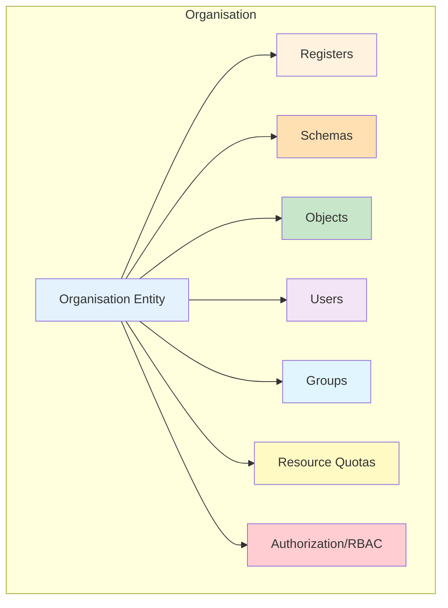
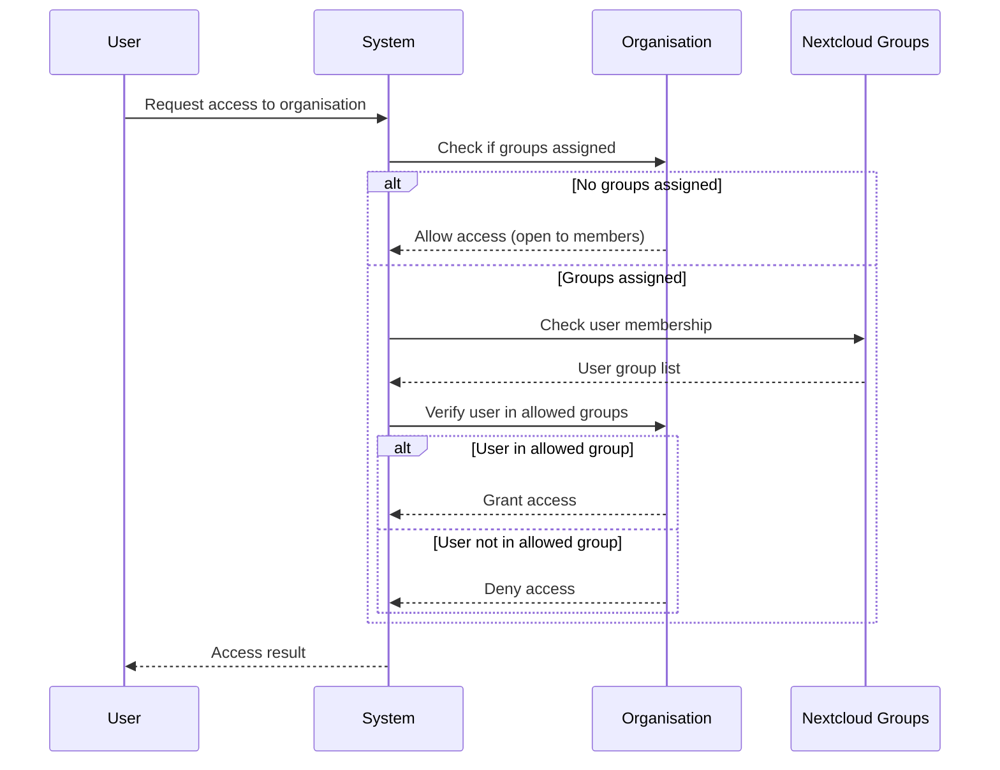
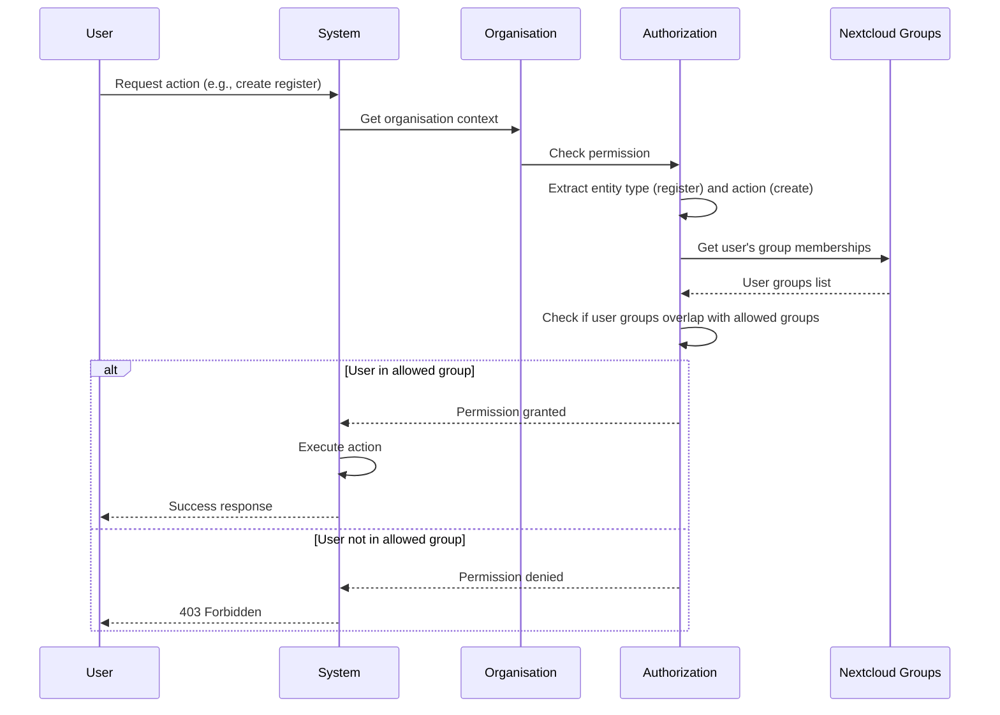

# Organisations

Organisations are the foundation of OpenRegister's multi-tenancy system, providing complete data isolation and access control. Each organisation represents a separate tenant with its own registers, schemas, objects, and user memberships.

## Overview

Organisations in OpenRegister enable:
- **Complete Data Isolation**: Each organisation's data remains completely separate
- **User Membership Management**: Users can belong to multiple organisations
- **Group-Based Access Control**: Control access using Nextcloud groups
- **Active Organisation Context**: Seamless switching between organisations
- **Resource Quotas**: Optional storage, bandwidth, and API request limits



## Key Features

### Data Isolation
- All entities (registers, schemas, objects) are scoped to organisations
- Users can only access data from organisations they belong to
- Automatic filtering ensures cross-organisation data protection

### User Management
- Users can be members of multiple organisations
- One active organisation per session
- Seamless context switching
- Default organisation for new users

### Group-Based Access Control
- Assign Nextcloud groups to organisations
- Only users in assigned groups can access the organisation
- Leave groups empty for open access to all members
- Integrates with Nextcloud's native group system

### Resource Quotas
- **Storage Quota**: Limit total storage per organisation (0 = unlimited)
- **Bandwidth Quota**: Monthly bandwidth limits (0 = unlimited)
- **API Request Quota**: Daily API request limits (0 = unlimited)
- **User Quota**: Maximum number of users (configurable)
- **Group Quota**: Maximum number of groups (configurable)

### Authorization & RBAC (Role-Based Access Control)
- **Hierarchical Permissions**: Define CRUD permissions per entity type (register, schema, object, view, agent)
- **Special Rights**: Grant special permissions like object_publish, agent_use, dashboard_view, llm_use
- **Group-Based**: Assign permissions to Nextcloud groups
- **Quick Authorization Checks**: Use singular entity names for efficient permission checking

## Creating an Organisation

### Via UI

1. Navigate to **Organisations** in the OpenRegister app
2. Click **Create Organisation**
3. Fill in the organisation details in the modal:

#### Basic Information Tab
- **Name** (required): The organisation name
- **Slug** (optional): URL-friendly identifier
- **Description** (optional): Detailed description
- **Nextcloud Groups**: Select which groups have access to this organisation

#### Settings Tab
- **Default Organisation**: Mark as default for new users (admin only)
- **Active**: Enable or disable the organisation

#### Resource Allocation Tab
- **Storage Quota (MB)**: Set storage limit (0 = unlimited)
- **Bandwidth Quota (MB/month)**: Set monthly bandwidth limit (0 = unlimited)
- **API Request Quota (requests/day)**: Set daily API request limit (0 = unlimited)

#### Security Tab
Configure fine-grained RBAC permissions:
- **Entity-Level Permissions**: Set CRUD permissions for registers, schemas, objects, views, and agents
- **Special Rights**: Grant special permissions like object publishing, agent use, dashboard view, and LLM access
- **Group Assignment**: Assign permissions to specific Nextcloud groups
- View current authorization configuration in an easy-to-read table format

4. Click **Create** to save the organisation

### Via API

```bash
POST /index.php/apps/openregister/api/organisations
Content-Type: application/json

{
  'name': 'Engineering Department',
  'description': 'Engineering team organisation',
  'slug': 'engineering',
  'active': true,
  'roles': [
    'engineers',
    'engineering-managers'
  ],
  'storageQuota': 10737418240,  // 10GB in bytes
  'bandwidthQuota': 53687091200, // 50GB in bytes
  'requestQuota': 10000
}
```

## Managing Organisation Groups

### Group Assignment Methods

#### Method 1: Edit Organisation Modal (Recommended)

1. Navigate to **Organisations** 
2. Click **Edit** on an organisation
3. **Basic Information Tab**: 
   - Use the 'Nextcloud Groups' multi-select dropdown to add or remove groups
   - See immediate feedback on selected groups
4. **Security Tab**: 
   - View complete list of assigned groups
   - Remove individual groups with X button
5. Click **Save** to persist changes

#### Method 2: Manage Roles Action (Legacy)

1. Click the **Actions** menu (three dots) on an organisation
2. Select **Manage Roles**
3. In the modal:
   - View currently assigned groups
   - Add groups from dropdown
   - Remove groups by clicking X
   - Click **Save Roles** to persist

### How Group Access Works

1. **Group Assignment**: Nextcloud groups are assigned to the organisation as 'roles'
2. **User Membership**: Users are added to Nextcloud groups through normal Nextcloud user management
3. **Access Control**: When a user tries to access organisation resources:
   - If no groups are assigned, all authenticated users with organisation membership can access
   - If groups are assigned, user must belong to at least one of the assigned groups
   - System administrators always have access



## Switching Active Organisation

### Via UI

1. Click the **Organisation Switcher** in the top navigation
2. Select the organisation you want to switch to
3. The page reloads with the new organisation context
4. All subsequent operations use this organisation

### Via API

```bash
POST /index.php/apps/openregister/api/organisations/{uuid}/set-active
```

## Editing an Organisation

1. Navigate to **Organisations**
2. Find the organisation to edit
3. Click **Actions** → **Edit**
4. Modify any of the tabs:
   - Basic Information
   - Settings
   - Resource Allocation
   - Security (view groups)
5. Click **Save** to apply changes

## Deleting an Organisation

⚠️ **Warning**: Deleting an organisation will delete all associated data:
- All registers
- All schemas
- All objects
- User memberships

1. Navigate to **Organisations**
2. Click **Actions** → **Delete**
3. Confirm the deletion
4. The organisation and all its data are permanently removed

## Organisation Properties

### Database Schema

The Organisation entity includes these fields:

| Field | Type | Description |
|-------|------|-------------|
| 'uuid' | VARCHAR(255) | Unique identifier |
| 'name' | VARCHAR(255) | Organisation name (required) |
| 'slug' | VARCHAR(255) | URL-friendly identifier (optional) |
| 'description' | TEXT | Detailed description |
| 'active' | BOOLEAN | Whether the organisation is active |
| 'users' | JSON | Array of user IDs belonging to organisation |
| 'groups' | JSON | Array of Nextcloud group IDs with access |
| 'authorization' | JSON | RBAC permissions structure (see Authorization section) |
| 'storage_quota' | BIGINT | Storage limit in bytes (NULL = unlimited) |
| 'bandwidth_quota' | BIGINT | Monthly bandwidth in bytes (NULL = unlimited) |
| 'request_quota' | INTEGER | Daily API requests (NULL = unlimited) |
| 'owner' | VARCHAR(255) | User ID of the organisation owner |
| 'created' | DATETIME | Creation timestamp |
| 'updated' | DATETIME | Last update timestamp |

### Groups JSON Structure

Groups are stored as a simple array of group ID strings for basic access control:

```json
{
  'groups': [
    'engineers',
    'managers',
    'viewers'
  ]
}
```

### Authorization JSON Structure

The authorization field contains the complete RBAC configuration:

```json
{
  'authorization': {
    'register': {
      'create': ['admin', 'register-manager'],
      'read': ['admin', 'register-manager', 'viewer'],
      'update': ['admin', 'register-manager'],
      'delete': ['admin']
    },
    'schema': {
      'create': ['admin'],
      'read': ['admin', 'developer', 'viewer'],
      'update': ['admin'],
      'delete': ['admin']
    },
    'object': {
      'create': ['admin', 'editor'],
      'read': ['admin', 'editor', 'viewer'],
      'update': ['admin', 'editor'],
      'delete': ['admin']
    },
    'view': {
      'create': ['admin'],
      'read': ['admin', 'user'],
      'update': ['admin'],
      'delete': ['admin']
    },
    'agent': {
      'create': ['admin'],
      'read': ['admin', 'developer'],
      'update': ['admin'],
      'delete': ['admin']
    },
    'object_publish': ['admin', 'publisher'],
    'agent_use': ['admin', 'ai-user'],
    'dashboard_view': ['admin', 'manager'],
    'llm_use': ['admin', 'ai-user']
  }
}
```

## Authorization & RBAC System

Organisations use a hierarchical Role-Based Access Control (RBAC) system to manage permissions at a granular level.

### Authorization Structure

The authorization system uses **singular entity names** for easier permission checking:

```json
{
  'authorization': {
    'register': {
      'create': ['admin', 'register-manager'],
      'read': ['admin', 'register-manager', 'viewer'],
      'update': ['admin', 'register-manager'],
      'delete': ['admin']
    },
    'schema': {
      'create': ['admin', 'schema-designer'],
      'read': ['admin', 'schema-designer', 'developer'],
      'update': ['admin', 'schema-designer'],
      'delete': ['admin']
    },
    'object': {
      'create': ['admin', 'editor', 'contributor'],
      'read': ['admin', 'editor', 'contributor', 'viewer'],
      'update': ['admin', 'editor'],
      'delete': ['admin']
    },
    'view': {
      'create': ['admin', 'view-designer'],
      'read': ['admin', 'view-designer', 'user'],
      'update': ['admin', 'view-designer'],
      'delete': ['admin']
    },
    'agent': {
      'create': ['admin', 'ai-specialist'],
      'read': ['admin', 'ai-specialist', 'developer'],
      'update': ['admin', 'ai-specialist'],
      'delete': ['admin']
    },
    'object_publish': ['admin', 'publisher'],
    'agent_use': ['admin', 'ai-user', 'developer'],
    'dashboard_view': ['admin', 'manager', 'viewer'],
    'llm_use': ['admin', 'ai-user']
  }
}
```

### Entity-Level Permissions

Each entity type has four standard CRUD permissions:

| Entity | Create | Read | Update | Delete |
|--------|--------|------|--------|--------|
| **register** | Who can create registers | Who can view registers | Who can modify registers | Who can delete registers |
| **schema** | Who can create schemas | Who can view schemas | Who can modify schemas | Who can delete schemas |
| **object** | Who can create objects | Who can view objects | Who can modify objects | Who can delete objects |
| **view** | Who can create views | Who can view views | Who can modify views | Who can delete views |
| **agent** | Who can create agents | Who can view agents | Who can modify agents | Who can delete agents |

### Special Rights

Beyond CRUD operations, special rights grant additional capabilities:

| Right | Description | Common Groups |
|-------|-------------|---------------|
| **object_publish** | Publish objects to make them publicly available | 'publisher', 'editor', 'admin' |
| **agent_use** | Use AI agents for processing and analysis | 'ai-user', 'developer', 'admin' |
| **dashboard_view** | Access organisation dashboard and analytics | 'manager', 'admin', 'analyst' |
| **llm_use** | Use Large Language Model features | 'ai-user', 'researcher', 'admin' |

### Permission Check Example

```php
// Quick authorization check using singular entity names
$canCreateRegister = $organisationService->hasPermission(
    $organisation,
    'register',  // Entity type (singular)
    'create',    // Action
    $userId
);

// Check special right
$canPublish = $organisationService->hasSpecialRight(
    $organisation,
    'object_publish',
    $userId
);
```

### Authorization Flow



### Best Practices

#### Permission Design
- ✅ Use hierarchical permissions (admin → manager → user)
- ✅ Grant least privilege - start restrictive, add as needed
- ✅ Use descriptive group names that reflect permissions
- ✅ Document why specific groups have specific permissions
- ❌ Don't grant 'delete' permissions to regular users
- ❌ Don't mix unrelated permissions in a single group

#### Group Structure
```
admin                  # Full access to everything
  ├─ register-manager  # Manage registers and schemas
  ├─ content-editor    # Create and edit objects
  ├─ publisher         # Publish objects
  └─ viewer            # Read-only access
```

#### Permission Auditing
- Review permissions quarterly
- Remove permissions from inactive groups
- Monitor permission usage in logs
- Update documentation when permissions change

## Use Cases

### Department Organisation

```
Organisation: 'Engineering Department'
Groups:
  - 'engineers' (50 users) - Full access to engineering resources
  - 'engineering-managers' (5 users) - Administrative access
  - 'interns' (10 users) - Limited access
Resource Quotas:
  - Storage: 100 GB
  - Bandwidth: 500 GB/month
  - API Requests: 50,000/day
```

### Project-Based Organisation

```
Organisation: 'Website Redesign Project'
Groups:
  - 'designers' (8 users) - Design asset access
  - 'developers' (12 users) - Code repository access
  - 'project-managers' (2 users) - Full project oversight
Resource Quotas:
  - Storage: 50 GB
  - Bandwidth: 200 GB/month
  - API Requests: 20,000/day
```

### Multi-Tenant Client Organisation

```
Organisation: 'Client: Acme Corp'
Groups:
  - 'acme-admins' (3 users) - Client administrators
  - 'acme-users' (100 users) - Regular client users
  - 'support-staff' (10 users) - Internal support team
Resource Quotas:
  - Storage: 500 GB
  - Bandwidth: 1 TB/month
  - API Requests: 100,000/day
```

## Best Practices

### Naming Conventions
- Use descriptive names that clearly indicate purpose
- Use slugs for URL-friendly identifiers
- Document the organisation's purpose in the description

### Group Management
- ✅ Use descriptive Nextcloud group names ('engineering-admins' not 'group1')
- ✅ Organize groups hierarchically with prefixes ('hr-admins', 'hr-staff')
- ✅ Document group purposes in Nextcloud group descriptions
- ✅ Regularly audit group membership
- ❌ Don't mix unrelated permissions in a single group

### Resource Quotas
- Set realistic quotas based on expected usage
- Monitor quota usage regularly
- Use 0 for unlimited where appropriate
- Consider organisation size and activity when setting quotas

### Security
- Only assign necessary groups to each organisation
- Regularly review and update group assignments
- Use the Security tab to audit current access
- Remove inactive users from groups promptly

## API Reference

### List Organisations

```bash
GET /index.php/apps/openregister/api/organisations
```

Returns all organisations the current user belongs to.

### Get Organisation

```bash
GET /index.php/apps/openregister/api/organisations/{uuid}
```

### Create Organisation

```bash
POST /index.php/apps/openregister/api/organisations
```

### Update Organisation

```bash
PUT /index.php/apps/openregister/api/organisations/{uuid}
```

### Delete Organisation

```bash
DELETE /index.php/apps/openregister/api/organisations/{uuid}
```

### Get Active Organisation

```bash
GET /index.php/apps/openregister/api/organisations/active
```

### Set Active Organisation

```bash
POST /index.php/apps/openregister/api/organisations/{uuid}/set-active
```

### Join Organisation

```bash
POST /index.php/apps/openregister/api/organisations/{uuid}/join
```

### Leave Organisation

```bash
POST /index.php/apps/openregister/api/organisations/{uuid}/leave
```

## Troubleshooting

### Cannot Create Organisation

**Problem**: Create button is disabled

**Solution**: Ensure the name field is filled in - it's required.

### Groups Not Appearing

**Problem**: Group dropdown is empty

**Solutions**:
1. Verify Nextcloud groups exist: Settings → Users → Groups
2. Check OCS API access
3. Review browser console for errors

### Cannot Switch Organisation

**Problem**: Organisation switching fails

**Solutions**:
1. Verify you're a member of the target organisation
2. Check that the organisation is active
3. Clear browser cache and session
4. Check server logs for errors

### Resource Quota Exceeded

**Problem**: Cannot create objects due to quota limits

**Solutions**:
1. Check current usage in organisation details
2. Request quota increase from administrator
3. Clean up unused objects and files
4. Archive old data

## PHP API Examples

### Get User's Organisations

```php
use OCA\OpenRegister\Service\OrganisationService;

$organisations = $organisationService->getUserOrganisations();
```

### Create Organisation with Groups and Authorization

```php
$organisation = $organisationService->createOrganisation(
    'Research Department',
    'Handles all research activities'
);

// Assign groups for basic access
$organisation->setGroups([
    'researchers',
    'lab-managers'
]);

// Set authorization permissions
$organisation->setAuthorization([
    'register' => [
        'create' => ['lab-managers'],
        'read'   => ['researchers', 'lab-managers'],
        'update' => ['lab-managers'],
        'delete' => ['lab-managers'],
    ],
    'schema' => [
        'create' => ['lab-managers'],
        'read'   => ['researchers', 'lab-managers'],
        'update' => ['lab-managers'],
        'delete' => ['lab-managers'],
    ],
    'object' => [
        'create' => ['researchers', 'lab-managers'],
        'read'   => ['researchers', 'lab-managers'],
        'update' => ['researchers', 'lab-managers'],
        'delete' => ['lab-managers'],
    ],
    'view' => [
        'create' => ['lab-managers'],
        'read'   => ['researchers', 'lab-managers'],
        'update' => ['lab-managers'],
        'delete' => ['lab-managers'],
    ],
    'agent' => [
        'create' => ['lab-managers'],
        'read'   => ['researchers', 'lab-managers'],
        'update' => ['lab-managers'],
        'delete' => ['lab-managers'],
    ],
    'object_publish' => ['lab-managers'],
    'agent_use'      => ['researchers', 'lab-managers'],
    'dashboard_view' => ['lab-managers'],
    'llm_use'        => ['researchers', 'lab-managers'],
]);

$organisationMapper->update($organisation);
```

### Set Resource Quotas

```php
$organisation->setStorageQuota(10737418240);  // 10GB
$organisation->setBandwidthQuota(53687091200); // 50GB
$organisation->setRequestQuota(10000);         // 10k requests/day

$organisationMapper->update($organisation);
```

## Related Documentation

- [Multi-Tenancy](multi-tenancy.md) - Multi-tenancy system overview
- [Organisation Roles](../features/organisation-roles.md) - Detailed RBAC documentation
- [Applications](applications.md) - Application management
- [Access Control](access-control.md) - RBAC and security
- [Nextcloud Groups](https://docs.nextcloud.com/server/latest/admin_manual/configuration_user/user_configuration.html)

