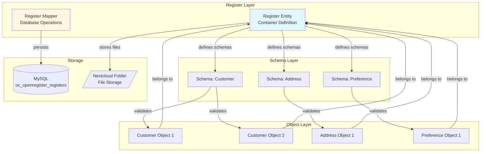
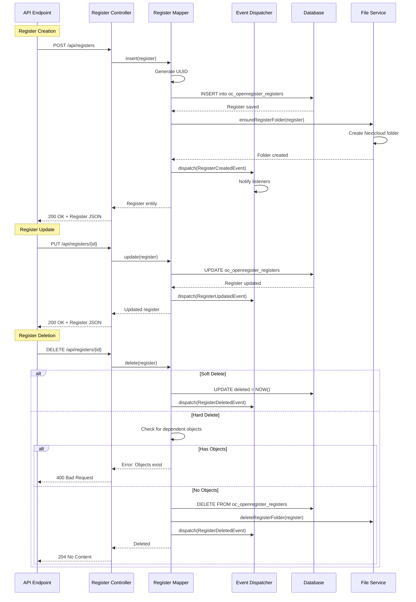
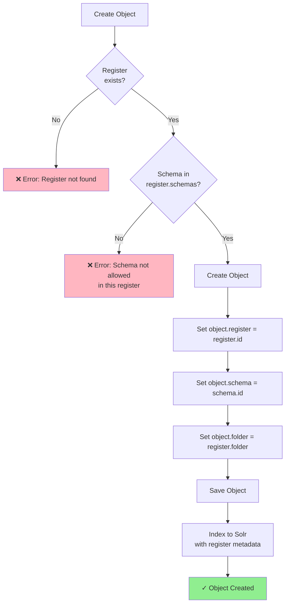
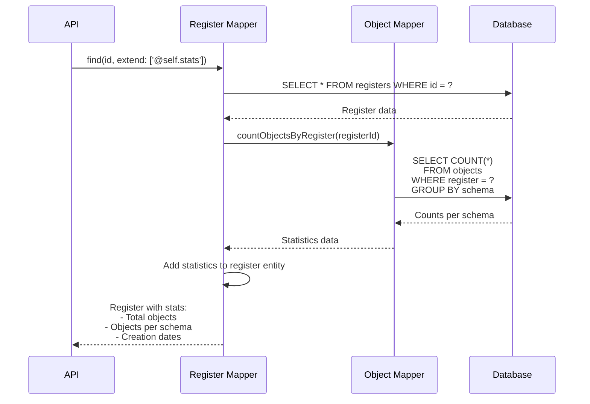
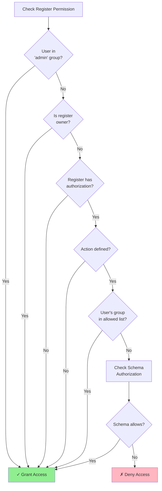

import ApiSchema from '@theme/ApiSchema';
import Tabs from '@theme/Tabs';
import TabItem from '@theme/TabItem';

# Registers

## What is a Register?

In Open Register, a **Register** is a specialized container that holds objects conforming to specific schemas. You can think of a register as:

- A **collection** of related data objects
- A **domain-specific database** focused on a particular subject area
- A **logical grouping** of information with common validation rules
- A **database** for structured data storage
- A **object store** for unstructured data
- A **data lake** for large-scale data storage and analysis

Registers provide a way to organize data by purpose, domain, or function, making it easier to manage and retrieve related information.

## Register Structure

<ApiSchema id="open-register" example   pointer="#/components/schemas/Register" />

## Register Use Cases

Registers can be used for various purposes:

### 1. Master Data Management

Create registers for core business entities like customers, products, or locations to ensure a single source of truth.

### 2. Domain-Specific Data Collections

Organize data by business domains such as:
- HR Register (employees, departments, positions)
- Financial Register (accounts, transactions, budgets)
- Product Register (products, categories, specifications)

### 3. Integration Hubs

Use registers as integration points between different systems, providing a standardized way to exchange data.

## Working with Registers
## Introduction

Registers in Open Register can be maintained through both the user interface (UI) and the API. This flexibility allows users to manage registers in a way that best suits their workflow and technical capabilities. 

For detailed information on the API endpoints and how to use them, please refer to the [API documentation for registers](https://openregisters.app/api#tag/Registers).


### Creating a Register

To create a new register, you need to define its basic properties and specify which schemas it will support:

```json
POST /api/registers
{
  "title": "Customer Register",
  "description": "Central repository for customer information",
  "schemas": ["customer", "address", "preference"],
  "source": "primary-source",
  "databaseId": "customer-db"
}
```

### Retrieving Register Information

You can retrieve information about a specific register:

```
GET /api/registers/{id}
```

Or list all available registers:

```
GET /api/registers
```

### Updating a Register

Registers can be updated to add or remove supported schemas or change other properties:

```json
PUT /api/registers/{id}
{
  "title": "Customer Register",
  "description": "Updated repository for customer information",
  "schemas": ["customer", "address", "preference", "communication-history"],
  "source": "primary-source",
  "databaseId": "customer-db"
}
```

### Deleting a Register

Registers can be deleted when no longer needed:

```
DELETE /api/registers/{id}
```

## Best Practices

1. **Logical Grouping**: Create registers around logical domains or business functions
2. **Clear Naming**: Use clear, descriptive names for registers
3. **Documentation**: Provide detailed descriptions of each register's purpose
4. **Schema Selection**: Carefully select which schemas belong in each register
5. **Access Control**: Define appropriate access controls for each register

## Relationship to Other Concepts

- **Schemas**: Registers specify which schemas they support, defining what types of objects can be stored
- **Objects**: Objects are stored within registers and must conform to one of the register's supported schemas
- **Sources**: Registers use sources to determine where and how their data is stored

## Conclusion

Registers are a fundamental organizing principle in Open Register, providing structure and context for your data. By grouping related schemas and objects into registers, you create a more manageable and intuitive data architecture that aligns with your business domains.

## Technical Implementation

### Architecture Overview

Registers serve as organizational containers that group related schemas and objects into logical domains:



### Register Lifecycle

The lifecycle of a register from creation to deletion:



### Register-Schema-Object Relationship

How registers, schemas, and objects interact:



### Database Schema

Registers are stored in the `oc_openregister_registers` table:

```sql
CREATE TABLE oc_openregister_registers (
    id INTEGER PRIMARY KEY AUTO_INCREMENT,
    uuid VARCHAR(255) UNIQUE NOT NULL,
    slug VARCHAR(255) NOT NULL,
    title VARCHAR(255),
    version VARCHAR(50),
    description TEXT,
    schemas JSON,
    source VARCHAR(255),
    table_prefix VARCHAR(50),
    folder VARCHAR(255),
    updated DATETIME,
    created DATETIME,
    owner VARCHAR(255),
    application VARCHAR(255),
    organisation VARCHAR(255),
    authorization JSON,
    groups JSON,
    deleted DATETIME,
    INDEX idx_slug (slug),
    INDEX idx_uuid (uuid),
    INDEX idx_folder (folder)
);
```

### Register Statistics

Registers can be extended with object statistics using the `@self.stats` extension:



**Example Response:**

```json
{
  "id": 1,
  "uuid": "abc123...",
  "title": "Customer Register",
  "schemas": [5, 7, 9],
  "@self": {
    "stats": {
      "totalObjects": 1523,
      "objectsBySchema": {
        "5": 1200,
        "7": 300,
        "9": 23
      },
      "oldestObject": "2024-01-15T10:00:00Z",
      "newestObject": "2025-01-31T14:30:00Z"
    }
  }
}
```

### Folder Management

Registers automatically manage Nextcloud folders for file storage:

```mermaid
graph TD
    RegisterCreated[Register Created] --> GenerateFolder[Generate Folder Path]
    GenerateFolder --> FolderPattern["/OpenRegister/{register.slug}"]
    
    FolderPattern --> CheckExists{Folder<br/>exists?}
    CheckExists -->|No| CreateFolder[Create Folder in Nextcloud]
    CheckExists -->|Yes| UseExisting[Use Existing Folder]
    
    CreateFolder --> SetPermissions[Set Folder Permissions]
    UseExisting --> SetPermissions
    
    SetPermissions --> StoreObjects[Objects Store Files Here]
    StoreObjects --> SubFolders[Create Object Subfolders:<br/>/OpenRegister/{slug}/{object-uuid}/]
    
    SubFolders --> FileStorage[Files Stored in Object Folders]
    
    style FileStorage fill:#90EE90
```

### Authorization System

Registers support group-based permissions similar to schemas:



**Authorization Configuration:**

```json
{
  "authorization": {
    "create": ["group-editors", "group-admin"],
    "read": ["group-viewers", "group-editors", "group-admin"],
    "update": ["group-editors", "group-admin"],
    "delete": ["group-admin"]
  },
  "groups": ["group-editors", "group-admin", "group-viewers"]
}
```

### Event System

Registers emit events for lifecycle operations:

| Event | Fired When | Use Cases |
|-------|------------|-----------|
| `RegisterCreatedEvent` | New register created | - Initialize folder structure<br/>- Setup default configurations<br/>- Audit logging |
| `RegisterUpdatedEvent` | Register properties updated | - Update folder permissions<br/>- Sync external systems<br/>- Cache invalidation |
| `RegisterDeletedEvent` | Register deleted | - Cleanup files and folders<br/>- Archive objects<br/>- Notify dependent systems |

### Code Examples

**Creating a Register:**

```php
use OCA\OpenRegister\Db\Register;
use OCA\OpenRegister\Db\RegisterMapper;

$register = new Register();
$register->hydrate([
    'title' => 'Customer Data Register',
    'slug' => 'customers',
    'description' => 'Central repository for all customer information',
    'schemas' => [5, 7, 9], // Schema IDs
    'folder' => '/OpenRegister/customers',
    'owner' => 'admin',
    'organisation' => 'ACME Corp'
]);

$savedRegister = $registerMapper->insert($register);
```

**Retrieving Register with Statistics:**

```php
// Get register with object statistics
$register = $registerMapper->find($registerId, ['@self.stats']);

$stats = $register->jsonSerialize()['@self']['stats'];
echo "Total objects: {$stats['totalObjects']}\n";

foreach ($stats['objectsBySchema'] as $schemaId => $count) {
    echo "Schema {$schemaId}: {$count} objects\n";
}
```

**Filtering Objects by Register:**

```php
// Find all objects in a register
$objects = $objectEntityMapper->findByRegister($registerId);

// Search objects in register via Solr
$results = $solrService->searchObjects([
    '@self' => [
        'register' => $registerId
    ]
]);
```

### Performance Optimizations

**1. Indexed Queries**
- Database indexes on `slug`, `uuid`, `folder`
- Fast register lookups

**2. Schema Array Storage**
- Schemas stored as JSON array
- Quick validation checks

**3. Folder Path Caching**
- Folder paths cached during request
- Reduces file system calls

**4. Statistics Lazy Loading**
- Statistics loaded only when requested
- Controlled via `@self.stats` extension

### Best Practices

**1. Register Organization**
- Group related schemas logically
- Use clear, descriptive names
- Maintain one register per domain

**2. Schema Selection**
- Only include schemas that belong together
- Keep schema lists manageable (<20 schemas)
- Document why schemas are grouped

**3. Folder Structure**
- Use meaningful folder paths
- Follow naming conventions
- Maintain folder hierarchy

**4. Authorization**
- Set appropriate access controls
- Use groups for team permissions
- Review permissions regularly

**5. Maintenance**
- Monitor object counts per register
- Archive unused registers
- Clean up orphaned folders

### Monitoring and Debugging

**Register Statistics:**

```bash
# Count objects per register
SELECT r.id, r.title, COUNT(o.id) as object_count
FROM oc_openregister_registers r
LEFT JOIN oc_openregister_objects o ON r.id = o.register
GROUP BY r.id, r.title
ORDER BY object_count DESC;

# Find registers with no objects
SELECT r.id, r.title
FROM oc_openregister_registers r
LEFT JOIN oc_openregister_objects o ON r.id = o.register
WHERE o.id IS NULL;
```

**Folder Management:**

```bash
# Check folder structure
docker exec nextcloud-container ls -la /var/www/html/data/OpenRegister/

# Find registers with folder issues
SELECT id, title, folder
FROM oc_openregister_registers
WHERE folder IS NULL OR folder = '';
```

**Authorization Issues:**

```bash
# Check register permissions
docker logs nextcloud-container | grep 'Register.*permission'

# List registers by authorization config
SELECT id, title, authorization, groups
FROM oc_openregister_registers
WHERE authorization IS NOT NULL;
``` 