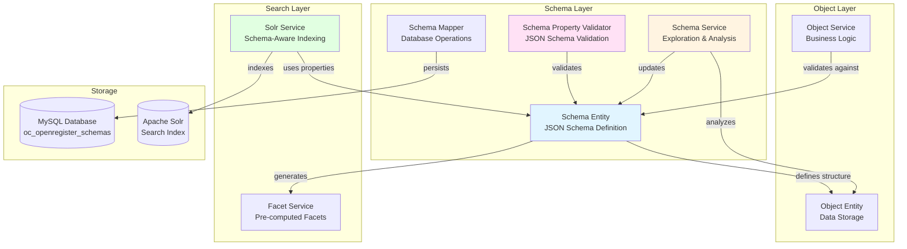
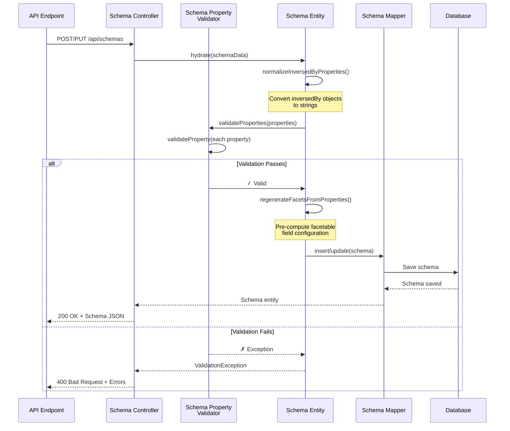
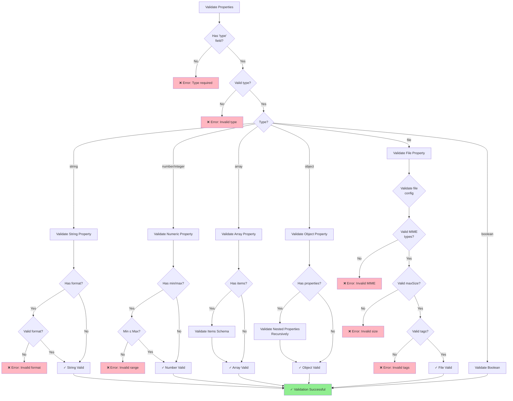
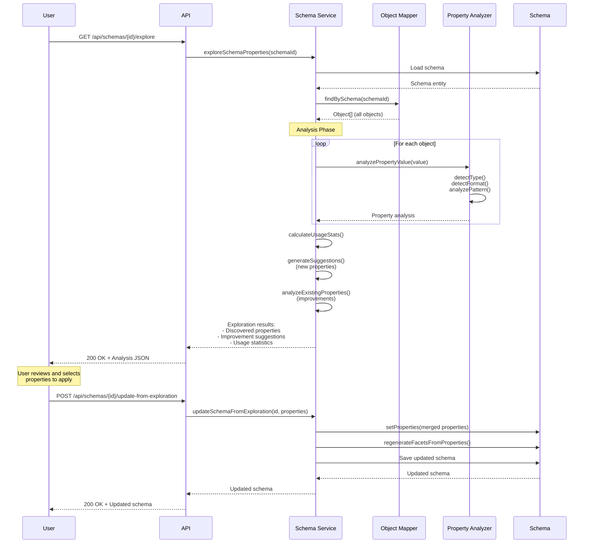
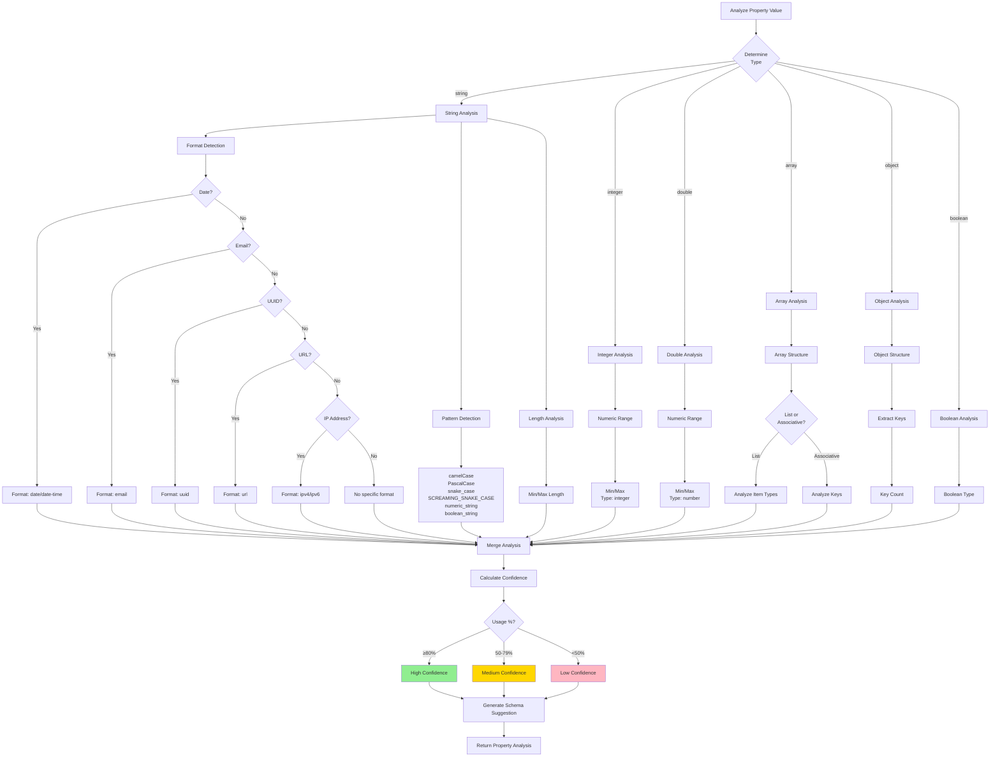
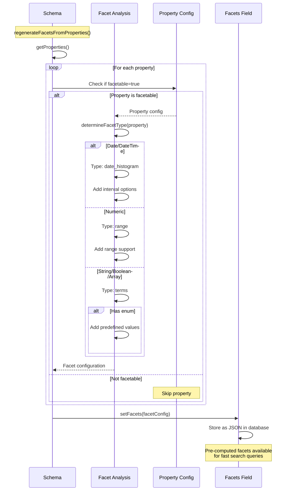
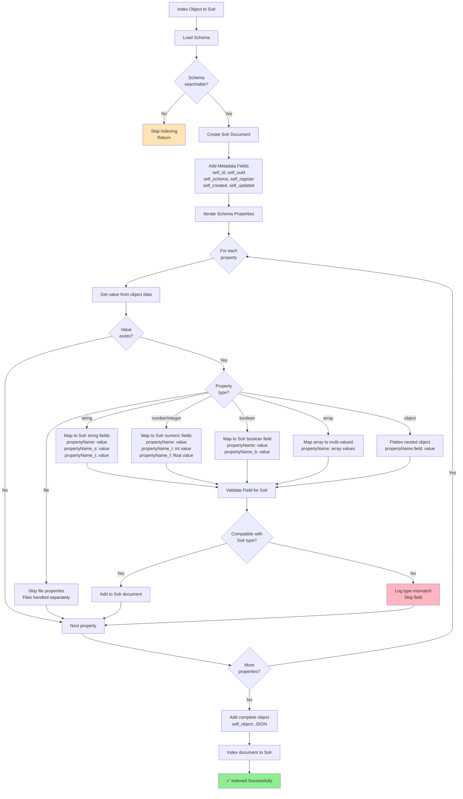
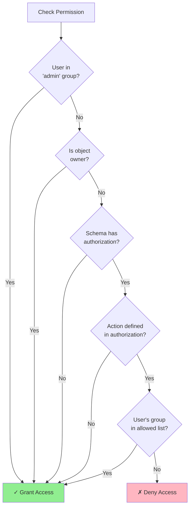

import ApiSchema from '@theme/ApiSchema';
import Tabs from '@theme/Tabs';
import TabItem from '@theme/TabItem';

# Schemas

## What is a Schema?

In Open Register, a **Schema** defines the structure, validation rules, and relationships for data objects. Schemas act as blueprints that specify:

- What **fields** an object should have
- What **data types** those fields should be
- Which fields are **required** vs. optional
- Any **constraints** on field values (min/max, patterns, enums)
- **Relationships** between different objects

Open Register uses [JSON Schema](https://json-schema.org/) as its schema definition language, providing a powerful and standardized way to describe data structures.

## Schema Structure

A schema in Open Register follows the JSON Schema specification (see [JSON Schema Core](https://json-schema.org/understanding-json-schema) and [JSON Schema Validation](https://json-schema.org/draft/2020-12/json-schema-validation.html)) and consists of the following key components defined in the specification:


<ApiSchema id="open-register" example   pointer="#/components/schemas/Schema" />

## Schema Validation

Open Register provides robust schema validation capabilities to ensure data integrity and quality. The validation system is built on top of JSON Schema validation and includes additional custom validation rules.

### Validation Types

1. **Type Validation**
   - Ensures data types match schema definitions
   - Validates string, number, boolean, object, and array types
   - Checks format specifications (email, date, URI, etc.)

2. **Required Fields**
   - Validates presence of mandatory fields
   - Supports conditional requirements
   - Handles nested required fields

3. **Constraints**
   - Minimum/maximum values for numbers
   - String length limits
   - Pattern matching for strings
   - Array size limits
   - Custom validation rules

4. **Relationships**
   - Validates object references
   - Checks relationship integrity
   - Ensures bidirectional relationships

### Custom Validation Rules

Open Register supports custom validation rules through PHP classes. These rules can be defined in your schema:

```json
{
  "properties": {
    "age": {
      "type": "integer",
      "minimum": 0,
      "maximum": 150,
      "customValidation": {
        "class": "OCA\\OpenRegister\\Validation\\AgeValidator",
        "method": "validate"
      }
    }
  }
}
```

### Validation Process

1. **Pre-validation**
   - Schema structure validation
   - Custom rule registration
   - Relationship validation setup

2. **Data Validation**
   - Type checking
   - Required field verification
   - Constraint validation
   - Custom rule execution

3. **Post-validation**
   - Relationship integrity check
   - Cross-field validation
   - Business rule validation

### Error Handling

The validation system provides detailed error messages:

```json
{
  "valid": false,
  "errors": [
    {
      "field": "email",
      "message": "Invalid email format",
      "code": "INVALID_EMAIL"
    },
    {
      "field": "age",
      "message": "Age must be between 0 and 150",
      "code": "INVALID_AGE"
    }
  ]
}
```

### Best Practices

1. **Validation Design**
   - Define clear validation rules
   - Use appropriate constraints
   - Consider performance impact
   - Document custom rules

2. **Error Messages**
   - Provide clear error descriptions
   - Include helpful suggestions
   - Use consistent error codes
   - Support multiple languages

3. **Performance**
   - Optimize validation rules
   - Cache validation results
   - Batch validate when possible
   - Monitor validation times

### Example Schema with Validation

```json
{
  "title": "Person",
  "version": "1.0.0",
  "required": ["firstName", "lastName", "email", "age"],
  "properties": {
    "firstName": {
      "type": "string",
      "minLength": 2,
      "maxLength": 50,
      "pattern": "^[A-Za-z\\s-]+$",
      "description": "Person's first name"
    },
    "lastName": {
      "type": "string",
      "minLength": 2,
      "maxLength": 50,
      "pattern": "^[A-Za-z\\s-]+$",
      "description": "Person's last name"
    },
    "email": {
      "type": "string",
      "format": "email",
      "description": "Person's email address"
    },
    "age": {
      "type": "integer",
      "minimum": 0,
      "maximum": 150,
      "description": "Person's age"
    },
    "phoneNumbers": {
      "type": "array",
      "items": {
        "type": "object",
        "required": ["type", "number"],
        "properties": {
          "type": {
            "type": "string",
            "enum": ["home", "work", "mobile"]
          },
          "number": {
            "type": "string",
            "pattern": "^\\+?[1-9]\\d{1,14}$"
          }
        }
      }
    }
  }
}
```

## Property Structure

Before diving into schema examples, let's understand the key components of a property definition. These components are primarily derived from JSON Schema specifications (see [JSON Schema Validation](https://json-schema.org/draft/2020-12/json-schema-validation.html)) with some additional extensions required for storage and validation purposes:

| Property | Description | Example |
|----------|-------------|---------|
| [`type`](https://json-schema.org/understanding-json-schema/reference/type#type-specific-keywords) | Data type of the property (string, number, boolean, object, array) | `"type": "string"` |
| [`description`](https://json-schema.org/understanding-json-schema/keywords#description) | Human-readable explanation of the property's purpose | `"description": "Person's full name"` |
| [`format`](https://json-schema.org/understanding-json-schema/reference/type#format) | Specific for the type (date, email, uri, etc) | `"format": "date-time"` |
| `pattern` | Regular expression pattern the value must match | `"pattern": "^[A-Z][a-z]+$"` |
| `enum` | Array of allowed values | `"enum": ["active", "inactive"]` |
| `minimum`/`maximum` | Numeric range constraints | `"minimum": 0, "maximum": 100` |
| `minLength`/`maxLength` | String length constraints | `"minLength": 3, "maxLength": 50` |
| `required` | Whether the property is mandatory | `"required": true` |
| `default` | Default value if none provided | `"default": "pending"` |
| `examples` | Sample valid values | `"examples": ["John Smith"]` |

Properties can also have nested objects and arrays with their own validation rules, allowing for complex data structures while maintaining strict validation. See the [Nesting schema's](#nesting-schemas) section below for more details.

### File Properties

File properties allow you to attach files directly to specific object properties with validation and automatic processing. File properties support both single files and arrays of files.

#### Basic File Property

```json
{
  'properties': {
    'avatar': {
      'type': 'file',
      'description': 'User profile picture',
      'allowedTypes': ['image/jpeg', 'image/png', 'image/gif'],
      'maxSize': 2097152,
      'autoTags': ['profile-image', 'auto-uploaded']
    }
  }
}
```

#### Array of Files Property

```json
{
  'properties': {
    'attachments': {
      'type': 'array',
      'description': 'Document attachments',
      'items': {
        'type': 'file',
        'allowedTypes': ['application/pdf', 'image/jpeg', 'image/png'],
        'maxSize': 10485760,
        'allowedTags': ['document', 'attachment'],
        'autoTags': ['auto-uploaded', 'property-attachments']
      }
    }
  }
}
```

#### File Property Configuration

| Property | Type | Description | Example |
|----------|------|-------------|---------|
| 'allowedTypes' | array | Array of allowed MIME types | '['image/jpeg', 'image/png']' |
| 'maxSize' | integer | Maximum file size in bytes | '5242880' (5MB) |
| 'allowedTags' | array | Tags that are allowed on files | '['document', 'public']' |
| 'autoTags' | array | Tags automatically applied to uploaded files | '['auto-uploaded', 'property-{propertyName}']' |

#### File Input Types

File properties support three types of input:

1. **Base64 Data URIs**: 'data:image/jpeg;base64,/9j/4AAQSkZJRgABAQEAAA...'
2. **URLs**: 'https://example.com/image.jpg' (system fetches the file)
3. **File Objects**: '{id: '12345', title: 'image.jpg', downloadUrl: '...'}'

#### File Property Processing

When objects are saved:

1. **File Detection**: System detects file data (base64, URLs, or file objects) in file properties
2. **File Processing**: 
   - Base64: Decoded and validated
   - URLs: Fetched from remote source
   - File Objects: Validated against existing files
3. **Validation**: Files are validated against 'allowedTypes' and 'maxSize' constraints
4. **File Creation**: Files are created and stored in the object's folder
5. **Auto Tagging**: 'autoTags' are automatically applied to files
6. **ID Storage**: File IDs replace file content in the object data

When objects are rendered:

1. **ID Detection**: System detects file IDs in file properties
2. **File Hydration**: File IDs are replaced with complete file objects
3. **Metadata**: File objects include path, size, type, tags, and access URLs

#### Auto Tag Placeholders

Auto tags support placeholder replacement:

| Placeholder | Replacement | Example |
|-------------|-------------|---------|
| '{property}' or '{propertyName}' | Property name | 'property-avatar' |
| '{index}' | Array index (for array properties) | 'file-0', 'file-1' |

#### File Upload Examples

**Base64 Input:**
```json
// Input object with base64 file data
{
  'name': 'John Doe',
  'avatar': 'data:image/jpeg;base64,/9j/4AAQSkZJRgABAQEAAA...',
  'documents': [
    'data:application/pdf;base64,JVBERi0xLjQKJcOkw6k...',
    'data:image/png;base64,iVBORw0KGgoAAAANSUhEUgAA...'
  ]
}
```

**URL Input:**
```json
// Input object with URLs (system fetches files)
{
  'name': 'Jane Smith',
  'avatar': 'https://example.com/avatars/jane.jpg',
  'documents': [
    'https://example.com/docs/resume.pdf',
    'https://example.com/certificates/cert.png'
  ]
}
```

**File Object Input:**
```json
// Input object with existing file objects
{
  'name': 'Bob Wilson',
  'avatar': {
    'id': '12345',
    'title': 'profile.jpg',
    'downloadUrl': 'https://example.com/s/AbCdEfGh/download'
  },
  'documents': [
    {
      'id': '12346',
      'title': 'document1.pdf',
      'downloadUrl': 'https://example.com/s/XyZwVuTs/download'
    }
  ]
}
```

**All Input Types - Final Storage:**

```json
// Stored object with file IDs
{
  "name": "John Doe",
  "avatar": 12345,
  "documents": [12346, 12347]
}
```

**Rendered object with file objects:**

```json
{
  "name": "John Doe",
  "avatar": {
    "id": "12345",
    "title": "avatar_1640995200.jpg",
    "type": "image/jpeg",
    "size": 15420,
    "accessUrl": "https://example.com/s/AbCdEfGh",
    "downloadUrl": "https://example.com/s/AbCdEfGh/download",
    "labels": ["profile-image", "auto-uploaded"]
  },
  "documents": [
    {
      "id": "12346",
      "title": "documents_0_1640995200.pdf",
      "type": "application/pdf",
      "size": 245760,
      "accessUrl": "https://example.com/s/XyZwVuTs",
      "labels": ["auto-uploaded", "property-documents"]
    },
    {
      "id": "12347",
      "title": "documents_1_1640995200.png",
      "type": "image/png",
      "size": 89123,
      "accessUrl": "https://example.com/s/MnOpQrSt",
      "labels": ["auto-uploaded", "property-documents"]
    }
  ]
}
```

#### Best Practices

1. **MIME Type Validation**: Always specify 'allowedTypes' to prevent unwanted file uploads
2. **Size Limits**: Set appropriate 'maxSize' limits to prevent storage abuse
3. **Auto Tags**: Use descriptive auto tags for better file organization
4. **Property Names**: Use clear property names that indicate file purpose
5. **Array Usage**: Use array properties for multiple files of the same type

## Example Schema

```json
{
  "id": "person",
  "title": "Person",
  "version": "1.0.0",
  "description": "Schema for representing a person with basic information",
  "summary": "Basic person information",
  "required": ["firstName", "lastName", "birthDate"],
  "properties": {
    "firstName": {
      "type": "string",
      "description": "Person's first name"
    },
    "lastName": {
      "type": "string",
      "description": "Person's last name"
    },
    "birthDate": {
      "type": "string",
      "format": "date",
      "description": "Person's date of birth in ISO 8601 format"
    },
    "email": {
      "type": "string",
      "format": "email",
      "description": "Person's email address"
    },
    "address": {
      "type": "object",
      "description": "Person's address",
      "properties": {
        "street": { "type": "string" },
        "city": { "type": "string" },
        "postalCode": { "type": "string" },
        "country": { "type": "string" }
      }
    },
    "phoneNumbers": {
      "type": "array",
      "items": {
        "type": "object",
        "properties": {
          "type": { 
            "type": "string",
            "enum": ["home", "work", "mobile"]
          },
          "number": { "type": "string" }
        }
      }
    }
  },
  "archive": {},
  "updated": "2023-04-20T11:25:00Z",
  "created": "2023-01-05T08:30:00Z"
}
```

## Schema Use Cases

Schemas serve multiple purposes in Open Register:

### 1. Data Validation

Schemas ensure that all data entering the system meets defined requirements, maintaining data quality and consistency.

### 2. Documentation

Schemas serve as self-documenting specifications for data structures, helping developers understand what data is available and how it's organized.

### 3. API Contract

Schemas define the contract between different systems, specifying what data can be exchanged and in what format.

### 4. UI Generation

Schemas can be used to automatically generate forms and other UI elements, ensuring that user interfaces align with data requirements.

## Working with Schemas

### Creating a Schema

To create a new schema, you define its structure and validation rules:

```json
POST /api/schemas
{
  "title": "Product",
  "version": "1.0.0",
  "description": "Schema for product information",
  "required": ["name", "sku", "price"],
  "properties": {
    "name": {
      "type": "string",
      "description": "Product name"
    },
    "sku": {
      "type": "string",
      "description": "Stock keeping unit"
    },
    "price": {
      "type": "number",
      "minimum": 0,
      "description": "Product price"
    },
    "description": {
      "type": "string",
      "description": "Product description"
    },
    "category": {
      "type": "string",
      "description": "Product category"
    }
  }
}
```

### Retrieving Schema Information

You can retrieve information about a specific schema:

```
GET /api/schemas/{id}
```

Or list all available schemas:

```
GET /api/schemas
```

### Updating a Schema

Schemas can be updated to add new fields, change validation rules, or fix issues:

```json
PUT /api/schemas/{id}
{
  "title": "Product",
  "version": "1.1.0",
  "description": "Schema for product information",
  "required": ["name", "sku", "price"],
  "properties": {
    "name": {
      "type": "string",
      "description": "Product name"
    },
    "sku": {
      "type": "string",
      "description": "Stock keeping unit"
    },
    "price": {
      "type": "number",
      "minimum": 0,
      "description": "Product price"
    },
    "description": {
      "type": "string",
      "description": "Product description"
    },
    "category": {
      "type": "string",
      "description": "Product category"
    },
    "tags": {
      "type": "array",
      "items": {
        "type": "string"
      },
      "description": "Product tags"
    }
  }
}
```
### Nesting schema's


### Schema Versioning

Open Register supports schema versioning to manage changes over time:

1. **Minor Updates**: Adding optional fields or relaxing constraints
2. **Major Updates**: Adding required fields, removing fields, or changing field types
3. **Archive**: Previous versions are stored in the schema's archive property

## API Property Filtering

When retrieving objects via the API, OpenRegister provides several parameters to control which properties are included or excluded from the response. This is particularly useful for optimizing performance, reducing payload sizes, or filtering out sensitive information.

### Available Filtering Parameters

| Parameter | Purpose | Usage Example |
|-----------|---------|---------------|
| '_fields' | **Whitelist** - Include only specified properties | '?_fields=id,name,description' |
| '_unset' | **Blacklist** - Remove specified properties | '?_unset=internal,private,metadata' |
| '_filter' | **Conditional** - Filter objects by property values | '?_filter=status,active' |

### Property Inclusion with '_fields'

Use '_fields' to specify exactly which properties should be included in the response:

```bash
# Only return id, name, and description
GET /api/objects/register/schema/123?_fields=id,name,description
```

**Response:**
```json
{
  "id": "123",
  "name": "Sample Object",
  "description": "This is a sample",
  "@self": {
    "id": "123",
    "name": "Sample Object",
    "register": "1",
    "schema": "5"
  }
}
```

### Property Removal with '_unset'

Use '_unset' to remove specific properties from the response:

```bash
# Remove internal and metadata properties
GET /api/objects/register/schema/123?_unset=internal,metadata,created
```

**Before '_unset':**
```json
{
  "id": "123",
  "name": "Sample Object",
  "internal": "sensitive data",
  "metadata": {"version": "1.0"},
  "created": "2023-01-01T00:00:00Z",
  "@self": {...}
}
```

**After '_unset=internal,metadata,created':**
```json
{
  "id": "123", 
  "name": "Sample Object",
  "@self": {...}
}
```

### Alternative Syntax

Both underscore and non-underscore versions are supported:

```bash
# These are equivalent:
GET /api/objects/123?_unset=field1,field2
GET /api/objects/123?unset=field1,field2

GET /api/objects/123?_fields=id,name
GET /api/objects/123?fields=id,name
```

### Collection Endpoints

Property filtering works on both single object and collection endpoints:

```bash
# Remove sensitive data from all objects in collection
GET /api/objects?_unset=password,token,internal

# Only include essential fields for list view
GET /api/objects?_fields=id,name,status
```

### Best Practices

1. **Performance**: Use '_fields' for large objects to reduce response size
2. **Security**: Use '_unset' to remove sensitive properties without affecting underlying data
3. **Consistency**: Choose one parameter style ('_unset' vs 'unset') and use consistently
4. **Documentation**: Document which fields can be filtered for API consumers

### Important Notes

- Property filtering only affects the API response, not the stored data
- The '@self' metadata object is always included and contains core object information
- Filtering is applied after object rendering and relationship resolution
- Invalid property names in filtering parameters are silently ignored

# Schema References and Object Cascading

OpenRegister supports schema references to enable reusable schema definitions and complex object relationships. This document explains how schema references work, how they are resolved, and how to configure object cascading.

## Reference Format

Schema references use the JSON Schema format: `#/components/schemas/[slug]`

### Examples

```json
{
  'type': 'object',
  'properties': {
    'person': {
      'type': 'object',
      '$ref': '#/components/schemas/Person'
    },
    'contacts': {
      'type': 'array',
      'items': {
        '$ref': '#/components/schemas/Contactgegevens'
      }
    }
  }
}
```

## Object Handling Configuration

OpenRegister provides different ways to handle nested objects through the `objectConfiguration.handling` property:

### 1. Nested Objects (`nested-object`)

Objects are stored as nested data within the parent object. This is the default behavior.

```json
{
  'contactgegevens': {
    'type': 'object',
    '$ref': '#/components/schemas/Contactgegevens',
    'objectConfiguration': {
      'handling': 'nested-object'
    }
  }
}
```

**Result**: The contactgegevens data is stored directly in the parent object.

### 2. Cascading Objects (`cascade`)

Objects are created as separate entities. There are two types of cascading behavior:

#### 2a. Cascading with `inversedBy` (Relational Cascading)

Creates separate entities with back-references to the parent object:

   ```json
   {
  'contactgegevens': {
    'type': 'array',
    'items': {
      'type': 'object',
      '$ref': '#/components/schemas/Contactgegevens',
      'inversedBy': 'organisatie'
    },
    'objectConfiguration': {
      'handling': 'cascade',
      'schema': '34'
    }
  }
}
```

**Result**: 
- Each contactgegevens object is created as a separate entity with the `organisatie` property set to the parent object's UUID
- The parent object's `contactgegevens` property becomes an empty array `[]`

#### 2b. Cascading without `inversedBy` (ID Storage Cascading)

Creates independent entities and stores their IDs in the parent object:

```json
{
  'contactgegevens': {
    'type': 'array',
    'items': {
      'type': 'object',
      '$ref': '#/components/schemas/Contactgegevens'
    },
    'objectConfiguration': {
      'handling': 'cascade',
      'schema': '34'
    }
  }
}
```

**Result**: 
- Each contactgegevens object is created as a separate, independent entity
- The parent object's `contactgegevens` property stores an array of the created objects' UUIDs: `['uuid1', 'uuid2']`

## Cascading Configuration

For objects to be cascaded (saved as separate entities), they must have:

1. **Schema Reference**: `$ref` property pointing to the target schema
2. **Object Configuration**: `objectConfiguration.handling` set to `'cascade'`
3. **Target Schema**: `objectConfiguration.schema` property specifying the schema ID for cascaded objects

### Optional Configuration

4. **Inverse Relationship**: `inversedBy` property for relational cascading (creates back-reference)
5. **Register**: `register` property (defaults to parent object's register)

### Cascading Types

- **With `inversedBy`**: Creates relational cascading where cascaded objects reference the parent
- **Without `inversedBy`**: Creates independent cascading where parent stores cascaded object IDs

### Single Object Cascading

#### With `inversedBy` (Relational)

```json
{
  'manager': {
    'type': 'object',
    '$ref': '#/components/schemas/Person',
    'inversedBy': 'managedOrganisation',
    'register': '6',
    'objectConfiguration': {
      'handling': 'cascade',
      'schema': '12'
    }
  }
}
```

**Result**: Manager object is created separately with `managedOrganisation` property set to parent UUID. Parent object's `manager` property becomes `null`.

#### Without `inversedBy` (ID Storage)

```json
{
  'manager': {
    'type': 'object',
    '$ref': '#/components/schemas/Person',
    'register': '6',
    'objectConfiguration': {
      'handling': 'cascade',
      'schema': '12'
       }
     }
   }
   ```

**Result**: Manager object is created independently. Parent object's `manager` property stores the manager's UUID as a string.

### Array Object Cascading

#### With `inversedBy` (Relational)

```json
{
  'employees': {
    'type': 'array',
    'items': {
      'type': 'object',
      '$ref': '#/components/schemas/Person',
      'inversedBy': 'employer'
    },
    'objectConfiguration': {
      'handling': 'cascade',
      'schema': '12'
    }
  }
}
```

**Result**: Each employee object is created separately with `employer` property set to parent UUID. Parent object's `employees` property becomes an empty array `[]`.

#### Without `inversedBy` (ID Storage)

   ```json
   {
  'employees': {
    'type': 'array',
    'items': {
      'type': 'object',
      '$ref': '#/components/schemas/Person'
    },
    'objectConfiguration': {
      'handling': 'cascade',
      'schema': '12'
       }
     }
   }
   ```

**Result**: Each employee object is created independently. Parent object's `employees` property stores an array of employee UUIDs: `['uuid1', 'uuid2', 'uuid3']`.

## Schema Resolution Process

Schema references are resolved through a **pre-processing approach** that happens before validation:

### 1. Schema Pre-processing

Before validation, the system:
- Scans the schema for `$ref` properties
- Resolves references to actual schema definitions
- Embeds the resolved schemas in place of references
- Creates union types for properties that support both objects and UUID references

### 2. Reference Resolution Order

The system resolves schema references in the following order:

1. **Direct ID/UUID**: `'34'`, `'21aab6e0-2177-4920-beb0-391492fed04b'`
2. **JSON Schema path**: `'#/components/schemas/Contactgegevens'`
3. **URL references**: `'http://example.com/api/schemas/34'`
4. **Slug references**: `'contactgegevens'` (case-insensitive)

For path and URL references, the system extracts the last path segment and matches it against schema slugs.

### 3. Union Type Creation

For cascading objects, the system creates union types that allow both:
- **Full nested object**: Complete object data
- **UUID reference**: String UUID pointing to an existing object

```json
{
  'type': ['object', 'string'],
  'properties': {
    // ... full schema properties
  },
  'pattern': '^[0-9a-f]{8}-[0-9a-f]{4}-4[0-9a-f]{3}-[89ab][0-9a-f]{3}-[0-9a-f]{12}$'
}
```

## Cascading Behavior

### Object Creation Flow

1. **Validation**: Objects are validated against the union type schema
2. **Sanitization**: Empty values are cleaned up
3. **Cascading**: Objects with `inversedBy` are extracted and saved separately
4. **Relationship Setting**: The `inversedBy` property is set to the parent object's UUID
5. **Separate Storage**: Cascaded objects are saved as independent entities
6. **Parent Update**: Cascaded objects are removed from the parent object's data

### Example Flow

Input data:
```json
{
  'naam': 'Test Organization',
  'contactgegevens': [
    {
      'email': 'contact@example.com',
      'telefoon': '123-456-7890',
      'voornaam': 'John',
      'achternaam': 'Doe'
    }
  ]
}
```

Result:
1. **Parent object** (organisatie): Stored with `contactgegevens: []`
2. **Cascaded object** (contactgegevens): Stored separately with `organisatie: 'parent-uuid'`

## Configuration Examples

### E-commerce Product with Reviews

```json
{
  'reviews': {
    'type': 'array',
    'items': {
      'type': 'object',
      '$ref': '#/components/schemas/Review',
      'inversedBy': 'product'
    },
    'objectConfiguration': {
      'handling': 'cascade',
      'schema': '25'
    }
  }
}
```

### Organization with Departments

```json
{
  'departments': {
    'type': 'array',
    'items': {
      'type': 'object',
      '$ref': '#/components/schemas/Department',
      'inversedBy': 'organization',
      'register': '6'
    },
    'objectConfiguration': {
      'handling': 'cascade'
    }
  }
}
```

### Project with Tasks

```json
{
  'tasks': {
    'type': 'array',
    'items': {
      'type': 'object',
      '$ref': '#/components/schemas/Task',
      'inversedBy': 'project'
    },
    'objectConfiguration': {
      'handling': 'cascade',
      'schema': '18'
    }
  }
}
```

## Schema Exploration

Open Register includes a powerful **Schema Exploration** feature that analyzes existing object data to discover properties not defined in the current schema. This is particularly useful when:

- Objects were created with validation disabled
- Data was imported from external sources
- The schema evolved over time and some properties weren't properly documented
- You need to discover the actual data structure within your objects

### How Schema Exploration Works

The exploration process involves several steps:

1. **Object Retrieval**: Collects all objects belonging to a specific schema
2. **Property Extraction**: Analyzes each object's properties and their values
3. **Type Detection**: Determines data types, formats, and patterns from real data
4. **Gap Analysis**: Identifies properties present in objects but missing from the schema
5. **Confidence Scoring**: Provides confidence levels for property recommendations

### Starting Schema Exploration

To explore a schema's properties:

1. Navigate to **Schemas** in the Open Register interface
2. Find the schema you want to explore
3. Click the **"Explore Properties"** action button (database search icon)
4. Review the analysis results showing discovered properties
5. Select which properties to add to your schema
6. Configure property settings (types, constraints, behaviors)
7. Apply changes to update the schema

### Understanding Analysis Results

The exploration results provide detailed information about each discovered property:

#### Property Information
- **Recommended Type**: Auto-detected data type (string, number, boolean, etc.)
- **Detected Format**: Specific format like date, email, URL, UUID
- **Type Variations**: Cases where the same property has different types across objects
- **Confidence Score**: Reliability percentage based on data consistency
- **Examples**: Sample values found in the data

#### Advanced Analysis
- **Numeric Range**: Min/max values and data type (integer vs float)
- **Length Range**: Minimum and maximum string lengths
- **String Patterns**: Detected formats like camelCase, snake_case, etc.
- **Description**: Auto-generated description based on property usage

#### Property Behaviors Table
Discovered properties can be configured with a comprehensive set of behaviors:

| Behavior | Description |
|----------|-------------|
| **Required field** | Property must be present in objects |
| **Immutable** | Property cannot be changed after creation |
| **Deprecated** | Property is marked for removal |
| **Visible to end users** | Show property in user interfaces |
| **Hide in collection view** | Hide property in list/grid views |
| **Hide in form view** | Hide property in forms |
| **Enable faceting** | Allow filtering/searching by this property |

### Configuration Options

For technical vs user-facing settings:

#### Technical Configuration
- **Technical Description**: For developers and administrators
- **Property Type**: Data type with auto-detected recommendations
- **Example Values**: Sample data from analysis
- **Constraints**: Type-specific limits (length, range, patterns)

#### User-Facing Configuration  
- **Display Title**: Label shown to end users
- **User Description**: Helpful text shown in forms and interfaces

### Analysis Process Details

The exploration analyzes each property across all objects to determine:

#### Length Analysis
```json
{
  "property_name": "description",
  "min_length": 15,
  "max_length": 256,
  "recommended_type": "string"
}
```

#### Format Detection
```json
{
  "property_name": "email_address", 
  "detected_format": "email",
  "confidence_score": 95,
  "examples": ["user@example.com", "test@domain.org"]
}
```

#### Type Consistency
```json
{
  "property_name": "score",
  "type_variations": ["integer", "string"],
  "recommended_type": "integer",
  "warnings": ["Mixed types detected - consider data cleanup"]
}
```

#### Pattern Recognition
```json
{
  "property_name": "user_id",
  "string_patterns": ["integer_string", "snake_case"],
  "numeric_range": {"min": 1, "max": 9999, "type": "integer"}
}
```

### Usage Workflow

#### Step 1: Initiate Exploration
```bash
# API endpoint for exploration
GET /api/schemas/{schemaId}/explore

# Example response
{
  "total_objects": 242,
  "discovered_properties": {
    "new_field": {
      "type": "string",
      "confidence_score": 85,
      "examples": ["value1", "value2"],
      "max_length": 50
    }
  },
  "analysis_date": "2025-01-10T11:30:00Z"
}
```

#### Step 2: Configure Properties
```json
# Select and configure properties to add
{
  "properties": [
    {
      "property_name": "new_field",
      "type": "string",
      "title": "New Field",
      "technical_description": "Field discovered through object analysis",
      "user_description": "This is a new field",
      "required": false,
      "facetable": true,
      "visible": true,
      "max_length": 50
    }
  ]
}
```

#### Step 3: Apply Changes
```bash
# Update schema with discovered properties
POST /api/schemas/{schemaId}/update-from-exploration

# Response
{
  "success": true,
  "message": "Schema updated successfully with 3 properties",
  "schema": { /* updated schema object */ }
}
```

### Best Practices

#### Before Exploration
- **Validate Data Quality**: Ensure your objects have reasonably clean data
- **Check Object Count**: Exploration works with all objects for a schema
- **Review Existing Schema**: Understand what properties you already have defined

#### During Analysis
- **Review Confidence Scores**: Higher scores indicate more reliable recommendations
- **Check Type Variations**: Investigate properties with inconsistent types
- **Examine Examples**: Use sample values to understand property purpose

#### After Exploration
- **Test Validation**: Create test objects with the updated schema
- **Update Documentation**: Document newly discovered properties
- **Clean Data**: Address any type inconsistencies found during analysis

### Monitoring and Maintenance

#### Regular Exploration
- Run exploration when importing large datasets
- Schedule periodic exploration after schema updates
- Use exploration after disabling validation for bulk operations

#### Performance Considerations
- **Large Schemas**: Exploration may take time with thousands of objects
- **Progress Indicators**: UI shows analysis progress and object counts
- **Caching**: Results are cached to avoid repeated analysis

### Common Use Cases

#### Data Import Discovery
```javascript
// After importing legacy data, discover actual structure
const exploration = await schemaService.exploreSchemaProperties(schemaId);

// Review discovered properties
exploration.suggestions.forEach(property => {
  console.log(`${property.property_name}: ${property.recommended_type} (${property.confidence_score}%)`);
});
```

#### Schema Evolution
```javascript
// When schema changes over time, discover what developers are actually using
const updatedSchema = await schemaService.updateSchemaFromExploration(
  schemaId, 
  selectedProperties
);
```

#### Data Quality Analysis
```javascript
// Identify data inconsistencies
exploration.suggestions
  .filter(p => p.type_variations && p.type_variations.length > 1)
  .forEach(property => {
    console.warn(`Inconsistent types for ${property.property_name}: ${property.type_variations.join(', ')}`);
  });
```

## Best Practices

### When to Use Cascading

Use cascading when:
- Objects have independent lifecycle management
- You need to query/filter child objects separately
- Child objects may be referenced by multiple parents
- You want to maintain referential integrity

### When to Use Nested Objects

Use nested objects when:
- Data is simple and doesn't need independent management
- Objects are tightly coupled to their parent
- Performance is critical (fewer database queries)
- You don't need to query child objects separately

### Configuration Tips

1. **Always specify `inversedBy`** for cascading relationships
2. **Use descriptive relationship names** that make sense from the child's perspective
3. **Consider register boundaries** - cascaded objects can be in different registers
4. **Test with both object and UUID inputs** to ensure union types work correctly
5. **Document your schema relationships** for other developers

## Troubleshooting

### Common Issues

1. **Objects not cascading**: Check that both `$ref` and `inversedBy` are present
2. **Validation errors**: Ensure the referenced schema exists and is accessible
3. **Missing relationships**: Verify the `inversedBy` property name matches the target schema
4. **Performance issues**: Consider using nested objects for simple, non-queryable data

### Debug Tips

1. Check the schema resolution logs for reference resolution issues
2. Verify that the target schema exists and has the expected `inversedBy` property
3. Test with simple object data first before complex nested structures
4. Use the API to inspect created objects and verify relationships

---

# Two-Way Relationships with writeBack

OpenRegister supports **two-way relationships** that automatically maintain bidirectional references between objects. This feature allows you to create relationships where both objects reference each other, ensuring data consistency and enabling efficient queries from either direction.

## Understanding Two-Way Relationships

### Key Concepts

- **`inversedBy`**: Declarative property that defines the relationship direction ("referenced objects have a property that points back to me")
- **`writeBack`**: Action property that triggers the actual update ("when I set this property, update the referenced objects' reverse property")
- **`removeAfterWriteBack`**: Optional property that removes the source property after the write-back is complete

### Relationship Flow

```mermaid
graph TD
    A[Samenwerking Object] -->|deelnemers: [org1, org2]| B[Organization 1]
    A -->|deelnemers: [org1, org2]| C[Organization 2]
    B -->|deelnames: [samenwerking]| A
    C -->|deelnames: [samenwerking]| A
    
    subgraph "Write-Back Process"
        D[Create Samenwerking] --> E[Process deelnemers]
        E --> F[Find Organizations]
        F --> G[Update deelnames on each Organization]
        G --> H[Remove deelnemers from Samenwerking]
    end
```

## Schema Configuration

### Basic Two-Way Relationship

```json
{
  "deelnemers": {
    "type": "array",
    "title": "Deelnemers",
    "description": "Organisaties die deelnemen aan deze community",
    "items": {
      "type": "object",
      "objectConfiguration": {"handling": "related-object"},
      "$ref": "#/components/schemas/organisatie",
      "inversedBy": "deelnames",
      "writeBack": true,
      "removeAfterWriteBack": true
    }
  }
}
```

### Configuration Properties

| Property | Type | Description | Example |
|----------|------|-------------|---------|
| `inversedBy` | string | Name of the property on the referenced object that points back | `"deelnames"` |
| `writeBack` | boolean | Enables automatic update of the reverse relationship | `true` |
| `removeAfterWriteBack` | boolean | Removes the source property after write-back (optional) | `true` |

## Implementation Details

### How It Works

1. **Object Creation**: When a samenwerking is created with `deelnemers`
2. **Property Detection**: System detects properties with `writeBack: true`
3. **Target Resolution**: Finds the referenced organizations using UUIDs
4. **Reverse Update**: Updates each organization's `deelnames` property
5. **Cleanup**: Optionally removes the `deelnemers` property from the samenwerking

### Processing Order

The write-back process happens **before** cascading operations to ensure the source data is available:

1. **Sanitization**: Clean empty values
2. **Write-Back**: Process inverse relationships
3. **Cascading**: Handle object cascading
4. **Default Values**: Set any default values

### UUID Validation

The system validates UUIDs using a strict regex pattern:
```
^[0-9a-f]{8}-[0-9a-f]{4}-[0-9a-f]{4}-[89ab][0-9a-f]{3}-[0-9a-f]{12}$
```

This ensures only valid UUIDs are processed for write-back operations.

## Example: Samenwerking and Organizations

### Samenwerking Schema (Source)

```json
{
  "properties": {
    "naam": {
      "type": "string",
      "title": "Naam",
      "description": "Naam van de samenwerking"
    },
    "deelnemers": {
      "type": "array",
      "title": "Deelnemers",
      "description": "Organisaties die deelnemen aan deze community",
      "items": {
        "type": "object",
        "objectConfiguration": {"handling": "related-object"},
        "$ref": "#/components/schemas/organisatie",
        "inversedBy": "deelnames",
        "writeBack": true,
        "removeAfterWriteBack": true
      }
    }
  }
}
```

### Organization Schema (Target)

```json
{
  "properties": {
    "naam": {
      "type": "string",
      "title": "Naam",
      "description": "Naam van de organisatie"
    },
    "deelnames": {
      "type": "array",
      "title": "Deelnames",
      "description": "UUIDs van communities waar deze organisatie aan deelneemt",
      "items": {
        "type": "string",
        "format": "uuid"
      }
    }
  }
}
```

## API Usage

### Creating a Samenwerking

```bash
curl -u 'admin:admin' \
  -H 'OCS-APIREQUEST: true' \
  -H 'Content-Type: application/json' \
  -X POST 'http://localhost/index.php/apps/openregister/api/objects/6/35' \
  -d '{
    "naam": "Test Samenwerking",
    "website": "https://samenwerking.nl",
    "type": "Samenwerking",
    "deelnemers": ["13382394-13cf-4f59-93ae-4c4e4998543f"]
  }'
```

**Response**:
```json
{
  "id": "9ee70e18-1852-4321-a70a-dff29c604aaa",
  "naam": "Test Samenwerking",
  "website": "https://samenwerking.nl",
  "type": "Samenwerking",
  "deelnemers": [],
  "@self": {
    "id": "9ee70e18-1852-4321-a70a-dff29c604aaa",
    "name": "Test Samenwerking",
    "description": 2806,
    "uri": "http://localhost/index.php/apps/openregister/api/objects/voorzieningen/organisatie/9ee70e18-1852-4321-a70a-dff29c604aaa",
    "register": "6",
    "schema": "35"
  }
}
```

### Checking the Organization

```bash
curl -u 'admin:admin' \
  -H 'OCS-APIREQUEST: true' \
  'http://localhost/index.php/apps/openregister/api/objects/6/35/13382394-13cf-4f59-93ae-4c4e4998543f'
```

**Response**:
```json
{
  "id": "13382394-13cf-4f59-93ae-4c4e4998543f",
  "naam": "Test Organisatie 1",
  "website": "https://test1.nl",
  "type": "Leverancier",
  "deelnames": ["9ee70e18-1852-4321-a70a-dff29c604aaa"],
  "deelnemers": [],
  "@self": {
    "id": "13382394-13cf-4f59-93ae-4c4e4998543f",
    "name": "Test Organisatie 1",
    "updated": "2025-07-14T20:14:46+00:00"
  }
}
```

## Best Practices

### When to Use Two-Way Relationships

Use two-way relationships when:
- You need to query relationships from both directions
- Data consistency is critical
- You want to maintain referential integrity
- Performance benefits from bidirectional queries

### Configuration Guidelines

1. **Clear Property Names**: Use descriptive names for both sides of the relationship
2. **Consistent Data Types**: Ensure both sides use compatible data types
3. **UUID Validation**: Always use valid UUIDs for references
4. **Documentation**: Document the relationship purpose and behavior

### Performance Considerations

- Write-back operations add processing time to object creation
- Consider the impact on bulk operations
- Monitor database performance with large relationship sets
- Use `removeAfterWriteBack` to reduce storage overhead

## Default Values Configuration

Open Register provides enhanced default value functionality that allows you to configure how and when default values are applied to object properties.

### Basic Default Values

Default values can be set for any property type to provide fallback values when data is not provided:

```json
{
  'properties': {
    'status': {
      'type': 'string',
      'default': 'pending',
      'description': 'Object status'
    },
    'priority': {
      'type': 'integer',
      'default': 1,
      'description': 'Priority level'
    },
    'active': {
      'type': 'boolean',
      'default': true,
      'description': 'Whether object is active'
    }
  }
}
```

### Array Default Values

For array properties with string items, you can set default values that will be applied as arrays:

```json
{
  'properties': {
    'tags': {
      'type': 'array',
      'items': {
        'type': 'string'
      },
      'default': ['general', 'untagged'],
      'description': 'Default tags applied to objects'
    },
    'categories': {
      'type': 'array',
      'items': {
        'type': 'string'
      },
      'default': ['uncategorized'],
      'description': 'Object categories'
    }
  }
}
```

### Object Default Values

Object properties can have default JSON values:

```json
{
  'properties': {
    'metadata': {
      'type': 'object',
      'default': {
        'version': '1.0',
        'author': 'system',
        'created': true
      },
      'description': 'Default metadata object'
    }
  }
}
```

### Default Behavior Configuration

Open Register supports two modes for applying default values via the `defaultBehavior` property:

#### Mode 1: 'false' (Default Behavior)

Default values are only applied when the property is **missing** or **null**:

```json
{
  'properties': {
    'status': {
      'type': 'string',
      'default': 'pending',
      'defaultBehavior': 'false'
    }
  }
}
```

**Application Logic:**
- Property not provided → Apply default
- Property is `null` → Apply default  
- Property is empty string `''` → Keep empty string
- Property has value → Keep existing value

#### Mode 2: 'falsy' (Enhanced Behavior)

Default values are applied when the property is **missing**, **null**, **empty string**, or **empty array/object**:

```json
{
  'properties': {
    'description': {
      'type': 'string',
      'default': 'No description provided',
      'defaultBehavior': 'falsy'
    },
    'tags': {
      'type': 'array',
      'items': { 'type': 'string' },
      'default': ['untagged'],
      'defaultBehavior': 'falsy'
    }
  }
}
```

**Application Logic:**
- Property not provided → Apply default
- Property is `null` → Apply default
- Property is empty string `''` → Apply default
- Property is empty array `[]` → Apply default
- Property is empty object `{}` → Apply default
- Property has meaningful value → Keep existing value

### Practical Use Cases

#### Preventing Empty Values

Use `defaultBehavior: 'falsy'` when you want to ensure properties always have meaningful values:

```json
{
  'properties': {
    'title': {
      'type': 'string',
      'default': 'Untitled',
      'defaultBehavior': 'falsy',
      'description': 'Ensures every object has a title'
    }
  }
}
```

#### Optional Fields with Fallbacks

Use `defaultBehavior: 'false'` when empty values should be preserved but missing values need defaults:

```json
{
  'properties': {
    'notes': {
      'type': 'string',
      'default': 'No notes',
      'defaultBehavior': 'false',
      'description': 'User can intentionally leave empty'
    }
  }
}
```

### Template Support

Default values support Twig templating for dynamic defaults:

```json
{
  'properties': {
    'created_by': {
      'type': 'string',
      'default': '{{ user.name }}',
      'description': 'Auto-filled with current user'
    },
    'reference': {
      'type': 'string', 
      'default': 'REF-{{ uuid }}',
      'description': 'Generated reference number'
    }
  }
}
```

### Processing Order

Default values are applied during object saving in this order:

1. **Sanitization**: Clean empty values based on schema
2. **Write-Back**: Process inverse relationships  
3. **Cascading**: Handle object cascading
4. **Default Values**: Apply defaults based on behavior configuration
5. **Constants**: Apply constant values (always override)

### Frontend Configuration

In the OpenRegister frontend, default values can be configured through the schema editor:

1. **Basic Defaults**: Set default values for string, number, boolean properties
2. **Array Defaults**: Comma-separated values for string arrays  
3. **Object Defaults**: JSON object notation for object properties
4. **Behavior Toggle**: Choose between 'false' and 'falsy' behavior modes

The behavior toggle appears when a default value is set and shows helpful hints about when defaults will be applied.

## Troubleshooting

### Common Issues

1. **Write-back not working**: Check that both `inversedBy` and `writeBack` are configured
2. **UUID validation errors**: Ensure UUIDs match the expected format
3. **Missing reverse properties**: Verify the target schema has the expected property
4. **Performance issues**: Consider the number of relationships being processed

### Debug Steps

1. Check the debug logs for write-back processing
2. Verify schema configuration is correct
3. Test with simple UUIDs first
4. Inspect both objects to confirm the relationship

### Recent Fixes

#### UUID Regex Fix (v1.0.0)
**Issue**: UUID validation regex was incorrectly configured for the third group.
**Fix**: Updated regex from `[0-9a-f]{3}` to `[0-9a-f]{4}` for the third UUID group.
**Impact**: Enables proper UUID validation for write-back operations.

#### Cascade Integration Fix (v1.0.0)
**Issue**: Properties with `writeBack` were being removed by cascade operations before write-back processing.
**Fix**: Modified cascade logic to skip properties with `writeBack` enabled.
**Impact**: Ensures write-back operations receive the correct data for processing.

## Schema Extension (Inheritance)

Schema Extension allows one schema to inherit from another schema, enabling schema reusability and maintaining DRY (Don't Repeat Yourself) principles. When a schema extends another, it inherits all properties from the parent and can override or add new properties.

### Core Concept

Schema extension implements an inheritance pattern where:

1. **Parent Schema**: The base schema that defines shared properties
2. **Child Schema**: The schema that extends the parent, adding or overriding properties
3. **Delta Storage**: Only differences (delta) from the parent are stored in the child schema
4. **Resolution**: When retrieving a child schema, properties from the parent are automatically merged

### How It Works

#### Storage (Delta Approach)

When you save a schema that extends another:

1. The system compares the child schema properties with the parent schema
2. Only the differences (new properties or property overrides) are stored in the database
3. The 'extend' property stores the reference to the parent schema (ID, UUID, or slug)

**Example:**

```json
// Parent Schema (id: 42, slug: 'person')
{
  'title': 'Person',
  'properties': {
    'firstName': { 'type': 'string', 'minLength': 2 },
    'lastName': { 'type': 'string', 'minLength': 2 },
    'email': { 'type': 'string', 'format': 'email' }
  },
  'required': ['firstName', 'lastName']
}

// Child Schema (stored in database)
{
  'title': 'Employee',
  'extend': '42',  // References parent schema
  'properties': {
    'employeeId': { 'type': 'string' },  // New property
    'email': { 'type': 'string', 'format': 'email', 'required': true }  // Override
  },
  'required': ['employeeId']  // Additional required field
}
```

#### Retrieval (Automatic Resolution)

When you retrieve a schema that extends another:

1. The system automatically detects the 'extend' property
2. The parent schema is loaded and resolved (supporting multi-level inheritance)
3. Parent properties are merged with child properties (child overrides parent)
4. Required fields are merged (union of both)
5. The fully resolved schema is returned

**Resolved Child Schema (returned by API):**

```json
{
  'title': 'Employee',
  'extend': '42',
  'properties': {
    'firstName': { 'type': 'string', 'minLength': 2 },  // From parent
    'lastName': { 'type': 'string', 'minLength': 2 },   // From parent
    'email': { 'type': 'string', 'format': 'email', 'required': true },  // Overridden
    'employeeId': { 'type': 'string' }  // New property
  },
  'required': ['firstName', 'lastName', 'employeeId']  // Merged
}
```

### Property Merging Rules

When merging parent and child properties:

1. **New Properties**: Properties only in child are included
2. **Inherited Properties**: Properties only in parent are included
3. **Overridden Properties**: Properties in both - child values override parent values
4. **Deep Merge**: For nested objects, properties are recursively merged
5. **Array Replacement**: Arrays (like enum values) are replaced, not merged

**Example: Deep Property Merge**

```json
// Parent property
'address': {
  'type': 'object',
  'properties': {
    'street': { 'type': 'string' },
    'city': { 'type': 'string' }
  }
}

// Child property (adds postal code, overrides city)
'address': {
  'properties': {
    'city': { 'type': 'string', 'minLength': 2 },
    'postalCode': { 'type': 'string' }
  }
}

// Merged result
'address': {
  'type': 'object',
  'properties': {
    'street': { 'type': 'string' },  // From parent
    'city': { 'type': 'string', 'minLength': 2 },  // Overridden
    'postalCode': { 'type': 'string' }  // New
  }
}
```

### Multi-Level Inheritance

OpenRegister supports multi-level schema inheritance where schemas can form inheritance chains:

```
BaseSchema (person)
    ↓ extends
ContactSchema (adds email, phone)
    ↓ extends
EmployeeSchema (adds employeeId, department)
```

The system automatically resolves the entire chain:

1. Loads BaseSchema
2. Applies ContactSchema delta
3. Applies EmployeeSchema delta
4. Returns fully resolved EmployeeSchema with all properties

### Using Schema Extension

#### Creating an Extended Schema

**Via API:**

```json
POST /api/schemas
{
  'title': 'Employee',
  'extend': '42',  // ID of parent schema
  'properties': {
    'employeeId': { 'type': 'string' },
    'department': { 'type': 'string' }
  },
  'required': ['employeeId']
}
```

**Via Frontend:**

1. Navigate to Schemas → Add Schema
2. Go to Configuration tab
3. Select parent schema from 'Extends Schema' dropdown
4. Add or override properties as needed
5. Save the schema

#### Updating an Extended Schema

When updating a schema that extends another:

1. Edit the schema normally
2. Changes are automatically compared with the parent
3. Only the delta is saved
4. Full schema is returned after save

### Preventing Circular References

OpenRegister includes protection against circular schema references:

- **Self-Reference**: A schema cannot extend itself
- **Circular Chains**: Schema A → Schema B → Schema C → Schema A is detected and prevented
- **Error Messages**: Clear error messages when circular references are detected

### Performance Considerations

Schema extension is designed for performance:

1. **Read Optimization**: Schemas are resolved at retrieval time, ensuring fresh data
2. **Write Optimization**: Delta extraction happens at save time once
3. **Caching**: Resolved schemas can be cached by ID to avoid repeated resolution
4. **Database Efficiency**: Storing only deltas reduces database size

### Use Cases

#### 1. Entity Hierarchies

Create base entities and specialized versions:

```
Person (base)
  → Customer (adds customerNumber, preferences)
  → Supplier (adds supplierCode, paymentTerms)
  → Employee (adds employeeId, department)
```

#### 2. Versioned Schemas

Extend schemas to create new versions:

```
ProductV1
  → ProductV2 (adds new fields, maintains backward compatibility)
    → ProductV3 (further enhancements)
```

#### 3. Domain-Specific Extensions

Create general schemas and domain-specific variants:

```
Document (base: title, content, created)
  → LegalDocument (adds caseNumber, court, ruling)
  → TechnicalDocument (adds version, author, reviewers)
  → FinancialDocument (adds amount, currency, fiscalYear)
```

#### 4. Multi-Tenant Customization

Base schema for all tenants, customizations per tenant:

```
OrganisationBase
  → OrganisationTenantA (custom fields for Tenant A)
  → OrganisationTenantB (custom fields for Tenant B)
```

### Best Practices

#### 1. Design Clear Hierarchies

- Start with a well-designed base schema
- Add properties that are truly common to all children
- Avoid overly deep inheritance chains (3-4 levels maximum)

#### 2. Document Extension Purpose

- Use schema 'description' to explain why extension is used
- Document which properties are overridden and why
- Maintain clear naming conventions

#### 3. Consider Maintenance

- Changes to parent schemas affect all children
- Test child schemas when updating parents
- Use versioning for breaking changes

#### 4. Property Override Strategy

- Only override when necessary
- Document overridden properties clearly
- Prefer adding new properties over overriding

#### 5. Required Fields

- Be careful with required fields in parents
- Consider impact on all children
- Child schemas can make additional fields required

### Limitations

1. **Single Parent**: A schema can only extend one parent schema (no multiple inheritance)
2. **Property Removal**: Child schemas cannot remove parent properties, only override them
3. **Type Changes**: Changing property types in overrides should be done carefully
4. **Performance**: Very deep inheritance chains may impact performance

### Troubleshooting

#### Schema Not Found

**Error**: 'Parent schema [id] not found'

**Solution**: Verify the parent schema exists and the extend property contains a valid ID, UUID, or slug

#### Circular Reference

**Error**: 'Circular schema extension detected'

**Solution**: Check the inheritance chain for circular references (A → B → A)

#### Property Conflicts

**Issue**: Unexpected property values after extension

**Solution**: Review property override rules and check parent schema properties

#### Resolution Issues

**Issue**: Schema properties not merging correctly

**Solution**: Ensure both parent and child properties are valid JSON Schema format

### API Examples

#### Get Extended Schema (Resolved)

```bash
GET /api/schemas/employee-schema

# Returns fully resolved schema with parent properties merged
```

#### Get Raw Schema (Delta Only)

```bash
# Not directly available - schemas are always resolved on retrieval
# To see raw delta, query the database directly (for debugging only)
```

#### Update Extended Schema

```bash
PUT /api/schemas/employee-schema
{
  'properties': {
    'salary': { 'type': 'number' }
  }
}

# System automatically extracts delta before saving
```

#### Check Which Schemas Extend This Schema

All schema endpoints automatically include an '@self.extendedBy' property that lists the UUIDs of schemas that extend the current schema:

```bash
GET /api/schemas/person-schema

# Returns:
{
  'id': 42,
  'uuid': 'abc-123',
  'title': 'Person',
  '@self': {
    'extendedBy': [
      'employee-uuid-456',
      'customer-uuid-789'
    ]
  },
  'properties': { ... }
}
```

This is useful for:
- **Understanding Schema Usage**: See which schemas depend on this one
- **Impact Analysis**: Identify which child schemas will be affected by changes
- **Schema Management**: Track schema relationships and dependencies
- **Refactoring**: Plan schema restructuring with full visibility of dependencies

The 'extendedBy' property is automatically populated for:
- Individual schema endpoint: 'GET /api/schemas/{id}'
- Collection endpoint: 'GET /api/schemas'

**Example Response for Collection:**

```json
{
  'results': [
    {
      'id': 42,
      'title': 'Person',
      '@self': {
        'extendedBy': ['employee-uuid', 'customer-uuid']
      },
      'properties': { ... }
    },
    {
      'id': 43,
      'title': 'Employee',
      'extend': '42',
      '@self': {
        'extendedBy': []  // No schemas extend Employee
      },
      'properties': { ... }
    }
  ]
}
```

### Advanced Topics

#### Custom Merge Logic

The default merge logic can handle most cases. For special requirements, the SchemaMapper class provides protected methods that can be extended:

- 'mergeSchemaProperties()' - Controls property merging
- 'deepMergeProperty()' - Controls deep property merging
- 'extractPropertyDelta()' - Controls delta extraction

#### Migration Strategies

When refactoring schemas to use extension:

1. Create base schema with common properties
2. Create extended schemas with specific properties
3. Migrate objects to use new schema structure
4. Remove duplicate properties from old schemas

#### Testing Extended Schemas

Test schemas with extension:

```bash
# Create test object with extended schema
POST /api/objects/{register}/{extended-schema}
{
  'firstName': 'John',  # From parent
  'employeeId': 'EMP123'  # From child
}

# Verify object validates against resolved schema
# Verify all properties (parent + child) are available
```

## Schema Exploration & Analysis

The Schema Exploration feature provides powerful automated analysis of object data to help optimize your schema definitions. It identifies both **new properties** not yet defined in schemas and **improvement opportunities** for existing properties.

### Overview

Schema Exploration scans all objects belonging to a schema and:

1. **Discovers New Properties**: Finds properties in object data that aren't defined in the schema
2. **Analyzes Existing Properties**: Compares schema definitions with actual object data to identify enhancement opportunities
3. **Generates Recommendations**: Provides confidence-scored suggestions for schema improvements
4. **Identifies Issues**: Highlights type mismatches, missing constraints, and validation improvements

### Analysis Process

When you trigger schema exploration, the system:

1. **Retrieves all objects** for the selected schema
2. **Extracts properties** from each object's data structure  
3. **Detects data types and patterns** in property values
4. **Identifies properties** not currently defined in the schema
5. **Analyzes existing properties** for improvement opportunities
6. **Compares current schema** with real object data
7. **Generates recommendations** and confidence scores

### Discovery Types

#### New Properties
Properties found in object data that aren't defined in the schema definition:
- Marked with 🔵 **NEW PROPERTY** badge
- Included when analysis detects properties missing from schema
- Can be added to schema with recommended types and constraints

#### Property Enhancements  
Improvements identified for properties already defined in the schema:
- Marked with 🔧 **IMPROVED PROPERTY** badge
- Includes type mismatches, missing constraints, and optimization opportunities
- Helps refine existing property definitions

### Analysis Features

#### Type Detection
- **Automatic type inference** from object data
- **Type variation detection** (when properties have mixed types)
- **Format detection** for strings (date, email, URL, UUID, etc.)
- **Pattern recognition** (camelCase, snake_case, numeric strings)

#### Constraint Analysis
- **Length analysis** for string properties (min/max length)
- **Range analysis** for numeric properties (min/max values)
- **Enum detection** for properties with predefined values
- **Required field analysis** based on null value frequency

#### Enhancement Opportunities
- **Missing constraints** (maxLength, format, pattern, enum)
- **Type improvements** (string to date, generic to specific types)
- **Constraint adjustments** (current limits vs. actual data ranges)
- **Validation rule additions** (regex patterns, format specifications)

### Filtering & Selection

The exploration interface provides multiple filtering options:

- **Property Type**: Filter between All, New Properties, or Existing Improvements
- **Confidence Level**: High, Medium, or Low confidence recommendations  
- **Search**: Find specific properties by name
- **Selection**: Show only selected properties for schema updates

### Usage Recommendations

#### For New Properties
✅ **High Confidence**: Over 80% of objects have this property - strongly recommended for addition
⚠️ **Medium Confidence**: 50-80% of objects have this property - consider adding if relevant
❌ **Low Confidence**: Under 50% of objects have this property - may be legacy data or edge cases

#### For Property Enhancements
✅ **Type Issues**: Current type doesn't match data - update schema definition
✅ **Missing Constraints**: Add length limits, formats, or patterns as indicated
✅ **Range Adjustments**: Adjust min/max values based on actual data ranges
✅ **Enum Additions**: Convert loose strings to enums when values are predefined

### Best Practices

1. **Review High Confidence Items First**: Focus on recommendations with 80%+ confidence
2. **Validate Recommendations**: Check sample values to ensure they make sense
3. **Test Schema Changes**: Validate updated schemas before applying to large datasets
4. **Iterative Improvement**: Run exploration periodically as object data evolves
5. **Monitor Impact**: Watch for validation errors after applying schema changes

### Monitoring & Troubleshooting

#### Large Datasets
- Analysis time scales with object count
- Progress indicators show current status
- Consider sampling for very large schemas (>10K objects)

#### Memory Usage
- Analysis loads all objects temporarily
- Ensure adequate server memory for large datasets
- Monitor Nextcloud container resources

#### Common Issues
- **Empty Results**: No objects found - verify schema has data
- **Memory Errors**: Reduce object count or increase container memory
- **Slow Performance**: Close other applications to free up resources

### Integration with Schema Management

Schema Exploration seamlessly integrates with OpenRegister's schema management:

- **Visual Property Cards**: Each discovery shows detailed analysis with badges and metadata
- **Configuration Options**: Full property configuration (types, constraints, behaviors)
- **Batch Updates**: Select and apply multiple properties simultaneously  
- **Schema Validation**: Automatic validation when applying exploration results
- **Cache Management**: Schema cache automatically cleared after updates

This feature helps maintain high-quality, well-defined schemas that accurately reflect your actual data patterns and usage.

## Technical Implementation

### Architecture Overview

The Schema feature is built on a multi-layered architecture that provides robust validation, exploration, and integration with the object system.



### Schema Definition Flow

When a schema is created or updated, it goes through a comprehensive validation and processing pipeline:



### Property Validation System

The validation system ensures schemas comply with JSON Schema specifications and OpenRegister extensions:



### Schema Exploration Process

Schema exploration analyzes existing objects to discover properties and suggest improvements:



### Property Analysis Flow

The property analysis system discovers types, formats, patterns, and constraints from actual data:



### Facet Pre-computation

Schemas can pre-compute facet configurations to optimize search performance:



### Schema-Aware Solr Indexing

Objects are indexed to Solr using schema property definitions:



### Authorization System

Schemas support group-based CRUD permissions:



### Configuration System

Schemas can configure object name, description, and file handling:

```json
{
  "configuration": {
    "objectNameField": "person.firstName",
    "objectDescriptionField": "case.summary",
    "objectSummaryField": "article.abstract",
    "objectImageField": "profile.avatar",
    "allowFiles": true,
    "allowedTags": ["document", "image", "public"],
    "autoPublish": false,
    "unique": ["email", "username"]
  }
}
```

**Configuration Options:**

| Option | Type | Description |
|--------|------|-------------|
| `objectNameField` | string | Dot-notation path to field for object name |
| `objectDescriptionField` | string | Dot-notation path to field for description |
| `objectSummaryField` | string | Dot-notation path to field for summary |
| `objectImageField` | string | Dot-notation path to field for image data |
| `allowFiles` | boolean | Whether schema allows file attachments |
| `allowedTags` | array | File tags allowed for this schema |
| `autoPublish` | boolean | Whether objects auto-publish on creation |
| `unique` | array | Properties that must have unique values |

### Database Schema

Schemas are stored in the `oc_openregister_schemas` table:

```sql
CREATE TABLE oc_openregister_schemas (
    id INTEGER PRIMARY KEY AUTO_INCREMENT,
    uuid VARCHAR(255) UNIQUE NOT NULL,
    uri VARCHAR(255),
    slug VARCHAR(255) NOT NULL,
    title VARCHAR(255),
    description TEXT,
    version VARCHAR(50),
    summary TEXT,
    required JSON,
    properties JSON,
    archive JSON,
    facets JSON,
    source VARCHAR(255),
    hard_validation BOOLEAN DEFAULT FALSE,
    immutable BOOLEAN DEFAULT FALSE,
    searchable BOOLEAN DEFAULT TRUE,
    updated DATETIME,
    created DATETIME,
    max_depth INTEGER DEFAULT 0,
    owner VARCHAR(255),
    application VARCHAR(255),
    organisation VARCHAR(255),
    authorization JSON,
    deleted DATETIME,
    configuration JSON,
    icon VARCHAR(255),
    groups JSON,
    INDEX idx_slug (slug),
    INDEX idx_uuid (uuid),
    INDEX idx_searchable (searchable)
);
```

### Performance Optimizations

**1. Facet Pre-computation**
- Facets generated at schema save time
- Eliminates runtime analysis during searches
- Stored in `facets` JSON field

**2. Schema Caching**
- Schemas cached in memory during request
- Reduces database queries for validation

**3. Lazy Loading**
- Schema properties loaded only when needed
- JSON fields decoded on demand

**4. Batch Exploration**
- Objects analyzed in batches
- Memory-efficient processing

**5. Indexed Fields**
- Database indexes on `slug`, `uuid`, `searchable`
- Fast schema lookups

### Code Examples

**Creating a Schema:**

```php
use OCA\OpenRegister\Db\Schema;
use OCA\OpenRegister\Db\SchemaMapper;

$schema = new Schema();
$schema->hydrate([
    'title' => 'Person',
    'slug' => 'person',
    'version' => '1.0.0',
    'required' => ['firstName', 'lastName', 'email'],
    'properties' => [
        'firstName' => [
            'type' => 'string',
            'title' => 'First Name',
            'minLength' => 2,
            'maxLength' => 50
        ],
        'lastName' => [
            'type' => 'string',
            'title' => 'Last Name',
            'minLength' => 2,
            'maxLength' => 50
        ],
        'email' => [
            'type' => 'string',
            'format' => 'email',
            'title' => 'Email Address'
        ],
        'age' => [
            'type' => 'integer',
            'minimum' => 0,
            'maximum' => 150
        ]
    ],
    'configuration' => [
        'objectNameField' => 'firstName',
        'objectDescriptionField' => 'email'
    ]
], $validator);

$schemaMapper->insert($schema);
```

**Validating Properties:**

```php
use OCA\OpenRegister\Service\SchemaPropertyValidatorService;

$validator = new SchemaPropertyValidatorService($logger);

try {
    $validator->validateProperties($properties);
    // Properties are valid
} catch (\Exception $e) {
    // Validation failed: $e->getMessage()
}
```

**Exploring Schema:**

```php
use OCA\OpenRegister\Service\SchemaService;

$analysis = $schemaService->exploreSchemaProperties($schemaId);

foreach ($analysis['suggestions'] as $suggestion) {
    if ($suggestion['confidence'] === 'high') {
        echo "Property: {$suggestion['property_name']}\n";
        echo "Type: {$suggestion['recommended_type']}\n";
        echo "Usage: {$suggestion['usage_percentage']}%\n";
        echo "Examples: " . implode(', ', $suggestion['examples']) . "\n";
    }
}
```

**Checking Permissions:**

```php
$schema = $schemaMapper->find($schemaId);

if ($schema->hasPermission($userGroupId, 'create', $userId)) {
    // User has create permission
    $objectService->createObject($data);
} else {
    throw new UnauthorizedException('No permission to create objects');
}
```

### Testing

**Unit Tests:**

```php
use PHPUnit\Framework\TestCase;

class SchemaValidationTest extends TestCase
{
    public function testValidateStringProperty()
    {
        $validator = new SchemaPropertyValidatorService($this->logger);
        
        $property = [
            'type' => 'string',
            'format' => 'email',
            'minLength' => 5,
            'maxLength' => 100
        ];
        
        $this->assertTrue($validator->validateProperty($property, '/email'));
    }
    
    public function testInvalidPropertyType()
    {
        $this->expectException(\Exception::class);
        $this->expectExceptionMessage('Invalid type');
        
        $validator->validateProperty(['type' => 'invalid'], '/field');
    }
}
```

**Integration Tests:**

```bash
# Test schema creation
vendor/bin/phpunit tests/Integration/SchemaIntegrationTest.php

# Test schema exploration
vendor/bin/phpunit tests/Integration/SchemaExplorationTest.php --filter testExploreProperties

# Test facet generation
vendor/bin/phpunit tests/Integration/SchemaFacetGenerationTest.php
```

### Best Practices

**1. Schema Design**
- Use descriptive property names
- Set appropriate constraints (min/max, patterns)
- Mark fields as required only when necessary
- Use enums for predefined values
- Document properties with titles and descriptions

**2. Validation Configuration**
- Enable `hardValidation` for critical schemas
- Use `immutable` for schemas that shouldn't change
- Set `searchable: false` for internal schemas

**3. Performance**
- Mark frequently filtered fields as `facetable`
- Use appropriate data types (integer vs string)
- Avoid deeply nested objects (maxDepth > 5)
- Limit array sizes where possible

**4. Security**
- Configure authorization for sensitive schemas
- Use group-based permissions
- Validate file properties thoroughly
- Restrict file types with `allowedTypes`

**5. Maintenance**
- Run schema exploration periodically
- Update schemas based on high-confidence suggestions
- Version schemas when making breaking changes
- Archive old versions in the `archive` property

### Monitoring and Debugging

**Schema Validation Errors:**

```bash
# Check Nextcloud logs
docker logs nextcloud-container | grep 'Schema.*validation'

# Check database for invalid schemas
SELECT id, title, hard_validation FROM oc_openregister_schemas WHERE properties IS NULL;
```

**Exploration Performance:**

```bash
# Monitor exploration execution time
docker logs nextcloud-container | grep 'Schema exploration'

# Check object counts per schema
SELECT schema, COUNT(*) as object_count 
FROM oc_openregister_objects 
GROUP BY schema 
ORDER BY object_count DESC;
```

**Solr Indexing Issues:**

```bash
# Check schema-aware indexing
docker logs nextcloud-container | grep 'schema-aware mapping'

# Verify searchable schemas
SELECT id, title, searchable FROM oc_openregister_schemas;
```