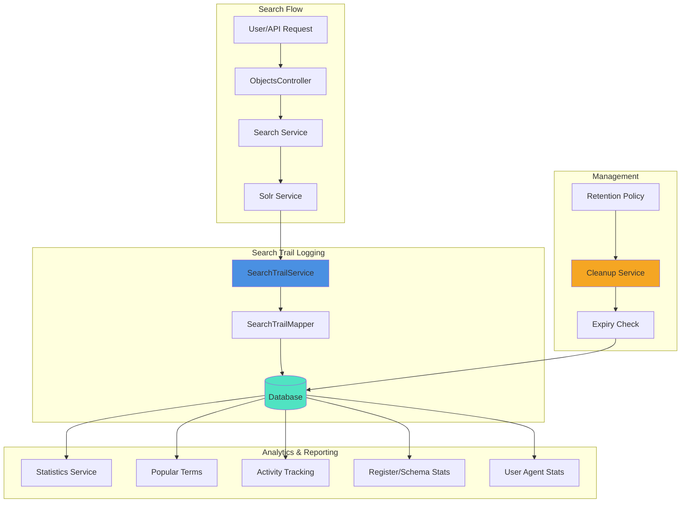
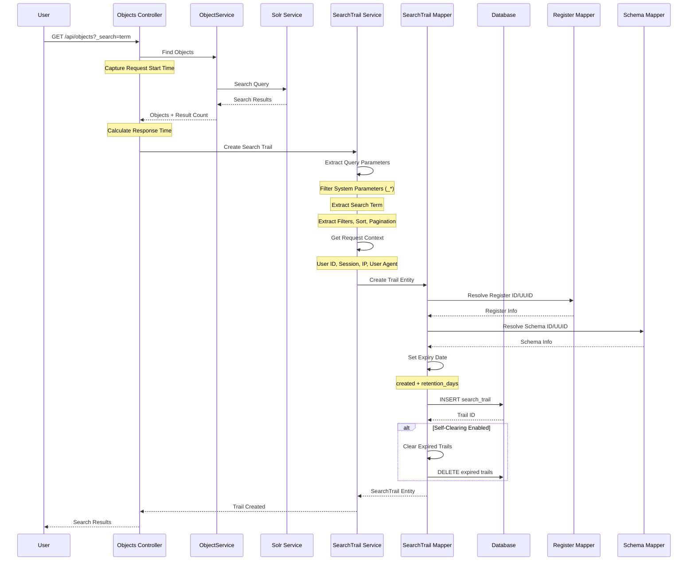
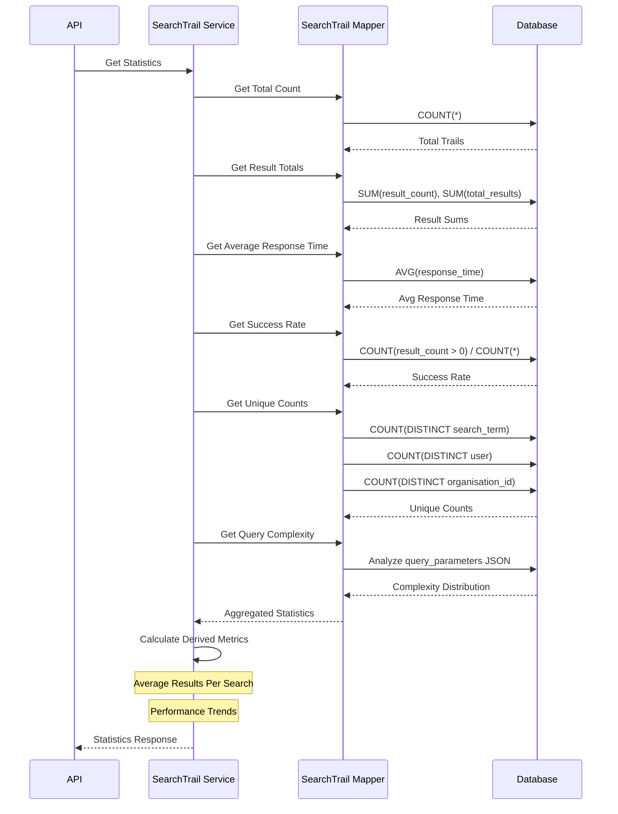

# Search Trails

Search trails provide comprehensive logging and analytics for search operations within the OpenRegister application. This feature allows administrators to track, analyze, and optimize search performance across all registers and schemas.

## Overview

Search trails automatically capture detailed information about every search operation performed in the system, including:

- Search terms and parameters
- Execution time and performance metrics
- Result counts and success rates
- User information and session details
- Register and schema context
- Request metadata and user agent information

## Features

### Automatic Search Logging

Every search operation is automatically logged with:

- **Search Context**: Register, schema, and search terms
- **Performance Metrics**: Execution time, result count, and success status
- **User Information**: User ID, session ID, and IP address
- **Request Details**: User agent, request method, and timestamp
- **Parameters**: Complete search parameters excluding sensitive information

### Analytics Dashboard

The search trails interface provides:

- **Comprehensive Statistics**: Total searches, results, success rates, and performance metrics
- **Popular Search Terms**: Most frequently used search terms with usage counts
- **Register/Schema Usage**: Search activity breakdown by register and schema
- **User Agent Statistics**: Browser and client distribution
- **Activity Patterns**: Search activity over time (hourly, daily, weekly, monthly)

### Advanced Filtering

Filter search trails by:

- **Time Range**: From and to dates for specific periods
- **Success Status**: Successful or failed searches
- **User**: Specific users or groups
- **Register/Schema**: Specific registers or schemas
- **Search Terms**: Specific search terms or patterns
- **Performance**: Execution time and result count ranges

### Query Complexity Analysis

Search trails categorize queries by complexity:

- **Simple**: Basic term searches with minimal parameters
- **Medium**: Multi-parameter searches with basic filters
- **Complex**: Advanced searches with multiple filters and facets

## API Endpoints

### GET /api/search-trails

Retrieve paginated search trail entries.

**Parameters:**
- `limit` (integer): Number of results per page (default: 50)
- `offset` (integer): Number of results to skip
- `page` (integer): Page number
- `search` (string): Search term filter
- `register` (string): Filter by register ID
- `schema` (string): Filter by schema ID
- `user` (string): Filter by user
- `success` (boolean): Filter by success status
- `dateFrom` (datetime): Start date filter
- `dateTo` (datetime): End date filter
- `searchTerm` (string): Filter by search term
- `executionTimeFrom` (integer): Minimum execution time (ms)
- `executionTimeTo` (integer): Maximum execution time (ms)
- `resultCountFrom` (integer): Minimum result count
- `resultCountTo` (integer): Maximum result count

**Example Request:**
```bash
GET /api/search-trails?limit=20&register=users&success=true
```

**Example Response:**
```json
{
  'results': [
    {
      'id': 1,
      'searchTerm': 'user search',
      'register': 'users',
      'schema': 'person',
      'parameters': {
        'limit': 20,
        'filters': {
          'status': 'active'
        }
      },
      'resultCount': 15,
      'executionTime': 150,
      'success': true,
      'user': 'admin',
      'userName': 'Administrator',
      'userAgent': 'Mozilla/5.0...',
      'ipAddress': '192.168.1.100',
      'sessionId': 'sess_abc123',
      'created': '2024-01-15T10:30:00Z'
    }
  ],
  'total': 1,
  'page': 1,
  'pages': 1,
  'limit': 20,
  'offset': 0
}
```

### GET /api/search-trails/statistics

Retrieve comprehensive search statistics.

**Example Response:**
```json
{
  'total': 1000,
  'totalResults': 15000,
  'averageResultsPerSearch': 15,
  'averageExecutionTime': 180,
  'successRate': 0.95,
  'uniqueSearchTerms': 250,
  'uniqueUsers': 50,
  'uniqueOrganizations': 10,
  'queryComplexity': {
    'simple': 600,
    'medium': 300,
    'complex': 100
  }
}
```

### GET /api/search-trails/popular-terms

Retrieve popular search terms.

**Parameters:**
- `limit` (integer): Number of terms to return (default: 10)

**Example Response:**
```json
[
  {
    'term': 'user',
    'count': 150,
    'percentage': 15.0
  },
  {
    'term': 'active',
    'count': 120,
    'percentage': 12.0
  }
]
```

### GET /api/search-trails/activity

Retrieve search activity data.

**Parameters:**
- `period` (string): Period type (hourly, daily, weekly, monthly)
- `limit` (integer): Number of periods to return

**Example Response:**
```json
[
  {
    'period': '2024-01-15',
    'searches': 50,
    'results': 750,
    'averageExecutionTime': 175,
    'successRate': 0.96
  }
]
```

### GET /api/search-trails/register-schema-stats

Retrieve register and schema usage statistics.

**Example Response:**
```json
[
  {
    'register': 'users',
    'registerName': 'User Registry',
    'schema': 'person',
    'schemaName': 'Person Schema',
    'searchCount': 200,
    'averageExecutionTime': 150,
    'successRate': 0.95
  }
]
```

### GET /api/search-trails/user-agent-stats

Retrieve user agent statistics.

**Example Response:**
```json
[
  {
    'userAgent': 'Mozilla/5.0...',
    'browser': 'Chrome',
    'version': '120.0',
    'platform': 'Windows',
    'count': 500,
    'percentage': 50.0
  }
]
```

### POST /api/search-trails/cleanup

Clean up old search trail entries.

**Request Body:**
```json
{
  'days': 30
}
```

**Example Response:**
```json
{
  'success': true,
  'message': 'Cleanup completed successfully',
  'deletedCount': 100
}
```

## Frontend Interface

### Search Trail Management

The search trails interface provides:

- **Table View**: Paginated list of search trail entries
- **Detailed Information**: Complete search context and parameters
- **Action Buttons**: View details, copy data, and delete entries
- **Bulk Operations**: Select multiple entries for bulk actions

### Advanced Filtering

Filter search trails using:

- **Register/Schema Selection**: Dropdown filters for specific registers and schemas
- **Success Status**: Filter by successful or failed searches
- **User Selection**: Multi-select user filter
- **Date Range**: From and to date pickers
- **Search Terms**: Text input for search term filtering
- **Performance Ranges**: Min/max inputs for execution time and result counts

### Analytics Dashboard

The analytics dashboard includes:

- **Key Metrics**: Total searches, results, success rates, and performance
- **Popular Terms**: Most frequently searched terms with usage counts
- **Activity Charts**: Search activity over time with selectable periods
- **Register/Schema Usage**: Usage statistics by register and schema
- **User Agent Distribution**: Browser and client statistics
- **Query Complexity**: Distribution of simple, medium, and complex queries

## Configuration

### Retention Policy

Configure search trail retention:

```php
// In app configuration
'search_trail_retention_days' => 90,
'search_trail_cleanup_enabled' => true,
'search_trail_cleanup_schedule' => 'daily',
```

### Privacy Settings

Control what information is logged:

```php
// Privacy configuration
'search_trail_log_ip_addresses' => true,
'search_trail_log_user_agents' => true,
'search_trail_log_session_ids' => true,
'search_trail_anonymize_users' => false,
```

### Performance Settings

Configure performance thresholds:

```php
// Performance monitoring
'search_trail_slow_query_threshold' => 1000, // milliseconds
'search_trail_complexity_thresholds' => [
    'simple' => 3,   // parameters
    'medium' => 10,  // parameters
    'complex' => 20, // parameters
],
```

## Best Practices

### Performance Optimization

1. **Regular Cleanup**: Implement automated cleanup of old search trails
2. **Index Management**: Ensure proper database indexes for search performance
3. **Batch Processing**: Use batch operations for large data sets
4. **Monitoring**: Monitor search trail table size and performance

### Privacy and Security

1. **Data Retention**: Implement appropriate retention policies
2. **Access Control**: Restrict access to search trail data
3. **Anonymization**: Consider anonymizing personal information
4. **Audit Logging**: Log access to search trail data

### Analytics and Reporting

1. **Regular Reviews**: Regularly review search patterns and performance
2. **Trend Analysis**: Identify trends in search behavior
3. **Performance Monitoring**: Monitor search performance over time
4. **User Behavior**: Analyze user search patterns for optimization

## Integration Examples

### Custom Analytics

```php
// Custom analytics query
$searchTrailService = new SearchTrailService();
$stats = $searchTrailService->getSearchStatistics([
    'register' => 'users',
    'dateFrom' => '2024-01-01',
    'dateTo' => '2024-01-31'
]);

// Process statistics
$popularTerms = $searchTrailService->getPopularSearchTerms(10);
$activityData = $searchTrailService->getSearchActivityByTime('daily');
```

### Custom Reporting

```php
// Generate custom report
$report = [
    'period' => '2024-01',
    'totalSearches' => $stats['total'],
    'successRate' => $stats['successRate'],
    'popularTerms' => $popularTerms,
    'activityData' => $activityData
];

// Export or process report
$this->exportReport($report);
```

### Performance Monitoring

```php
// Monitor slow queries
$slowQueries = $searchTrailService->getSlowQueries(1000); // > 1000ms

// Alert on performance issues
if (count($slowQueries) > 10) {
    $this->sendPerformanceAlert($slowQueries);
}
```

## Troubleshooting

### Common Issues

1. **High Storage Usage**: Implement regular cleanup and archiving
2. **Slow Queries**: Add database indexes and optimize queries
3. **Missing Data**: Check search trail logging configuration
4. **Performance Issues**: Monitor database performance and optimize

### Debug Mode

Enable debug mode for detailed logging:

```php
// Enable debug logging
'search_trail_debug' => true,
'search_trail_log_level' => 'debug',
```

### Error Handling

Search trail logging is designed to be non-intrusive:

- Failed logging does not affect search operations
- Errors are logged separately for monitoring
- Fallback mechanisms ensure data integrity

## Future Enhancements

### Planned Features

1. **Machine Learning**: Predictive search suggestions based on trails
2. **Advanced Visualization**: Interactive charts and dashboards
3. **Export Capabilities**: PDF and Excel export functionality
4. **API Rate Limiting**: Based on search trail analysis
5. **Personalization**: User-specific search optimization

### Integration Possibilities

1. **External Analytics**: Integration with Google Analytics or similar
2. **Business Intelligence**: Export to BI tools for advanced analysis
3. **Alerting Systems**: Integration with monitoring and alerting platforms
4. **Search Optimization**: Automatic index optimization based on patterns

## Summary

Search trails provide powerful insights into search behavior and performance within the OpenRegister application. The feature enables administrators to:

- Track and analyze all search operations
- Monitor performance and identify bottlenecks
- Understand user behavior and search patterns
- Optimize search functionality based on real usage data
- Maintain comprehensive audit trails for compliance

The combination of detailed logging, advanced analytics, and intuitive interfaces makes search trails an essential tool for managing and optimizing search operations in large-scale registry systems.

## Technical Implementation

### Architecture Overview



### Search Trail Creation Flow



### Search Trail Data Capture

```mermaid
graph TB
    subgraph "Request Data"
        REQ_URI[Request URI]
        REQ_METHOD[HTTP Method]
        REQ_PARAMS[Query Parameters]
        REQ_HEADERS[Headers]
    end
    
    subgraph "Search Context"
        SEARCH_TERM[Search Term]
        FILTERS[Filters]
        SORT[Sort Parameters]
        FACETS[Facet Requests]
    end
    
    subgraph "Pagination"
        PAGE[Page Number]
        LIMIT[Limit]
        OFFSET[Offset]
    end
    
    subgraph "User Context"
        USER_ID[User ID]
        USER_NAME[User Name]
        SESSION[Session ID]
        IP[IP Address]
        UAGENT[User Agent]
    end
    
    subgraph "Register/Schema Context"
        REG_ID[Register ID]
        REG_UUID[Register UUID]
        REG_NAME[Register Name]
        SCHEMA_ID[Schema ID]
        SCHEMA_UUID[Schema UUID]
        SCHEMA_NAME[Schema Name]
    end
    
    subgraph "Results Data"
        RESULT_COUNT[Result Count]
        TOTAL_RESULTS[Total Results]
        RESPONSE_TIME[Response Time]
        EXEC_TYPE[Execution Type]
    end
    
    subgraph "Metadata"
        CREATED[Created Timestamp]
        EXPIRES[Expiry Date]
        ORG_ID[Organisation ID]
        SIZE[Entry Size]
    end
    
    REQ_URI --> TRAIL[Search Trail Entity]
    REQ_METHOD --> TRAIL
    REQ_PARAMS --> TRAIL
    
    SEARCH_TERM --> TRAIL
    FILTERS --> TRAIL
    SORT --> TRAIL
    FACETS --> TRAIL
    
    PAGE --> TRAIL
    LIMIT --> TRAIL
    OFFSET --> TRAIL
    
    USER_ID --> TRAIL
    USER_NAME --> TRAIL
    SESSION --> TRAIL
    IP --> TRAIL
    UAGENT --> TRAIL
    
    REG_ID --> TRAIL
    REG_UUID --> TRAIL
    REG_NAME --> TRAIL
    SCHEMA_ID --> TRAIL
    SCHEMA_UUID --> TRAIL
    SCHEMA_NAME --> TRAIL
    
    RESULT_COUNT --> TRAIL
    TOTAL_RESULTS --> TRAIL
    RESPONSE_TIME --> TRAIL
    EXEC_TYPE --> TRAIL
    
    CREATED --> TRAIL
    EXPIRES --> TRAIL
    ORG_ID --> TRAIL
    SIZE --> TRAIL
    
    style TRAIL fill:#4A90E2
```



### Statistics Aggregation



### Cleanup Process

```mermaid
graph TB
    START[Cleanup Trigger]
    
    START --> CHECK{Self-Clearing Enabled?}
    CHECK -->|No| CRON[Cron Job Trigger]
    CHECK -->|Yes| AUTO[Auto-Cleanup on Create]
    
    CRON --> MANUAL[Manual Cleanup API]
    AUTO --> CLEANUP[Cleanup Process]
    MANUAL --> CLEANUP
    
    CLEANUP --> GET_DATE[Get Current Date]
    GET_DATE --> QUERY[Query Expired Trails]
    
    QUERY --> FILTER{Filter: expires < NOW()}
    FILTER --> DELETE[DELETE Expired Trails]
    
    DELETE --> COUNT[Count Deleted]
    COUNT --> LOG[Log Cleanup Results]
    LOG --> RETURN[Return Status]
    
    RETURN --> END[End]
    
    style AUTO fill:#50E3C2
    style MANUAL fill:#F5A623
    style DELETE fill:#E74C3C
```

### Database Schema

**Search Trail Table: `oc_openregister_search_trail`**

| Column | Type | Description |
|--------|------|-------------|
| `id` | INTEGER | Primary key |
| `uuid` | VARCHAR(36) | Unique identifier |
| `search_term` | TEXT | Search term from `_search` parameter |
| `query_parameters` | JSON | Full query parameters (excluding system params) |
| `result_count` | INTEGER | Number of results returned (current page) |
| `total_results` | INTEGER | Total matching results (before pagination) |
| `register` | INTEGER | Register ID (foreign key) |
| `schema` | INTEGER | Schema ID (foreign key) |
| `register_uuid` | VARCHAR(36) | Register UUID |
| `schema_uuid` | VARCHAR(36) | Schema UUID |
| `user` | VARCHAR(255) | User ID |
| `user_name` | VARCHAR(255) | User display name |
| `register_name` | VARCHAR(255) | Register name |
| `schema_name` | VARCHAR(255) | Schema name |
| `session` | VARCHAR(255) | Session ID |
| `ip_address` | VARCHAR(45) | IP address (IPv4/IPv6) |
| `user_agent` | TEXT | User agent string |
| `request_uri` | TEXT | Full request URI |
| `http_method` | VARCHAR(10) | HTTP method (GET, POST) |
| `response_time` | INTEGER | Response time in milliseconds |
| `page` | INTEGER | Page number |
| `limit` | INTEGER | Limit parameter |
| `offset` | INTEGER | Offset parameter |
| `facets_requested` | BOOLEAN | Whether facets were requested |
| `facetable_requested` | BOOLEAN | Whether facetable discovery was requested |
| `filters` | JSON | Applied filters |
| `sort_parameters` | JSON | Sort parameters |
| `published_only` | BOOLEAN | Whether only published objects were queried |
| `execution_type` | VARCHAR(20) | Execution type: `sync` or `async` |
| `created` | DATETIME | Creation timestamp |
| `organisation_id` | VARCHAR(255) | Organisation identifier |
| `organisation_id_type` | VARCHAR(50) | Type of organisation identifier |
| `expires` | DATETIME | Expiration date (created + retention_days) |
| `size` | INTEGER | Size of entry in bytes |

**Indexes:**
- PRIMARY KEY (`id`)
- INDEX (`uuid`)
- INDEX (`search_term`)
- INDEX (`register`, `schema`)
- INDEX (`user`)
- INDEX (`created`)
- INDEX (`expires`) -- For efficient cleanup
- INDEX (`organisation_id`)

### Code Examples

#### Creating a Search Trail

```php
use OCA\OpenRegister\Service\SearchTrailService;

// In ObjectsController after search execution
$responseTime = round((microtime(true) - $startTime) * 1000, 2); // ms

$trail = $this->searchTrailService->createSearchTrail(
    query: $query,
    resultCount: count($results),
    totalResults: $totalResults,
    responseTime: $responseTime,
    executionType: 'sync'
);
```

#### Retrieving Statistics

```php
// Get comprehensive statistics
$stats = $this->searchTrailService->getSearchStatistics([
    'register' => 5,
    'dateFrom' => '2024-01-01',
    'dateTo' => '2024-12-31'
]);

// Returns:
// [
//     'total' => 1000,
//     'totalResults' => 15000,
//     'averageResultsPerSearch' => 15.0,
//     'averageExecutionTime' => 180,
//     'successRate' => 0.95,
//     'uniqueSearchTerms' => 250,
//     'uniqueUsers' => 50,
//     'uniqueOrganizations' => 10,
//     'queryComplexity' => [
//         'simple' => 600,
//         'medium' => 300,
//         'complex' => 100
//     ]
// ]
```

#### Getting Popular Search Terms

```php
// Get top 10 popular search terms
$popularTerms = $this->searchTrailService->getPopularSearchTerms(10);

// Returns:
// [
//     ['term' => 'user', 'count' => 150, 'percentage' => 15.0],
//     ['term' => 'active', 'count' => 120, 'percentage' => 12.0],
//     ...
// ]
```

#### Activity Analysis

```php
// Get daily search activity for last 30 days
$activity = $this->searchTrailService->getSearchActivityByTime(
    period: 'daily',
    limit: 30
);

// Returns:
// [
//     [
//         'period' => '2024-01-15',
//         'searches' => 50,
//         'results' => 750,
//         'averageExecutionTime' => 175,
//         'successRate' => 0.96
//     ],
//     ...
// ]
```

#### Manual Cleanup

```php
// Clean up search trails older than 90 days
$result = $this->searchTrailService->clearExpiredSearchTrails();

// Returns:
// [
//     'success' => true,
//     'deleted' => 1,
//     'cleanup_date' => '2024-01-15 10:30:00',
//     'message' => 'Self-clearing: deleted expired search trail entries'
// ]
```

### Query Complexity Classification

Search trails automatically classify queries by complexity:

```php
private function calculateQueryComplexity(array $queryParameters): string
{
    $paramCount = count($queryParameters);
    
    if ($paramCount <= 3) {
        return 'simple';   // Basic search with minimal filters
    } elseif ($paramCount <= 10) {
        return 'medium';   // Multi-parameter search with filters
    } else {
        return 'complex';  // Advanced search with many filters/facets
    }
}
```

### System Parameter Filtering

System parameters (starting with `_`) are automatically excluded from tracking:

```php
private function filterSystemParameters(array $query): array
{
    return array_filter($query, function ($key) {
        // Exclude parameters starting with _
        return !str_starts_with($key, '_');
    }, ARRAY_FILTER_USE_KEY);
}
```

### Performance Optimizations

1. **Batch Inserts**
   - Search trails are inserted asynchronously to avoid blocking search responses
   - Non-critical operation - failures don't affect search results

2. **Indexed Queries**
   - Database indexes on common filter fields (`user`, `register`, `schema`, `created`)
   - Composite index on (`expires`) for efficient cleanup queries

3. **JSON Field Optimization**
   - `query_parameters`, `filters`, and `sort_parameters` stored as JSON
   - Allows flexible querying without schema changes

4. **Retention Policy**
   - Automatic expiry calculation: `expires = created + retention_days`
   - Background cleanup via cron jobs (default: disabled for self-clearing)

5. **Caching Statistics**
   - Frequently accessed statistics can be cached
   - Cache invalidation on new trail creation

### Integration Points

#### 1. ObjectsController
- Automatically creates search trail after every search operation
- Captures full request context and timing

#### 2. Cron Jobs
- Background job for periodic cleanup of expired trails
- Configurable retention period (default: 365 days)

#### 3. Analytics Dashboard
- Vue.js frontend for visualizing search trail data
- Real-time statistics and trend analysis

#### 4. Solr Integration
- Captures Solr-specific search parameters
- Tracks facet requests and complexity

### Best Practices

1. **Retention Policy**
   - Set retention period based on compliance requirements
   - Default: 365 days
   - Consider GDPR/privacy regulations

2. **Privacy Considerations**
   - IP addresses and user agents are logged by default
   - Consider anonymization for sensitive environments
   - Provide opt-out mechanisms if required

3. **Performance Monitoring**
   - Monitor search trail table size regularly
   - Set up alerts for slow queries (> 1000ms)
   - Archive old data instead of deleting if needed

4. **Self-Clearing Configuration**
   - Disabled by default (use cron jobs instead)
   - Enable only for low-traffic environments
   - Can cause performance impact on search operations

5. **Error Handling**
   - Search trail failures should not affect search operations
   - Log errors separately for monitoring
   - Implement fallback mechanisms

### Monitoring & Debugging

#### Enable Debug Logging

```php
// In SearchTrailService
$this->logger->debug('Creating search trail', [
    'search_term' => $searchTerm,
    'result_count' => $resultCount,
    'response_time' => $responseTime
]);
```

#### Query Search Trails

```bash
# Get recent search trails
docker exec -it master-database-mysql-1 mysql -u nextcloud -pnextcloud nextcloud -e "
SELECT search_term, result_count, response_time, created 
FROM oc_openregister_search_trail 
ORDER BY created DESC 
LIMIT 10;
"

# Get slow queries
docker exec -it master-database-mysql-1 mysql -u nextcloud -pnextcloud nextcloud -e "
SELECT search_term, response_time, created 
FROM oc_openregister_search_trail 
WHERE response_time > 1000 
ORDER BY response_time DESC 
LIMIT 20;
"

# Get popular search terms
docker exec -it master-database-mysql-1 mysql -u nextcloud -pnextcloud nextcloud -e "
SELECT search_term, COUNT(*) as count 
FROM oc_openregister_search_trail 
WHERE search_term IS NOT NULL 
GROUP BY search_term 
ORDER BY count DESC 
LIMIT 10;
"
```

#### Check Table Size

```bash
docker exec -it master-database-mysql-1 mysql -u nextcloud -pnextcloud nextcloud -e "
SELECT 
    COUNT(*) as total_trails,
    MIN(created) as oldest_trail,
    MAX(created) as newest_trail,
    AVG(response_time) as avg_response_time,
    MAX(response_time) as max_response_time
FROM oc_openregister_search_trail;
"
```

### Security Considerations

1. **Access Control**
   - Search trail data should be restricted to administrators
   - Use RBAC to control access to analytics endpoints

2. **Data Privacy**
   - IP addresses and session IDs are personal data
   - Implement retention policies compliant with GDPR/privacy laws
   - Provide data export and deletion capabilities for users

3. **SQL Injection**
   - All queries use parameterized statements
   - User input is never directly concatenated into queries

4. **XSS Prevention**
   - User agent and search terms are escaped in frontend display
   - JSON fields are properly validated before storage

### Future Enhancements

1. **Machine Learning Integration**
   - Predict search intent based on historical patterns
   - Suggest related searches
   - Optimize ranking based on click-through rates

2. **Real-Time Analytics**
   - WebSocket integration for live search metrics
   - Real-time dashboard updates
   - Instant performance alerts

3. **Advanced Visualization**
   - Heat maps for search activity
   - Geographic distribution of searches (based on IP)
   - User journey visualization

4. **A/B Testing Support**
   - Compare search algorithms
   - Track conversion rates
   - Optimize search relevance

5. **Export Capabilities**
   - CSV/Excel export for offline analysis
   - Integration with BI tools (Tableau, Power BI)
   - Custom report generation 