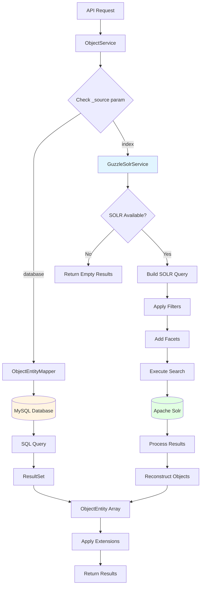
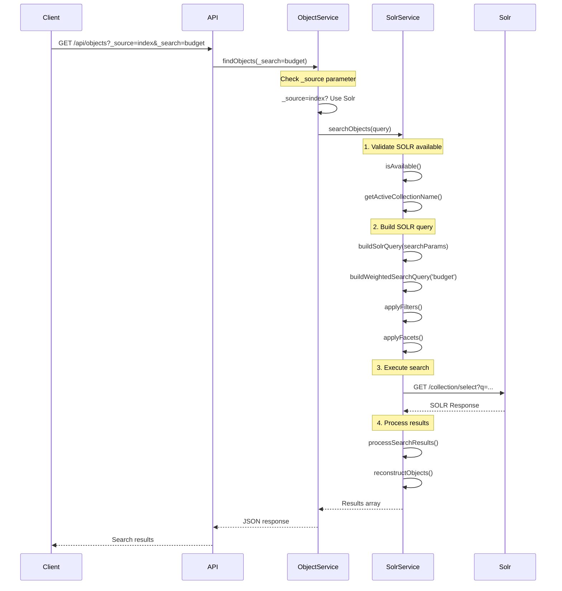
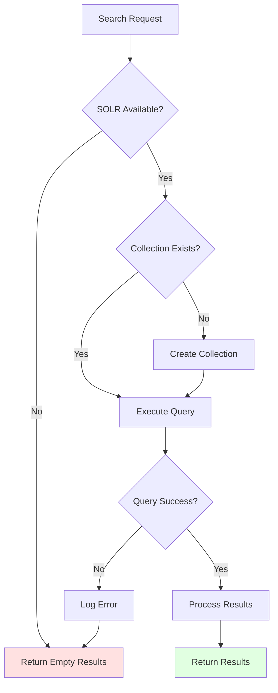

# Advanced Search

Open Register provides powerful search capabilities that allow filtering objects based on their properties using a flexible query syntax.

## Automatic Facets
Automatic Facets provide dynamic filtering options based on object properties and metadata.

## Content Search

Content Search provides powerful search capabilities across objects and their associated files.

## Elasticsearch Integration

Elasticsearch Integration provides advanced search and analytics capabilities for objects and their content.

## Overview

The search system enables:
- Full-text search
- Metadata search
- File content search
- Advanced query options
- **[Saved Views](./views.md)** - Save and reuse complex search configurations

## Key Benefits

1. **Discovery**
   - Find relevant content
   - Explore relationships
   - Discover patterns

2. **Integration**
   - Combined search results
   - Unified interface
   - Rich filtering

3. **Performance**
   - Optimized indexing
   - Fast results
   - Scalable search

## Overview

The faceting system:
- Generates filters automatically
- Updates in real-time
- Supports multiple filter types
- Provides count information

## Key Benefits

1. **User Experience**
   - Intuitive filtering
   - Dynamic updates
   - Clear navigation

2. **Data Discovery**
   - Quick filtering
   - Pattern recognition
   - Data exploration

3. **Integration**
   - Automatic generation
   - Custom configuration
   - Search integration

## Overview

The search system enables you to filter objects using query parameters. However, it's important to note that this approach is limited by the maximum URL length supported by browsers and servers (typically 2,048 characters for most browsers).

For more complex queries that exceed URL length limitations, we are planning to implement GraphQL support in the future. This would enable:

- Deeply nested queries
- Complex filtering logic
- Precise field selection
- Batch operations
- Real-time subscriptions

> Note: GraphQL implementation is currently pending funding. If you're interested in supporting this feature, please contact us.

In the meantime, here are the available search capabilities using URL parameters:

## Open Catalogi Integration

If you have **Open Catalogi** installed alongside OpenRegister, you gain access to the more flexible `/api/publications` endpoint. This endpoint provides enhanced filtering capabilities that allow you to search across multiple registers and schemas without being constrained by URL path parameters.

### Publications Endpoint Advantages

The publications endpoint (`/api/publications`) offers several advantages over register/schema-specific endpoints:

- **Cross-register searching**: Filter objects from multiple registers simultaneously
- **Dynamic schema filtering**: Switch between schemas without changing the endpoint
- **Cleaner URLs**: No need to include register/schema in the URL path
- **More flexible queries**: Better support for complex filter combinations

### Register and Schema Filtering in Publications

When using the publications endpoint, register and schema become regular query parameters instead of URL path components:

#### Basic Publications Filtering
```bash
# Search across all registers and schemas
GET /api/publications

# Filter by specific register
GET /api/publications?register=5

# Filter by specific schema  
GET /api/publications?schema=24

# Filter by both register and schema
GET /api/publications?register=5&schema=24
```

#### Multiple Register/Schema Filtering
```bash
# Objects from multiple registers
GET /api/publications?register[]=5&register[]=6&register[]=7

# Objects from multiple schemas
GET /api/publications?schema[]=24&schema[]=25

# Complex combinations
GET /api/publications?register[]=5&register[]=6&schema[]=24&schema[]=25
```

#### Combined with Metadata Filters
```bash
# Date filtering across multiple registers
GET /api/publications?register[]=5&register[]=6&@self[created][gte]=2025-06-25T00:00:00

# Schema filtering with content search
GET /api/publications?schema=24&@self[title][~]=budget&_search=annual

# Complex multi-criteria search
GET /api/publications?register=5&schema[]=24&schema[]=25&@self[published][exists]=true&@self[created][gte]=2025-01-01T00:00:00
```

### Comparison: OpenRegister vs Publications Endpoints

| Feature | OpenRegister Endpoint | Publications Endpoint |
|---------|----------------------|----------------------|
| URL Format | `/api/objects/5/24?filters` | `/api/publications?register=5&schema=24&filters` |
| Cross-register | ❌ Not supported | ✅ Supported |
| Multiple schemas | ❌ Single schema only | ✅ Multiple schemas |
| URL complexity | Higher (path parameters) | Lower (query parameters) |
| Filter flexibility | Limited by path structure | Full query parameter flexibility |

### Migration Example

Convert existing OpenRegister queries to use the publications endpoint:

```bash
# OpenRegister format
GET /api/objects/5/24?@self[created][gte]=2025-06-25T00:00:00&@self[title][~]=budget

# Equivalent Publications format  
GET /api/publications?register=5&schema=24&@self[created][gte]=2025-06-25T00:00:00&@self[title][~]=budget

# Enhanced Publications format (multiple schemas)
GET /api/publications?register=5&schema[]=24&schema[]=25&@self[created][gte]=2025-06-25T00:00:00&@self[title][~]=budget
```

### When to Use Each Endpoint

**Use OpenRegister endpoints (`/api/objects/{register}/{schema}`) when:**
- Working with a single, specific register and schema
- Building register-specific applications
- Need guaranteed register/schema validation in URL routing

**Use Publications endpoint (`/api/publications`) when:**
- Searching across multiple registers or schemas
- Building general-purpose search interfaces
- Need maximum query flexibility
- Want cleaner, more maintainable URLs

:::tip Open Catalogi Installation

The publications endpoint requires Open Catalogi to be installed and configured alongside OpenRegister. If you don't see the `/api/publications` endpoint, check your Open Catalogi installation.

:::

## Metadata Filtering

OpenRegister supports comprehensive filtering on object metadata using query parameters. All metadata fields can be filtered using the '@self' prefix followed by the field name and optional operator.

### Core Metadata Fields

The following metadata fields are available for filtering on all objects:

#### System Fields
| Field | Description | Type | Example |
|-------|-------------|------|---------|
| `id` | Object unique identifier | UUID | `@self[id]=550e8400-e29b-41d4-a716-446655440000` |
| `uuid` | Object universal unique ID | UUID | `@self[uuid]=550e8400-e29b-41d4-a716-446655440000` |
| `register` | Register ID or slug | Integer/String | `@self[register]=5` or `@self[register]=pets` |
| `schema` | Schema ID or slug | Integer/String | `@self[schema]=24` or `@self[schema]=animal` |
| `version` | Object version number | String | `@self[version]=1.0.0` |
| `size` | Object size in bytes | String | `@self[size][gte]=1024` |
| `schemaVersion` | Schema version used | String | `@self[schemaVersion]=2.1.0` |

#### Timestamps
| Field | Description | Type | Example |
|-------|-------------|------|---------|
| `created` | Creation timestamp | DateTime | `@self[created][gte]=2025-06-25T00:00:00` |
| `updated` | Last update timestamp | DateTime | `@self[updated][lt]=2025-06-30T23:59:59` |
| `published` | Publication timestamp | DateTime | `@self[published][gte]=2025-01-01T00:00:00` |
| `depublished` | Depublication timestamp | DateTime | `@self[depublished][lte]=2025-12-31T23:59:59` |

#### Content Fields
| Field | Description | Type | Example |
|-------|-------------|------|---------|
| `name` | Object name | String | `@self[name][~]=Annual Report` |
| `description` | Object description | String | `@self[description][$]=implementation` |
| `uri` | Object URI | String | `@self[uri][^]=https://api.example.com` |
| `folder` | Object folder path | String | `@self[folder][~]=documents` |

#### Ownership & Access
| Field | Description | Type | Example |
|-------|-------------|------|---------|
| `organization` | Owning organization ID | UUID | `@self[organization]=550e8400-e29b-41d4-a716-446655440000` |
| `application` | Source application ID | UUID | `@self[application]=550e8400-e29b-41d4-a716-446655440000` |
| `owner` | Object owner | String | `@self[owner]=john.doe` |
| `license` | Object license | String | `@self[license]=CC-BY-4.0` |
| `source` | Data source identifier | String | `@self[source]=external-api` |

#### Status & State
| Field | Description | Type | Example |
|-------|-------------|------|---------|
| `hash` | Object content hash | String | `@self[hash]=a1b2c3d4e5f6` |
| `uri` | Object URI | String | `@self[uri][~]=api.example.com` |

### Filtering Operators

All metadata fields support the following operators for precise filtering:

| Operator | Description | Example |
|----------|-------------|---------|
| `=` | Equals (case insensitive) | `@self[name]=annual report` |
| `ne` | Not equals (case insensitive) | `@self[status][ne]=draft` |
| `gt` | Greater than | `@self[version][gt]=1` |
| `lt` | Less than | `@self[version][lt]=5` |
| `gte` | Greater than or equal | `@self[created][gte]=2025-01-01T00:00:00` |
| `lte` | Less than or equal | `@self[updated][lte]=2025-12-31T23:59:59` |
| `~` | Contains (case insensitive) | `@self[description][~]=budget` |
| `^` | Starts with (case insensitive) | `@self[name][^]=annual` |
| `$` | Ends with (case insensitive) | `@self[name][$]=2025` |
| `===` | Equals (case sensitive) | `@self[name][===]=Annual Report` |
| `exists` | Property exists check | `@self[published][exists]=true` |
| `empty` | Empty value check | `@self[summary][empty]=true` |
| `null` | Null value check | `@self[depublished][null]=true` |

:::info Why Operator Names Instead of Mathematical Symbols?

We use operator names like `gte`, `lte`, `gt`, `lt`, and `ne` instead of mathematical symbols like `>=`, `<=`, `>`, `<`, and `!=` to avoid URL encoding problems.

**The Problem:**
When using mathematical symbols in URL parameters, they get URL encoded:
- `age[>=]=5` becomes `age[%3E=]=5` 
- `weight[<=]=10` becomes `weight[%3C=]=10`

This URL encoding can cause parsing issues with PHP's `$_GET` parameter processing, especially when operators are used within array key brackets.

**The Solution:**
Using descriptive operator names ensures clean, readable URLs:
- `age[gte]=5` (greater than or equal)
- `weight[lte]=10` (less than or equal)
- `name[ne]=test` (not equal)

This approach maintains compatibility across different web servers and ensures reliable parameter parsing.

:::

### Metadata Filtering Examples

#### Basic Metadata Filtering
```
# Filter by register
GET /api/objects/5/24?@self[register]=5

# Filter by creation date
GET /api/objects/5/24?@self[created][gte]=2025-06-01T00:00:00

# Filter by name containing specific text
GET /api/objects/5/24?@self[name][~]=budget

# Filter by published objects
GET /api/objects/5/24?@self[published][exists]=true
```

#### Advanced Metadata Combinations
```
# Objects created after date AND belonging to specific organization
GET /api/objects/5/24?@self[created][gte]=2025-01-01T00:00:00&@self[organization]=550e8400-e29b-41d4-a716-446655440000

# Published objects with specific name pattern
GET /api/objects/5/24?@self[published][exists]=true&@self[name][^]=Annual

# Objects updated within date range
GET /api/objects/5/24?@self[updated][gte]=2025-06-01T00:00:00&@self[updated][lte]=2025-06-30T23:59:59

# Exclude draft objects
GET /api/objects/5/24?@self[status][ne]=draft
```

#### Register and Schema Filtering
```
# Objects from multiple registers (when using general search endpoints)
GET /api/search?@self[register][]=5&@self[register][]=6

# Objects with specific schema
GET /api/search?@self[schema]=24

# Combined register, schema, and date filter
GET /api/search?@self[register]=5&@self[schema]=24&@self[created][gte]=2025-06-25T00:00:00
```

## Date Format Handling

When working with date fields like `created`, `updated`, `published`, and `depublished`, it's important to understand the date format requirements.

### Standard Date Format

Open Register uses ISO 8601 date format **without timezone suffixes** for optimal database compatibility:

**Correct Format:** `2025-06-23T14:30:00`  
**Avoid:** `2025-06-23T14:30:00.000Z` or `2025-06-23T14:30:00+00:00`

### Date Range Examples

```
# Objects created after June 21, 2025 at 22:00
GET /api/objects?@self[created][gte]=2025-06-21T22:00:00

# Objects updated before June 25, 2025 
GET /api/objects?@self[updated][lt]=2025-06-25T00:00:00

# Objects published within a specific date range
GET /api/objects?@self[published][gte]=2025-06-01T00:00:00&@self[published][lte]=2025-06-30T23:59:59
```

### Frontend Implementation

When implementing date filters in JavaScript/frontend code, ensure you convert dates to the correct format:

```javascript
// Convert Date object to OpenRegister format
const formatDateForOpenRegister = (date) => {
    if (!date) return null
    // Remove timezone info to match database format
    return new Date(date).toISOString().replace(/\.000Z$/, '')
}

// Example usage
const fromDate = formatDateForOpenRegister(new Date('2025-06-21'))
// Result: '2025-06-21T00:00:00'
```

:::tip
This standardized format ensures consistent date comparisons across different timezones and database configurations.

:::

## Full Text Search

The '_search' parameter allows searching across all text properties of objects in a case-insensitive way:

```
GET /api/pets?_search=nemo
```

This searches for "nemo" in all text fields like name, description, notes etc.

### Wildcard Search
You can use wildcards in the search term:

- `*` matches zero or more characters
```
GET /api/pets?_search=ne*o
``` 
Matches "nemo", "negro", "neuro" etc.

- `?` matches exactly one character
```
GET /api/pets?_search=ne?o
```
Matches "nemo", "nero" but not "neuro"

### Pattern Matching
- `^` matches start of text
```
GET /api/pets?_search=^ne
```
Matches text starting with "ne"

- `$` matches end of text
```
GET /api/pets?_search=mo$
```
Matches text ending with "mo"

### Phrase Search
Use quotes for exact phrase matching:
```
GET /api/pets?_search="orange fish"
```
Matches the exact phrase "orange fish"

## Basic Search

Simple equals search (case insensitive):
```
GET /api/pets?name=nemo
```

This returns all pets named "nemo", "Nemo", "NEMO", etc.

Case sensitive search:
```
GET /api/pets?name[===]=Nemo
```

This returns only pets named exactly "Nemo".

## Comparison Operators

### Not Equals `ne`
```
GET /api/pets?name[ne]=nemo
```
Returns all pets NOT named "nemo" (case insensitive)

### Greater Than `gt`
```
GET /api/pets?age[gt]=5
```
Returns pets older than 5 years

### Less Than `lt`
```
GET /api/pets?weight[lt]=10
```
Returns pets weighing less than 10kg

### Greater Than or Equal `gte`
```
GET /api/pets?age[gte]=2
```
Returns pets 2 years or older

### Less Than or Equal `lte`
```
GET /api/pets?age[lte]=10
```
Returns pets 10 years or younger

### Contains `~`
```
GET /api/pets?name[~]=ne
```
Returns pets with "ne" in their name (like "nemo", "nero", "Nemo", etc) - case insensitive

### Starts With `^`
```
GET /api/pets?name[^]=ne
```
Returns pets whose names start with "ne" (case insensitive)

### Ends With `$`
```
GET /api/pets?name[$]=mo
```
Returns pets whose names end with "mo" (case insensitive)

## Combining Multiple Conditions

### AND Operations
```
GET /api/pets?name=nemo&type=fish
```
Returns pets named "nemo" (case insensitive) AND of type "fish"

### OR Operations
```
GET /api/pets?name[]=nemo&name[]=dory
```
Returns pets named either "nemo" OR "dory" (case insensitive)

## Special Filters

### Exists Check
```
GET /api/pets?microchip[exists]=true
```
Returns pets that have a microchip property

### Empty Check
```
GET /api/pets?notes[empty]=true
```
Returns pets with empty notes

### Null Check
```
GET /api/pets?owner[null]=true
```
Returns pets with no owner

### Between Range
```
GET /api/pets?age[gte]=2&age[lte]=5
```
Returns pets between 2 and 5 years old (inclusive)

```
GET /api/pets?age[gt]=2&age[lt]=5
``` 
Returns pets between 2 and 5 years old (exclusive)

## Searching Nested Properties

```
GET /api/pets?owner.city=Amsterdam
```
Returns pets whose owners live in Amsterdam (case insensitive)

```
GET /api/pets?vaccinations.date[gt]=2023-01-01
```
Returns pets with vaccinations after January 1st, 2023

## Best Practices

1. Use URL encoding for special characters
2. Keep queries focused and specific
3. Use pagination for large result sets
4. Consider URL length limitations
5. Break complex queries into multiple requests if needed

## Performance Considerations

### Indexing
- Core metadata fields (`id`, `uuid`, `created`, `updated`, `register`, `schema`) are automatically indexed
- Date fields support efficient range queries
- String fields with operators like `~`, `^`, `$` may be slower on large datasets

### Query Optimization
```
# Efficient: Use indexed fields first
GET /api/objects/5/24?@self[created][gte]=2025-01-01&@self[title][~]=budget

# Less efficient: Complex string operations on large datasets
GET /api/objects/5/24?@self[description][~]=very_specific_text
```

### Pagination with Metadata Filters
```
# Always use pagination with filters
GET /api/objects/5/24?@self[created][gte]=2025-01-01&_limit=50&_offset=0
```

## Search Engine Implementation

### Solr Integration

OpenRegister uses Apache Solr as its search engine, providing powerful full-text search and faceting capabilities.

#### Case-Insensitive Search

All text searches are case-insensitive by default. The search implementation uses 'mb_strtolower()' to normalize search terms before querying Solr:

```php
// Search terms are normalized to lowercase
$cleanTerm = mb_strtolower($cleanTerm);
```

This ensures that searches work consistently regardless of input case:
- 'software' = 'SOFTWARE' = 'SoFtWaRe' (all return the same results)
- Handles international characters correctly (é, ñ, ü, etc.)
- Works with UTF-8 encoded strings

The normalization happens before the query is sent to Solr, ensuring reliable search behavior across different Solr configurations.

#### Ordering and Sorting

Objects can be ordered by metadata fields using the '_order' parameter:

**Sortable Fields:**
- '@self.name' - Alphabetical by object name (uses 'self_name_s' Solr field)
- '@self.published' - Chronological by published date
- '@self.created' - Chronological by creation date
- '@self.updated' - Chronological by update date

**Sorting Directions:**
- 'asc' - Ascending order (A→Z, oldest→newest)
- 'desc' - Descending order (Z→A, newest→oldest)

**Examples:**
```
# Alphabetical order (A→Z)
GET /api/objects?_source=index&_order[@self.name]=asc

# Reverse alphabetical (Z→A)
GET /api/objects?_source=index&_order[@self.name]=desc

# Newest first
GET /api/objects?_source=index&_order[@self.published]=desc

# Oldest first
GET /api/objects?_source=index&_order[@self.created]=asc
```

**Technical Implementation:**
- Text fields use sortable string variants (with '_s' suffix)
- Solr schema includes sortable copies of searchable fields
- Date fields use native Solr date sorting
- Field mapping handled by 'translateSortableField()' method

#### Search Performance

**Weighted Field Search:**
The search engine uses weighted field boosting to prioritize matches in certain fields:

```php
// Example weights
'self_name^10'        // Name field has highest priority
'self_title^8'        // Title field is second priority
'self_description^5'  // Description has medium priority
'self_summary^3'      // Summary has lower priority
```

This ensures that matches in object names are ranked higher than matches in descriptions.

**Field Types in Solr:**
- 'text_general' - Analyzed text fields (tokenized, lowercased, stemmed)
- 'string' - Exact value fields (not tokenized, for sorting/faceting)
- 'date' - ISO 8601 date fields (for range queries and sorting)
- UUID fields - String fields for identifiers

#### Testing Search

The search implementation includes comprehensive integration tests:

**Test Coverage:**
- Case-insensitive search (lowercase, uppercase, mixed case)
- Ordering by name (ascending, descending)
- Ordering by dates (chronological, reverse chronological)
- Combined filters with search
- Pagination with ordering

**Running Tests:**
```bash
# Run all search tests
vendor/bin/phpunit tests/Integration/CoreIntegrationTest.php --filter "testCaseInsensitive|testOrdering"

# Run specific test
vendor/bin/phpunit tests/Integration/CoreIntegrationTest.php --filter testCaseInsensitiveSearchLowercase
```

See 'SOLR_TESTING_GUIDE.md' in the repository for detailed testing procedures.

## Error Handling

### Invalid Field Names
```json
{
  "error": "Invalid field name: @self[invalid_field]",
  "code": 400
}
```

### Invalid Operators
```json
{
  "error": "Invalid operator: @self[created][invalid_op]",
  "code": 400
}
```

### Invalid Date Formats
```json
{
  "error": "Invalid date format. Expected: YYYY-MM-DDTHH:MM:SS",
  "code": 400
}
```

---

## Technical Implementation

This section provides detailed technical information about how search is implemented in OpenRegister.

### Architecture Overview

OpenRegister uses Apache Solr as its search engine, providing powerful full-text search, faceting, and filtering capabilities:



**Key Components:**
- **ObjectService**: High-level orchestration, determines search mode
- **GuzzleSolrService**: Main service for Solr integration
- **ObjectEntityMapper**: Database access for non-Solr searches
- **Query Builder**: Translates OpenRegister queries to Solr queries
- **Filter Processor**: Handles metadata and property filters
- **Facet Engine**: Generates facet aggregations

### Search Request Flow



**Search Flow Steps:**

1. **Request Validation**: Check for '_source=index' parameter to enable Solr search
2. **SOLR Availability**: Verify Solr service is available and collection exists
3. **Query Building**: Convert OpenRegister query to Solr query syntax
4. **Filter Application**: Apply metadata filters, RBAC, multi-tenancy
5. **Facet Generation**: Add facet aggregations if requested
6. **Search Execution**: Send query to Solr and retrieve results
7. **Result Processing**: Convert Solr documents to OpenRegister format
8. **Object Reconstruction**: Hydrate full object data from 'self_object' field

### Query Building Process

```mermaid
graph TD
    A[OpenRegister Query] --> B[buildSolrQuery]
    B --> C[Parse _search parameter]
    C --> D[buildWeightedSearchQuery]
    D --> E[Add field boosting]
    
    B --> F[Parse filters]
    F --> G[@self metadata filters]
    F --> H[Property filters]
    G --> I[buildFilterQuery]
    H --> I
    I --> J[Apply operators]
    
    B --> K[Parse sorting]
    K --> L[translateSortField]
    L --> M[Map to Solr fields]
    
    B --> N[Parse pagination]
    N --> O[Calculate start/rows]
    
    B --> P[Parse facets]
    P --> Q[Get facetable fields]
    Q --> R[Add facet.field params]
    
    E --> S[Complete SOLR Query]
    J --> S
    M --> S
    O --> S
    R --> S
    
    style B fill:#e1f5ff
    style S fill:#e1ffe1
```

**Query Translation Example:**

```php
// OpenRegister Query
{
  "_search": "annual report",
  "_limit": 20,
  "_page": 1,
  "_order": {"@self.created": "desc"},
  "@self": {
    "register": "5",
    "created": {"gte": "2025-01-01T00:00:00"}
  },
  "status": "published",
  "_facetable": true
}

// Translated SOLR Query
{
  "q": "(self_name:(annual report)^10 OR self_summary:(annual report)^5 OR self_description:(annual report)^2)",
  "fq": [
    "self_register:5",
    "self_created:[2025-01-01T00:00:00Z TO *]",
    "status_s:published"
  ],
  "start": 0,
  "rows": 20,
  "sort": "self_created desc",
  "facet": "true",
  "facet.field": ["status_s", "self_register_i", "category_s"]
}
```

### Weighted Search Implementation

OpenRegister implements intelligent field weighting to improve search relevance:

```php
private function buildWeightedSearchQuery(string $searchTerm): string
{
    $cleanTerm = $this->escapeSolrValue($searchTerm);
    
    // Wildcard support for partial matching
    $wildcardTerm = '*' . $cleanTerm . '*';
    
    // Build query with field-specific boosting
    $queryParts = [
        "self_name:($wildcardTerm)^10",      // Highest priority
        "self_summary:($wildcardTerm)^5",    // Medium-high priority
        "self_description:($wildcardTerm)^2" // Medium priority
    ];
    
    return '(' . implode(' OR ', $queryParts) . ')';
}
```

**Field Weight Rationale:**
- **Name (10x)**: Most important identifier, should rank highest
- **Summary (5x)**: Key information, deserves strong ranking
- **Description (2x)**: Detailed content, moderate ranking boost
- **Other fields (1x)**: Standard relevance scoring

### Filter Operators

OpenRegister supports comprehensive filter operators that are translated to Solr query syntax:

| OpenRegister | Solr Syntax | Example |
|--------------|-------------|---------|
| '=' (equals) | ':value' | 'status_s:active' |
| 'ne' (not equals) | '-field:value' | '-status_s:inactive' |
| 'gt' (greater than) | ':\{value TO \*\}' | 'age_i:\{30 TO \*\}' |
| 'gte' (greater or equal) | ':[value TO \*]' | 'age_i:[30 TO \*]' |
| 'lt' (less than) | ':\{\* TO value\}' | 'age_i:\{\* TO 30\}' |
| 'lte' (less or equal) | ':[\* TO value]' | 'age_i:[\* TO 30]' |
| '~' (contains) | ':\*value\*' | 'name_s:\*john\*' |
| '^' (starts with) | ':value*' | 'name_s:annual*' |
| '$' (ends with) | ':*value' | 'name_s:*2025' |
| 'exists' | 'field:[* TO *]' | 'published:[* TO *]' |
| 'null' | '-field:[* TO *]' | '-published:[* TO *]' |

### Performance Optimizations

#### 1. Schema Analysis Caching

```php
// Pre-compute facet configuration when schema is saved
$schema->setFacets($this->analyzeFacetableFields($schema));
```

**Benefits:**
- Eliminates runtime schema analysis
- Reduces search request latency
- Improves scalability

#### 2. Query Result Caching

Search results are cached to improve performance for repeated queries:

**Configuration:**
- TTL: 300 seconds (5 minutes)
- Storage: PSR-6 compliant cache
- Invalidation: On object updates

#### 3. Bulk Indexing

```php
// Index multiple objects in single request
$this->bulkIndex($documents, $commit = false);
```

**Optimization:**
- Batch size: 1000 documents
- Deferred commits
- Optimized for bulk imports

#### 4. Selective Field Loading

```php
// Load only required fields from SOLR
$solrQuery['fl'] = 'id,self_uuid,self_name,self_created';
```

**Benefits:**
- Reduced network transfer
- Faster deserialization
- Lower memory usage

### Monitoring and Debugging

#### Query Logging

```php
$this->logger->debug('Executing SOLR search', [
    'original_query' => $query,
    'solr_query' => $solrQuery,
    'collection' => $collectionName,
    'execution_time_ms' => $executionTime
]);
```

#### Performance Metrics

```php
$metrics = [
    'searches' => $this->stats['searches'],
    'indexes' => $this->stats['indexes'],
    'search_time' => $this->stats['search_time'],
    'index_time' => $this->stats['index_time'],
    'errors' => $this->stats['errors']
];
```

#### Health Checks

```bash
# Check SOLR availability
GET /api/solr/health

# Response
{
  "available": true,
  "collection": "openregister_nextcloud_core",
  "document_count": 1234,
  "index_size_mb": 45.6
}
```

### Error Handling Flow



**Error Scenarios:**

1. **SOLR Unavailable**: Return empty results with warning
2. **Collection Missing**: Auto-create collection, retry query
3. **Query Syntax Error**: Log error, return validation message
4. **Timeout**: Reduce query complexity, retry with simplified query
5. **Result Too Large**: Apply pagination, warn about result size

### Code Examples

#### Building a Search Query

```php
use OCA\OpenRegister\Service\GuzzleSolrService;

// Execute search with filters
$results = $solrService->searchObjects([
    '_search' => 'annual report',
    '_limit' => 20,
    '_page' => 1,
    '_order' => ['@self.created' => 'desc'],
    '@self' => [
        'register' => '5',
        'created' => ['gte' => '2025-01-01T00:00:00']
    ],
    'status' => 'published',
    '_facetable' => true
]);

// Access results
$objects = $results['data'];
$total = $results['total'];
$facets = $results['facets'];
```

#### Custom Filter Processing

```php
// Build custom filter query
$filters = [];

// Add metadata filters
if (isset($query['@self'])) {
    foreach ($query['@self'] as $field => $value) {
        $filters[] = $this->buildMetadataFilter($field, $value);
    }
}

// Add property filters
foreach ($query as $key => $value) {
    if ($key[0] !== '_' && $key !== '@self') {
        $filters[] = $this->buildPropertyFilter($key, $value);
    }
}

$solrQuery['fq'] = $filters;
```

### Testing

```bash
# Run all search tests
vendor/bin/phpunit tests/Service/GuzzleSolrServiceTest.php

# Test specific scenarios
vendor/bin/phpunit --filter testWeightedSearch
vendor/bin/phpunit --filter testFacetedSearch
vendor/bin/phpunit --filter testFilterOperators

# Integration tests
vendor/bin/phpunit tests/Integration/SearchIntegrationTest.php
```

**Test Coverage:**
- Query building and translation
- Filter operator processing
- Facet generation
- Result processing
- Error handling
- Performance benchmarks
- Case-insensitive search
- Ordering and sorting
