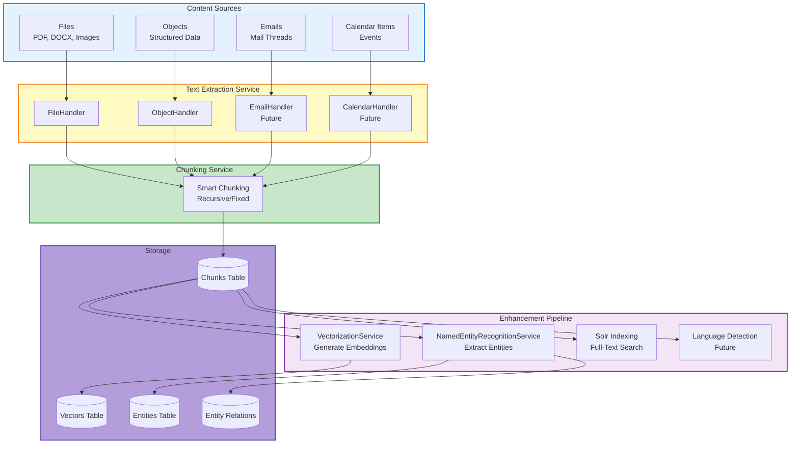
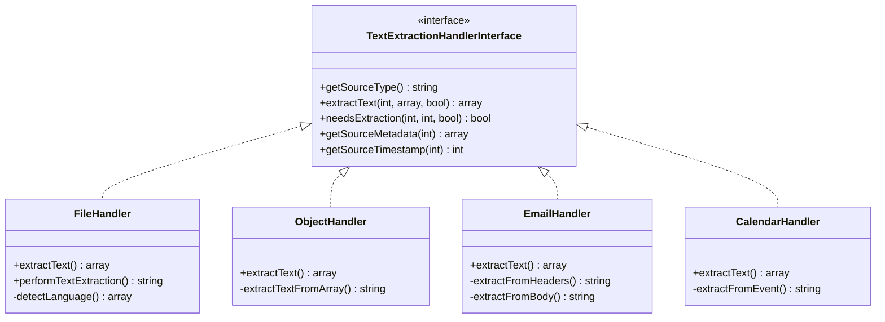
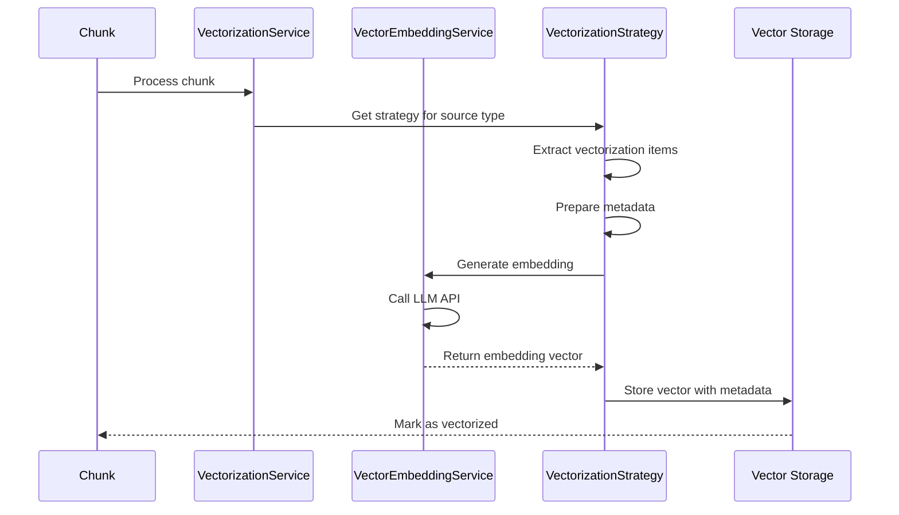
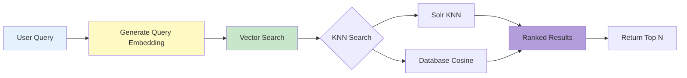
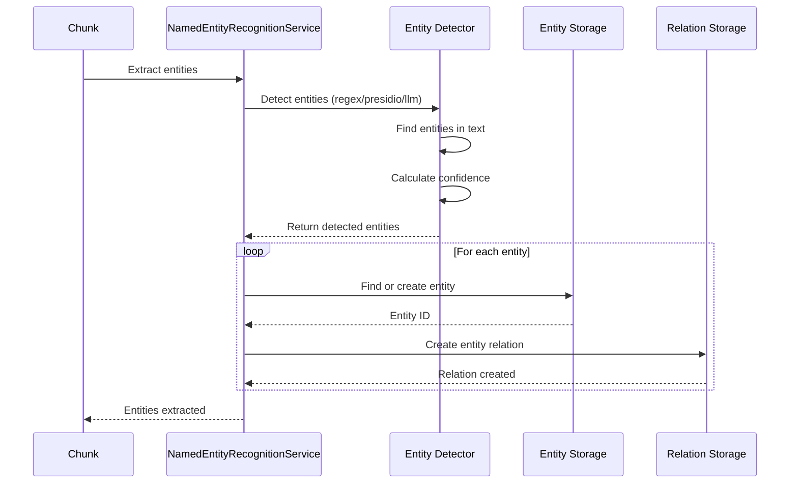
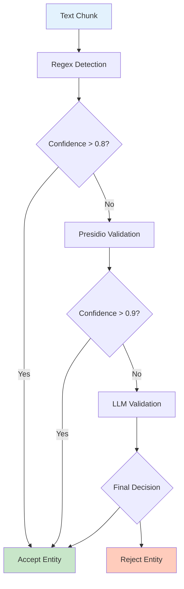
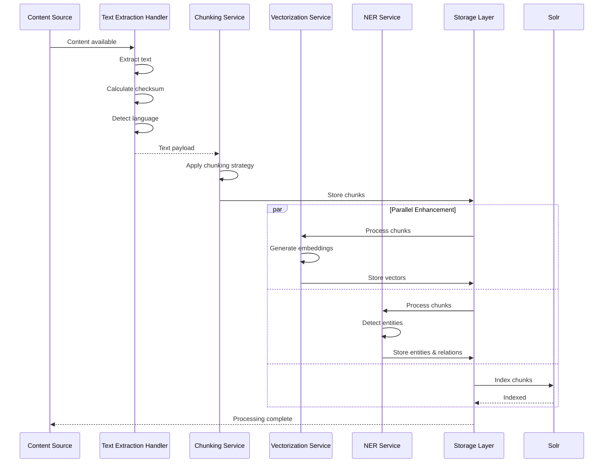

import ApiSchema from '@theme/ApiSchema';
import Tabs from '@theme/Tabs';
import TabItem from '@theme/TabItem';

# Text Extraction, Vectorization & Named Entity Recognition

## Overview

OpenRegister's content processing system transforms raw content (files, objects, emails, calendar items) into searchable, analyzable, and AI-ready data through three main services:

1. **Text Extraction** - Convert content to text and chunk it
2. **Vectorization** - Generate semantic embeddings for RAG
3. **Named Entity Recognition (NER)** - Extract entities for GDPR compliance

## Architecture Overview



## Stage 1: Text Extraction

The Text Extraction Service uses a handler-based architecture to extract text from different source types.

### Handler Architecture



### File Handler

Extracts text from Nextcloud files using various extraction methods:

**Supported Formats:**
- **Documents**: PDF, DOCX, DOC, ODT, RTF
- **Spreadsheets**: XLSX, XLS, CSV
- **Presentations**: PPTX
- **Text Files**: TXT, MD, HTML, JSON, XML
- **Images**: JPG, PNG, GIF, WebP, TIFF (via OCR)

**Extraction Methods:**
- **LLPhant**: Local PHP-based extraction
- **Dolphin**: AI-powered extraction with OCR
- **Native**: Direct text reading for plain text files

### Object Handler

Converts OpenRegister objects to text by concatenating property values:

**Process:**
1. Extract schema and register information
2. Flatten nested object structures
3. Concatenate property values with context
4. Add metadata (UUID, version, organization)

**Example:**
```json
Input Object:
{
  "firstName": "Jane",
  "lastName": "Smith",
  "email": "jane@example.com",
  "company": {
    "name": "Acme Corp",
    "industry": "Technology"
  }
}

Extracted Text:
"Object ID: 550e8400-...
Type: Contact
Register: Customers
firstName: Jane
lastName: Smith
email: jane@example.com
company.name: Acme Corp
company.industry: Technology
Organization: Acme Corp"
```

### Extraction Output

All handlers return a standardized payload:

```json
{
  "source_type": "file|object|email|calendar",
  "source_id": 12345,
  "text": "Full extracted text...",
  "length": 1234,
  "checksum": "sha256_hash",
  "method": "extraction_method",
  "owner": "user_id",
  "organisation": "org_id",
  "language": "en",
  "language_level": "B2",
  "language_confidence": 0.95,
  "detection_method": "auto",
  "metadata": {
    "file_path": "/path/to/file.pdf",
    "mime_type": "application/pdf",
    "file_size": 245678
  }
}
```

## Stage 2: Chunking

Text is split into manageable chunks optimized for processing and search.

### Chunking Strategies

#### 1. Recursive Character Splitting (Recommended)

Smart splitting that respects natural text boundaries:

```
Priority Order:
1. Paragraph breaks (\n\n)
2. Sentence endings (. ! ?)
3. Line breaks (\n)
4. Commas and semicolons
5. Word boundaries (spaces)
6. Character split (fallback)
```

**Best for**: Natural language documents, articles, reports

#### 2. Fixed Size Splitting

Mechanical splitting with overlap:

```
Settings:
- Chunk size: 1000 characters
- Overlap: 200 characters
- Minimum chunk: 100 characters
```

**Best for**: Structured data, code, logs

### Chunk Structure

Each chunk contains:

```json
{
  "uuid": "chunk-uuid",
  "source_type": "file",
  "source_id": 12345,
  "text_content": "The actual chunk content...",
  "start_offset": 0,
  "end_offset": 1000,
  "chunk_index": 0,
  "checksum": "sha256_hash",
  "language": "en",
  "language_level": "B2",
  "language_confidence": 0.95,
  "detection_method": "auto",
  "indexed": false,
  "vectorized": false,
  "position_reference": {
    "type": "chunk",
    "source_type": "file",
    "source_id": 12345
  },
  "created_at": "2025-01-15T10:30:00Z",
  "updated_at": "2025-01-15T10:30:00Z"
}
```

### Chunk Storage

Chunks are stored in the `openregister_chunks` table with:
- Full text content
- Source references
- Position information
- Language metadata
- Processing flags (indexed, vectorized)

## Stage 3: Vectorization

The VectorizationService generates semantic embeddings for RAG (Retrieval Augmented Generation) and semantic search.

### Vectorization Flow



### Vectorization Strategies

#### File Strategy

Processes file chunks individually:

```php
// Each file chunk gets its own vector
Chunk 0: [0.123, -0.456, 0.789, ...]
Chunk 1: [0.234, -0.567, 0.890, ...]
Chunk 2: [0.345, -0.678, 0.901, ...]
```

**Metadata includes:**
- File ID and path
- Chunk index
- Total chunks
- File name and type

#### Object Strategy

Processes entire objects as single vectors:

```php
// Object gets one vector representing all content
Object 12345: [0.123, -0.456, 0.789, ...]
```

**Metadata includes:**
- Object UUID
- Schema and register
- Version information
- Organization

### Embedding Models

Supported embedding providers:

| Provider | Models | Dimensions | Use Case |
|----------|--------|------------|----------|
| **OpenAI** | text-embedding-ada-002<br/>text-embedding-3-small<br/>text-embedding-3-large | 1536<br/>1536<br/>3072 | General purpose, high quality |
| **Fireworks AI** | nomic-ai/nomic-embed-text-v1.5<br/>thenlper/gte-base | 768<br/>768 | Cost-effective, fast |
| **Ollama** | nomic-embed-text | 384 | Local, privacy-friendly |

### Vector Storage

Vectors can be stored in:

1. **Database** (`openregister_vectors` table)
   - Serialized binary format
   - Good for small to medium datasets
   - Enables PHP-based similarity search

2. **Solr** (Dense Vector Fields)
   - Native vector support
   - KNN (K-Nearest Neighbors) search
   - Scalable for large datasets

### Semantic Search

Once vectorized, content can be searched semantically:



## Stage 4: Named Entity Recognition (NER)

The NamedEntityRecognitionService extracts entities (persons, organizations, emails, etc.) for GDPR compliance and data classification.

### NER Flow



### Entity Types

| Entity Type | Description | Examples | GDPR Category |
|-------------|-------------|----------|---------------|
| **PERSON** | Individual names | John Doe, Jane Smith | Personal Data |
| **EMAIL** | Email addresses | john@example.com | Personal Data |
| **PHONE** | Phone numbers | +31 6 12345678 | Personal Data |
| **ADDRESS** | Physical addresses | 123 Main St, Amsterdam | Personal Data |
| **ORGANIZATION** | Company/org names | Acme Corporation | Business Data |
| **LOCATION** | Geographic locations | Amsterdam, Netherlands | Contextual Data |
| **DATE** | Dates and times | 2025-01-15, January 15th | Temporal Data |
| **IBAN** | Bank account numbers | NL91 ABNA 0417 1643 00 | Sensitive PII |
| **SSN** | Social security numbers | 123-45-6789 | Sensitive PII |
| **IP_ADDRESS** | IP addresses | 192.168.1.1 | Contextual Data |

### Detection Methods

#### 1. Regex Patterns (Local)

Fast, privacy-friendly detection using regular expressions:

**Advantages:**
- No external dependencies
- Fast processing (~10-50ms per chunk)
- Privacy-friendly (no data leaves server)

**Limitations:**
- Lower accuracy for complex cases
- Limited context awareness

**Supported Entities:**
- Email addresses
- Phone numbers
- IBANs
- Basic patterns

#### 2. Presidio (External Service)

Microsoft's PII detection service:

**Advantages:**
- High accuracy
- Specialized for PII detection
- Maintained by experts

**Limitations:**
- Requires external service
- Data sent to external API
- Network latency

#### 3. LLM-Based (AI)

Context-aware entity extraction using Large Language Models:

**Advantages:**
- Context-aware detection
- Handles ambiguity
- Can detect complex entities

**Limitations:**
- Slower processing (~500-2000ms per chunk)
- Higher cost
- Requires API access

#### 4. Hybrid Approach (Recommended)

Combines multiple methods for best results:



### Entity Storage

#### Entity Table

Stores unique entities:

```json
{
  "id": 1,
  "uuid": "entity-uuid",
  "type": "PERSON",
  "value": "John Doe",
  "category": "personal_data",
  "belongs_to_entity_id": null,
  "metadata": {
    "normalized": "john doe",
    "aliases": ["J. Doe", "Johnny Doe"]
  },
  "detected_at": "2025-01-15T10:30:00Z",
  "updated_at": "2025-01-15T10:30:00Z"
}
```

#### Entity Relation Table

Links entities to chunk positions:

```json
{
  "id": 1,
  "entity_id": 1,
  "chunk_id": 123,
  "position_start": 45,
  "position_end": 54,
  "confidence": 0.95,
  "detection_method": "hybrid",
  "context": "...Contact John Doe at...",
  "anonymized": false,
  "created_at": "2025-01-15T10:30:00Z"
}
```

## Complete Processing Flow



## Integration Points

### Text Extraction → Chunking

```php
// TextExtractionService extracts text
$payload = $handler->extractText($sourceId, $metadata);

// Chunks are created
$chunks = $textExtractionService->textToChunks($payload, $options);

// Chunks are persisted
$textExtractionService->persistChunksForSource(
    $sourceType,
    $sourceId,
    $chunks,
    $owner,
    $organisation,
    $timestamp,
    $payload
);
```

### Chunking → Vectorization

```php
// VectorizationService processes chunks
$chunks = $chunkMapper->findBySource('file', $fileId);

foreach ($chunks as $chunk) {
    $vectorizationService->vectorizeEntity($chunk, $strategy);
}
```

### Chunking → NER

```php
// NamedEntityRecognitionService processes chunks
$chunks = $chunkMapper->findBySource('file', $fileId);

foreach ($chunks as $chunk) {
    $nerService->extractFromChunk($chunk, [
        'method' => 'hybrid',
        'confidence_threshold' => 0.7
    ]);
}
```

## Configuration

### Text Extraction Settings

**Settings → OpenRegister → File Configuration**

- **Extraction Scope**: None, All Files, Specific Folders, Object Files
- **Extraction Engine**: LLPhant or Dolphin
- **Chunking Strategy**: Recursive or Fixed Size
- **Chunk Size**: Default 1000 characters
- **Chunk Overlap**: Default 200 characters

### Vectorization Settings

**Settings → OpenRegister → LLM Configuration**

- **Enable Vectorization**: Yes/No
- **Embedding Provider**: OpenAI, Fireworks, Ollama
- **Embedding Model**: Select model
- **Vector Backend**: Database or Solr
- **Batch Size**: Chunks per batch

### NER Settings

**Settings → OpenRegister → Text Analysis**

- **Enable Entity Extraction**: Yes/No
- **Extraction Method**: Regex, Presidio, LLM, Hybrid
- **Entity Types**: Select types to detect
- **Confidence Threshold**: Minimum confidence (0.0-1.0)
- **Context Window**: Characters around entity (default: 50)

## Performance Considerations

### Processing Times

| Stage | Time per Item | Notes |
|-------|---------------|-------|
| **Text Extraction** | 2-60 seconds | Depends on file size and type |
| **Chunking** | 50-100ms | Per 100KB of text |
| **Vectorization** | 200-500ms | Per chunk (one-time) |
| **NER (Regex)** | 10-50ms | Per chunk |
| **NER (LLM)** | 500-2000ms | Per chunk |

### Recommendations

1. **Batch Processing**: Process enhancements in background jobs
2. **Selective Enhancement**: Only enable features you need
3. **Hybrid NER**: Use fast regex first, validate with LLM only when needed
4. **Vector Caching**: Cache embeddings to avoid regeneration
5. **Incremental Processing**: Only process changed content (use checksums)

## Use Cases

### Use Case 1: Document Search with RAG

**Scenario**: Users need to search across documents semantically.

**Process**:
1. Files uploaded → Text extracted → Chunked
2. Chunks vectorized → Stored in vector database
3. User query → Generate query embedding
4. Semantic search → Find relevant chunks
5. Return results with context

**Result**: Users can search using natural language queries like "budget discussion with John" and find relevant content even if exact words don't match.

### Use Case 2: GDPR Compliance Audit

**Scenario**: Organization needs to identify all personal data.

**Process**:
1. All content → Text extracted → Chunked
2. NER processes all chunks → Extracts entities
3. Entities stored → Linked to chunks
4. Generate GDPR report → Shows all PII locations

**Result**: Complete audit trail of where personal data appears in the system.

### Use Case 3: Multi-Modal Content Search

**Scenario**: Search across files, objects, emails, and calendar items.

**Process**:
1. All sources → Unified text extraction
2. All content → Chunked consistently
3. All chunks → Vectorized with same model
4. Unified search → Returns results from all sources

**Result**: Single search interface finds content regardless of source type.

## API Examples

### Extract Text from File

```http
POST /api/files/12345/extract
```

**Response:**
```json
{
  "success": true,
  "chunks_created": 14,
  "checksum": "sha256_hash"
}
```

### Vectorize Chunks

```http
POST /api/chunks/vectorize
Content-Type: application/json

{
  "source_type": "file",
  "source_id": 12345,
  "provider": "openai"
}
```

**Response:**
```json
{
  "success": true,
  "vectors_created": 14,
  "model": "text-embedding-3-small",
  "dimensions": 1536
}
```

### Extract Entities from Chunk

```http
POST /api/chunks/123/extract-entities
Content-Type: application/json

{
  "method": "hybrid",
  "confidence_threshold": 0.7
}
```

**Response:**
```json
{
  "entities_found": 5,
  "relations_created": 5,
  "entities": [
    {
      "type": "PERSON",
      "value": "John Doe",
      "confidence": 0.95
    },
    {
      "type": "EMAIL",
      "value": "john@example.com",
      "confidence": 0.9
    }
  ]
}
```

### Semantic Search

```http
POST /api/search/semantic
Content-Type: application/json

{
  "query": "budget discussion with John",
  "limit": 10,
  "filters": {
    "source_type": ["file", "object"]
  }
}
```

**Response:**
```json
{
  "results": [
    {
      "chunk_id": 123,
      "source_type": "file",
      "source_id": 12345,
      "text": "...discussed budget with John Doe...",
      "similarity": 0.87,
      "metadata": {
        "file_name": "meeting-notes.pdf",
        "chunk_index": 3
      }
    }
  ],
  "total": 10
}
```

## Future Enhancements

### Planned Handlers

- **EmailHandler**: Extract text from email threads
- **CalendarHandler**: Extract text from calendar events
- **ChatHandler**: Extract text from Talk conversations

### Planned Features

- **Incremental Processing**: Only process changed content
- **Streaming Extraction**: Process large files in streams
- **Multi-Language Support**: Enhanced language detection
- **Entity Linking**: Link related entities (person → email → phone)
- **Anonymization**: Automatic entity anonymization
- **Sentiment Analysis**: Per-chunk sentiment scoring
- **Topic Modeling**: Automatic content categorization

## Related Documentation

### Feature Documentation
- [Text Extraction Sources](../features/text-extraction-sources.md) - Detailed source-specific documentation
- [Enhanced Text Extraction](../features/text-extraction-enhanced.md) - GDPR and language features
- [AI Chat Interface](./ai.md) - RAG and semantic search usage
- [Search Features](./search.md) - Search capabilities
- [Files Feature](./files.md) - File management
- [Objects Feature](./objects.md) - Object management

### Technical Documentation
- [Text Extraction Technical Documentation](../technical/text-extraction.md) - Implementation details, database schema, handlers
- [Vectorization Technical Documentation](../technical/vectorization.md) - Embedding generation, storage backends, performance
- [Named Entity Recognition Technical Documentation](../technical/named-entity-recognition.md) - Entity extraction, GDPR register, detection methods

