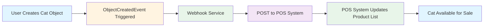
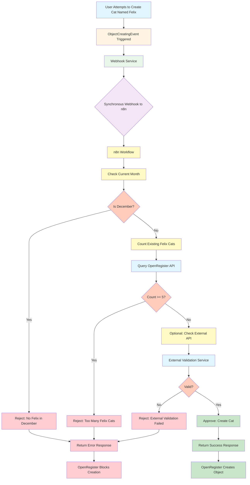

# Webhooks

OpenRegister includes a built-in webhook system that enables two powerful use cases: **event notifications** and **business logic integration**. Webhooks allow you to trigger external workflows and integrations whenever events occur within OpenRegister, enabling seamless integration with external systems and complex business rule validation.


## Overview

Webhooks serve two primary purposes in OpenRegister:

1. **Event Notifications**: Send CloudEvents to external systems when objects experience CRUD operations
2. **Business Logic Integration**: Add complex business rules and decision-making to the internal flow of registers

OpenRegister's webhook system provides a robust, production-ready solution with automatic retries, event filtering, and comprehensive monitoring.

## Use Case 1: Event Notifications

The simplest use case for webhooks is notifying external systems when objects are created, updated, or deleted. This enables real-time synchronization between OpenRegister and other applications.

### Example: Pet Store Inventory Sync

Imagine a pet store using OpenRegister to manage its inventory. When a new cat is added to the store, the point-of-sale (POS) system needs to be notified so it can include the new product in its product list.



**Configuration**:
```json
{
  "name": "POS Inventory Sync",
  "url": "https://pos-system.example.com/api/products",
  "method": "POST",
  "events": ["OCA\\OpenRegister\\Event\\ObjectCreatedEvent"],
  "filters": {
    "objectType": "object",
    "schema": "pet-store-cat-schema"
  },
  "enabled": true
}
```

When a cat object is created, OpenRegister automatically sends a CloudEvent to the POS system, which then updates its product catalog in real-time.

## Use Case 2: Business Logic and Decision Making

Webhooks can also be used to add complex business logic and decision-making to the internal flow of registers. This is particularly useful when validation rules are too complex for JSON schema validation.

### Example: Complex Pet Store Rules

Consider a pet store with complex business rules:
- **Rule 1**: Cannot create cats named "Felix" in the month of December
- **Rule 2**: Cannot create cats named "Felix" when there are already 5 or more cats with that name in the store

These rules involve:
- Date-based validation (checking if current month is December)
- Aggregation logic (counting existing cats with the same name)
- External data validation (potentially checking against external APIs)

JSON schema validation cannot handle this complexity. Instead, we can use webhooks to register to the object pre-create event and fire a synchronous webhook to an external tool like n8n that allows us to graphically build business logic flows.



**Configuration**:
```json
{
  "name": "Felix Cat Validation",
  "url": "http://n8n:5678/webhook/felix-validation",
  "method": "POST",
  "events": ["OCA\\OpenRegister\\Event\\ObjectCreatingEvent"],
  "filters": {
    "objectType": "object",
    "schema": "pet-store-cat-schema",
    "data.@self.name": "Felix"
  },
  "enabled": true,
  "configuration": {
    "interceptRequests": true,
    "async": false,
    "processResponse": true,
    "responseProcessing": {
      "mergeStrategy": "merge"
    }
  }
}
```

**n8n Workflow Capabilities**:

The n8n workflow can perform complex operations that JSON schema cannot:

1. **Date/Time Logic**: Check if current date is in December
2. **API Queries**: Query OpenRegister API to count existing cats with name "Felix"
3. **External API Calls**: Validate against external services (e.g., check if Felix is a registered trademark, verify against pet registry databases)
4. **Data Transformation**: Transform or enrich the request data before validation
5. **Conditional Logic**: Implement complex if/then/else rules
6. **Aggregations**: Count, sum, or perform other aggregations on existing data

**Response Handling**:

The n8n workflow returns a response that OpenRegister uses to determine whether to continue:

- **Success Response**: Object creation proceeds
- **Error Response**: Object creation is blocked, error message shown to user

This enables powerful business logic that would be impossible to implement with JSON schema alone.

### Key Features

- **Event-Driven Architecture**: Subscribe to specific OpenRegister events
- **Automatic Retries**: Configurable retry policies (exponential, linear, fixed)
- **Event Filtering**: Filter events based on payload data
- **Secure**: HMAC-SHA256 signature verification
- **Statistics**: Track delivery success rates and last execution times
- **Custom Headers**: Add authentication headers or custom metadata
- **Wildcard Support**: Use wildcards to match multiple events

## Requirements

- Nextcloud 28 or higher
- OpenRegister app installed and enabled
- External system to receive webhooks (n8n, Windmill, custom endpoint)

## Managing Webhooks

OpenRegister provides a RESTful API for managing webhooks.


### Creating a Webhook

```bash
curl -X POST http://localhost:8080/index.php/apps/openregister/api/webhooks \
  -u 'admin:admin' \
  -H 'Content-Type: application/json' \
  -d '{
    "name": "My Webhook",
    "url": "https://my-server.com/webhook",
    "method": "POST",
    "events": [
      "OCA\\OpenRegister\\Event\\ObjectCreatedEvent",
      "OCA\\OpenRegister\\Event\\ObjectUpdatedEvent"
    ],
    "enabled": true,
    "timeout": 30,
    "maxRetries": 3,
    "retryPolicy": "exponential"
  }'
```

#### Parameters

| Parameter | Type | Required | Description |
|-----------|------|----------|-------------|
| `name` | string | Yes | Webhook display name |
| `url` | string | Yes | Target URL to call |
| `method` | string | No | HTTP method: GET, POST, PUT, PATCH, DELETE (default: POST) |
| `events` | array | No | Event class names (empty = all events) |
| `enabled` | boolean | No | Enable/disable webhook (default: true) |
| `headers` | object | No | Custom HTTP headers |
| `secret` | string | No | Secret for HMAC signature |
| `filters` | object | No | Event payload filters |
| `timeout` | integer | No | Request timeout in seconds (default: 30) |
| `maxRetries` | integer | No | Maximum retry attempts (default: 3) |
| `retryPolicy` | string | No | Retry policy: exponential, linear, fixed (default: exponential) |

### Listing Webhooks

```bash
curl -X GET http://localhost:8080/index.php/apps/openregister/api/webhooks \
  -u 'admin:admin'
```

### Getting a Webhook

```bash
curl -X GET http://localhost:8080/index.php/apps/openregister/api/webhooks/{id} \
  -u 'admin:admin'
```

### Updating a Webhook

```bash
curl -X PUT http://localhost:8080/index.php/apps/openregister/api/webhooks/{id} \
  -u 'admin:admin' \
  -H 'Content-Type: application/json' \
  -d '{
    "enabled": false
  }'
```

### Deleting a Webhook

```bash
curl -X DELETE http://localhost:8080/index.php/apps/openregister/api/webhooks/{id} \
  -u 'admin:admin'
```

### Testing a Webhook

```bash
curl -X POST http://localhost:8080/index.php/apps/openregister/api/webhooks/{id}/test \
  -u 'admin:admin'
```


The test endpoint sends a test payload to verify webhook configuration. After testing, the webhook list automatically refreshes to show updated statistics (Last Triggered, Success Rate).

### Listing Available Events

```bash
curl -X GET http://localhost:8080/index.php/apps/openregister/api/webhooks/events \
  -u 'admin:admin'
```

## Available Events

OpenRegister dispatches events for all entity lifecycle operations. Below is a complete list of available events.

### Object Events

| Event | Description | When Triggered |
|-------|-------------|----------------|
| `OCA\OpenRegister\Event\ObjectCreatedEvent` | Object created | After new object is saved |
| `OCA\OpenRegister\Event\ObjectUpdatedEvent` | Object updated | After object is modified |
| `OCA\OpenRegister\Event\ObjectDeletedEvent` | Object deleted | After object is removed |
| `OCA\OpenRegister\Event\ObjectLockedEvent` | Object locked | After object is locked |
| `OCA\OpenRegister\Event\ObjectUnlockedEvent` | Object unlocked | After object is unlocked |
| `OCA\OpenRegister\Event\ObjectRevertedEvent` | Object reverted | After object is reverted to previous version |

### Register Events

| Event | Description | When Triggered |
|-------|-------------|----------------|
| `OCA\OpenRegister\Event\RegisterCreatedEvent` | Register created | After new register is saved |
| `OCA\OpenRegister\Event\RegisterUpdatedEvent` | Register updated | After register is modified |
| `OCA\OpenRegister\Event\RegisterDeletedEvent` | Register deleted | After register is removed |

### Schema Events

| Event | Description | When Triggered |
|-------|-------------|----------------|
| `OCA\OpenRegister\Event\SchemaCreatedEvent` | Schema created | After new schema is saved |
| `OCA\OpenRegister\Event\SchemaUpdatedEvent` | Schema updated | After schema is modified |
| `OCA\OpenRegister\Event\SchemaDeletedEvent` | Schema deleted | After schema is removed |

### Application Events

| Event | Description | When Triggered |
|-------|-------------|----------------|
| `OCA\OpenRegister\Event\ApplicationCreatedEvent` | Application created | After new application is saved |
| `OCA\OpenRegister\Event\ApplicationUpdatedEvent` | Application updated | After application is modified |
| `OCA\OpenRegister\Event\ApplicationDeletedEvent` | Application deleted | After application is removed |

### Agent Events

| Event | Description | When Triggered |
|-------|-------------|----------------|
| `OCA\OpenRegister\Event\AgentCreatedEvent` | Agent created | After new agent is saved |
| `OCA\OpenRegister\Event\AgentUpdatedEvent` | Agent updated | After agent is modified |
| `OCA\OpenRegister\Event\AgentDeletedEvent` | Agent deleted | After agent is removed |

### Source Events

| Event | Description | When Triggered |
|-------|-------------|----------------|
| `OCA\OpenRegister\Event\SourceCreatedEvent` | Source created | After new source is saved |
| `OCA\OpenRegister\Event\SourceUpdatedEvent` | Source updated | After source is modified |
| `OCA\OpenRegister\Event\SourceDeletedEvent` | Source deleted | After source is removed |

### Configuration Events

| Event | Description | When Triggered |
|-------|-------------|----------------|
| `OCA\OpenRegister\Event\ConfigurationCreatedEvent` | Configuration created | After new configuration is saved |
| `OCA\OpenRegister\Event\ConfigurationUpdatedEvent` | Configuration updated | After configuration is modified |
| `OCA\OpenRegister\Event\ConfigurationDeletedEvent` | Configuration deleted | After configuration is removed |

### View Events

| Event | Description | When Triggered |
|-------|-------------|----------------|
| `OCA\OpenRegister\Event\ViewCreatedEvent` | View created | After new view is saved |
| `OCA\OpenRegister\Event\ViewUpdatedEvent` | View updated | After view is modified |
| `OCA\OpenRegister\Event\ViewDeletedEvent` | View deleted | After view is removed |

### Conversation Events

| Event | Description | When Triggered |
|-------|-------------|----------------|
| `OCA\OpenRegister\Event\ConversationCreatedEvent` | Conversation created | After new conversation is saved |
| `OCA\OpenRegister\Event\ConversationUpdatedEvent` | Conversation updated | After conversation is modified |
| `OCA\OpenRegister\Event\ConversationDeletedEvent` | Conversation deleted | After conversation is removed |

### Organisation Events

| Event | Description | When Triggered |
|-------|-------------|----------------|
| `OCA\OpenRegister\Event\OrganisationCreatedEvent` | Organisation created | After new organisation is saved |
| `OCA\OpenRegister\Event\OrganisationUpdatedEvent` | Organisation updated | After organisation is modified |
| `OCA\OpenRegister\Event\OrganisationDeletedEvent` | Organisation deleted | After organisation is removed |

## Webhook Payload

All webhooks receive a standardized payload. The format depends on the HTTP method:

### POST, PUT, PATCH, DELETE Methods

For these methods, the payload is sent as JSON in the request body:

```json
{
  "event": "OCA\\OpenRegister\\Event\\ObjectCreatedEvent",
  "webhook": {
    "id": "550e8400-e29b-41d4-a716-446655440000",
    "name": "My Webhook"
  },
  "data": {
    "objectType": "object",
    "action": "created",
    "object": {
      "id": 123,
      "uuid": "abc-123",
      "...": "..."
    },
    "register": "my-register-uuid",
    "schema": "my-schema-uuid"
  },
  "timestamp": "2025-11-20T20:00:00+00:00",
  "attempt": 1
}
```

### GET Method

For GET requests, the payload is sent as query parameters instead of a JSON body:

```
GET /webhook-endpoint?event=OCA%5COpenRegister%5CEvent%5CObjectCreatedEvent&webhook[id]=550e8400-e29b-41d4-a716-446655440000&webhook[name]=My%20Webhook&data[objectType]=object&data[action]=created&timestamp=2025-11-20T20:00:00%2B00:00&attempt=1
```

The query parameters are URL-encoded versions of the same payload structure.

### Payload Structure

| Field | Type | Description |
|-------|------|-------------|
| `event` | string | Full event class name |
| `webhook.id` | string | Webhook UUID |
| `webhook.name` | string | Webhook name |
| `data` | object | Event-specific data |
| `timestamp` | string | ISO 8601 timestamp |
| `attempt` | integer | Delivery attempt number (1 for first attempt) |

## Event Filtering

You can filter which events trigger webhooks using the `filters` parameter:

```json
{
  "filters": {
    "objectType": "object",
    "action": "created",
    "register": "my-specific-register"
  }
}
```

Filters support:
- **Exact matching**: Filter value must match payload value exactly
- **Array matching**: Payload value must be in the filter array
- **Dot notation**: Access nested payload values (e.g., `'object.uuid'`)

Example with array filter:

```json
{
  "filters": {
    "action": ["created", "updated"]
  }
}
```

## Security

### HMAC Signature Verification

When you provide a `secret` during webhook creation, OpenRegister signs each payload with HMAC-SHA256 and includes the signature in the `X-Webhook-Signature` header.

To verify signatures:

```python
import hmac
import hashlib
import json

def verify_webhook(payload_body, signature, secret):
    expected = hmac.new(
        secret.encode('utf-8'),
        payload_body,
        hashlib.sha256
    ).hexdigest()
    
    return hmac.compare_digest(expected, signature)

# In your webhook endpoint
signature = request.headers.get('X-Webhook-Signature')
is_valid = verify_webhook(request.body, signature, 'your-secret')
```

### Custom Headers

Add authentication headers or custom metadata:

```json
{
  "headers": {
    "Authorization": "Bearer your-token",
    "X-Custom-Header": "value"
  }
}
```

## Retry Policies

OpenRegister supports three retry policies:

### Exponential Backoff (default)

Doubles the delay after each failure:
- Attempt 1: Immediate
- Attempt 2: 2 minutes
- Attempt 3: 4 minutes
- Attempt 4: 8 minutes

### Linear Backoff

Increases delay linearly:
- Attempt 1: Immediate
- Attempt 2: 5 minutes
- Attempt 3: 10 minutes
- Attempt 4: 15 minutes

### Fixed Delay

Constant delay between retries:
- All retries: 5 minutes

## Wildcard Events

Subscribe to multiple events using wildcards:

```json
{
  "events": [
    "OCA\\OpenRegister\\Event\\Object*",
    "OCA\\OpenRegister\\Event\\*CreatedEvent"
  ]
}
```

Or leave `events` empty to receive **all events**:

```json
{
  "events": []
}
```

## Monitoring

Each webhook tracks delivery statistics:

| Metric | Description |
|--------|-------------|
| `totalDeliveries` | Total delivery attempts |
| `successfulDeliveries` | Successful deliveries |
| `failedDeliveries` | Failed deliveries |
| `lastTriggeredAt` | Last delivery attempt timestamp |
| `lastSuccessAt` | Last successful delivery timestamp |
| `lastFailureAt` | Last failed delivery timestamp |

## Integrations

See platform-specific integration guides:

- [n8n Integration](../Integrations/n8n.md)
- [Windmill Integration](../Integrations/windmill.md)
- [Custom Webhooks](../Integrations/custom-webhooks.md)

## Examples

### Subscribe to All Object Events

```json
{
  "name": "Object Monitor",
  "url": "https://my-server.com/webhooks/objects",
  "events": ["OCA\\OpenRegister\\Event\\Object*"],
  "enabled": true
}
```

### Subscribe to Specific Register Changes

```json
{
  "name": "Register Monitor",
  "url": "https://my-server.com/webhooks/register",
  "events": [
    "OCA\\OpenRegister\\Event\\RegisterCreatedEvent",
    "OCA\\OpenRegister\\Event\\RegisterUpdatedEvent"
  ],
  "filters": {
    "register": "my-register-uuid"
  },
  "enabled": true
}
```

### High Security Webhook with Custom Headers

```json
{
  "name": "Secure Webhook",
  "url": "https://my-server.com/secure-webhook",
  "secret": "my-super-secret-key",
  "headers": {
    "Authorization": "Bearer my-api-token",
    "X-Source": "OpenRegister"
  },
  "events": [],
  "enabled": true
}
```

## Troubleshooting

### Webhook Not Firing

1. Check if webhook is enabled: `GET /api/webhooks/{id}`
2. Verify events are being triggered (check logs)
3. Ensure URL is accessible from Nextcloud container
4. Check network connectivity and firewall rules

### Delivery Failures

1. Check webhook statistics for error patterns
2. Review Nextcloud logs: `docker logs nextcloud | grep 'Webhook'`
3. Test webhook manually: `POST /api/webhooks/{id}/test`
4. Verify target endpoint is responding correctly

### Debug Mode

Enable debug logging in Nextcloud:

```php
// config/config.php
'loglevel' => 0,  // 0 = debug, 4 = error
```

Then monitor logs:

```bash
docker logs -f nextcloud | grep -E 'Webhook|OpenRegister'
```

## Best Practices

1. **Use Secrets**: Always configure HMAC secrets for production webhooks
2. **Set Appropriate Timeouts**: Balance between reliability and resource usage
3. **Filter Events**: Only subscribe to events you need
4. **Monitor Statistics**: Regularly check delivery success rates
5. **Handle Retries**: Design endpoints to be idempotent
6. **Validate Signatures**: Always verify HMAC signatures in production
7. **Use HTTPS**: Secure webhook URLs with TLS encryption
8. **Test First**: Use the test endpoint before going live

## Request/Response Webhook Flow

OpenRegister supports intercepting requests before they reach controllers, sending them to external webhooks as CloudEvents, and optionally processing responses to modify the request. This enables powerful use cases like:

- **Request Validation**: Validate requests before they're processed
- **Data Transformation**: Transform or enrich request data
- **Formatting Logic**: Apply formatting rules before object creation
- **External Processing**: Send requests to external services for processing

### What are CloudEvents?

CloudEvents is a specification for describing event data in a common way. It provides:

- **Consistent Structure**: Standardized event format across systems
- **Interoperability**: Works with different event systems and platforms
- **Standardized Metadata**: Includes source, type, id, time, and other standard attributes
- **Extensibility**: Supports custom attributes and data

CloudEvents makes it easier to integrate services that produce and consume events, enabling better interoperability between different systems.

### Request Interception Flow

The following diagram illustrates how requests are intercepted and processed:


### Configuration

To enable request interception, configure your webhook with the following settings:

```json
{
  "name": "Request Validator",
  "url": "https://my-service.com/validate",
  "method": "POST",
  "events": ["OCA\\OpenRegister\\Event\\ObjectCreatingEvent"],
  "enabled": true,
  "configuration": {
    "interceptRequests": true,
    "async": false,
    "processResponse": true,
    "responseProcessing": {
      "mergeStrategy": "merge",
      "fieldMapping": {
        "validatedData": "data",
        "enrichedFields": "@self"
      }
    }
  }
}
```

#### Configuration Options

| Option | Type | Default | Description |
|--------|------|---------|-------------|
| `interceptRequests` | boolean | false | Enable request interception for this webhook |
| `async` | boolean | false | If true, don't wait for response (fire and forget) |
| `processResponse` | boolean | false | If true, process webhook response to modify request |
| `responseProcessing.mergeStrategy` | string | "merge" | How to merge response: "merge", "replace", or "custom" |
| `responseProcessing.fieldMapping` | object | Custom field mapping when strategy is "custom" |

### CloudEvent Payload Structure

When a request is intercepted, it's formatted as a CloudEvent with the following structure:

```json
{
  "specversion": "1.0",
  "type": "object.creating",
  "source": "https://nextcloud.example.com/apps/openregister",
  "id": "550e8400-e29b-41d4-a716-446655440000",
  "time": "2025-01-25T10:30:00+00:00",
  "datacontenttype": "application/json",
  "subject": "object:register-1/schema-2",
  "data": {
    "method": "POST",
    "path": "/api/objects/register-1/schema-2",
    "queryParams": {},
    "headers": {
      "Content-Type": "application/json",
      "Authorization": "Bearer token"
    },
    "body": {
      "@self": {
        "title": "My Object",
        "description": "Object description"
      }
    }
  },
  "openregister": {
    "app": "openregister",
    "version": "1.0.0"
  }
}
```

### Response Processing

When `processResponse` is enabled, the webhook response can modify the request:

**Merge Strategy**: Merges response data into request data
```json
// Webhook Response
{
  "data": {
    "@self": {
      "validated": true,
      "enrichedField": "value"
    }
  }
}

// Result: Merged into original request
```

**Replace Strategy**: Replaces entire request body with response data
```json
// Webhook Response
{
  "data": {
    "@self": {
      "completely": "new",
      "structure": "here"
    }
  }
}

// Result: Request body replaced
```

**Custom Strategy**: Uses field mapping to selectively update fields
```json
// Configuration
{
  "fieldMapping": {
    "validatedData": "data",
    "metadata": "@self.metadata"
  }
}

// Webhook Response
{
  "validatedData": {...},
  "metadata": {...}
}

// Result: Mapped to specific request fields
```

### Example Use Cases

#### 1. Request Validation

Validate requests before processing:

```json
{
  "name": "Validation Webhook",
  "url": "https://validator.example.com/validate",
  "configuration": {
    "interceptRequests": true,
    "async": false,
    "processResponse": true,
    "responseProcessing": {
      "mergeStrategy": "merge"
    }
  }
}
```

#### 2. Data Enrichment

Enrich request data with external information:

```json
{
  "name": "Enrichment Webhook",
  "url": "https://enricher.example.com/enrich",
  "configuration": {
    "interceptRequests": true,
    "async": false,
    "processResponse": true,
    "responseProcessing": {
      "mergeStrategy": "merge"
    }
  }
}
```

#### 3. Async Notifications

Send notifications without waiting for response:

```json
{
  "name": "Notification Webhook",
  "url": "https://notifier.example.com/notify",
  "configuration": {
    "interceptRequests": true,
    "async": true,
    "processResponse": false
  }
}
```

## Webhook Logging

All webhook delivery attempts are logged to the `webhook_logs` table, providing comprehensive audit trails and debugging capabilities.

### Log Entry Structure

Each log entry contains:

| Field | Type | Description |
|-------|------|-------------|
| `webhookId` | integer | Reference to the webhook |
| `eventClass` | string | Event class name that triggered the webhook |
| `payload` | object | Full payload sent to webhook |
| `requestBody` | string | Request body as JSON (only stored on failure for retry purposes) |
| `url` | string | Target URL |
| `method` | string | HTTP method used |
| `success` | boolean | Whether delivery succeeded |
| `statusCode` | integer | HTTP status code from response |
| `responseBody` | string | Response body from webhook |
| `errorMessage` | string | Error message if delivery failed |
| `attempt` | integer | Attempt number (1 for first attempt) |
| `nextRetryAt` | datetime | Timestamp for next retry (if failed) |
| `created` | datetime | When the log entry was created |

**Note**: The `requestBody` field is only stored when a webhook delivery fails. This allows the system to retry failed deliveries with the exact same payload. Successful deliveries do not store the request body to conserve database space.

### Accessing Logs

Logs can be accessed via the API:

```bash
# Get logs for a specific webhook
curl -X GET http://localhost:8080/index.php/apps/openregister/api/webhooks/{id}/logs \
  -u 'admin:admin'

# Get all webhook logs (with optional filtering)
curl -X GET 'http://localhost:8080/index.php/apps/openregister/api/webhooks/logs?webhook_id=1&limit=50&offset=0&success=false' \
  -u 'admin:admin'
```

#### Logs API Parameters

| Parameter | Type | Description |
|-----------|------|-------------|
| `webhook_id` | integer | Filter logs by webhook ID (optional) |
| `limit` | integer | Maximum number of logs to return (default: 50) |
| `offset` | integer | Number of logs to skip (default: 0) |
| `success` | boolean | Filter by success status: true or false (optional) |

#### Retrying Failed Webhooks

You can manually retry a failed webhook delivery using the log entry ID:

```bash
curl -X POST http://localhost:8080/index.php/apps/openregister/api/webhooks/logs/{logId}/retry \
  -u 'admin:admin'
```

This will retry the webhook delivery using the stored request payload from the original failed attempt.

## Retry Mechanism

OpenRegister includes an automatic retry mechanism for failed webhook deliveries using Nextcloud background jobs with exponential backoff.

### How It Works

1. **Initial Delivery**: When a webhook delivery fails, a log entry is created with `success=false`
2. **Retry Scheduling**: The system calculates the next retry time based on the retry policy and stores it in `nextRetryAt`
3. **Cron Job Processing**: A background cron job (`WebhookRetryJob`) runs every 5 minutes
4. **Retry Execution**: The cron job finds failed logs where `nextRetryAt` has passed and retries the delivery
5. **Exponential Backoff**: Each retry uses increasing delays to avoid overwhelming the target service

### Retry Policies

Three retry policies are supported:

#### Exponential Backoff (default)

Delays double with each attempt:
- Attempt 1: Immediate
- Attempt 2: 2 minutes (2^1 * 60)
- Attempt 3: 4 minutes (2^2 * 60)
- Attempt 4: 8 minutes (2^3 * 60)

#### Linear Backoff

Delays increase linearly:
- Attempt 1: Immediate
- Attempt 2: 5 minutes (1 * 300)
- Attempt 3: 10 minutes (2 * 300)
- Attempt 4: 15 minutes (3 * 300)

#### Fixed Delay

Constant delay between retries:
- All retries: 5 minutes (300 seconds)

### Retry Flow Diagram


### Configuration

Retries are enabled webhook-wide:

```json
{
  "name": "My Webhook",
  "maxRetries": 3,
  "retryPolicy": "exponential",
  "configuration": {
    "enableRetries": true
  }
}
```

#### Retry Configuration Options

| Option | Type | Default | Description |
|--------|------|---------|-------------|
| `maxRetries` | integer | 3 | Maximum number of retry attempts |
| `retryPolicy` | string | "exponential" | Retry policy: "exponential", "linear", or "fixed" |
| `configuration.enableRetries` | boolean | true | Enable/disable retries for this webhook |

### Monitoring Retries

You can monitor retry status by checking webhook logs:

```bash
# Get statistics for a webhook
curl -X GET http://localhost:8080/index.php/apps/openregister/api/webhooks/{id}/logs/stats \
  -u 'admin:admin'
```

Response:
```json
{
  "total": 150,
  "successful": 145,
  "failed": 5,
  "pendingRetries": 2
}
```

## API Reference

For complete API documentation, see the [Events API Reference](../api/events-reference.md).
