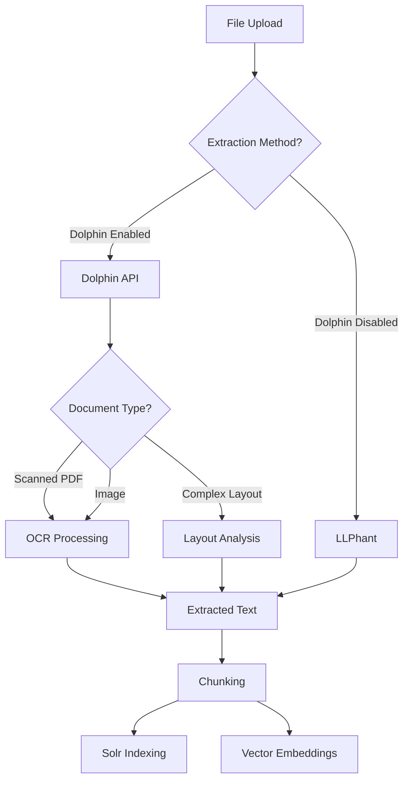

# Dolphin LLM Model Integration

Dolphin is an open-source document image parsing model (0.3B parameters) developed by ByteDance. It provides advanced document processing capabilities including OCR, layout analysis, and structured extraction.

## Overview

Dolphin is a Vision-Language Model (VLM) that excels at:
- ✅ **Advanced OCR**: Better accuracy on scanned documents and images
- ✅ **Layout Analysis**: Understand document structure and reading order
- ✅ **Complex Documents**: Handle multi-column layouts, mixed content types
- ✅ **Table Extraction**: Parse complex tables with high accuracy
- ✅ **Formula Recognition**: Extract mathematical formulas from documents

## Prerequisites

- Nextcloud 28+ with OpenRegister installed
- Docker and Docker Compose
- GPU recommended (4GB+ VRAM) for optimal performance
- At least 8GB RAM

## Quick Start

### Step 1: Deploy Dolphin Container

Dolphin is included in `docker-compose.dev.yml` with the `huggingface` profile:

```bash
# Start Dolphin service
docker-compose -f docker-compose.dev.yml --profile huggingface up -d dolphin-vlm

# Wait for model download and initialization
docker logs -f openregister-dolphin-vlm
```

### Step 2: Configure OpenRegister

Once Dolphin is deployed, configure in OpenRegister:

**PHP Configuration** (`config/text_extraction.php`):

```php
return [
    'text_extraction' => [
        'dolphin' => [
            'enabled' => true,
            'api_url' => 'http://dolphin-vlm:5000',  // From Nextcloud container
            'timeout' => 60,  // Longer timeout for complex documents
            'fallback_to_llphant' => true  // Fallback if Dolphin unavailable
        ]
    ]
];
```

### Step 3: Test Integration

```bash
# Test Dolphin health
curl http://localhost:8083/health

# Test document parsing
curl -X POST http://localhost:8083/parse \
  -F "file=@document.pdf" \
  -F "format=text"
```

## Configuration Details

### Dolphin Service Configuration

```yaml
dolphin-vlm:
  build:
    context: ./docker/dolphin
    dockerfile: Dockerfile
  container_name: openregister-dolphin-vlm
  restart: always
  ports:
    - "8083:5000"
  volumes:
    - ./docker/dolphin/models:/app/models
  environment:
    - MODEL_PATH=/app/models
    - LOG_LEVEL=INFO
  deploy:
    resources:
      limits:
        memory: 8G
      reservations:
        memory: 4G
      devices:
        - driver: nvidia
          count: all
          capabilities: [gpu]
```

### Accessing Dolphin

**Important: Docker Container Communication**

- ✅ **From Nextcloud container**: `http://dolphin-vlm:5000`
- ✅ **From host machine**: `http://localhost:8083`
- ❌ **NOT**: `http://localhost:5000` (from Nextcloud container)

## Use Cases

### 1. Scanned Document Processing

Dolphin excels at extracting text from scanned PDFs and images:

```php
use OCA\OpenRegister\Service\TextExtractionService;

$textExtractionService = $this->container->get(TextExtractionService::class);

// Extract text from scanned PDF
$text = $textExtractionService->extractFromFile($fileId, [
    'method' => 'dolphin',  // Use Dolphin for OCR
    'format' => 'text'
]);
```

### 2. Complex Layout Analysis

Parse documents with complex layouts:

- Multi-column layouts
- Mixed text and images
- Tables and forms
- Mathematical formulas

### 3. Table Extraction

Extract structured data from tables:

```php
// Extract tables from document
$result = $textExtractionService->extractFromFile($fileId, [
    'method' => 'dolphin',
    'format' => 'structured',  // Get structured output
    'extract_tables' => true
]);
```

## API Endpoints

### Health Check

```bash
GET http://dolphin-vlm:5000/health
```

Response:
```json
{
  "status": "ok",
  "service": "dolphin-api"
}
```

### Parse Document

```bash
POST http://dolphin-vlm:5000/parse
Content-Type: multipart/form-data

file: <file>
format: text|structured|json
```

### Parse PDF

```bash
POST http://dolphin-vlm:5000/parse/pdf
Content-Type: multipart/form-data

file: <pdf_file>
```

## Integration with Text Extraction Pipeline

Dolphin integrates with OpenRegister's text extraction pipeline:



## When to Use Dolphin

### Use Dolphin When:

- ✅ Processing scanned documents
- ✅ Complex multi-column layouts
- ✅ Tables and structured data extraction
- ✅ Mathematical formulas
- ✅ High accuracy OCR required

### Use LLPhant When:

- ✅ Simple text documents
- ✅ Privacy-first requirements (no external API)
- ✅ Fast processing needed
- ✅ No GPU available

## Troubleshooting

### Container Won't Start

```bash
# Check logs
docker logs openregister-dolphin-vlm

# Common issues:
# 1. Port 8083 already in use
sudo lsof -i :8083

# 2. Insufficient memory
docker stats openregister-dolphin-vlm

# 3. GPU not available
docker exec openregister-dolphin-vlm nvidia-smi
```

### Model Download Fails

```bash
# Check internet connection
docker exec openregister-dolphin-vlm ping -c 3 huggingface.co

# Manual model download
docker exec openregister-dolphin-vlm \
  huggingface-cli download ByteDance/Dolphin-1.5 \
  --local-dir /app/models
```

### Connection Errors from OpenRegister

**Problem**: OpenRegister can't connect to Dolphin.

**Solutions**:
1. Verify API URL uses container name: `http://dolphin-vlm:5000`
2. Check containers are on same Docker network
3. Test connection from Nextcloud container:
   ```bash
   docker exec <nextcloud-container> curl http://dolphin-vlm:5000/health
   ```

### Slow Processing

**Solutions**:
1. Use GPU acceleration (10-100x faster)
2. Process smaller documents
3. Increase timeout settings
4. Use batch processing for multiple files

## Performance Optimization

### GPU Acceleration

For best performance, use GPU:

```yaml
deploy:
  resources:
    devices:
      - driver: nvidia
        count: all
        capabilities: [gpu]
```

**Performance Gain**: 10-100x faster processing with GPU

### Batch Processing

Process multiple documents efficiently:

```php
// Process multiple files
$fileIds = [123, 124, 125];
foreach ($fileIds as $fileId) {
    $textExtractionService->extractFromFile($fileId, [
        'method' => 'dolphin',
        'async' => true  // Process asynchronously
    ]);
}
```

## Maintenance

### View Logs

```bash
docker logs -f openregister-dolphin-vlm
```

### Restart Container

```bash
docker restart openregister-dolphin-vlm
```

### Update Model

```bash
docker exec openregister-dolphin-vlm \
  huggingface-cli download ByteDance/Dolphin-2.0 \
  --local-dir /app/models
  
docker restart openregister-dolphin-vlm
```

### Check GPU Usage

```bash
docker exec openregister-dolphin-vlm nvidia-smi
```

## Further Reading

- [Docker Setup](../development/docker-setup.md) - Docker setup with Hugging Face profile
- [Text Extraction Implementation](../technical/text-extraction.md)
- [Dolphin GitHub Repository](https://github.com/bytedance/Dolphin)
- [Hugging Face Dolphin Model](https://huggingface.co/ByteDance/Dolphin-1.5)

## Support

For issues specific to:
- **Dolphin setup**: Check [Docker Setup](../development/docker-setup.md) - Use `--profile huggingface` to enable Dolphin
- **OpenRegister integration**: OpenRegister GitHub issues
- **Model issues**: Check [Dolphin GitHub](https://github.com/bytedance/Dolphin)


