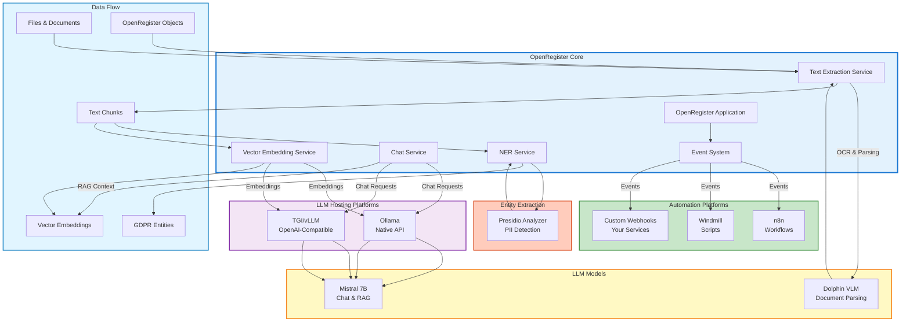
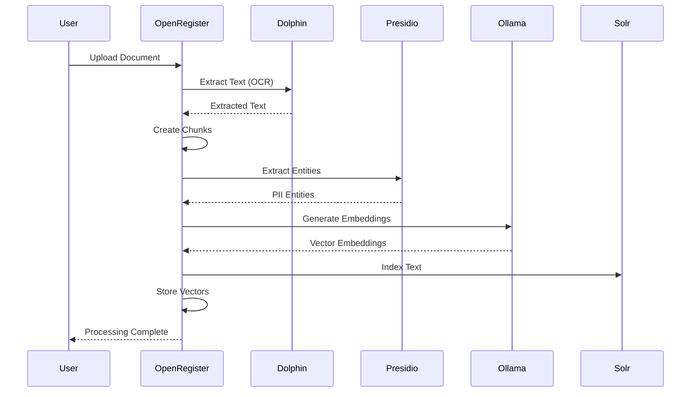
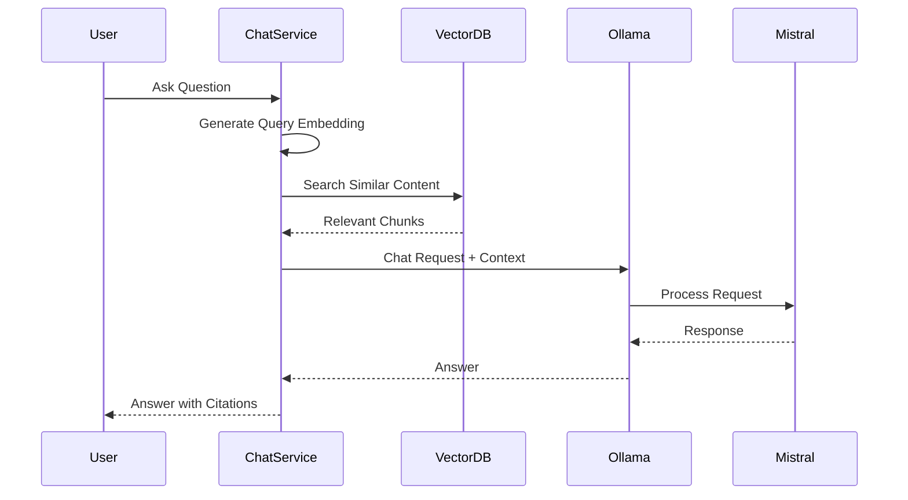
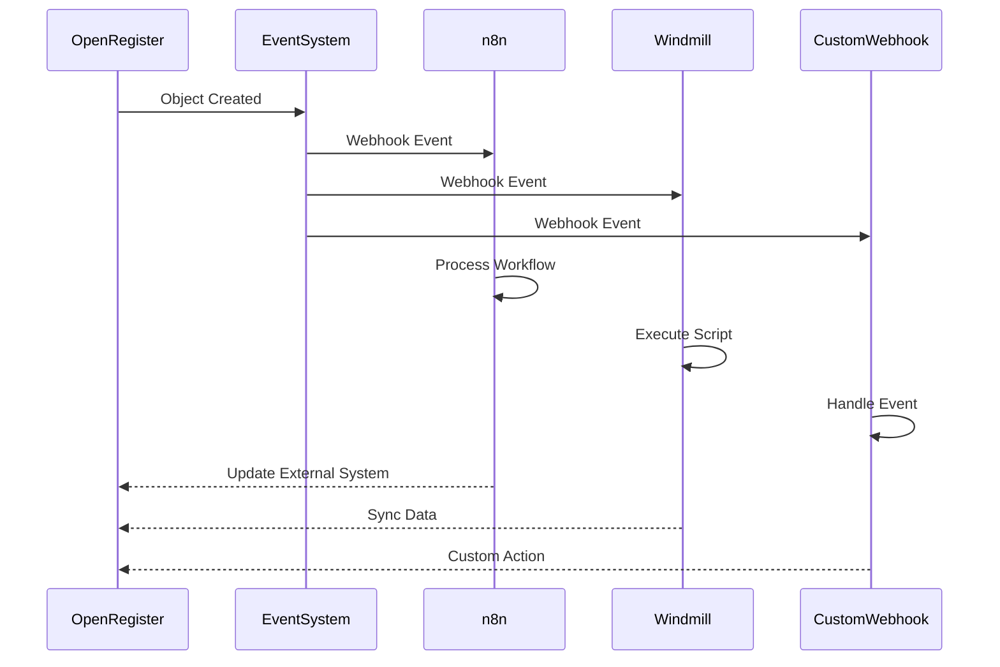

# Integrations Overview

OpenRegister integrates with various external services and models to provide powerful AI capabilities, automation workflows, and advanced text processing. This page provides an overview of all available integrations and how they work together.

## Integration Categories

OpenRegister integrations fall into three main categories:

### 1. LLM Hosting Platforms
Services that host and run Large Language Models locally:
- **[Ollama](./ollama.md)** - Simple, native API for running LLMs
- **[Hugging Face](./huggingface.md)** - TGI/vLLM with OpenAI-compatible API

### 2. LLM Models
Specific language models that can be used:
- **[Mistral](./mistral.md)** - High-performance 7B model
- **[Dolphin](./dolphin.md)** - Document parsing and OCR model

### 3. Entity Extraction Services
Services for detecting and extracting entities from text:
- **[Presidio](./presidio.md)** - Microsoft's PII detection service

### 4. Automation Platforms
Workflow automation and integration platforms:
- **[n8n](./n8n.md)** - Workflow automation platform
- **[Windmill](./windmill.md)** - Developer-focused workflow engine
- **[Custom Webhooks](./custom-webhooks.md)** - Build your own integrations

## Integration Architecture

The following diagram shows how all integrations work together in OpenRegister:



## Integration Flow

### 1. Text Extraction Pipeline



### 2. Chat & RAG Pipeline



### 3. Automation Pipeline



## Integration Comparison

### LLM Hosting Platforms

| Platform | API Type | Setup Difficulty | Performance | Best For |
|----------|----------|------------------|-------------|----------|
| **Ollama** | Native | ⭐⭐⭐⭐⭐ Easy | ⚡⚡⚡ Good | Development, simple setup |
| **TGI** | OpenAI-Compatible | ⭐⭐⭐ Medium | ⚡⚡ Fast | Production, optimized |
| **vLLM** | OpenAI-Compatible | ⭐⭐⭐ Medium | ⚡⚡⚡ Very Fast | High throughput |

### LLM Models

| Model | Size | Use Case | Hosting |
|-------|------|----------|---------|
| **Mistral 7B** | 7B | Chat, RAG, general purpose | Ollama, TGI, vLLM |
| **Dolphin** | 0.3B | Document parsing, OCR | Custom container |

### Entity Extraction

| Service | Accuracy | Languages | Best For |
|---------|----------|-----------|----------|
| **Presidio** | 90-95% | 50+ | GDPR compliance, production |
| **MITIE** | 75-85% | Limited | Fast local processing |
| **LLM-based** | 92-98% | All | Highest accuracy |

### Automation Platforms

| Platform | Language | Use Case | Best For |
|----------|----------|----------|----------|
| **n8n** | Visual/JS | Workflow automation | Non-developers |
| **Windmill** | Python/TS/Go/Bash | Script execution | Developers |
| **Custom Webhooks** | Any | Custom integrations | Full control |

## Quick Start Guide

### For AI Chat & RAG

1. **Choose LLM Hosting**: Start with [Ollama](./ollama.md) for easiest setup
2. **Pull Model**: Download [Mistral](./mistral.md) or Llama 3.2
3. **Configure**: Set up in OpenRegister Settings → LLM Configuration
4. **Enable RAG**: Vectorize your objects and files

### For Document Processing

1. **Deploy Dolphin**: Start [Dolphin](./dolphin.md) container for OCR
2. **Configure**: Set Dolphin as extraction method
3. **Process Files**: Upload documents for automatic processing

### For GDPR Compliance

1. **Start Presidio**: Presidio is included in docker-compose
2. **Configure**: Enable entity extraction in settings
3. **Monitor**: Track PII in GDPR register

### For Automation

1. **Choose Platform**: [n8n](./n8n.md) for workflows or [Windmill](./windmill.md) for scripts
2. **Set Up Webhooks**: Register webhook endpoints
3. **Create Workflows**: Build automation for your use cases

## Integration Requirements

### Minimum Requirements

- **CPU**: 4+ cores recommended
- **RAM**: 16GB minimum (32GB recommended for larger models)
- **Storage**: 50GB+ for models and data
- **GPU**: Optional but recommended (8GB+ VRAM for LLMs)

### Docker Requirements

- Docker 20.10+
- Docker Compose 2.0+
- NVIDIA Docker runtime (for GPU support)

## Configuration Overview

### LLM Configuration

```yaml
# docker-compose.yml
services:
  ollama:
    image: ollama/ollama:latest
    # ... configuration
  
  tgi-mistral:
    image: ghcr.io/huggingface/text-generation-inference:latest
    # ... configuration
```

### Entity Extraction Configuration

```yaml
services:
  presidio-analyzer:
    image: mcr.microsoft.com/presidio-analyzer:latest
    # ... configuration
```

### Document Processing Configuration

```yaml
services:
  dolphin-vlm:
    build: ./docker/dolphin
    # ... configuration
```

## Best Practices

### 1. Start Simple

Begin with Ollama for LLM hosting - it's the easiest to set up and configure.

### 2. Use GPU When Available

GPU acceleration provides 10-100x performance improvement for LLMs and document processing.

### 3. Choose Right Model Size

- **Development**: Use smaller models (3B-7B) for faster iteration
- **Production**: Use larger models (7B-13B) for better quality

### 4. Monitor Resource Usage

Keep an eye on:
- Memory usage (models can be memory-intensive)
- GPU utilization
- API response times

### 5. Implement Fallbacks

Always have fallback options:
- LLPhant for text extraction if Dolphin unavailable
- MITIE for entity extraction if Presidio unavailable
- Database search if vector search unavailable

## Troubleshooting

### Common Issues

1. **Container Communication**: Always use container names, not localhost
2. **Model Not Found**: Ensure model names include version tags
3. **Out of Memory**: Reduce model size or increase available RAM
4. **Slow Performance**: Enable GPU acceleration

### Getting Help

- Check individual integration documentation
- Review [Development Guides](../development/)
- Open GitHub issues for bugs
- Check Docker logs for errors

## Next Steps

- **[Ollama Integration](./ollama.md)** - Get started with local LLMs
- **[Hugging Face Integration](./huggingface.md)** - Production-ready LLM hosting
- **[Presidio Integration](./presidio.md)** - GDPR-compliant entity extraction
- **[n8n Integration](./n8n.md)** - Workflow automation
- **[Custom Webhooks](./custom-webhooks.md)** - Build your own integrations

## Related Documentation

- [Text Extraction](../features/text-extraction-sources.md)
- [RAG Implementation](../features/rag-implementation.md)
- [Entity Extraction](../features/ner-nlp-concepts.md)
- [AI Features](../features/ai.md)


