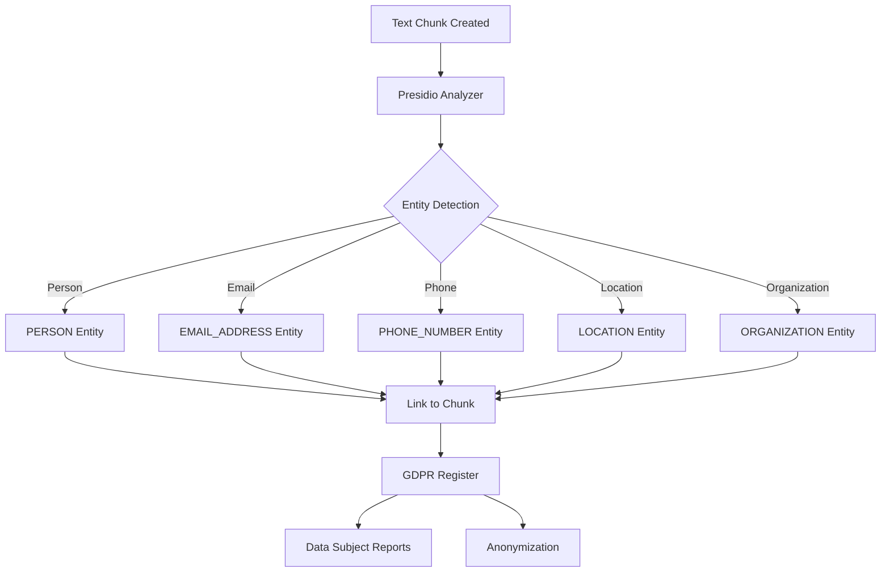

# Presidio Integration

Integrate OpenRegister with Microsoft Presidio Analyzer for advanced entity extraction and PII (Personally Identifiable Information) detection for GDPR compliance.

## Overview

Presidio Analyzer is Microsoft's open-source PII detection service that provides:
- ✅ **High Accuracy**: 90-98% precision for PII detection
- ✅ **Multi-language Support**: 50+ languages including Dutch
- ✅ **GDPR Compliance**: Built specifically for GDPR/CCPA requirements
- ✅ **Self-hosted**: Run locally in Docker
- ✅ **Extensible**: Add custom recognizers

## Prerequisites

- Nextcloud 28+ with OpenRegister installed
- Docker and Docker Compose
- At least 2GB RAM
- Presidio Analyzer container (included in docker-compose.yml)

## Quick Start

### Step 1: Start Presidio Container

Presidio is included in the docker-compose configuration:

```bash
# Start all services including Presidio
docker-compose up -d

# Or specifically start Presidio
docker-compose up -d presidio-analyzer
```

### Step 2: Verify Presidio is Running

```bash
# Check health
curl http://localhost:5001/health

# Expected response:
# {"status":"ok"}
```

### Step 3: Configure OpenRegister

Presidio is automatically configured when the container is running. Configure in OpenRegister settings:

**Settings → OpenRegister → Text Analysis → Entity Extraction**

- **Method**: Select "Presidio"
- **Presidio URL**: `http://presidio-analyzer:5001` (from Nextcloud container)
- **Default Language**: Select your primary language (e.g., Dutch)
- **Supported Languages**: Select languages to support

## Configuration Details

### Presidio Service Configuration

```yaml
presidio-analyzer:
  image: mcr.microsoft.com/presidio-analyzer:latest
  container_name: openregister-presidio-analyzer
  restart: always
  ports:
    - "5001:5001"
  environment:
    - GRPC_PORT=5001
    - LOG_LEVEL=INFO
    # Multi-language support including Dutch
    - PRESIDIO_ANALYZER_LANGUAGES=en,nl,de,fr,es
  deploy:
    resources:
      limits:
        memory: 2G
      reservations:
        memory: 512M
  healthcheck:
    test: ["CMD-SHELL", "curl -f http://localhost:5001/health || exit 1"]
    interval: 30s
    timeout: 10s
    retries: 3
```

### Accessing Presidio

**Important: Docker Container Communication**

- ✅ **From Nextcloud container**: `http://presidio-analyzer:5001`
- ✅ **From host machine**: `http://localhost:5001`
- ❌ **NOT**: `http://localhost:5001` (from Nextcloud container, use container name)

## Supported Entity Types

Presidio detects the following entity types:

### Personal Information
- **PERSON**: Person names
- **EMAIL_ADDRESS**: Email addresses
- **PHONE_NUMBER**: Phone numbers
- **NRP**: National identification numbers (BSN in Netherlands)

### Financial Information
- **CREDIT_CARD**: Credit card numbers
- **IBAN_CODE**: International bank account numbers
- **SWIFT_CODE**: SWIFT codes

### Location Information
- **LOCATION**: Geographic locations
- **IP_ADDRESS**: IP addresses
- **URL**: Web URLs

### Organization Information
- **ORGANIZATION**: Organization names

### Date and Time
- **DATE_TIME**: Dates and timestamps

### Medical Information
- **MEDICAL_LICENSE**: Medical license numbers
- **US_PASSPORT**: US passport numbers

### Custom Entities
- Add custom recognizers for domain-specific entities

## Use Cases

### 1. GDPR Compliance

Automatically detect and track PII in documents:

```php
use OCA\OpenRegister\Service\NerService;

$nerService = $this->container->get(NerService::class);

// Extract entities from Dutch text
$dutchText = "Jan de Vries woont in Amsterdam en zijn telefoonnummer is 06-12345678.";

$entities = $nerService->extractEntities($dutchText, 'presidio', [
    'language' => 'nl'
]);

foreach ($entities as $entity) {
    echo "Type: {$entity['type']}\n";
    echo "Value: {$entity['value']}\n";
    echo "Confidence: {$entity['confidence']}\n";
    echo "Position: {$entity['start']}-{$entity['end']}\n\n";
}
```

**Output**:
```
Type: PERSON
Value: Jan de Vries
Confidence: 0.85
Position: 0-12

Type: LOCATION
Value: Amsterdam
Confidence: 0.85
Position: 22-31

Type: PHONE_NUMBER
Value: 06-12345678
Confidence: 0.95
Position: 58-69
```

### 2. Data Subject Access Requests

Generate GDPR reports showing all PII for a person:

```php
// Find all entities for a specific person
$personEntities = $nerService->findEntitiesByValue('Jan de Vries', 'presidio');

// Generate GDPR report
$report = $gdprService->generateDataSubjectReport($personEntities);
```

### 3. Automatic Anonymization

Anonymize detected PII in documents:

```php
// Extract entities
$entities = $nerService->extractEntities($text, 'presidio');

// Anonymize text
$anonymizedText = $anonymizationService->anonymize($text, $entities);
```

## API Usage

### Direct API Calls

Test Presidio directly:

```bash
# Analyze text for PII
curl -X POST http://localhost:5001/analyze \
  -H "Content-Type: application/json" \
  -d '{
    "text": "Jan de Vries woont in Amsterdam",
    "language": "nl",
    "entities": ["PERSON", "LOCATION"]
  }'
```

Response:
```json
{
  "entities": [
    {
      "entity_type": "PERSON",
      "start": 0,
      "end": 12,
      "score": 0.85,
      "analysis_explanation": {
        "recognizer": "SpacyRecognizer",
        "pattern": "PERSON"
      }
    },
    {
      "entity_type": "LOCATION",
      "start": 22,
      "end": 31,
      "score": 0.85,
      "analysis_explanation": {
        "recognizer": "SpacyRecognizer",
        "pattern": "LOCATION"
      }
    }
  ]
}
```

## Integration with Text Extraction Pipeline

Presidio integrates with OpenRegister's text extraction pipeline:



## Configuration

### PHP Configuration

```php
// config/ner_config.php
return [
    'ner_enabled' => true,
    'ner_method' => 'presidio',  // Use Presidio for production
    
    'presidio' => [
        'analyzer_url' => 'http://presidio-analyzer:5001',
        'default_language' => 'nl',  // Default to Dutch
        'languages' => ['nl', 'en'],  // Support Dutch and English
        'score_threshold' => 0.6,     // Minimum confidence score
        'entities' => [
            'PERSON',
            'EMAIL_ADDRESS',
            'PHONE_NUMBER',
            'IBAN_CODE',
            'LOCATION',
            'ORGANIZATION',
            'NRP',  // Dutch BSN numbers
        ]
    ]
];
```

### Automatic Language Detection

If your documents are mixed language, detect language first:

```php
// Detect language
$language = $nerService->detectLanguage($text);

// Use detected language for entity extraction
$entities = $nerService->extractEntities($text, 'presidio', [
    'language' => $language
]);
```

## Accuracy Comparison

| Method | Precision | Recall | F1 Score | Speed |
|--------|-----------|--------|----------|-------|
| **Presidio** | 90-95% | 85-92% | 87-93% | ⚡⚡ Medium |
| **MITIE** (Local) | 75-85% | 70-80% | 72-82% | ⚡⚡⚡ Fast |
| **LLM** (GPT-4) | 92-98% | 90-95% | 91-96% | ⚡ Slow |

**Definitions**:
- **Precision**: Percentage of detected entities that are correct (low false positives)
- **Recall**: Percentage of actual entities that were detected (low false negatives)
- **F1 Score**: Harmonic mean of precision and recall (overall accuracy)

## Troubleshooting

### Container Won't Start

```bash
# Check logs
docker logs openregister-presidio-analyzer

# Common issues:
# 1. Port 5001 already in use
sudo lsof -i :5001

# 2. Insufficient memory
docker stats openregister-presidio-analyzer

# 3. Language models not downloaded
docker exec openregister-presidio-analyzer ls /app/models
```

### Low Accuracy

**Solutions**:
1. Specify correct language: `'language' => 'nl'` for Dutch
2. Adjust score threshold: Lower threshold for more detections
3. Add custom recognizers for domain-specific entities
4. Use hybrid approach with multiple methods

### Connection Errors from OpenRegister

**Problem**: OpenRegister can't connect to Presidio.

**Solutions**:
1. Verify analyzer URL uses container name: `http://presidio-analyzer:5001`
2. Check containers are on same Docker network
3. Test connection from Nextcloud container:
   ```bash
   docker exec <nextcloud-container> curl http://presidio-analyzer:5001/health
   ```

### Slow Processing

**Solutions**:
1. Process in batches
2. Use async processing for large documents
3. Cache results for repeated text
4. Adjust timeout settings

## Performance Optimization

### Batch Processing

Process multiple chunks efficiently:

```php
// Process multiple chunks
$chunks = [$chunk1, $chunk2, $chunk3];
$allEntities = $nerService->extractEntitiesBatch($chunks, 'presidio', [
    'language' => 'nl',
    'async' => true
]);
```

### Caching

Cache entity extraction results:

```php
// Cache entities for repeated text
$cacheKey = md5($text);
$entities = $cache->get($cacheKey);

if (!$entities) {
    $entities = $nerService->extractEntities($text, 'presidio');
    $cache->set($cacheKey, $entities, 3600);  // Cache for 1 hour
}
```

## Further Reading

- [Presidio Setup Guide](../development/presidio-setup.md)
- [Entity Extraction Concepts](../features/ner-nlp-concepts.md)
- [Text Extraction Enhanced](../features/text-extraction-enhanced.md)
- [Presidio Official Documentation](https://microsoft.github.io/presidio/)

## Support

For issues specific to:
- **Presidio setup**: Check [Presidio Setup Guide](../development/presidio-setup.md)
- **Entity extraction**: See [Entity Extraction Concepts](../features/ner-nlp-concepts.md)
- **OpenRegister integration**: OpenRegister GitHub issues
- **Presidio issues**: Check [Presidio GitHub](https://github.com/microsoft/presidio)

