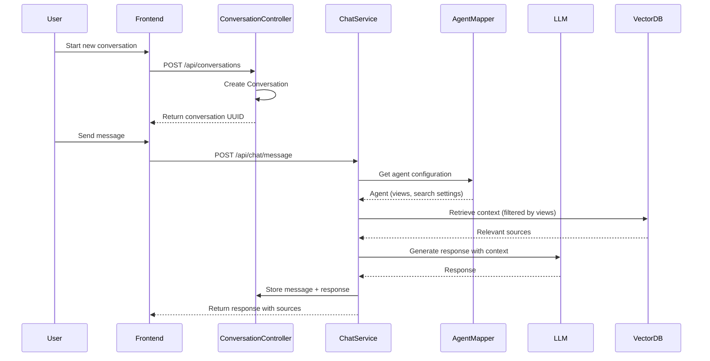

# Conversations API

## Overview

The Conversations API provides endpoints for managing AI chat conversations, including creating, retrieving, updating, and archiving conversations.

## Data Flow



## Base Endpoint

```
/index.php/apps/openregister/api/conversations
```

## Authentication

All endpoints require authentication via Nextcloud session or app password.

## Endpoints

### List Conversations

Retrieve all active conversations for the current user in their active organisation.

```http
GET /index.php/apps/openregister/api/conversations
```

#### Query Parameters

| Parameter | Type | Required | Default | Description |
|-----------|------|----------|---------|-------------|
| `limit` | integer | No | 50 | Maximum number of conversations to return |
| `offset` | integer | No | 0 | Number of conversations to skip (for pagination) |
| `includeDeleted` | boolean | No | false | Include soft-deleted conversations |

#### Response

```json
{
  "results": [
    {
      "id": 1,
      "uuid": "550e8400-e29b-41d4-a716-446655440001",
      "title": "Customer Support Query",
      "userId": "admin",
      "organisation": 1,
      "agentId": 5,
      "metadata": {
        "source": "web",
        "tags": ["support", "billing"]
      },
      "deletedAt": null,
      "created": "2024-11-05T10:00:00Z",
      "updated": "2024-11-05T10:30:00Z",
      "messageCount": 8
    }
  ],
  "total": 15,
  "limit": 50,
  "offset": 0
}
```

#### Status Codes

- `200 OK`: Conversations retrieved successfully
- `500 Internal Server Error`: Server error occurred

---

### Get Conversation

Retrieve a single conversation with all its messages.

```http
GET /index.php/apps/openregister/api/conversations/{uuid}
```

#### Path Parameters

| Parameter | Type | Required | Description |
|-----------|------|----------|-------------|
| `uuid` | string | Yes | Conversation UUID |

#### Response

```json
{
  "id": 1,
  "uuid": "550e8400-e29b-41d4-a716-446655440001",
  "title": "Customer Support Query",
  "userId": "admin",
  "organisation": 1,
  "agentId": 5,
  "metadata": {
    "source": "web",
    "tags": ["support", "billing"]
  },
  "deletedAt": null,
  "created": "2024-11-05T10:00:00Z",
  "updated": "2024-11-05T10:30:00Z",
  "messages": [
    {
      "id": 1,
      "uuid": "660e8400-e29b-41d4-a716-446655440001",
      "conversationId": 1,
      "role": "user",
      "content": "How do I update my billing information?",
      "sources": [],
      "created": "2024-11-05T10:00:00Z"
    },
    {
      "id": 2,
      "uuid": "660e8400-e29b-41d4-a716-446655440002",
      "conversationId": 1,
      "role": "assistant",
      "content": "To update your billing information, navigate to...",
      "sources": [
        {
          "type": "file",
          "id": "doc-001",
          "name": "billing-guide.pdf",
          "relevance": 0.95
        }
      ],
      "created": "2024-11-05T10:00:15Z"
    }
  ],
  "messageCount": 8
}
```

#### Status Codes

- `200 OK`: Conversation retrieved successfully
- `403 Forbidden`: User doesn't have access to this conversation
- `404 Not Found`: Conversation not found
- `500 Internal Server Error`: Server error occurred

---

### Create Conversation

Create a new conversation with a specific agent.

```http
POST /index.php/apps/openregister/api/conversations
```

#### Request Body

```json
{
  "agentUuid": "450e8400-e29b-41d4-a716-446655440010",
  "title": "Optional custom title"
}
```

| Field | Type | Required | Description |
|-------|------|----------|-------------|
| `agentUuid` | string | Yes | UUID of the agent to use for this conversation |
| `title` | string | No | Custom title (auto-generated if not provided) |

#### Response

```json
{
  "id": 10,
  "uuid": "550e8400-e29b-41d4-a716-446655440010",
  "title": "New Conversation",
  "userId": "admin",
  "organisation": 1,
  "agentId": 5,
  "metadata": {},
  "deletedAt": null,
  "created": "2024-11-05T11:00:00Z",
  "updated": "2024-11-05T11:00:00Z"
}
```

#### Status Codes

- `201 Created`: Conversation created successfully
- `400 Bad Request`: Invalid request data or agent not found
- `500 Internal Server Error`: Server error occurred

---

### Update Conversation

Update a conversation's title or metadata.

```http
PATCH /index.php/apps/openregister/api/conversations/{uuid}
```

#### Path Parameters

| Parameter | Type | Required | Description |
|-----------|------|----------|-------------|
| `uuid` | string | Yes | Conversation UUID |

#### Request Body

```json
{
  "title": "Updated Title",
  "metadata": {
    "priority": "high",
    "category": "technical"
  }
}
```

| Field | Type | Required | Description |
|-------|------|----------|-------------|
| `title` | string | No | New conversation title |
| `metadata` | object | No | New or updated metadata |

#### Response

```json
{
  "id": 1,
  "uuid": "550e8400-e29b-41d4-a716-446655440001",
  "title": "Updated Title",
  "userId": "admin",
  "organisation": 1,
  "agentId": 5,
  "metadata": {
    "priority": "high",
    "category": "technical"
  },
  "deletedAt": null,
  "created": "2024-11-05T10:00:00Z",
  "updated": "2024-11-05T11:05:00Z"
}
```

#### Status Codes

- `200 OK`: Conversation updated successfully
- `403 Forbidden`: User doesn't have permission to modify this conversation
- `404 Not Found`: Conversation not found
- `500 Internal Server Error`: Server error occurred

---

### Delete Conversation (Soft)

Soft delete a conversation, moving it to the archive.

```http
DELETE /index.php/apps/openregister/api/conversations/{uuid}
```

#### Path Parameters

| Parameter | Type | Required | Description |
|-----------|------|----------|-------------|
| `uuid` | string | Yes | Conversation UUID |

#### Response

```json
{
  "message": "Conversation deleted successfully",
  "uuid": "550e8400-e29b-41d4-a716-446655440001"
}
```

#### Status Codes

- `200 OK`: Conversation soft deleted successfully
- `403 Forbidden`: User doesn't have permission to delete this conversation
- `404 Not Found`: Conversation not found
- `500 Internal Server Error`: Server error occurred

---

### Restore Conversation

Restore a soft-deleted conversation from the archive.

```http
POST /index.php/apps/openregister/api/conversations/{uuid}/restore
```

#### Path Parameters

| Parameter | Type | Required | Description |
|-----------|------|----------|-------------|
| `uuid` | string | Yes | Conversation UUID |

#### Response

```json
{
  "id": 1,
  "uuid": "550e8400-e29b-41d4-a716-446655440001",
  "title": "Restored Conversation",
  "userId": "admin",
  "organisation": 1,
  "agentId": 5,
  "metadata": {},
  "deletedAt": null,
  "created": "2024-11-05T10:00:00Z",
  "updated": "2024-11-05T11:10:00Z"
}
```

#### Status Codes

- `200 OK`: Conversation restored successfully
- `403 Forbidden`: User doesn't have permission to restore this conversation
- `404 Not Found`: Conversation not found
- `500 Internal Server Error`: Server error occurred

---

### Delete Conversation (Permanent)

Permanently delete a conversation and all its messages.

```http
DELETE /index.php/apps/openregister/api/conversations/{uuid}/permanent
```

#### Path Parameters

| Parameter | Type | Required | Description |
|-----------|------|----------|-------------|
| `uuid` | string | Yes | Conversation UUID |

#### Response

```json
{
  "message": "Conversation permanently deleted",
  "uuid": "550e8400-e29b-41d4-a716-446655440001"
}
```

#### Status Codes

- `200 OK`: Conversation permanently deleted
- `403 Forbidden`: User doesn't have permission to delete this conversation
- `404 Not Found`: Conversation not found
- `500 Internal Server Error`: Server error occurred

---

### List Archived Conversations

Retrieve all soft-deleted conversations for the current user.

```http
GET /index.php/apps/openregister/api/conversations/archive
```

#### Query Parameters

| Parameter | Type | Required | Default | Description |
|-----------|------|----------|---------|-------------|
| `limit` | integer | No | 50 | Maximum number of conversations to return |
| `offset` | integer | No | 0 | Number of conversations to skip (for pagination) |

#### Response

```json
{
  "results": [
    {
      "id": 3,
      "uuid": "550e8400-e29b-41d4-a716-446655440003",
      "title": "Archived Conversation",
      "userId": "admin",
      "organisation": 1,
      "agentId": 2,
      "metadata": {},
      "deletedAt": "2024-11-05T09:00:00Z",
      "created": "2024-11-04T14:00:00Z",
      "updated": "2024-11-05T09:00:00Z",
      "messageCount": 5
    }
  ],
  "total": 3,
  "limit": 50,
  "offset": 0
}
```

#### Status Codes

- `200 OK`: Archived conversations retrieved successfully
- `500 Internal Server Error`: Server error occurred

---

## Access Control

### Conversation Ownership

- Users can only access conversations they own (`userId` matches)
- Conversations are scoped to the user's current organisation
- When switching organisations, conversations from other organisations become inaccessible

### Permission Rules

| Action | Permission Required |
|--------|-------------------|
| List conversations | User must be in the conversation's organisation |
| View conversation | User must be the owner |
| Create conversation | User must have access to the specified agent |
| Update conversation | User must be the owner |
| Delete conversation | User must be the owner |
| Restore conversation | User must be the owner |

## Examples

### Creating and Using a Conversation

```javascript
// 1. Create a new conversation
const createResponse = await fetch('/index.php/apps/openregister/api/conversations', {
  method: 'POST',
  headers: { 'Content-Type': 'application/json' },
  body: JSON.stringify({
    agentUuid: 'agent-uuid-here'
  })
});

const conversation = await createResponse.json();

// 2. Send a message (see Chat API)
const chatResponse = await fetch('/index.php/apps/openregister/api/chat/send', {
  method: 'POST',
  headers: { 'Content-Type': 'application/json' },
  body: JSON.stringify({
    conversationUuid: conversation.uuid,
    message: 'Hello, can you help me?'
  })
});

// 3. Get conversation with messages
const getResponse = await fetch(
  `/index.php/apps/openregister/api/conversations/${conversation.uuid}`
);
const conversationWithMessages = await getResponse.json();
```

### Managing Archives

```javascript
// Soft delete a conversation
await fetch(`/index.php/apps/openregister/api/conversations/${uuid}`, {
  method: 'DELETE'
});

// List archived conversations
const archiveResponse = await fetch('/index.php/apps/openregister/api/conversations/archive');
const archived = await archiveResponse.json();

// Restore from archive
await fetch(`/index.php/apps/openregister/api/conversations/${uuid}/restore`, {
  method: 'POST'
});

// Permanently delete
await fetch(`/index.php/apps/openregister/api/conversations/${uuid}/permanent`, {
  method: 'DELETE'
});
```

## Related APIs

- [Chat & RAG Deep Dive](../features/chat-rag-deepdive.md) - How chat and RAG work
- [AI Agents](../features/agents.md) - Manage and configure AI agents
- [AI Configuration](../Features/ai.md) - LLM setup and configuration

## Database Schema

### Conversations Table

```sql
CREATE TABLE openregister_conversations (
  id BIGINT PRIMARY KEY AUTO_INCREMENT,
  uuid VARCHAR(255) UNIQUE NOT NULL,
  title VARCHAR(255),
  user_id VARCHAR(255) NOT NULL,
  organisation INT,
  agent_id INT NOT NULL,
  metadata LONGTEXT,  -- JSON
  deleted_at DATETIME NULL,
  created DATETIME NOT NULL,
  updated DATETIME NOT NULL,
  INDEX idx_user_org (user_id, organisation),
  INDEX idx_agent (agent_id),
  INDEX idx_deleted (deleted_at)
);
```

### Messages Table

```sql
CREATE TABLE openregister_messages (
  id BIGINT PRIMARY KEY AUTO_INCREMENT,
  uuid VARCHAR(255) UNIQUE NOT NULL,
  conversation_id BIGINT NOT NULL,
  role VARCHAR(50) NOT NULL,  -- 'user', 'assistant', 'system'
  content LONGTEXT NOT NULL,
  sources LONGTEXT,  -- JSON
  created DATETIME NOT NULL,
  INDEX idx_conversation (conversation_id),
  FOREIGN KEY (conversation_id) REFERENCES openregister_conversations(id) ON DELETE CASCADE
);
```

