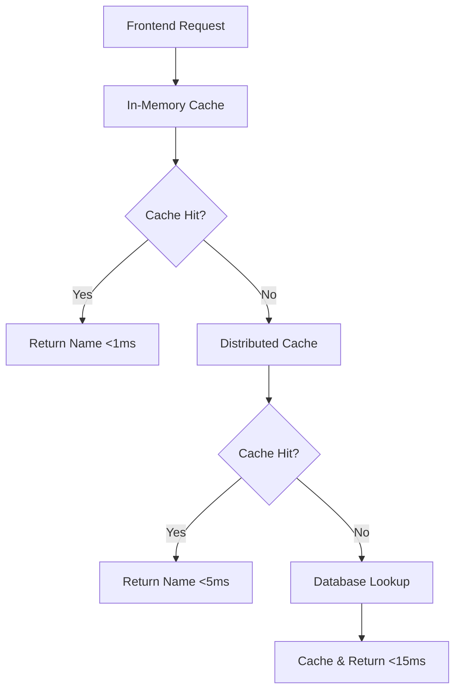

# Names API - Ultra-Fast Object Name Resolution

The Names API provides lightning-fast object name lookup functionality for frontend applications, enabling seamless rendering of human-readable names instead of UUIDs throughout the user interface.

## 🚀 Key Features

- **Ultra-Fast Performance**: Sub-10ms response times through aggressive caching
- **Bulk Operations**: Retrieve multiple names in a single request
- **Automatic Cache Management**: Integrates with object CRUD operations
- **Frontend Optimized**: Designed specifically for UI name resolution needs
- **Related Data Support**: Extract related object names from search results

## 📋 Available Endpoints

### 1. Get All Names or Specific Names (GET)

```
GET /api/names
GET /api/names?ids=uuid1,uuid2,uuid3
```

**Query Parameters:**
- `ids` (optional): Comma-separated list of object IDs/UUIDs or JSON array

**Response Example:**
```json
{
  "names": {
    "uuid-1": "Organization Alpha",
    "uuid-2": "Contact John Doe",
    "uuid-3": "Document Beta"
  },
  "total": 3,
  "cached": true,
  "execution_time": "2.45ms",
  "cache_stats": {
    "name_cache_size": 1564,
    "name_hit_rate": 98.5
  }
}
```

### 1b. Get Specific Names with JSON Body (POST)

```
POST /api/names
```

**Use Case:** Handles large UUID arrays that exceed URL length limits (especially with long UUIDs).

**Request Body:**
```json
{
  "ids": ["uuid-1", "uuid-2", "uuid-3"]
}
```

**Response Example:**
```json
{
  "names": {
    "uuid-1": "Organization Alpha",
    "uuid-2": "Contact John Doe",
    "uuid-3": "Document Beta"
  },
  "total": 3,
  "requested": 3,
  "cached": true,
  "execution_time": "0.77ms",
  "cache_stats": {
    "name_cache_size": 1564,
    "name_hit_rate": 100
  }
}
```

### 2. Get Single Object Name

```
GET /api/names/{id}
```

**Response Example:**
```json
{
  "id": "uuid-123",
  "name": "Organization Alpha",
  "found": true,
  "cached": true,
  "execution_time": "1.2ms"
}
```

### 3. Cache Statistics

```
GET /api/names/stats
```

**Response Example:**
```json
{
  "cache_statistics": {
    "name_hits": 1245,
    "name_misses": 23,
    "name_hit_rate": 98.2,
    "name_cache_size": 1564,
    "name_warmups": 2
  },
  "performance_metrics": {
    "name_cache_enabled": true,
    "distributed_cache_available": true,
    "warmup_available": true
  }
}
```

### 4. Manual Cache Warmup

```
POST /api/names/warmup
```

**Response Example:**
```json
{
  "success": true,
  "loaded_names": 782,
  "execution_time": "39.54ms",
  "cache_stats": {
    "name_cache_size": 1564,
    "name_warmups": 1
  }
}
```

## 🔗 Enhanced Search Responses

The Names API integrates with paginated search endpoints to provide related object data for frontend optimization.

### Related Data Parameters

Add these query parameters to any paginated search endpoint:

- `_related=true`: Include aggregated related object IDs
- `_relatedNames=true`: Include related object ID → name mappings

**Example Request:**
```
GET /api/objects?_limit=10&_related=true&_relatedNames=true
```

**Enhanced Response:**
```json
{
  "results": [...],
  "total": 150,
  "page": 1,
  "related": [
    "uuid-rel-1",
    "uuid-rel-2",
    "uuid-rel-3"
  ],
  "relatedNames": {
    "uuid-rel-1": "Related Organization A",
    "uuid-rel-2": "Related Contact B",
    "uuid-rel-3": "Related Document C"
  }
}
```

## ⚡ Performance Characteristics

### Benchmark Results - Search Response Enhancement

Based on comprehensive testing with 10 objects per paginated search request:

| Query Type | Average Response Time | Performance Impact |
|------------|----------------------|-------------------|
| **Standard Search** | 838ms | Baseline |
| **With `_related=true`** | 924ms | **+10% (+86ms)** |
| **With `_relatedNames=true`** | 804ms | **-4% (-34ms)** |
| **Both Parameters** | 894ms | **+7% (+56ms)** |

### Key Performance Insights

- **`_related=true`**: Small 10% performance cost for extracting relationship IDs
- **`_relatedNames=true`**: Actually 4% faster due to efficient cache usage  
- **Combined Parameters**: Moderate 7% overhead when using both features
- **Single Name Lookup**: Ultra-fast **0.4ms** response time from cache

### Cache Layers



### Cache Performance Benchmarks

| Operation | Cache Status | Response Time | Use Case |
|-----------|-------------|---------------|----------|
| Single Name | In-Memory Hit | **0.4ms** | Individual lookups |
| Bulk Names (50) | Mixed Cache | 3-8ms | Batch operations |
| All Names | Warmed Cache | 5-15ms | Initial load |
| Cache Warmup | Database Load | **11ms** (1,500+ names) | System initialization |
| Cold Cache | Database | 20-50ms | First access |

## 💻 Frontend Integration Examples

### React Hook Example

```javascript
// Custom hook for name resolution with POST support for large ID arrays
function useObjectNames(ids) {
  const [names, setNames] = useState({});
  const [loading, setLoading] = useState(true);
  
  useEffect(() => {
    if (ids && ids.length > 0) {
      // Use POST method for large ID arrays (>50 UUIDs) to avoid URL length limits
      if (ids.length > 50) {
        fetch('/api/names', {
          method: 'POST',
          headers: { 'Content-Type': 'application/json' },
          body: JSON.stringify({ ids })
        })
          .then(r => r.json())
          .then(data => {
            setNames(data.names);
            setLoading(false);
          });
      } else {
        // Use GET method for smaller ID arrays
        const idsParam = ids.join(',');
        fetch('/api/names?ids=' + idsParam)
          .then(r => r.json())
          .then(data => {
            setNames(data.names);
            setLoading(false);
          });
      }
    }
  }, [ids]);
  
  return { names, loading };
}

// Usage in component
function ObjectList({ objects }) {
  const ids = objects.map(obj => obj.uuid);
  const { names, loading } = useObjectNames(ids);
  
  return (
    <div>
      {objects.map(obj => (
        <div key={obj.uuid}>
          {loading ? obj.uuid : names[obj.uuid] || obj.uuid}
        </div>
      ))}
    </div>
  );
}
```

### Vue.js Example

```javascript
// Vue 3 Composition API
import { ref, computed, watch } from 'vue';

export function useNames(objectIds) {
  const names = ref({});
  const loading = ref(false);
  
  const fetchNames = async (ids) => {
    if (!ids || ids.length === 0) return;
    
    loading.value = true;
    try {
      const response = await fetch(`/api/names?ids=${ids.join(',')}`);
      const data = await response.json();
      names.value = { ...names.value, ...data.names };
    } finally {
      loading.value = false;
    }
  };
  
  watch(() => objectIds.value, fetchNames, { immediate: true });
  
  const getNameOrUuid = (uuid) => names.value[uuid] || uuid;
  
  return { names, loading, getNameOrUuid };
}
```

## 🔄 Cache Management

### Automatic Cache Updates

The name cache automatically updates when objects are modified:

- **Create**: New object names are immediately cached
- **Update**: Modified names are updated in cache
- **Delete**: Deleted objects are removed from cache
- **Bulk Operations**: Efficiently handles bulk CRUD operations

### Manual Cache Control

```bash
# Warmup cache manually
curl -X POST /api/names/warmup

# Check cache statistics
curl /api/names/stats

# Force cache refresh (via warmup)
curl -X POST /api/names/warmup
```

## 🎯 Best Practices

### 1. Frontend Patterns

```javascript
// ✅ Good: Batch multiple name lookups with method selection
const allIds = [...relationIds, ...ownerIds, ...categoryIds];

// Choose method based on ID count to avoid URL length limits
if (allIds.length > 50) {
  // Use POST for large arrays
  const names = await fetch('/api/names', {
    method: 'POST',
    headers: { 'Content-Type': 'application/json' },
    body: JSON.stringify({ ids: allIds })
  }).then(r => r.json());
} else {
  // Use GET for smaller arrays
  const names = await fetch(`/api/names?ids=${allIds.join(',')}`).then(r => r.json());
}

// ❌ Bad: Individual requests
for (const id of relationIds) {
  const name = await fetchName(id); // Creates N requests
}
```

### 1b. URL Length Considerations

```javascript
// ✅ Good: Handle URL length limits gracefully
function fetchObjectNames(ids) {
  // UUID strings average ~36 chars + comma = ~37 chars per ID
  // Most browsers support ~2000 char URLs safely
  // 50 UUIDs = ~1850 chars (safe margin)
  const URL_SAFE_LIMIT = 50;
  
  if (ids.length > URL_SAFE_LIMIT) {
    return fetch('/api/names', {
      method: 'POST',
      headers: { 'Content-Type': 'application/json' },
      body: JSON.stringify({ ids })
    });
  }
  
  return fetch(`/api/names?ids=${ids.join(',')}`);
}
```

### 2. Caching Strategy

```javascript
// ✅ Good: Use related names for nested data
const response = await fetch('/api/objects?_relatedNames=true');
const { results, relatedNames } = response.data;

// ❌ Bad: Separate requests for related data
const results = await fetch('/api/objects').then(r => r.json());
const relatedNames = await fetch('/api/names?ids=' + extractIds(results));
```

### 3. Error Handling

```javascript
// ✅ Good: Graceful fallback to UUIDs
function displayName(uuid, names) {
  return names[uuid] || uuid; // Falls back to UUID if name not found
}

// ✅ Good: Handle missing names gracefully
const { names = {}, error } = await fetchNames(ids);
if (error) {
  console.warn('Name lookup failed, using UUIDs');
}
```

## 🔧 Configuration

### Schema-Based Name Mapping

Names are extracted using schema configuration:

```json
{
  "configuration": {
    "objectNameField": "naam",
    "objectSummaryField": "beschrijvingKort",
    "objectDescriptionField": "beschrijving"
  }
}
```

If no name field is configured, the object UUID is used as fallback.

## 📊 Monitoring & Debugging

### Performance Monitoring

```javascript
// Monitor cache performance
const stats = await fetch('/api/names/stats').then(r => r.json());
console.log('Name Cache Hit Rate:', stats.cache_statistics.name_hit_rate + '%');
```

### Debug Information

All name endpoints include execution time and cache statistics in responses for performance analysis.

## 🚨 Error Handling

### Common Error Scenarios

| Status Code | Scenario | Response |
|-------------|----------|----------|
| 200 | Success | Names returned with cache stats |
| 404 | Object not found | `{"found": false, "name": null}` |
| 500 | Cache/DB error | `{"error": "Failed to retrieve names"}` |

### Graceful Degradation

The Names API is designed for graceful degradation:
- Missing names fall back to object UUIDs
- Cache failures fall back to direct database lookups
- Partial results are returned when some objects are not found

## 🔮 Future Enhancements

- **Elasticsearch Integration**: For full-text name searching
- **Real-time Updates**: WebSocket-based cache invalidation
- **Multi-language Names**: Support for internationalized object names
- **Advanced Filtering**: Name-based object filtering capabilities
