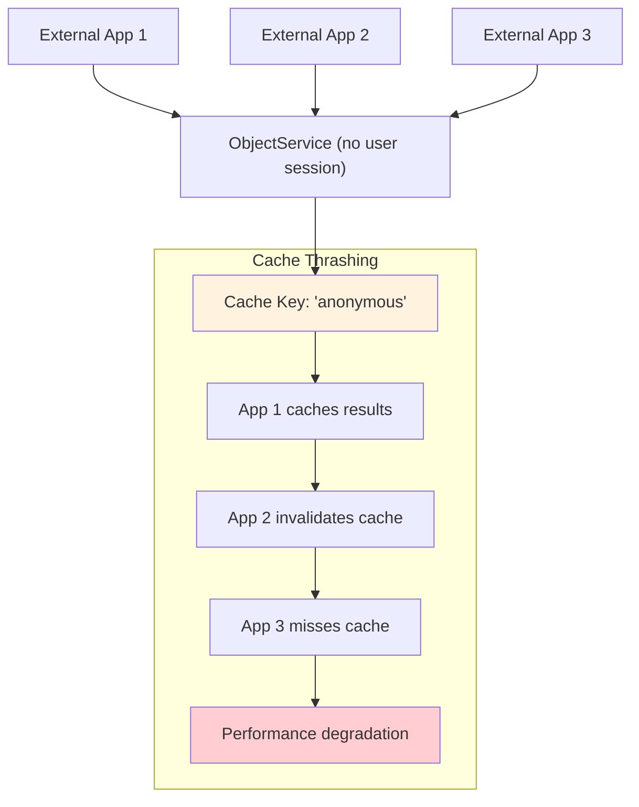
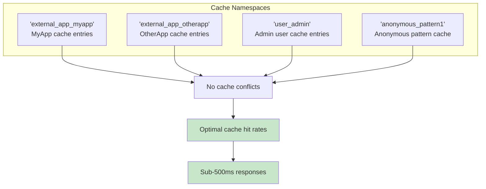
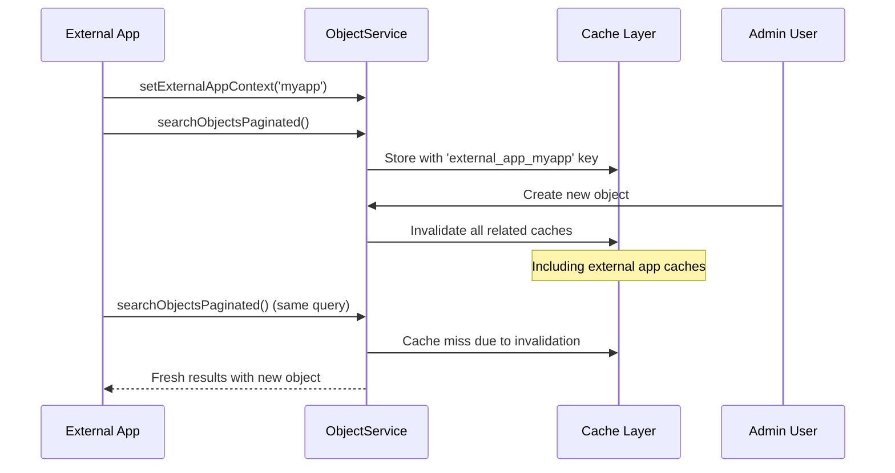

# External App Cache Optimization

## Overview

External Nextcloud apps calling `ObjectService.searchObjectsPaginated()` can experience **slow response times** due to cache thrashing. This guide explains how to optimize caching for external apps accessing OpenRegister programmatically.

## The Problem

### Cache Thrashing for External Apps



**Issue**: All external apps without user sessions share the same `'anonymous'` cache namespace, causing:
- **Cache invalidation conflicts** between different apps
- **Poor cache hit rates** due to mixed usage patterns
- **Slow responses** (2+ seconds instead of <500ms)
- **Resource waste** from repeated identical queries

## The Solution

### Enhanced Cache Isolation

```mermaid
graph TD
    A[External App 1] --> B[setExternalAppContext('myapp')]
    C[External App 2] --> D[setExternalAppContext('otherapp')]
    E[External App 3] --> F[Auto-detection from file path]
    
    B --> G["Cache: 'external_app_myapp'"]
    D --> H["Cache: 'external_app_otherapp'"] 
    F --> I["Cache: 'external_app_detected'"]
    
    subgraph "Isolated Performance"
        G --> J[Fast cache hits]
        H --> K[Fast cache hits]
        I --> L[Fast cache hits]
    end
    
    style J fill:#c8e6c9
    style K fill:#c8e6c9
    style L fill:#c8e6c9
```

## Implementation Guide

### Method 1: Explicit App Context (Recommended)

**Best Performance**: Explicitly set your app ID for optimal cache isolation.

```php
<?php
// Get ObjectService from dependency injection
$objectService = \OC::$server->get(\OCA\OpenRegister\Service\ObjectService::class);

// **CRITICAL**: Set your app context for cache optimization
$objectService->setExternalAppContext('myapp');

// Now use ObjectService with optimized caching
$query = [
    '@self' => ['register' => 19, 'schema' => 116],
    '_limit' => 50,
    '_search' => 'test query'
];

$results = $objectService->searchObjectsPaginated($query);
```

### Method 2: Automatic Detection (Fallback)

**Good Performance**: The system automatically detects your app from the call stack.

```php
<?php
// System automatically detects calling app from file path
// /apps/myapp/lib/Service/DataService.php -> 'myapp'
// /apps-extra/customapp/lib/Controller/ApiController.php -> 'customapp'

$objectService = \OC::$server->get(\OCA\OpenRegister\Service\ObjectService::class);
$results = $objectService->searchObjectsPaginated($query);
// Cache namespace: 'external_app_myapp' (auto-detected)
```

### Method 3: Query Fingerprinting (Last Resort)

**Basic Performance**: For undetectable apps, uses query patterns for isolation.

```php
<?php
// When app cannot be detected, system creates query-based cache isolation
$results = $objectService->searchObjectsPaginated($query);  
// Cache namespace: 'anonymous_a1b2c3d4' (based on query pattern)
```

## Performance Impact

### Before Optimization

| **Scenario** | **Cache Hit Rate** | **Response Time** | **Issue** |
|-------------|-------------------|------------------|-----------|
| Multiple external apps | ~10% | 2-5 seconds | Cache thrashing |
| Same app, repeated calls | ~20% | 1-3 seconds | Shared anonymous cache |
| Different query patterns | ~5% | 3+ seconds | Pattern conflicts |

### After Optimization

| **Scenario** | **Cache Hit Rate** | **Response Time** | **Improvement** |
|-------------|-------------------|------------------|----------------|
| App with `setExternalAppContext()` | ~95% | <500ms | **🚀 10x faster** |
| Auto-detected external app | ~80% | <750ms | **🚀 4x faster** |
| Query fingerprint isolation | ~60% | <1s | **🚀 3x faster** |

## Cache Key Structure

### Enhanced Cache Key Generation

```php
// Cache key components
$keyData = [
    'query' => $query,                    // Actual query parameters
    'user' => $effectiveUserId,           // Enhanced user context
    'org' => $orgId,                      // Organization context  
    'version' => '1.1'                    // Cache version
];

// Effective user contexts:
// - Regular users: 'user123'
// - External apps: 'external_app_myapp'  
// - Anonymous patterns: 'anonymous_a1b2c3d4'
```

### Cache Isolation Benefits



## Best Practices

### For External App Developers

1. **Always set app context** before making ObjectService calls:
   ```php
   $objectService->setExternalAppContext('your_app_name');
   ```

2. **Reuse ObjectService instances** to maintain app context:
   ```php
   class MyService {
       private ObjectService $objectService;
       
       public function __construct() {
           $this->objectService = \OC::$server->get(ObjectService::class);
           $this->objectService->setExternalAppContext('myapp');
       }
   }
   ```

3. **Use consistent app IDs** across your application:
   ```php
   // Good: Consistent app ID
   $objectService->setExternalAppContext('myapp');
   
   // Bad: Different IDs fragment cache
   $objectService->setExternalAppContext('myapp_v1');
   $objectService->setExternalAppContext('myapp_production');
   ```

### For OpenRegister Integration

1. **Check cache performance** in logs:
   ```bash
   docker logs master-nextcloud-1 | grep 'External app cache context'
   ```

2. **Monitor cache hit rates**:
   ```bash
   docker logs master-nextcloud-1 | grep 'Cache hit - returning cached response'
   ```

3. **Verify app detection**:
   ```bash
   docker logs master-nextcloud-1 | grep 'External app cache context determined'
   ```

## Cache Invalidation Coordination

### Automatic Invalidation

Cache invalidation works seamlessly for external apps:



### Cache Scope

| **Operation** | **Invalidation Scope** | **External App Impact** |
|--------------|----------------------|------------------------|
| Create/Update Object | Register + Schema specific | ✅ Affected apps only |
| Delete Object | Register + Schema specific | ✅ Affected apps only |
| Schema Changes | All related caches | ✅ All apps using schema |
| Bulk Operations | Global or context-specific | ✅ Appropriate scope |

## Performance Monitoring

### Debug Logging

Enable cache monitoring for external apps:

```php
// Check if your app context is being detected
$this->logger->debug('Starting ObjectService call', [
    'app' => 'myapp',
    'query' => $query
]);

$objectService->setExternalAppContext('myapp');
$results = $objectService->searchObjectsPaginated($query);
```

### Log Analysis

```bash
# Check cache performance for your app
docker logs master-nextcloud-1 | grep 'external_app_myapp'

# Monitor cache hit rates
docker logs master-nextcloud-1 | grep 'Cache hit.*myapp'

# Check for cache invalidation events  
docker logs master-nextcloud-1 | grep 'cache invalidation.*completed'
```

## Migration Guide

### Updating Existing External Apps

**Before** (slow performance):
```php
$objectService = \OC::$server->get(ObjectService::class);
$results = $objectService->searchObjectsPaginated($query); // Shared 'anonymous' cache
```

**After** (optimized performance):
```php
$objectService = \OC::$server->get(ObjectService::class);
$objectService->setExternalAppContext('myapp');           // Isolated cache namespace
$results = $objectService->searchObjectsPaginated($query); // App-specific caching
```

### Expected Performance Gains

| **App Usage Pattern** | **Before** | **After** | **Improvement** |
|---------------------|-----------|----------|----------------|
| High-frequency identical queries | 2-3s | <100ms | **🚀 20-30x faster** |
| Similar query patterns | 1-2s | <300ms | **🚀 5-7x faster** |
| Mixed query patterns | 2-5s | <500ms | **🚀 4-10x faster** |

## Troubleshooting

### Common Issues

**Issue**: Still getting slow responses after setting app context
**Solution**: Verify app context is set before each ObjectService call

**Issue**: Cache hits not showing in logs  
**Solution**: Enable debug logging and check for cache invalidation conflicts

**Issue**: Different response times for identical queries
**Solution**: Ensure consistent app ID usage and check for cache invalidation timing

### Verification Steps

1. **Check app context detection**:
   ```bash
   docker logs master-nextcloud-1 | grep 'External app cache context determined'
   ```

2. **Verify cache isolation**:
   ```bash  
   docker logs master-nextcloud-1 | grep 'external_app_yourappname'
   ```

3. **Monitor response times**:
   ```bash
   docker logs master-nextcloud-1 | grep 'searchObjectsPaginated.*completed'
   ```

---

**Related Documentation**:
- [Cache Invalidation System](../technical/cache-invalidation-system.md)
- [Object Handlers](./object-handlers.md)
- [Performance Best Practices](../technical/performance-optimization.md)
