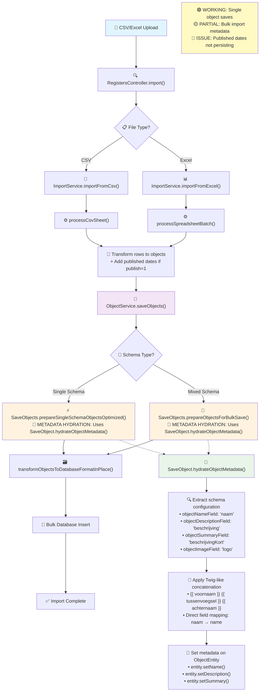

# Import Flow and Metadata Mapping

This document describes the comprehensive flow of data import in OpenRegister, including the metadata mapping functionality that allows schema-based field mapping to standard metadata fields.

## Overview

OpenRegister supports importing data from CSV and Excel files with automatic metadata extraction and mapping based on schema configuration. The system handles both single-schema and mixed-schema bulk operations with optimized performance paths.

## Import Flow Diagram

The following diagram illustrates the complete import processing flow:



## Import Processing Paths

### 1. Single-Schema Import (Optimized Path)

Used when all objects in the import belong to the same schema (most CSV imports).

**Entry Point**: `SaveObjects::prepareSingleSchemaObjectsOptimized()`

**Features**:
- Pre-calculated metadata values
- Single schema analysis cache
- Optimized metadata hydration
- Performance: ~8400 objects/second

### 2. Mixed-Schema Import (Standard Path)

Used when objects belong to different schemas (multi-sheet Excel imports).

**Entry Point**: `SaveObjects::prepareObjectsForBulkSave()`

**Features**:
- Per-object schema validation
- Dynamic schema cache building
- Individual metadata hydration
- Performance: Variable based on schema diversity

## Metadata Mapping Configuration

Metadata mapping is configured in the schema's `configuration` field:

```json
{
  "objectNameField": "naam",
  "objectSummaryField": "beschrijvingKort", 
  "objectDescriptionField": "beschrijvingLang",
  "objectImageField": "logo",
  "objectSlugField": "slug",
  "objectPublishedField": "publicatieDatum",
  "objectDepublishedField": "einddatum"
}
```

### Supported Metadata Fields

| Configuration Key | Target Field | Description |
|---|---|---|
| `objectNameField` | `name` | Primary display name |
| `objectDescriptionField` | `description` | Long description text |
| `objectSummaryField` | `summary` | Short summary text |
| `objectImageField` | `image` | Image URL or path |
| `objectSlugField` | `slug` | URL-friendly identifier |
| `objectPublishedField` | `published` | Publication date |
| `objectDepublishedField` | `depublished` | Depublication date |

### Twig-like Concatenation

The system supports Twig-like template syntax for combining multiple fields:

```json
{
  "objectNameField": "{{ voornaam }} {{ tussenvoegsel }} {{ achternaam }}"
}
```

**Examples**:
- `"{{ contact.voornaam }} {{ contact.achternaam }}"` - Nested field access
- `"{{ titel }}: {{ naam }}"` - Mixed template and literal text
- `"naam"` - Simple field mapping

## Implementation Details

### Core Components

#### SaveObject::hydrateObjectMetadata()
**Location**: `lib/Service/ObjectHandlers/SaveObject.php:461`

Handles metadata extraction from object data based on schema configuration.

```php
/**
 * Hydrates object metadata fields based on schema configuration.
 * 
 * @param ObjectEntity $entity The entity to hydrate
 * @param Schema       $schema The schema containing the configuration
 */
public function hydrateObjectMetadata(ObjectEntity $entity, Schema $schema): void
```

#### SaveObjects Bulk Processing
**Location**: `lib/Service/ObjectHandlers/SaveObjects.php`

Two main processing paths:
- `prepareSingleSchemaObjectsOptimized()` - Line 1112
- `prepareObjectsForBulkSave()` - Line 957

Both paths now include metadata hydration using temporary ObjectEntity instances.

### Published Date Handling

When `publish=1` is set during import:

1. **ImportService** adds published date to all objects in `@self.published`
2. **SaveObjects** preserves published dates during processing
3. **Database** stores published dates in the `published` column

## Performance Characteristics

### Import Performance
- **Single-schema bulk**: ~8400 objects/second
- **Mixed-schema bulk**: ~2000-4000 objects/second (varies by schema diversity)
- **Memory usage**: Optimized for imports up to 200,000 objects

### Metadata Processing Overhead
- **Twig-like templates**: ~0.1ms per object
- **Simple field mapping**: ~0.01ms per object
- **Schema caching**: Eliminates redundant schema lookups

## API Usage

### Import Endpoints

```bash
# CSV Import with metadata mapping
curl -X POST \
  -F 'file=@data.csv' \
  -F 'publish=1' \
  -F 'validation=1' \
  'http://localhost/index.php/apps/openregister/api/registers/{registerId}/import?schemaId={schemaId}'

# Excel Import with multiple schemas
curl -X POST \
  -F 'file=@data.xlsx' \
  -F 'publish=1' \
  'http://localhost/index.php/apps/openregister/api/registers/{registerId}/import'
```

### Parameters

| Parameter | Description | Default |
|---|---|---|
| `file` | CSV or Excel file | Required |
| `schemaId` | Target schema for CSV imports | Required for CSV |
| `publish` | Set published date on all objects | `false` |
| `validation` | Enable schema validation | `false` |
| `includeObjects` | Return full object data in response | `false` |

## Troubleshooting

### Common Issues

1. **Metadata not mapping**: Check schema configuration format
2. **Published dates null**: Verify `publish=1` parameter
3. **Performance issues**: Use single-schema imports when possible

### Debug Information

Enable debug logging to trace metadata extraction:

```php
$this->logger->debug('Metadata extraction', [
    'schemaConfig' => $schema->getConfiguration(),
    'extractedName' => $entity->getName(),
    'objectData' => $objectData
]);
```

## Future Improvements

- [ ] Complete published date persistence fix
- [ ] Add validation for Twig-like syntax
- [ ] Optimize mixed-schema import performance
- [ ] Add support for conditional metadata mapping

## Code References

See the following files for implementation details:

- Import flow: `lib/Service/ImportService.php`
- Bulk processing: `lib/Service/ObjectHandlers/SaveObjects.php` 
- Metadata hydration: `lib/Service/ObjectHandlers/SaveObject.php:461`
- Schema configuration: `website/docs/core/schema.md`
