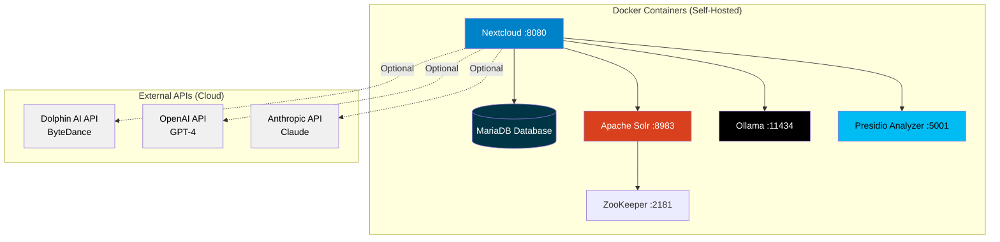

# Docker Services - Quick Reference

## Services Included in docker-compose.yml

### ✅ Verified Services

| Service | Status | Port | Purpose | Required |
|---------|--------|------|---------|----------|
| **Nextcloud** | ✅ Included | 8080 | Application server | Yes |
| **MariaDB** | ✅ Included | Internal | Database storage | Yes |
| **Solr** | ✅ Included | 8983 | Full-text search | Yes |
| **ZooKeeper** | ✅ Included (prod) | 2181 | Solr coordination | Production only |
| **Ollama** | ✅ Included | 11434 | Local LLM (custom API) | Optional |
| **Presidio Analyzer** | ✅ Included | 5001 | NER/PII detection | Optional |
| **TGI/vLLM** | ✅ Available (separate compose) | 8081/8082 | Local LLM (OpenAI API) | Optional |

### 📝 Optional API Services (Separate Deployment Required)

These services are accessed via API and require separate deployment or external service:

| Service | Type | Purpose | Deployment |
|---------|------|---------|------------|
| **Dolphin** | Self-hosted API (optional) | Document parsing, OCR, layout analysis | Requires custom container setup |
| **OpenAI** | External API | GPT-4 for LLM tasks | Cloud service |
| **Anthropic** | External API | Claude for LLM tasks | Cloud service |

**Note**: [Dolphin](https://github.com/bytedance/Dolphin) is an open-source document image parsing model (0.3B parameters) that can be self-hosted. While there's no official Docker image, it can be containerized using Hugging Face Inference Toolkit. It's used as an alternative to local LLPhant for complex document extraction with advanced OCR and layout analysis.

## Service Architecture



## Quick Start

### Start All Services

```bash
cd /path/to/openregister

# Production mode
docker-compose up -d

# Development mode
docker-compose -f docker-compose.dev.yml up -d
```

### Check Status

```bash
# List all running services
docker-compose ps

# Check specific service
curl http://localhost:8080  # Nextcloud
curl http://localhost:8983/solr/  # Solr
curl http://localhost:11434/api/tags  # Ollama
curl http://localhost:5001/health  # Presidio
```

## Service Details

### 1. Solr ✅ (Included)

**Purpose**: Full-text search engine for objects and files  
**Port**: 8983  
**Image**: `solr:9-slim`

**Configuration**:
- Production: SolrCloud mode with ZooKeeper
- Development: Standalone mode

**Access**: http://localhost:8983/solr/

### 2. Ollama ✅ (Included)

**Purpose**: Local LLM for AI features (chat, RAG, entity extraction)  
**Port**: 11434  
**Image**: `ollama/ollama:latest`

**Features**:
- Privacy-first (runs locally)
- Supports llama3.2, mistral, qwen, gemma, phi
- GPU acceleration (NVIDIA)

**Pull Models**:
```bash
docker exec openregister-ollama ollama pull llama3.2
docker exec openregister-ollama ollama list
```

### 3. Presidio Analyzer ✅ (Included)

**Purpose**: Named Entity Recognition (NER) and PII detection  
**Port**: 5001  
**Image**: `mcr.microsoft.com/presidio-analyzer:latest`

**Features**:
- Multi-language support (Dutch, English, German, French, Spanish)
- 90-98% accuracy for entity detection
- GDPR-focused PII detection
- Detects: persons, emails, phones, addresses, IBANs, BSN, etc.

**Dutch Language Support**: ✅ Automatic (downloads nl_core_news_sm on first startup)

**Test Dutch Detection**:
```bash
curl -X POST http://localhost:5001/analyze \
  -H "Content-Type: application/json" \
  -d '{
    "text": "Jan de Vries woont in Amsterdam en zijn email is jan.devries@example.nl",
    "language": "nl"
  }'
```

### 4. Dolphin (Optional, Separate Deployment)

**Purpose**: Advanced document parsing with OCR and layout analysis  
**Type**: Open-source self-hosted API (requires separate setup)  
**Repository**: [github.com/bytedance/Dolphin](https://github.com/bytedance/Dolphin)

**Capabilities**:
- Document image parsing (PDF, images)
- Advanced OCR (scanned documents, photos)
- Layout analysis (reading order detection)
- Table and formula extraction
- Multi-language support

**Deployment Options**:

1. **Custom Docker Container** (Recommended):
   - Build using Hugging Face Inference Toolkit
   - Deploy as API service
   - Configure OpenRegister to use API endpoint

2. **Replicate Cloud**:
   - Use Replicate's hosted version
   - API-based access

3. **Manual Python Deployment**:
   - Install via pip requirements
   - Run as Python service

**Integration with OpenRegister**:
1. Deploy Dolphin as API service (e.g., http://dolphin:5000)
2. Configure in Nextcloud: Settings > OpenRegister > Text Extraction
3. Set Dolphin API endpoint
4. Select "Dolphin" as extraction method

**Note**: Dolphin is optional. For simpler setups, use LLPhant (local PHP library). For privacy-critical data, avoid external deployments or ensure Dolphin runs in your infrastructure.

## Dutch Language Support

### Services with Dutch Support

| Service | Dutch Support | Notes |
|---------|---------------|-------|
| **Presidio** | ✅ Excellent | Automatic model download |
| **Ollama** | ✅ Good | With multilingual models (llama3.2) |
| **Solr** | ✅ Good | Dutch language analyzer configured |
| **Dolphin** | ✅ Excellent | Native multi-language support |

### Presidio Dutch Setup

**No manual setup required!** The Dutch language model downloads automatically on first startup.

See detailed guide: [Presidio Setup for Dutch Language](./presidio-setup.md)

## Privacy Comparison

### Self-Hosted (Docker) - Maximum Privacy

- ✅ Solr - All data stays local
- ✅ Ollama - All processing local
- ✅ Presidio - Self-hosted, no data leaves your server

**Use for**: Privacy-critical data, GDPR compliance, internal documents

### External APIs - Best Accuracy

- ⚠️ Dolphin - Data sent to ByteDance API
- ⚠️ OpenAI - Data sent to OpenAI
- ⚠️ Anthropic - Data sent to Anthropic

**Use for**: Non-sensitive content, when accuracy is paramount, public data

**Recommendation**: Use self-hosted services (Ollama + Presidio) for sensitive data. Use external APIs only for non-sensitive content.

## Resource Requirements

### With All Self-Hosted Services

**Development**:
- CPU: 4 cores
- RAM: 10GB
- Disk: 20GB

**Production**:
- CPU: 8 cores
- RAM: 16GB (24GB with Ollama large models)
- Disk: 100GB+

### Minimal Setup (Without AI)

If you don't need AI/NER features:
- CPU: 2 cores
- RAM: 4GB
- Disk: 10GB

**Services**: Nextcloud + MariaDB + Solr only

## Troubleshooting

### Service Won't Start

```bash
# Check logs
docker-compose logs [service-name]

# Restart specific service
docker-compose restart [service-name]

# Rebuild
docker-compose up -d --force-recreate [service-name]
```

### Port Already in Use

```bash
# Check which process uses the port
sudo lsof -i :8080  # Nextcloud
sudo lsof -i :8983  # Solr
sudo lsof -i :11434 # Ollama
sudo lsof -i :5001  # Presidio

# Change port in docker-compose.yml if needed
```

### Presidio Dutch Model Not Downloading

```bash
# Manually download
docker exec -it openregister-presidio-analyzer \
  python -m spacy download nl_core_news_sm

# Verify
docker exec -it openregister-presidio-analyzer \
  python -m spacy info nl_core_news_sm
```

## Configuration Files

- **Production**: `docker-compose.yml`
- **Development**: `docker-compose.dev.yml`
- **Ollama-specific**: `docker-compose.ollama.yml` (alternative config)

## OpenAI-Compatible Local LLM

**NEW**: You can now run Mistral and other Hugging Face models with an **OpenAI-compatible API** using **TGI** or **vLLM**:

```bash
# Start TGI with Mistral (OpenAI-compatible API)
docker-compose -f docker-compose.huggingface.yml up -d tgi-mistral

# Test OpenAI-compatible endpoint
curl http://localhost:8081/v1/chat/completions \
  -H "Content-Type: application/json" \
  -d '{"model": "mistral", "messages": [{"role": "user", "content": "Hello!"}]}'
```

**Benefits**:
- ✅ Works with LLPhant (PHP OpenAI client)
- ✅ Drop-in replacement for OpenAI API
- ✅ Privacy-first (100% local)
- ✅ No API costs

See [Hugging Face TGI Setup](./huggingface-tgi-setup.md) for complete guide.

## Related Documentation

- [Presidio Setup for Dutch](./presidio-setup.md) - Detailed Presidio configuration
- [Docker Services Overview](./docker-services.md) - Complete service documentation
- [Hugging Face TGI Setup](./huggingface-tgi-setup.md) - OpenAI-compatible local LLM
- [NER & NLP Concepts](../features/ner-nlp-concepts.md) - Understanding entity recognition
- [Text Extraction](../features/text-extraction-enhanced.md) - File processing pipeline

---

**Quick Answer**: ✅ Yes, Solr, Ollama, and Presidio are included in docker-compose. TGI/vLLM available via separate docker-compose file for OpenAI-compatible API. Dolphin requires separate deployment (custom container).

