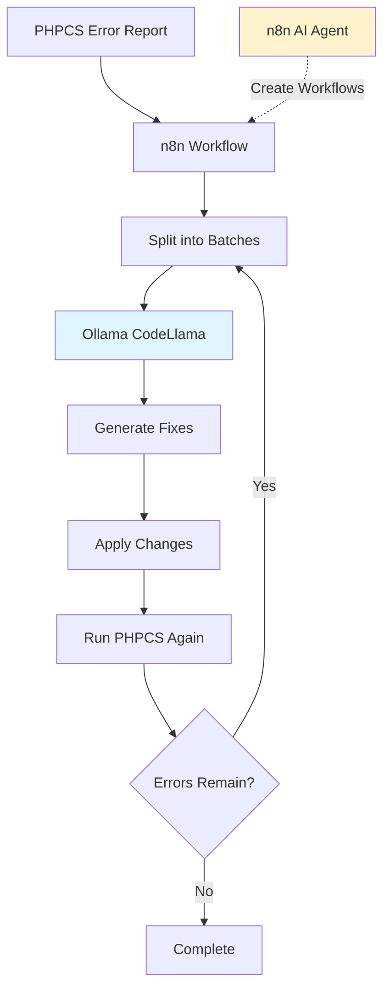
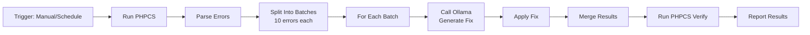
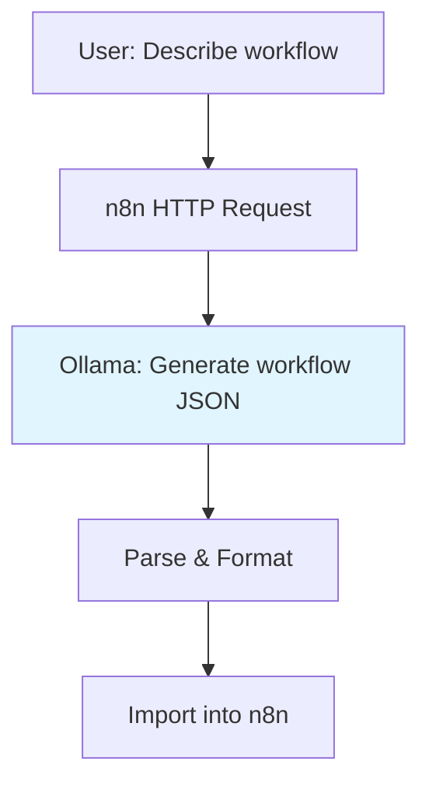

# Automated PHPCS Error Fixing with n8n and Ollama

## Overview

This guide sets up an automated workflow using n8n and Ollama to fix PHPCS errors in bulk, avoiding the need for constant "continue?" prompts.

## Architecture



## Step 1: Enable n8n Profile

```bash
# Start with n8n profile
docker-compose --profile n8n up -d

# Verify n8n is running
curl http://localhost:5678/healthz
```

## Step 2: Install Code-Specific Models in Ollama

### Recommended Models for Code Fixing

```bash
# CodeLlama 7B (Best for PHP/general code)
docker exec openregister-ollama ollama pull codellama:7b-instruct

# DeepSeek Coder 6.7B (Excellent for code understanding)
docker exec openregister-ollama ollama pull deepseek-coder:6.7b-instruct

# Phind CodeLlama 34B (Best quality, needs more RAM)
docker exec openregister-ollama ollama pull phind-codellama:34b-v2

# StarCoder 7B (Alternative)
docker exec openregister-ollama ollama pull starcoder:7b
```

**Recommended for PHPCS:** `codellama:7b-instruct` (good balance of speed and quality)

### Verify Models

```bash
docker exec openregister-ollama ollama list
```

## Step 3: Configure Continue.dev (Optional)

If you want to use Continue.dev in your IDE alongside n8n:

### Install Continue Extension

1. **VS Code/Cursor**: Install "Continue" extension
2. **Configure** `~/.continue/config.json`:

```json
{
  "models": [
    {
      "title": "CodeLlama Ollama",
      "provider": "ollama",
      "model": "codellama:7b-instruct",
      "apiBase": "http://localhost:11434"
    }
  ],
  "tabAutocompleteModel": {
    "title": "StarCoder",
    "provider": "ollama",
    "model": "starcoder:7b",
    "apiBase": "http://localhost:11434"
  }
}
```

## Step 4: Set Up n8n Workflow for PHPCS Fixing

### Access n8n

1. Open: http://localhost:5678
2. Login: admin / admin
3. Create new workflow

### Install Required n8n Nodes

n8n has these useful nodes for this task:
- **Code Node** - Execute JavaScript/Python
- **HTTP Request** - Call Ollama API
- **Execute Command** - Run shell commands
- **Split In Batches** - Process errors in chunks
- **Merge** - Combine results

### Workflow Design



### Example n8n Workflow JSON

Create a new workflow in n8n and import this:

```json
{
  "name": "PHPCS Auto-Fixer",
  "nodes": [
    {
      "parameters": {},
      "name": "Manual Trigger",
      "type": "n8n-nodes-base.manualTrigger",
      "typeVersion": 1,
      "position": [250, 300]
    },
    {
      "parameters": {
        "command": "cd /var/www/html/custom_apps/openregister && composer phpcs -- --report=json"
      },
      "name": "Run PHPCS",
      "type": "n8n-nodes-base.executeCommand",
      "typeVersion": 1,
      "position": [450, 300]
    },
    {
      "parameters": {
        "functionCode": "// Parse PHPCS JSON output\\nconst phpcsOutput = JSON.parse($input.item.json.stdout);\\nconst errors = [];\\n\\nfor (const file in phpcsOutput.files) {\\n  const fileData = phpcsOutput.files[file];\\n  fileData.messages.forEach(msg => {\\n    if (msg.type === 'ERROR') {\\n      errors.push({\\n        file: file,\\n        line: msg.line,\\n        column: msg.column,\\n        message: msg.message,\\n        source: msg.source\\n      });\\n    }\\n  });\\n}\\n\\nreturn errors.map(error => ({ json: error }));"
      },
      "name": "Parse Errors",
      "type": "n8n-nodes-base.code",
      "typeVersion": 1,
      "position": [650, 300]
    },
    {
      "parameters": {
        "batchSize": 10,
        "options": {}
      },
      "name": "Split Errors",
      "type": "n8n-nodes-base.splitInBatches",
      "typeVersion": 1,
      "position": [850, 300]
    },
    {
      "parameters": {
        "url": "http://ollama:11434/api/generate",
        "method": "POST",
        "jsonParameters": true,
        "options": {},
        "bodyParametersJson": "={\\n  \\"model\\": \\"codellama:7b-instruct\\",\\n  \\"prompt\\": \\"Fix this PHP code style error:\\\\n\\\\nFile: {{ $json.file }}\\\\nLine: {{ $json.line }}\\\\nError: {{ $json.message }}\\\\n\\\\nProvide ONLY the corrected code without explanation.\\",\\n  \\"stream\\": false\\n}"
      },
      "name": "Call Ollama",
      "type": "n8n-nodes-base.httpRequest",
      "typeVersion": 3,
      "position": [1050, 300]
    },
    {
      "parameters": {
        "functionCode": "// Apply the fix suggested by Ollama\\nconst fix = JSON.parse($input.item.json.body).response;\\nconst file = $input.item.json.file;\\nconst line = $input.item.json.line;\\n\\n// Read file, apply fix, write back\\n// This is a simplified example\\nreturn [{ json: { file, line, fix, applied: true } }];"
      },
      "name": "Apply Fix",
      "type": "n8n-nodes-base.code",
      "typeVersion": 1,
      "position": [1250, 300]
    }
  ],
  "connections": {
    "Manual Trigger": {
      "main": [[{ "node": "Run PHPCS", "type": "main", "index": 0 }]]
    },
    "Run PHPCS": {
      "main": [[{ "node": "Parse Errors", "type": "main", "index": 0 }]]
    },
    "Parse Errors": {
      "main": [[{ "node": "Split Errors", "type": "main", "index": 0 }]]
    },
    "Split Errors": {
      "main": [[{ "node": "Call Ollama", "type": "main", "index": 0 }]]
    },
    "Call Ollama": {
      "main": [[{ "node": "Apply Fix", "type": "main", "index": 0 }]]
    }
  }
}
```

## Step 5: Use AI in n8n for Creating Flows

### Yes! n8n Has AI Capabilities

n8n supports AI in two ways:

#### 1. AI Agent Node (n8n Cloud/Self-hosted with OpenAI)

For creating workflows with AI assistance, you can:

```bash
# Use n8n's AI features with Ollama through the API
# n8n can call Ollama to help generate workflow logic
```

#### 2. Custom AI Integration

You can create workflows that use AI to help build other workflows:

**Workflow Creator Workflow:**



### Example: AI-Assisted Workflow Creation

Create this workflow in n8n:

**Name:** "AI Workflow Builder"

**Nodes:**
1. **Webhook Trigger** - Receives workflow description
2. **HTTP Request to Ollama** - Generates workflow
3. **Code Node** - Formats response
4. **HTTP Request to n8n API** - Creates workflow

```javascript
// Code Node: Generate Workflow with Ollama
const description = $input.item.json.description;

const prompt = `You are an n8n workflow expert. Create a workflow JSON for this requirement:

${description}

Return ONLY valid n8n workflow JSON with nodes and connections.`;

// Call Ollama
const response = await $http.request({
  method: 'POST',
  url: 'http://ollama:11434/api/generate',
  body: {
    model: 'codellama:7b-instruct',
    prompt: prompt,
    stream: false
  }
});

return [{ json: { workflow: response.response } }];
```

## Step 6: Complete PHPCS Fixing Workflow

Here's a production-ready workflow:

```javascript
// Complete PHPCS Auto-Fixer Workflow

// Node 1: Get PHPCS Errors
const phpcsCommand = 'docker exec -u 33 nextcloud php /var/www/html/custom_apps/openregister/vendor/bin/phpcs --report=json --standard=/var/www/html/custom_apps/openregister/phpcs.xml /var/www/html/custom_apps/openregister/lib';

// Node 2: Parse and Prioritize
const parseErrors = (phpcsJson) => {
  const errors = [];
  for (const file in phpcsJson.files) {
    phpcsJson.files[file].messages.forEach(msg => {
      if (msg.type === 'ERROR') {
        errors.push({
          file: file,
          line: msg.line,
          code: msg.source,
          message: msg.message,
          severity: msg.severity
        });
      }
    });
  }
  // Sort by severity
  return errors.sort((a, b) => b.severity - a.severity);
};

// Node 3: Generate Fix with Ollama
const generateFix = async (error) => {
  const prompt = `Fix this PHP coding standard error:

File: ${error.file}
Line: ${error.line}
Error: ${error.message}
Code: ${error.code}

Read the file, fix ONLY this error, and provide the corrected code segment.
Include 3 lines of context before and after the fix.`;

  const response = await fetch('http://ollama:11434/api/generate', {
    method: 'POST',
    headers: { 'Content-Type': 'application/json' },
    body: JSON.stringify({
      model: 'codellama:7b-instruct',
      prompt: prompt,
      stream: false,
      options: {
        temperature: 0.1,  // Low temperature for consistent fixes
        top_p: 0.9
      }
    })
  });
  
  return response.json();
};

// Node 4: Apply Fix
const applyFix = (file, lineNumber, fixedCode) => {
  // Read file
  // Apply fix at line number
  // Write file
  // Return success/failure
};

// Node 5: Verify
const verifyFix = async (file) => {
  // Run PHPCS on just this file
  // Return true if error is fixed
};
```

## Step 7: Run the Workflow

### Manual Execution

1. Open n8n: http://localhost:5678
2. Open your workflow
3. Click "Execute Workflow"
4. Monitor progress in real-time

### Scheduled Execution

Add a Cron trigger:
```
0 2 * * *  # Run every night at 2 AM
```

### Webhook Execution

Trigger from external sources:
```bash
curl -X POST http://localhost:5678/webhook/phpcs-fix \\
  -H "Content-Type: application/json" \\
  -d '{"directory": "lib/Controller"}'
```

## Best Practices

### 1. Batch Processing

Process 10-20 errors at a time:
```javascript
{
  "batchSize": 10,
  "options": {
    "reset": false
  }
}
```

### 2. Error Handling

Add error handling nodes:
```javascript
// Retry on failure
{
  "retryOnFail": true,
  "maxTries": 3,
  "waitBetweenTries": 5000
}
```

### 3. Logging

Log all fixes for review:
```javascript
// Log to file
const logFix = (file, error, fix) => {
  const log = {
    timestamp: new Date().toISOString(),
    file: file,
    error: error,
    fix: fix
  };
  // Append to log file
};
```

### 4. Verification

Always verify fixes:
```javascript
// After applying fixes, run PHPCS again
const verify = async () => {
  const result = await runPHPCS();
  if (result.errorCount < originalErrorCount) {
    return 'improved';
  }
  return 'no-change';
};
```

## Model Selection for Different Tasks

| Task | Recommended Model | Why |
|------|------------------|-----|
| **PHPCS Fixes** | `codellama:7b-instruct` | Fast, understands PHP |
| **Complex Refactoring** | `phind-codellama:34b` | Better understanding |
| **Docblock Generation** | `codellama:7b-instruct` | Quick, accurate |
| **Workflow Creation** | `codellama:13b-instruct` | Better reasoning |
| **Code Review** | `deepseek-coder:6.7b` | Excellent analysis |

## Troubleshooting

### Ollama Connection Issues

```bash
# Test Ollama from n8n container
docker exec openregister-n8n curl http://ollama:11434/api/tags

# If fails, check network
docker network inspect openregister_default
```

### Model Not Found

```bash
# List available models
docker exec openregister-ollama ollama list

# Pull missing model
docker exec openregister-ollama ollama pull codellama:7b-instruct
```

### n8n Workflow Errors

Check n8n logs:
```bash
docker logs openregister-n8n -f
```

## Advanced: AI-Powered Workflow Builder

Create a "meta-workflow" that uses AI to build workflows:

```javascript
// Workflow: "Create Workflow from Description"

// Input: Natural language description
const description = "Create a workflow that monitors GitHub issues and sends Slack notifications";

// Generate with Ollama
const workflowJson = await generateWorkflow(description);

// Import into n8n
const result = await n8n.createWorkflow(workflowJson);
```

## Example Prompts for Ollama

### For PHPCS Fixing

```
You are a PHP coding standards expert. Fix this PHPCS error:

File: lib/Controller/ObjectsController.php
Line: 145
Error: Method name "Get_objects" is not in camel caps format
Code: PSR1.Methods.CamelCapsMethodName.NotCamelCaps

Provide the corrected method name and update any calls to this method.
```

### For Workflow Creation

```
Create an n8n workflow that:
1. Reads PHPCS errors from a JSON file
2. Groups errors by file
3. For each file, generates fixes using Ollama
4. Applies fixes and commits to git
5. Sends a summary email

Return valid n8n workflow JSON.
```

## Performance Tips

### 1. Use Streaming for Large Files

```javascript
{
  "stream": true,  // Get responses progressively
  "options": {
    "num_predict": 500  // Limit response length
  }
}
```

### 2. Parallel Processing

Process multiple files in parallel:
```javascript
{
  "mode": "allInputsFirstInput",
  "maxConnections": 5
}
```

### 3. Caching

Cache common fixes:
```javascript
const fixCache = new Map();
const cacheKey = `${error.code}-${error.message}`;
if (fixCache.has(cacheKey)) {
  return fixCache.get(cacheKey);
}
```

## Next Steps

1. **Start Simple**
   ```bash
   docker-compose --profile n8n up -d
   docker exec openregister-ollama ollama pull codellama:7b-instruct
   ```

2. **Create Basic Workflow**
   - Import the example workflow
   - Test with a few errors
   - Verify results

3. **Expand**
   - Add more error types
   - Improve prompts
   - Add verification

4. **Automate**
   - Schedule nightly runs
   - Integrate with CI/CD
   - Auto-commit fixes

## Summary

✅ **n8n** provides workflow orchestration  
✅ **Ollama** provides AI code understanding  
✅ **CodeLlama** is best for PHP/code fixes  
✅ **Batch processing** avoids "continue?" prompts  
✅ **AI can help create n8n workflows** too!  

This setup lets you fix hundreds of PHPCS errors automatically overnight! 🎉


