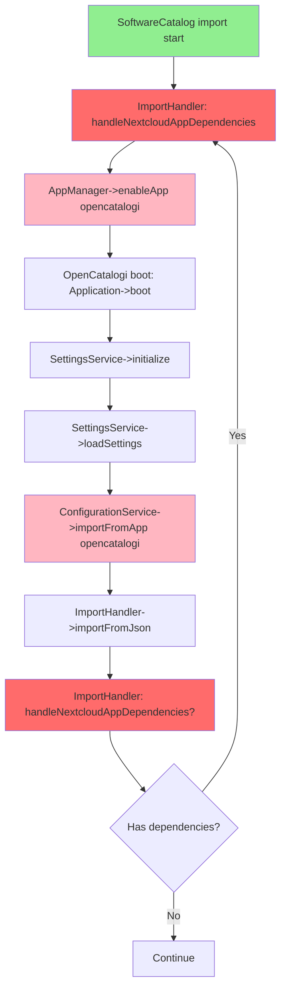

# Circular Dependency Analyse & Oplossingsvoorstel

## 🔍 **DEEP DIVE: De Circular Dependency Chain**

### Huidige Situatie



### Het Probleem

**1. Softwarecatalog importeert en ziet dependency op opencatalogi**
   ```json
   {
     "dependencies": [{
       "type": "nextcloud-app",
       "app": "opencatalogi",
       "required": true
     }]
   }
   ```

**2. ImportHandler roept `handleNextcloudAppDependencies()` aan**
   - Checkt of opencatalogi enabled is
   - Zo niet: `$appManager->enableApp('opencatalogi')`

**3. Nextcloud boot proces voor opencatalogi start**
   ```php
   // opencatalogi/lib/AppInfo/Application.php:75
   $settingsService->initialize();
   ```

**4. SettingsService->initialize() roept loadSettings()**
   ```php
   // opencatalogi/lib/Service/SettingsService.php:249
   if ($this->shouldLoadSettings()) {
       $this->loadSettings();
   }
   ```

**5. loadSettings() roept ConfigurationService->importFromApp()**
   ```php
   // SettingsService.php:634
   return $configurationService->importFromApp(
       appId: 'opencatalogi',
       data: $data,
       version: $currentAppVersion,
       force: $force
   );
   ```

**6. Dit triggert WEER ImportHandler->importFromJson()**
   - Die WEER `handleNextcloudAppDependencies()` zou kunnen aanroepen
   - **INFINITE LOOP** als opencatalogi ook dependencies heeft

---

## 🎯 **OPLOSSINGSVOORSTELLEN**

### **Optie 1: Guard Flag (Simpelst, Meest Robuust)**

Voeg een **import context flag** toe die voorkomt dat dependency checking recursief wordt aangeroepen.

#### Implementatie:

```php
// ImportHandler.php
private static bool $isDependencyCheckActive = false;

private function handleNextcloudAppDependencies(array $configData): void
{
    // Prevent recursive dependency checking
    if (self::$isDependencyCheckActive === true) {
        $this->logger->debug('Skipping dependency check - already in dependency resolution context');
        return;
    }
    
    $dependencies = $configData['x-openregister']['dependencies'] ?? [];
    if (empty($dependencies) === true) {
        return;
    }

    // Set guard flag
    self::$isDependencyCheckActive = true;
    
    try {
        // ... existing dependency handling code ...
        
        foreach ($dependencies as $dependency) {
            // ... enable apps ...
        }
    } finally {
        // Always reset flag, even on exception
        self::$isDependencyCheckActive = false;
    }
}
```

**Voordelen:**
- ✅ Simpel te implementeren
- ✅ Voorkomt alle recursie
- ✅ Geen breaking changes
- ✅ Works met elke dependency chain

**Nadelen:**
- ⚠️ Global state (static property)
- ⚠️ Bij parallel imports kan het problemen geven (maar Nextcloud is single-threaded)

---

### **Optie 2: Dependency Resolution Phase (Meest Clean)**

Splits de import in **2 fasen**: dependency resolution en actual import.

#### Implementatie:

```php
// ImportHandler.php

public function importFromJson(
    array $data,
    ?Configuration $configuration=null,
    ?string $owner=null,
    ?string $appId=null,
    ?string $version=null,
    bool $force=false,
    bool $resolveDependencies=true  // NEW parameter
): array {
    // PHASE 1: Resolve dependencies (if requested)
    if ($resolveDependencies === true) {
        $this->resolveDependenciesRecursive($data);
    }
    
    // PHASE 2: Import (dependencies already resolved)
    // ... existing import logic ...
    // importSeedData will NOT trigger dependency resolution again
}

private function resolveDependenciesRecursive(
    array $configData,
    array &$resolvedApps = []
): void {
    $dependencies = $configData['x-openregister']['dependencies'] ?? [];
    
    foreach ($dependencies as $dependency) {
        if ($dependency['type'] !== 'nextcloud-app') {
            continue;
        }
        
        $appId = $dependency['app'];
        
        // Skip if already resolved
        if (in_array($appId, $resolvedApps)) {
            continue;
        }
        
        $appManager = \OC::$server->get(\OCP\App\IAppManager::class);
        
        if (!$appManager->isEnabledForUser($appId)) {
            $this->logger->info("Enabling dependency: {$appId}");
            $appManager->enableApp($appId);
            \OC_App::loadApp($appId);
            
            // Mark as resolved BEFORE loading to prevent circular checks
            $resolvedApps[] = $appId;
            
            // Load the app's config and resolve ITS dependencies
            $appConfig = $this->loadAppConfig($appId);
            if ($appConfig) {
                $this->resolveDependenciesRecursive($appConfig, $resolvedApps);
            }
        } else {
            $resolvedApps[] = $appId;
        }
    }
}
```

**Voordelen:**
- ✅ Clean separation of concerns
- ✅ Explicit dependency tree resolution
- ✅ Supports multi-level dependencies
- ✅ No global state

**Nadelen:**
- ⚠️ Meer code wijzigingen
- ⚠️ Complexer om te testen

---

### **Optie 3: Lazy Dependency Resolution (Meest Flexibel)**

Controleer dependencies **ALLEEN voor seedData**, niet tijdens de algemene import.

#### Implementatie:

```php
// Move dependency check from importFromJson to importSeedData

private function importSeedData(
    array $configData,
    ?string $owner,
    ?string $appId,
    Configuration $configuration,
    array &$result
): void {
    $seedData = $configData['x-openregister']['seedData'] ?? null;
    if ($seedData === null || empty($seedData['objects']) === true) {
        return;
    }

    // Check dependencies ONLY when we actually need seedData
    // At this point, schemas/registers are already imported
    $this->ensureDependenciesForSeedData($configData);
    
    // ... rest of seedData import ...
}

private function ensureDependenciesForSeedData(array $configData): void
{
    $dependencies = $configData['x-openregister']['dependencies'] ?? [];
    
    foreach ($dependencies as $dependency) {
        if ($dependency['type'] !== 'nextcloud-app') {
            continue;
        }
        
        $appId = $dependency['app'];
        $appManager = \OC::$server->get(\OCP\App\IAppManager::class);
        
        // Only enable if NOT already enabled
        if (!$appManager->isEnabledForUser($appId)) {
            $this->logger->info("Enabling app for seedData: {$appId}");
            $appManager->enableApp($appId);
            \OC_App::loadApp($appId);
            
            // DO NOT recursively check this app's dependencies
            // It will handle its own config loading independently
        }
    }
}
```

**Voordelen:**
- ✅ Dependencies only checked when needed
- ✅ Minimale impact op bestaande code
- ✅ Apps kunnen hun eigen config laden zonder conflict

**Nadelen:**
- ⚠️ Dependency niet gecheckt voor algemene imports (alleen seedData)
- ⚠️ Kan nog steeds circular triggering hebben als app zelf import doet

---

### **Optie 4: Boot Hook System (Meest Elegant, Meeste Werk)**

Gebruik Nextcloud's boot hooks om dependencies te resolven **VOOR** app boot.

#### Implementatie:

```php
// Register een pre-boot hook
$context->registerBootstrap(\OCA\OpenRegister\Bootstrap\DependencyResolver::class);

// DependencyResolver.php
class DependencyResolver implements IBootstrap {
    public function register(IRegistrationContext $context): void {
        // Register before apps boot
    }
    
    public function boot(IBootContext $context): void {
        // Check ALL app configs for dependencies
        // Enable required apps BEFORE they boot
        $this->resolveAllDependencies();
    }
}
```

**Voordelen:**
- ✅ Nextcloud-native oplossing
- ✅ Dependencies resolved voor ALL apps
- ✅ No circular issues mogelijk

**Nadelen:**
- ⚠️ Veel werk om te implementeren
- ⚠️ Vergt wijzigingen in app bootstrap
- ⚠️ Kan performance impact hebben (alle configs checken bij boot)

---

## 🏆 **AANBEVELING: Combinatie van Optie 1 + 3**

### Waarom?

1. **Optie 1 (Guard Flag)** voorkomt recursie - MUST HAVE
2. **Optie 3 (Lazy Resolution)** checkt alleen voor seedData - EFFICIENT
3. Samen geven ze **maximale veiligheid met minimale overhead**

### Implementatie Plan:

```php
// ImportHandler.php

private static bool $isDependencyCheckActive = false;

public function importFromJson(...) {
    // Normal import without dependency check
    // ... schemas, registers import ...
    
    // Seed data import WITH dependency check
    if ($configuration !== null) {
        $this->importSeedData(...);
    }
}

private function importSeedData(...) {
    $seedData = $configData['x-openregister']['seedData'] ?? null;
    if (!$seedData) return;
    
    // Check dependencies with guard
    $this->ensureDependenciesForSeedData($configData);
    
    // ... import objects ...
}

private function ensureDependenciesForSeedData(array $configData): void
{
    // GUARD: Prevent recursive calls
    if (self::$isDependencyCheckActive === true) {
        $this->logger->debug('Skipping recursive dependency check');
        return;
    }
    
    self::$isDependencyCheckActive = true;
    
    try {
        $dependencies = $configData['x-openregister']['dependencies'] ?? [];
        
        foreach ($dependencies as $dependency) {
            if ($dependency['type'] !== 'nextcloud-app') {
                continue;
            }
            
            $appId = $dependency['app'];
            $appManager = \OC::$server->get(\OCP\App\IAppManager::class);
            
            if ($appManager->isInstalled($appId) === false) {
                $this->logger->warning("Required app '{$appId}' not installed");
                if ($dependency['required'] ?? false) {
                    throw new Exception("Required app '{$appId}' not installed");
                }
                continue;
            }
            
            if (!$appManager->isEnabledForUser($appId)) {
                $this->logger->info("Enabling required app: {$appId}");
                $appManager->enableApp($appId);
                \OC_App::loadApp($appId);
            }
        }
    } finally {
        self::$isDependencyCheckActive = false;
    }
}
```

### Voordelen van deze combinatie:

✅ **Veilig**: Guard voorkomt alle recursie  
✅ **Efficiënt**: Alleen checken waar nodig (seedData)  
✅ **Simpel**: Minimale code changes  
✅ **Robuust**: Works met complexe dependency chains  
✅ **Backwards compatible**: Geen breaking changes  

---

## 📋 **IMPLEMENTATIE STAPPEN**

1. ✅ **Stap 1**: Voeg guard flag toe aan `ImportHandler`
2. ✅ **Stap 2**: Move `handleNextcloudAppDependencies` call naar `importSeedData`
3. ✅ **Stap 3**: Hernoem naar `ensureDependenciesForSeedData`
4. ✅ **Stap 4**: Test met softwarecatalog -> opencatalogi dependency
5. ✅ **Stap 5**: Voeg openconnector dependency toe aan softwarecatalog
6. ✅ **Stap 6**: Documenteer in `website/docs/development/`

---

## 🧪 **TEST SCENARIO**

```
Clean Database
├── Enable ONLY openregister
├── Import softwarecatalog config
│   ├── Has dependency: opencatalogi (required)
│   ├── Has dependency: openconnector (optional)
│   └── Has seedData: pages, menus
├── ImportHandler sees dependencies
├── Enables opencatalogi
│   └── Opencatalogi boots
│       └── Loads own config (ImportHandler called AGAIN)
│           └── Guard flag PREVENTS recursive dependency check ✅
│           └── Import completes
├── Enables openconnector (optional, skips if not installed)
├── ImportSeedData finds page/menu schemas from opencatalogi ✅
└── Creates 4 pages + 3 menus ✅
```

**Expected Result**: 
- 21 softwarecatalog schemas
- 48 opencatalogi schemas  
- 7 seed objects (4 pages + 3 menus)
- NO infinite loops
- NO hangs

---

## 💡 **BONUS: Future Enhancement**

Voor de toekomst kunnen we **dependency metadata** toevoegen:

```json
{
  "dependencies": [
    {
      "type": "nextcloud-app",
      "app": "opencatalogi",
      "version": ">=0.7.0",
      "required": true,
      "provides": ["page", "menu", "glossary"],
      "reason": "Provides page/menu schemas for seedData"
    }
  ]
}
```

Dit maakt het mogelijk om:
- ✅ Checken of de juiste **versie** geïnstalleerd is
- ✅ Weten welke **schemas** een app provides
- ✅ Betere **error messages** bij missing dependencies
- ✅ **Dependency graph** visualisatie in UI

