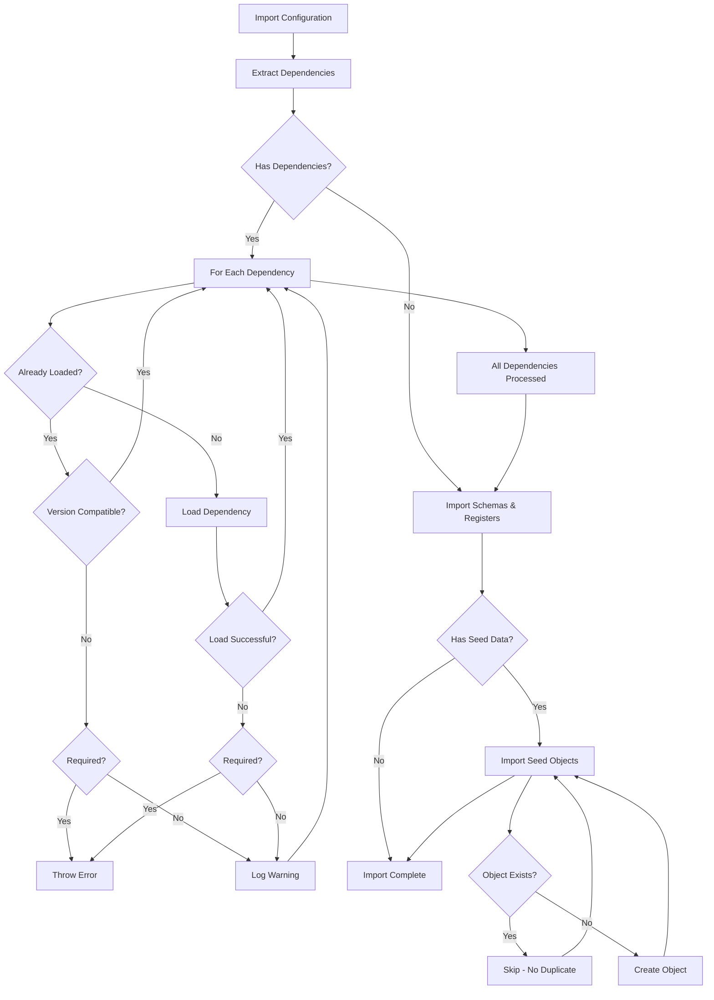

# Configuration Dependencies in OpenRegister

## Overview

The OpenRegister dependency system allows configurations to declare dependencies on other configurations. When a configuration with dependencies is imported, the system automatically loads all required dependencies first, ensuring proper initialization order and data integrity.

## Use Case

This feature is critical when one application depends on data or schemas from another application. For example:

- **OpenCatalogi** exposes data from **softwarecatalog** via its API
- OpenCatalogi must ensure that softwarecatalog schemas and Magic Mapper tables are loaded before it initializes
- Without dependency management, this would require manual coordination and could fail silently

### Required vs Optional Dependencies

**Required Dependencies** ('required: true'):
- Critical for core functionality
- App cannot function properly without them
- Import fails if dependency cannot be loaded
- Example: OpenCatalogi → softwarecatalog (needs data to expose)

**Optional Dependencies** ('required: false'):
- Enhance functionality but not essential
- App degrades gracefully if unavailable
- Import continues with warning if dependency missing
- Example: OpenCatalogi → n8n (automation is nice-to-have)

### Common Use Cases for Optional Dependencies

1. **Workflow Automation (n8n)**
   - Provides automation capabilities
   - Not required for basic CRUD operations
   - Enhances user experience when available

2. **Analytics and Monitoring**
   - Tracking and reporting features
   - Core app works without metrics
   - Optional telemetry dependencies

3. **Third-Party Integrations**
   - External service connectors
   - Not needed for standalone operation
   - Provide additional integration points

4. **Advanced Features**
   - AI/ML capabilities
   - Advanced search (Solr)
   - Real-time collaboration features

## How It Works

### 1. Declaring Dependencies

Dependencies are declared in the 'x-openregister' section of a configuration file:

```json
{
  'openapi': '3.0.0',
  'info': {
    'title': 'OpenCatalogi Configuration',
    'version': '1.0.0'
  },
  'x-openregister': {
    'type': 'application',
    'app': 'opencatalogi',
    'dependencies': [
      {
        'app': 'softwarecatalog',
        'config': 'softwarecatalogus_register_magic',
        'version': '>=2.0.0',
        'required': true,
        'reason': 'OpenCatalogi exposes softwarecatalog data - requires schemas and Magic Mapper tables'
      }
    ],
    'seedData': {
      'description': 'Initial pages and menus for a working catalog website',
      'objects': {
        'page': [
          {
            'title': 'Welkom',
            'slug': 'home',
            'contents': [
              {'type': 'RichText', 'data': {'content': '<h1>Welkom</h1>'}}
            ]
          }
        ],
        'menu': [
          {
            'title': 'Main nav',
            'items': [
              {'name': 'Home', 'link': '/'},
              {'name': 'About', 'link': '/about'}
            ]
          }
        ]
      }
    }
  }
}
```

### 2. Dependency Properties

Each dependency object supports:

- **app** (string, required): The app ID providing the dependency
- **config** (string, required): The configuration file name (without .json)
- **version** (string, optional): Version constraint (default: '*')
  - Exact: '2.0.0'
  - Greater than or equal: '>=2.0.0'
  - Caret range: '^2.0.0' (>=2.0.0 <3.0.0)
  - Tilde range: '~2.0.0' (>=2.0.0 <2.1.0)
- **required** (boolean, optional): Whether the dependency is mandatory (default: false)
- **reason** (string, optional): Human-readable explanation for the dependency

### 3. Seed Data Objects

Configurations can include seed data - initial objects that are imported after schemas are created. This is especially useful for:

- **UI Components**: Pages, menus, themes
- **Default Content**: Welcome pages, documentation
- **Configuration Objects**: Settings, categories, templates
- **Sample Data**: Example records for testing

**Seed Data Structure:**

```json
'seedData': {
  'description': 'Purpose of this seed data',
  'objects': {
    'schema-slug': [
      {
        'title': 'Object Title',
        'slug': 'unique-slug',
        'field1': 'value1',
        'field2': 'value2'
      }
    ]
  }
}
```

**Features:**
- Objects are grouped by schema slug
- Duplicate detection via slug (skips if exists)
- Imports after all schemas and registers are loaded
- Comprehensive error logging
- Non-blocking errors (continues on failure)

**Example - Software Catalog with UI Seed Data:**

```json
'seedData': {
  'description': 'Initial pages and menus for a working catalog website',
  'objects': {
    'page': [
      {
        'title': 'Welkom',
        'slug': 'home',
        'contents': [
          {
            'type': 'RichText',
            'order': 0,
            'data': {
              'content': '<h1>Welkom</h1><p>Welcome to the catalog</p>'
            }
          }
        ]
      },
      {
        'title': 'About Us',
        'slug': 'about',
        'contents': [...]
      }
    ],
    'menu': [
      {
        'title': 'Main Navigation',
        'position': 1,
        'items': [
          {'order': 1, 'name': 'Home', 'link': '/'},
          {'order': 2, 'name': 'Applications', 'link': '/applications'},
          {'order': 3, 'name': 'About', 'link': '/about'}
        ]
      }
    ]
  }
}
```

### 4. Loading Flow

When a configuration is imported:



### 4. Version Validation

The system supports semantic versioning constraints:

```php
// Exact match
'version': '2.0.0'

// Greater than or equal
'version': '>=2.0.0'

// Caret range (allow minor and patch updates)
'version': '^2.0.0'  // Allows 2.0.0 to 2.9.9, but not 3.0.0

// Tilde range (allow patch updates only)
'version': '~2.0.0'  // Allows 2.0.0 to 2.0.9, but not 2.1.0
```

### 5. Circular Dependency Detection

The system prevents circular dependencies during import. If detected, it throws an exception:

```
Circular dependency detected: appA/configA → appB/configB → appA/configA
```

## Implementation Details

### DependencyHandler Class

Located at 'lib/Service/Configuration/DependencyHandler.php', this handler provides:

- **extractDependencies(array $config)**: Extract dependencies from configuration
- **validateVersion(string $required, string $actual)**: Check version compatibility
- **validateDependencies(array $deps, array $loaded)**: Validate all dependencies
- **getDependencyId(array $dep)**: Get identifier for logging (app/config@version)

### ImportHandler Integration

The 'ImportHandler' class automatically calls dependency loading in its 'importFromJson()' method:

```php
public function importFromJson(array $data, ...): array
{
    // Check for and load dependencies first.
    $this->loadDependencies(data: $data, force: $force);
    
    // Continue with normal import...
}
```

### Dependency Injection

The 'DependencyHandler' is registered in 'Application.php':

```php
$context->registerService(
    ConfigurationDependencyHandler::class,
    function ($container) {
        return new ConfigurationDependencyHandler(
            logger: $container->get('Psr\Log\LoggerInterface')
        );
    }
);
```

## Example Configurations

### OpenCatalogi (Dependent with Required and Optional Dependencies)

```json
{
  'x-openregister': {
    'app': 'opencatalogi',
    'dependencies': [
      {
        'app': 'softwarecatalog',
        'config': 'softwarecatalogus_register_magic',
        'version': '>=2.0.0',
        'required': true,
        'reason': 'Exposes softwarecatalog data via API'
      },
      {
        'app': 'n8n',
        'config': 'n8n_workflows',
        'version': '>=1.0.0',
        'required': false,
        'reason': 'Provides workflow automation for catalog publishing and data sync'
      }
    ]
  }
}
```

### Software Catalog (Independent)

```json
{
  'x-openregister': {
    'app': 'softwarecatalog',
    'dependencies': []
  }
}
```

### n8n (Independent Integration)

```json
{
  'x-openregister': {
    'app': 'n8n',
    'type': 'integration',
    'dependencies': []
  }
}
```

## Logging

The dependency system provides detailed logging:

### Info Level
- Configuration dependency processing started
- Dependency already loaded with compatible version
- Dependency loaded successfully
- All dependencies processed

### Warning Level
- Invalid dependency definition
- Optional dependency has version mismatch
- Optional dependency could not be loaded

### Error Level
- Required dependency failed to load
- Dependency version mismatch for required dependency
- Circular dependency detected

## Best Practices

### 1. Always Provide Reasons

Make it clear why a dependency exists:

```json
{
  'reason': 'OpenCatalogi exposes softwarecatalog data via API - requires schemas and Magic Mapper tables'
}
```

### 2. Use Semantic Versioning

Be specific about version requirements:

```json
// Good: Allows minor updates
'version': '^2.0.0'

// Bad: Too restrictive
'version': '2.0.0'

// Bad: Too permissive
'version': '*'
```

### 3. Mark Critical Dependencies as Required

Only set 'required: true' for dependencies that are absolutely necessary:

```json
{
  'required': true,
  'reason': 'Core functionality depends on this'
}
```

### 4. Use Optional Dependencies for Enhancements

Mark dependencies as optional when they provide enhancements but aren't critical:

```json
{
  'app': 'n8n',
  'config': 'n8n_workflows',
  'version': '>=1.0.0',
  'required': false,
  'reason': 'Provides workflow automation - enhances functionality but not required'
}
```

**Benefits of Optional Dependencies:**
- App remains functional if optional dependency is unavailable
- Graceful degradation of features
- Flexible deployment options (can install without n8n)
- Clear logging of what's missing without blocking startup

### 5. Order Dependencies Logically

List dependencies in the order they would naturally be loaded:

```json
'dependencies': [
  {
    'app': 'base-schemas',
    'config': 'common'
  },
  {
    'app': 'extended-schemas',
    'config': 'specific'
  }
]
```

## Troubleshooting

### Dependency Not Found

If a required dependency cannot be loaded:

1. Check if the dependency app is installed ('php occ app:list')
2. Verify the configuration file exists in the dependency app
3. Check the configuration file name matches the 'config' field
4. Review logs for specific error messages

### Version Mismatch

If version validation fails:

1. Check the installed version: 'php occ config:app:get openregister imported_config_{app}_version'
2. Compare with the required version constraint
3. Update the dependency app or relax the version constraint

### Circular Dependencies

If you encounter a circular dependency error:

1. Review the dependency chains in all configurations
2. Identify the cycle (logged in error message)
3. Restructure configurations to break the cycle
4. Consider creating a separate 'common' configuration for shared dependencies

## Future Enhancements

Potential improvements to the dependency system:

1. **Dependency Resolution API**: Expose dependency graph via REST API
2. **Dependency Visualization**: Generate Mermaid diagrams of dependency trees
3. **Parallel Loading**: Load independent dependencies concurrently
4. **Dependency Caching**: Cache dependency resolution results
5. **Optional Dependencies**: Support 'optional' flag for soft dependencies
6. **Conflict Detection**: Warn about incompatible dependency versions across configurations

## Related Documentation

- [Configuration Management](./configuration-management.md)
- [Magic Mapper](./magic-mapper-auto-table-creation.md)
- [Import/Export System](./import-export.md)

