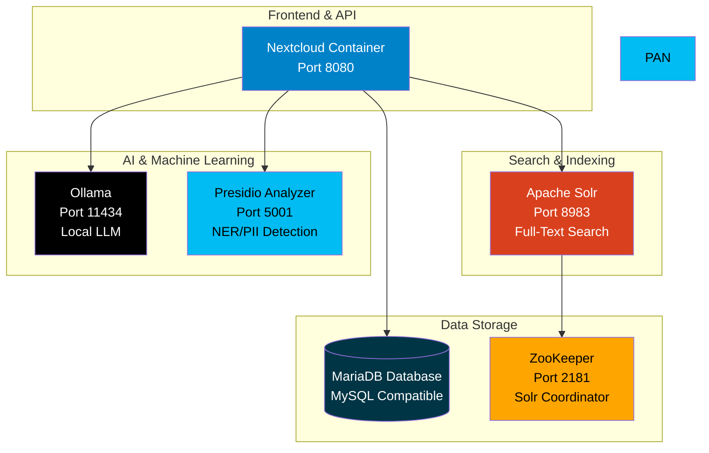
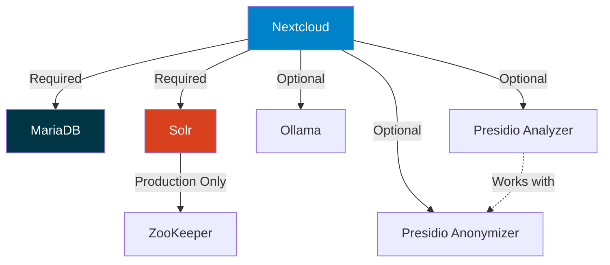

# Docker Services Overview

## Services Included in OpenRegister Docker Compose

OpenRegister uses Docker Compose to manage multiple services that work together to provide a complete development and production environment. This document provides an overview of all services included in the stack.

## Service Architecture



## Core Services

### 1. Nextcloud (Application Server)

**Image**: `nextcloud:latest`  
**Container**: `nextcloud` (prod) / `nextcloud-dev` (dev)  
**Port**: `8080`

The main application container running Nextcloud with OpenRegister app mounted.

**Configuration**:
- Admin credentials: `admin` / `admin` (development only)
- PHP Memory: 4G
- Upload limit: 2G
- Timezone: Europe/Amsterdam

**Volumes**:
- `nextcloud:/var/www/html` - Nextcloud installation
- `.:/var/www/html/custom_apps/openregister` - OpenRegister source code (mounted for development)

**Environment Variables**:
```yaml
MYSQL_HOST: db
MYSQL_DATABASE: nextcloud
MYSQL_USER: nextcloud
MYSQL_PASSWORD: '!ChangeMe!'
PHP_MEMORY_LIMIT: 4G
PHP_UPLOAD_LIMIT: 2G
```

### 2. MariaDB (Database)

**Image**: `mariadb:10.6`  
**Port**: Internal only  
**Volume**: `db:/var/lib/mysql`

MySQL-compatible database server for Nextcloud and OpenRegister data storage.

**Configuration**:
- Database: `nextcloud`
- User: `nextcloud`
- Password: `!ChangeMe!` (change in production)
- Transaction isolation: READ-COMMITTED
- Binary logging: Enabled

## Search Services

### 3. Apache Solr (Full-Text Search)

**Image**: `solr:9-slim`  
**Container**: `openregister-solr`  
**Port**: `8983`  
**Volume**: `solr:/var/solr`

Enterprise search platform for full-text indexing and search across objects and files.

**Features**:
- SolrCloud mode (production) with ZooKeeper coordination
- Standalone mode (development)
- Faceted search support
- Multi-language support
- Vector search support (future)

**Configuration**:
- Heap size: 512MB (adjustable)
- ZooKeeper host: `zookeeper:2181` (production only)

**Access**:
- Admin UI: http://localhost:8983/solr/
- API: http://localhost:8983/solr/{collection}/select

### 4. ZooKeeper (Solr Coordinator)

**Image**: `zookeeper:3.8`  
**Container**: `openregister-zookeeper`  
**Port**: `2181`  
**Volume**: `zookeeper:/data`

Distributed coordination service for SolrCloud configuration and cluster management.

**Note**: Only used in production docker-compose.yml, not in dev mode.

## AI & NLP Services

### 5. Ollama (Local LLM)

**Image**: `ollama/ollama:latest`  
**Container**: `openregister-ollama`  
**Port**: `11434`  
**Volume**: `ollama:/root/.ollama`

Local large language model server for privacy-first AI capabilities.

**Features**:
- Chat and conversational AI
- RAG (Retrieval Augmented Generation)
- Agent functionality
- Entity extraction (alternative to Presidio)
- No external API calls required

**Configuration**:
- Parallel requests: 2 (prod) / 4 (dev)
- Keep alive: 15m (prod) / 30m (dev)
- Memory: 8-16GB (supports GPU acceleration)
- Shared memory: 2GB

**Supported Models**:
- llama3.2, llama3.1, llama2
- mistral, mixtral
- qwen, gemma, phi
- Custom models

**Pull Models**:
```bash
docker exec openregister-ollama ollama pull llama3.2
docker exec openregister-ollama ollama pull mistral
docker exec openregister-ollama ollama list
```

**Access**:
- API: http://localhost:11434
- Health check: http://localhost:11434/api/tags

### 6. Presidio Analyzer (NER & PII Detection)

**Image**: `mcr.microsoft.com/presidio-analyzer:latest`  
**Container**: `openregister-presidio-analyzer`  
**Port**: `5001`  

Microsoft's open-source PII detection service for Named Entity Recognition (NER).

**Features**:
- High-accuracy entity detection (90-98% precision)
- Multi-language support (50+ languages)
- GDPR compliance focused
- Detects: persons, emails, phones, addresses, IBAN, SSN, credit cards, etc.

**Recommended For**:
- ✅ Production deployments
- ✅ GDPR compliance requirements
- ✅ High accuracy needs
- ✅ Multi-language content

**Configuration**:
- Languages: en, nl, de, fr, es (configurable)
- Log level: INFO (prod) / DEBUG (dev)
- Memory: 512MB-2GB

**Entity Types Detected**:
- PERSON, EMAIL_ADDRESS, PHONE_NUMBER
- LOCATION, ORGANIZATION
- CREDIT_CARD, IBAN_CODE, SSN
- IP_ADDRESS, URL, DATE_TIME
- MEDICAL_LICENSE, US_PASSPORT
- Custom types via configuration

**Access**:
- API: http://localhost:5001
- Health check: http://localhost:5001/health
- Docs: http://localhost:5001/docs

**Example Request**:
```bash
curl -X POST http://localhost:5001/analyze \
  -H "Content-Type: application/json" \
  -d '{
    "text": "John Doe can be reached at john.doe@example.com",
    "language": "en"
  }'
```

**Note**: Presidio also offers a separate Anonymizer service, but OpenRegister handles anonymization internally using the detected entity positions from the Analyzer.

### Optional: Dolphin Document Parser

**Status**: Not included in docker-compose (requires separate deployment)  
**Repository**: [github.com/bytedance/Dolphin](https://github.com/bytedance/Dolphin)

Dolphin is an open-source document parsing model that can be deployed separately for advanced document processing:

**Features**:
- Advanced PDF parsing and OCR
- Layout analysis with reading order detection
- Table and formula extraction
- Lightweight (0.3B parameters)

**Deployment**:
Dolphin requires custom containerization. See the [Dolphin GitHub repository](https://github.com/bytedance/Dolphin) for deployment guides using Hugging Face Inference Toolkit.

Once deployed, configure the API endpoint in OpenRegister settings to use it for document extraction.

## Docker Compose Files

### Production: `docker-compose.yml`

Includes all services with production-ready configuration:
- ✅ Nextcloud
- ✅ MariaDB
- ✅ Solr (SolrCloud mode)
- ✅ ZooKeeper
- ✅ Ollama
- ✅ Presidio Analyzer

**Usage**:
```bash
cd openregister
docker-compose up -d
docker-compose logs -f nextcloud
```

### Development: `docker-compose.dev.yml`

Optimized for development with verbose logging:
- ✅ Nextcloud (dev mode)
- ✅ MariaDB
- ✅ Solr (standalone mode, no ZooKeeper)
- ✅ Ollama (more concurrent requests, longer keep-alive)
- ✅ Presidio Analyzer (DEBUG logging)

**Usage**:
```bash
cd openregister
docker-compose -f docker-compose.dev.yml up -d
docker-compose -f docker-compose.dev.yml logs -f nextcloud
```

## Service Dependencies



**Required Services** (core functionality):
- Nextcloud
- MariaDB
- Solr

**Optional Services** (enhanced features):
- Ollama (AI chat, RAG, local NER)
- Presidio Analyzer (production-grade NER)
- ZooKeeper (Solr clustering)

## Resource Requirements

### Minimum (Development)
- CPU: 4 cores
- RAM: 8GB
- Disk: 20GB

### Recommended (Production)
- CPU: 8 cores
- RAM: 16GB (32GB with Ollama large models)
- Disk: 100GB+ (depending on data volume)
- Optional: NVIDIA GPU for Ollama acceleration

### Per-Service Memory Usage

| Service | Development | Production |
|---------|-------------|------------|
| Nextcloud | 512MB-2GB | 2GB-4GB |
| MariaDB | 512MB-1GB | 2GB-4GB |
| Solr | 512MB-1GB | 2GB-8GB |
| ZooKeeper | N/A | 256MB-512MB |
| Ollama | 8GB-16GB | 8GB-32GB |
| Presidio Analyzer | 512MB-2GB | 1GB-2GB |

**Total**: 10-23GB (dev), 15-52GB (prod with all services)

## Network Configuration

All services run on the same Docker network and can communicate via service names:

**Internal hostnames**:
- `db` - MariaDB
- `openregister-solr` or `solr` - Solr
- `openregister-zookeeper` or `zookeeper` - ZooKeeper
- `openregister-ollama` or `ollama` - Ollama
- `openregister-presidio-analyzer` or `presidio-analyzer` - Presidio Analyzer

**Exposed ports**:
- `8080` → Nextcloud
- `8983` → Solr Admin UI
- `11434` → Ollama API
- `5001` → Presidio Analyzer API

## Health Checks

All services include health checks for monitoring:

```bash
# Check all services
docker-compose ps

# Check specific service
docker exec openregister-solr curl -f http://localhost:8983/solr/admin/info/system
docker exec openregister-ollama curl -f http://localhost:11434/api/tags
curl -f http://localhost:5001/health  # Presidio Analyzer
```

## Volume Management

Persistent data is stored in Docker volumes:

```bash
# List volumes
docker volume ls | grep openregister

# Backup volumes
docker run --rm -v openregister_db:/data -v $(pwd):/backup alpine tar czf /backup/db-backup.tar.gz /data

# Remove all volumes (WARNING: deletes all data)
docker-compose down -v
```

## Troubleshooting

### Service won't start

```bash
# Check logs
docker-compose logs [service-name]

# Restart service
docker-compose restart [service-name]

# Rebuild service
docker-compose up -d --force-recreate [service-name]
```

### Out of memory

```bash
# Check memory usage
docker stats

# Increase memory limits in docker-compose.yml
# Or reduce services (disable Ollama if not needed)
```

### Network issues

```bash
# Check network connectivity between services
docker exec nextcloud ping db
docker exec nextcloud ping solr
docker exec nextcloud curl http://presidio-analyzer:5001/health

# Recreate network
docker-compose down
docker-compose up -d
```

## Alternative Configurations

### Minimal Setup (No AI)

For basic OpenRegister without AI features:

```yaml
services:
  - nextcloud
  - db
  - solr
```

### Privacy-First (No Cloud Services)

For maximum privacy with local AI only:

```yaml
services:
  - nextcloud
  - db
  - solr
  - ollama  # Local LLM for NER
  # NO Presidio (cloud-based)
```

### Maximum Accuracy (All Services)

For production with best NER accuracy:

```yaml
services:
  - nextcloud
  - db
  - solr
  - zookeeper
  - ollama
  - presidio-analyzer  # Best accuracy for entity detection
```

## Related Documentation

- [Docker Setup Guide](./docker-setup.md) - Complete setup instructions
- [NER & NLP Concepts](../features/ner-nlp-concepts.md) - Understanding entity recognition
- [Text Extraction Enhanced](../features/text-extraction-enhanced.md) - File processing pipeline
- [Settings Configuration](../user/settings-configuration.md) - Configure services in Nextcloud

---

**Note**: For production GDPR compliance, we recommend including **Presidio Analyzer** for state-of-the-art entity detection. OpenRegister handles anonymization internally using the detected entity positions.

