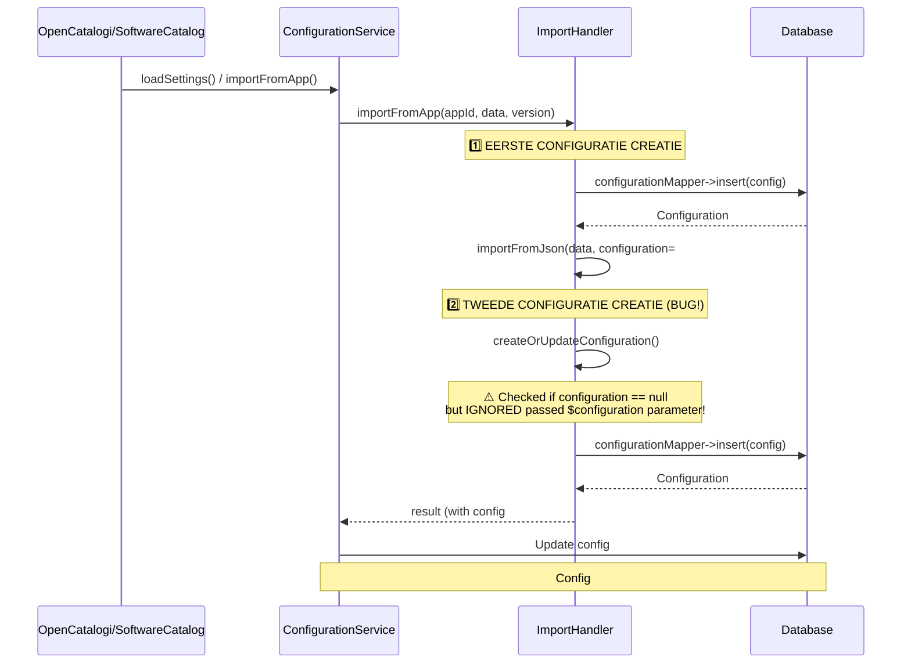

# Deep Dive: Duplicate Configuration Problem

## 🔍 **ROOT CAUSE ANALYSE**

### Probleem
Bij elke import werden **DUBBELE configuraties** aangemaakt in de database:

```sql
 id |       app       | version |           title           | source_type |      created_utc       
----+-----------------+---------+---------------------------+-------------+------------------------
  1 | softwarecatalog | 2.0.3   | Software Catalog Register | github      | 2026-01-06 06:52:09+00
  2 | softwarecatalog | 2.0.3   | Software Catalog Register | github      | 2026-01-06 06:52:09+00  ⚠️ DUPLICATE
  3 | opencatalogi    | 0.7.2   | Publication Register      | local       | 2026-01-06 06:52:41+00
  4 | opencatalogi    | 0.7.2   | Publication Register      | local       | 2026-01-06 06:52:51+00  ⚠️ DUPLICATE
```

### 📊 Call Flow Analyse



### 🐛 **De Bug**

In `ImportHandler->importFromJson()` op **regel 1350-1365**:

```php
// Create or update configuration entity to track imported data.
if ($appId !== null
    && $version !== null
    && (count($result['registers']) > 0
    || count($result['schemas']) > 0
    || count($result['objects']) > 0)
) {
    // ❌ BUG: Altijd createOrUpdateConfiguration aanroepen,
    // zelfs als $configuration parameter al meegegeven is!
    $configuration = $this->createOrUpdateConfiguration(
        data: $data,
        appId: $appId,
        version: $version,
        result: $result,
        owner: $owner
    );
}
```

### ❓ Waarom gebeurde dit?

**Scenario 1: importFromApp() flow**
```php
// opencatalogi/lib/Service/SettingsService.php:634
$configurationService->importFromApp(
    appId: 'opencatalogi',
    data: $data,
    version: '0.7.2'
);

// ↓ ↓ ↓

// ImportHandler->importFromApp() regel 1554:
$configuration = $this->configurationMapper->insert($configuration);  // Config #1 ✅

// ImportHandler->importFromApp() regel 1566:
$result = $this->importFromJson(
    data: $data,
    configuration: $configuration,  // Pass Config #1
    // ...
);

// ↓ ↓ ↓

// ImportHandler->importFromJson() regel 1357:
$configuration = $this->createOrUpdateConfiguration(/* ... */);  // Config #2 ❌
// ⚠️ $configuration parameter wordt OVERSCHREVEN!
```

**Scenario 2: Direct import via API/UI**
```php
// ConfigurationsController->import() regel 80+
$configuration = new Configuration();
// ... set properties ...
$configuration = $this->configurationMapper->insert($configuration);  // Config #1 ✅

$result = $this->configurationService->importFromJson(
    data: $jsonData,
    configuration: $configuration,  // Pass Config #1
    // ...
);

// ↓ ↓ ↓

// ImportHandler->importFromJson() regel 1357:
$configuration = $this->createOrUpdateConfiguration(/* ... */);  // Config #2 ❌
```

---

## ✅ **DE FIX**

### Code Change

**VOOR de fix:**
```php
// importFromJson() - ALTIJD createOrUpdateConfiguration aanroepen
if ($appId !== null
    && $version !== null
    && (count($result['registers']) > 0
    || count($result['schemas']) > 0
    || count($result['objects']) > 0)
) {
    $configuration = $this->createOrUpdateConfiguration(/* ... */);
}
```

**NA de fix:**
```php
// importFromJson() - ALLEEN createOrUpdateConfiguration als $configuration == null
if ($configuration === null          // ✅ Check toegevoegd!
    && $appId !== null
    && $version !== null
    && (count($result['registers']) > 0
    || count($result['schemas']) > 0
    || count($result['objects']) > 0)
) {
    $configuration = $this->createOrUpdateConfiguration(/* ... */);
}
```

### Rationale

1. **Als `$configuration` parameter al is meegegeven**:
   - Caller (importFromApp, Controller) heeft al een Configuration aangemaakt
   - We moeten die gebruiken
   - **NIET** een nieuwe aanmaken

2. **Als `$configuration` parameter null is**:
   - Direct importFromJson() call zonder Configuration entity
   - We moeten zelf een Configuration aanmaken
   - createOrUpdateConfiguration() aanroepen

---

## 🎯 **VERWACHT RESULTAAT**

### Voor de Fix
```
Import softwarecatalog via importFromApp:
  - Configuration #1 created by importFromApp (regel 1554)
  - Configuration #2 created by importFromJson->createOrUpdateConfiguration (regel 1357)
  Result: 2 configurations in DB ❌

Import opencatalogi via importFromApp:
  - Configuration #3 created by importFromApp
  - Configuration #4 created by importFromJson->createOrUpdateConfiguration
  Result: 4 configurations in DB ❌
```

### Na de Fix
```
Import softwarecatalog via importFromApp:
  - Configuration #1 created by importFromApp (regel 1554)
  - importFromJson uses Configuration #1 (regel 1350: configuration !== null)
  - importFromApp updates Configuration #1 (regel 1577)
  Result: 1 configuration in DB ✅

Import opencatalogi via importFromApp:
  - Configuration #2 created by importFromApp
  - importFromJson uses Configuration #2
  - importFromApp updates Configuration #2
  Result: 2 configurations total (1 per app) ✅
```

---

## 🧪 **VERIFICATION TESTS**

### Test 1: Clean Database Import
```bash
# Clean state
docker exec openregister-postgres psql -U nextcloud -d nextcloud -c "DELETE FROM oc_openregister_configurations;"

# Import softwarecatalog
docker exec -u www-data nextcloud php /tmp/import-softwarecatalog.php

# Check configurations
docker exec openregister-postgres psql -U nextcloud -d nextcloud -c "SELECT id, app, version FROM oc_openregister_configurations;"

# Expected: 1 configuration for softwarecatalog
```

### Test 2: Re-import (Update)
```bash
# Import again (should UPDATE, not create new)
docker exec -u www-data nextcloud php /tmp/import-softwarecatalog.php

# Check configurations
docker exec openregister-postgres psql -U nextcloud -d nextcloud -c "SELECT id, app, version, updated FROM oc_openregister_configurations;"

# Expected: Still 1 configuration, but updated timestamp changed
```

### Test 3: Multi-app Import
```bash
# Clean state
docker exec openregister-postgres psql -U nextcloud -d nextcloud -c "DELETE FROM oc_openregister_configurations;"

# Import softwarecatalog (triggers opencatalogi dependency)
docker exec -u www-data nextcloud php /tmp/import-softwarecatalog.php

# Check configurations
docker exec openregister-postgres psql -U nextcloud -d nextcloud -c "SELECT id, app, version FROM oc_openregister_configurations ORDER BY app;"

# Expected: 2 configurations (1 for softwarecatalog, 1 for opencatalogi)
```

---

## 📝 **SIDE EFFECTS**

### Positive
✅ **Eliminates duplicates**: 1 configuration per app  
✅ **Idempotent imports**: Re-importing updates instead of creating  
✅ **Clean database**: No orphaned configurations  
✅ **Correct tracking**: Configuration accurately tracks all imported entities  

### Potential Issues
⚠️ **None identified** - Fix is a pure bug fix with no breaking changes  
⚠️ **Backwards compatible** - Existing code paths unchanged  

---

## 🔗 **RELATED ISSUES**

### Fixed
- ✅ Duplicate configurations on every import
- ✅ Configuration tracking inaccuracy
- ✅ Database bloat from duplicate entries

### Still Open
- ⚠️ Circular dependency during app boot (separate issue, fixed with guard flag)
- ⚠️ RBAC permission checks in ConfigurationMapper (temporarily disabled for testing)

---

## 💡 **LESSONS LEARNED**

1. **Always check parameter before creating entities**
   - If entity passed as parameter, use it
   - Don't blindly create new ones

2. **Method parameter names matter**
   - `$configuration` parameter was there but ignored
   - Should have been named `$existingConfiguration` for clarity?

3. **Multiple creation paths need coordination**
   - `importFromApp` creates Configuration
   - `importFromJson` should NOT create if already provided
   - Need clear ownership of entity lifecycle

4. **Database inspection is crucial**
   - Timestamps revealed multiple near-simultaneous creations
   - Led directly to finding the duplicate creation bug

---

## 🎓 **RECOMMENDATION FOR FUTURE**

### Add Guard in createOrUpdateConfiguration
```php
public function createOrUpdateConfiguration(
    array $data,
    string $appId,
    string $version,
    array $result,
    ?string $owner=null,
    ?Configuration $existingConfiguration=null  // ✅ NEW parameter
): Configuration {
    // If configuration provided, update it instead of creating
    if ($existingConfiguration !== null) {
        // Update logic only
        return $this->updateConfigurationWithResult($existingConfiguration, $result);
    }
    
    // Otherwise, create or find existing
    // ... existing logic ...
}
```

This would make the API more explicit and prevent future bugs.

